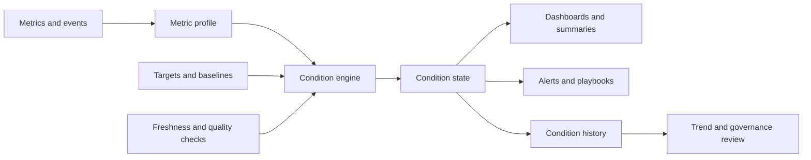

# The 12-Condition Framework: A Standardized Method for Operational Signal Classification

**Audience:** Multi-location retail leaders, franchise operators, regional operations teams, analysts, product leaders, reliability teams  
**Canonical URL:** `/whitepapers/12-condition-framework/`  
**Related papers:** Cendryva self-hosted ML observability; model drift detection in regulated environments; real-time statistical monitoring; Cendryva technical architecture  
**Author:** Cendryva  
**Published:** 2026-05-25  
**Version:** 1.0  
**License:** CC BY 4.0
**Contact:** research@cendryva.com

## Abstract

Retailers, franchise systems, and distributed service organizations measure thousands of signals: revenue, foot traffic, conversion, inventory, labor coverage, queue length, energy use, equipment uptime, customer satisfaction, field activity, promotion performance, and local compliance tasks. The problem is not that teams lack metrics. The problem is that metrics often fail to communicate operational condition.

A number on a dashboard does not automatically answer whether the system is healthy, improving, degrading, missing data, or in need of immediate action. The 12-Condition Framework standardizes how measured signals are classified into human-readable states. It gives teams a shared language for interpreting performance across domains without forcing every metric into the same unit, scale, or business meaning.

This paper introduces the framework, explains why condition classification is different from dashboarding, and describes how standardized conditions can support operational response, executive review, automation, and cross-functional coordination.

## Executive Summary

Most organizations already collect metrics. The harder challenge is interpretation. A metric value only becomes useful when someone can answer:

- Is this good, bad, missing, noisy, or urgent?
- Is the metric moving in the right direction?
- Is this expected seasonality or abnormal change?
- Should anyone act now?
- Who owns the response?
- How should this condition be explained to a non-specialist?
- Is this state comparable to other domains?

The 12-Condition Framework converts raw metric values into standardized operational states. It is designed for environments where teams need a consistent interpretation layer across different kinds of measures.

The framework helps teams move from fragmented dashboards to operational classification:

- from "latency is 780ms" to "performance is in DANGER"
- from "inventory is 18% above target" to "supply is in ABUNDANCE"
- from "no feed received" to "signal is in NON_EXISTENCE"
- from "conversion is 141% of plan" to "growth is in POWER"
- from "defect rate doubled" to "quality is in EMERGENCY"

The value is not the label alone. The value is that every label can connect to thresholds, ownership, automation, review history, and response playbooks.

Cendryva applies the 12-Condition Framework to help distributed operators run many locations with a shared decision language. Instead of every region interpreting dashboards differently, Cendryva turns local signals into consistent conditions that can drive store review, staffing response, inventory action, field maintenance, and executive summaries.

## Why Metric Values Are Not Enough

Metric values are often domain-specific. A response time of 200ms may be excellent for one system and unacceptable for another. A 5% change in conversion may be huge for a marketplace but noise for a seasonal operational metric. A high count may be good for revenue, bad for incidents, and ambiguous for support tickets.

Dashboards often ask humans to translate raw values into operational meaning repeatedly. That creates inconsistency:

- executives interpret charts differently from operators
- analysts use different thresholds across teams
- automation rules drift from human expectations
- urgent conditions compete with merely interesting changes
- missing data is mistaken for healthy silence
- teams overreact to normal variance and miss slow degradation

Condition classification creates a layer between measurement and action. The metric remains precise, but the condition explains what the value means in context.

## Framework Principles

### 1. Conditions Are Contextual

A condition is calculated relative to a metric's target, baseline, trend, tolerance, seasonality, and business meaning. The same number can produce different conditions in different contexts.

### 2. Conditions Are Direction-Aware

Some metrics are better when higher, such as revenue, throughput, utilization, or engagement. Others are better when lower, such as latency, defect rate, churn, risk score, or energy waste. The framework must know whether higher is good, lower is good, or the ideal state is a range.

### 3. Missing Data Is a Condition

No signal is not the same as a good signal. Missing telemetry, stale features, broken connectors, delayed reports, and silent devices should be classified explicitly.

### 4. Conditions Should Be Human and Machine Readable

A condition label should be understandable to a human and stable enough for automation. If a state triggers an alert, playbook, approval gate, or rollback, the label needs consistent semantics.

### 5. Conditions Should Preserve the Underlying Metric

Classification should not hide the raw value. A dashboard should show both the condition and the measurement that produced it.

## The 12 Conditions

The framework uses twelve states to describe positive, normal, negative, missing, and transitional metric conditions.

| Condition     | Meaning                                       | Typical interpretation                                    |
| ------------- | --------------------------------------------- | --------------------------------------------------------- |
| POWER         | Exceptional positive performance              | The signal is far above target in a beneficial direction  |
| AFFLUENCE     | Strong positive performance                   | The signal is above target and materially favorable       |
| ABUNDANCE     | Healthy surplus or overcapacity               | The system has more than enough of a desired resource     |
| NORMAL        | Expected operating range                      | The signal is within acceptable bounds                    |
| BELOW_NORMAL  | Mild degradation or underperformance          | The signal is below expectation but not yet urgent        |
| DANGER        | Material negative deviation                   | The signal requires attention and likely owner review     |
| EMERGENCY     | Severe negative condition                     | The signal requires immediate response                    |
| NON_EXISTENCE | Missing, absent, or unavailable signal        | The system lacks required data or activity                |
| LIABILITY     | Persistently harmful burden                   | The signal creates cost, risk, debt, or drag              |
| DOUBT         | Ambiguous, unstable, or low-confidence signal | The system cannot classify confidently                    |
| CHANGE        | Material transition under evaluation          | The signal is shifting quickly or entering a new regime   |
| POWER_CHANGE  | Positive breakout or rapid favorable shift    | The signal is improving beyond expected transition bounds |

These labels are intentionally general. They can apply to a sales pipeline, a warehouse, an API, a wind farm, a classroom attendance program, a fraud queue, an ML model, a server cluster, or a nonprofit outreach campaign.

## Mapping Metrics to Conditions

Condition mapping begins with a metric profile.

A metric profile should define:

- name and owner
- unit of measure
- desired direction
- target or expected range
- warning threshold
- critical threshold
- baseline window
- seasonality rules
- minimum data freshness
- sample size requirements
- confidence rules
- response owner
- playbook or escalation path

Example metric profile:

| Field             | Example                                                |
| ----------------- | ------------------------------------------------------ |
| Metric            | Warehouse pick delay                                   |
| Desired direction | Lower is better                                        |
| Target            | Under 4 minutes                                        |
| BELOW_NORMAL      | 4-6 minutes                                            |
| DANGER            | 6-10 minutes                                           |
| EMERGENCY         | Over 10 minutes                                        |
| NON_EXISTENCE     | No scan data for 15 minutes                            |
| Owner             | Fulfillment operations                                 |
| Response          | Shift lead review, staffing check, conveyor inspection |

The raw metric remains "average pick delay." The condition tells the organization how to interpret it now.

## Industry Focus: Multi-Location Retail and Franchise Operations

### Store Revenue and Conversion

Metric: store conversion rate  
Desired direction: higher is better

- POWER: conversion exceeds target by more than 40%
- AFFLUENCE: conversion exceeds target by 15-40%
- NORMAL: conversion is within expected range
- DANGER: conversion falls below tolerance for two consecutive windows
- EMERGENCY: conversion collapses after a promotion, staffing change, or local disruption

### Checkout and Queue Performance

Metric: average checkout wait time  
Desired direction: lower is better

- NORMAL: wait time inside service target
- BELOW_NORMAL: wait time slightly above target
- DANGER: wait time causing abandonment risk
- EMERGENCY: checkout congestion requires immediate intervention
- NON_EXISTENCE: queue data stops reporting

### Inventory Availability

Metric: shelf availability for priority items  
Desired direction: higher is better

- ABUNDANCE: stock exceeds expected demand buffer
- NORMAL: availability inside target range
- BELOW_NORMAL: local stock weakening
- DANGER: priority SKUs likely to stock out
- NON_EXISTENCE: inventory feed missing or stale

### Facilities and Equipment

Metric: refrigeration temperature exception rate  
Desired direction: lower is better

- NORMAL: equipment inside operating range
- BELOW_NORMAL: repeated minor exceptions
- DANGER: rising exception rate with spoilage risk
- EMERGENCY: immediate maintenance or product protection required
- LIABILITY: chronic maintenance debt at the location

### Field Execution

Metric: campaign setup completion by store  
Desired direction: higher is better

- POWER_CHANGE: rapid improvement after field coaching
- NORMAL: setup completed on schedule
- BELOW_NORMAL: store is behind execution plan
- NON_EXISTENCE: no field confirmation submitted
- DOUBT: records conflict with photo or audit evidence

The same condition language works across domains while preserving domain-specific thresholds.

## Distinguishing DANGER, EMERGENCY, and LIABILITY

Negative states are not interchangeable.

**DANGER** means a signal is materially outside tolerance and requires attention. The system may still be operating, but the owner should review and respond.

**EMERGENCY** means the signal is severe enough to require immediate action. It may indicate customer harm, safety risk, financial exposure, operational stoppage, or major reliability failure.

**LIABILITY** means the signal is persistently harmful. It may not be urgent in the moment, but it creates ongoing drag or risk. Examples include chronic cloud overspend, recurring manual rework, stale inventory, unresolved security exceptions, or a model that routinely routes too many cases to manual review.

This distinction prevents teams from treating all bad news as an incident while still making chronic problems visible.

## Why NON_EXISTENCE Matters

Many monitoring systems underrepresent missing data. A dashboard may show no alerts because the data feed failed, not because the system is healthy. The 12-Condition Framework makes absence explicit.

NON_EXISTENCE can mean:

- no data was received
- a connector failed
- a device stopped reporting
- an integration was disabled
- a required activity did not occur
- a metric has no owner
- a newly expected process has not started

In many operations, NON_EXISTENCE is one of the most important states because it reveals blind spots.

## Handling DOUBT

DOUBT captures uncertainty. It is useful when the system has a value but should not confidently classify it.

Common causes:

- sample size is too small
- data quality is poor
- conflicting sources disagree
- seasonality model is unreliable
- recent change invalidates the baseline
- labels are delayed
- metric ownership is unclear

DOUBT prevents false precision. Instead of pretending the system knows, it marks the signal as needing interpretation or data-quality work.

## CHANGE and POWER_CHANGE

Change states are designed for transition periods.

**CHANGE** indicates a material shift that may be good, bad, or still under evaluation. It is useful when a metric is moving quickly but has not stabilized.

**POWER_CHANGE** indicates a rapid positive breakout. It helps teams notice meaningful improvements, not only failures. For example, a new onboarding flow may drive unusually strong activation, a scheduling change may sharply reduce wait time, or a field campaign may produce a surge in participation.

Positive anomalies deserve classification too. They can reveal practices worth preserving or scaling.

## From Conditions to Playbooks

A condition should connect to action. The same condition can trigger different responses depending on metric type and owner.

| Condition     | Typical action                                                         |
| ------------- | ---------------------------------------------------------------------- |
| POWER         | Capture cause, preserve successful pattern, consider scaling           |
| AFFLUENCE     | Monitor, document improvement, compare cohorts                         |
| ABUNDANCE     | Rebalance resources, prevent waste, maintain buffer                    |
| NORMAL        | Continue monitoring                                                    |
| BELOW_NORMAL  | Review trend, prepare response if deterioration continues              |
| DANGER        | Notify owner, inspect root cause, start mitigation                     |
| EMERGENCY     | Escalate immediately, execute incident or response playbook            |
| NON_EXISTENCE | Restore signal, investigate missing source, assign owner               |
| LIABILITY     | Open remediation plan, track debt reduction                            |
| DOUBT         | Improve data quality, collect more evidence, avoid automation          |
| CHANGE        | Watch closely, compare cohorts, confirm whether new baseline is needed |
| POWER_CHANGE  | Identify driver, test repeatability, scale carefully                   |

This turns the framework into an operating system for metric response.

## Automation Without Losing Judgment

Condition classification can drive automation:

- send alerts
- open tickets
- suppress low-confidence automation
- route work to owners
- trigger rollback checks
- freeze model promotion
- request human review
- change staffing recommendations
- shift inventory allocation
- update executive summaries

But automation should reflect risk. NORMAL, AFFLUENCE, and POWER may update reports. DANGER may notify owners. EMERGENCY may page responders. DOUBT may block automation. NON_EXISTENCE may trigger source recovery instead of business action.

The framework improves automation by making states explicit, not by removing human judgment.

## Architecture Pattern

The condition engine evaluates raw values against targets, baselines, directionality, confidence, freshness, and transition rules. It emits both the condition and the explanation needed for humans to trust it.

## Cendryva and the 12-Condition Framework

Cendryva uses the 12-Condition Framework as a common classification layer across operational metrics, ML observability, business statistics, and executive health views.

This allows different signals to be summarized without flattening their meaning:

- a model drift score can be in DANGER
- an uptime metric can be NORMAL
- an inventory reserve can be in ABUNDANCE
- a cost metric can become a LIABILITY
- a data feed can fall into NON_EXISTENCE
- a growth metric can enter POWER_CHANGE

For retail and franchise operators, this means a regional leader can compare very different stores and signals without flattening them into a single oversimplified score. Cendryva preserves the underlying metric while giving each signal an operational meaning, owner, and response path.

## Implementation Checklist

Teams adopting condition classification should define:

- the metric inventory
- owner for each metric
- desired direction for each metric
- target and tolerance rules
- missing-data rules
- confidence and sample-size rules
- seasonality and baseline rules
- condition transition rules
- alert policies by condition
- playbooks by condition and domain
- condition history retention
- review cadence for threshold tuning

The framework becomes more valuable when conditions are reviewed over time. Condition history can reveal chronic liabilities, recurring emergencies, repeated missing signals, and positive patterns worth scaling.

## Conclusion

Metrics tell teams what was measured. Conditions tell teams what the measurement means.

The 12-Condition Framework provides a standardized language for interpreting operational signals across domains. It helps organizations separate healthy performance from missing data, mild degradation from emergencies, chronic liabilities from acute incidents, and positive breakouts from normal variation.

The result is a clearer path from measurement to decision. Teams can still inspect raw values, but they no longer have to reinvent interpretation every time a chart changes.

For organizations operating complex systems, that shared decision language is not cosmetic. It is the difference between watching dashboards and running the business.

## Scope and Limitations

This is a vendor-authored paper from Cendryva, and readers should weigh it with that potential bias in mind. The 12-Condition Framework is presented as one classification approach, not as a universal standard endorsed by an external body.

The paper covers a general method for classifying operational signals into human-readable states, with examples drawn from multi-location retail, franchise, and distributed service operations. It does not specify product implementation details, alert routing libraries, or specific data-pipeline tooling.

The thresholds shown in the examples (such as conversion percentages, queue times, and refrigeration exception rates) are illustrative. Real thresholds need to be set per metric, per location, and per business context. They are not benchmarks of any specific deployment.

The framework is a decision-support pattern. It does not replace operational, safety, or regulatory programs. For environments with formal monitoring requirements (food safety, clinical research, financial controls, occupational safety, and similar domains), teams should align condition definitions and response playbooks with the standards that govern their operations and consult their internal subject-matter experts.

Industry practice around metric interpretation, baselining methods, and anomaly detection continues to evolve. Teams should re-evaluate thresholds and condition rules periodically rather than treating an initial configuration as permanent.

## References and Further Reading

### Reliability and observability practice

- Beyer, Betsy, Chris Jones, Jennifer Petoff, and Niall Richard Murphy, editors. *Site Reliability Engineering: How Google Runs Production Systems* (the "Four Golden Signals" chapter). O'Reilly, 2016.
- Gregg, Brendan. *The USE Method: Utilization, Saturation, and Errors for performance analysis*. brendangregg.com, 2012.
- Wilkie, Tom. *The RED Method: How to instrument your services*. Weaveworks engineering blog, 2018.
- OpenTelemetry. *Semantic Conventions for Metrics, Logs, and Traces*. Cloud Native Computing Foundation.

### Statistical and quality methods

- Shewhart, Walter A. *Economic Control of Quality of Manufactured Product*. D. Van Nostrand Company, 1931.
- Montgomery, Douglas C. *Introduction to Statistical Quality Control*. Wiley, multiple editions.
- ISO 22400-2:2014. *Automation systems and integration — Key performance indicators (KPIs) for manufacturing operations management — Part 2: Definitions and descriptions*. International Organization for Standardization.

### Operational measurement

- Kaplan, Robert S., and David P. Norton. *The Balanced Scorecard: Translating Strategy into Action*. Harvard Business Review Press, 1996.
- Hubbard, Douglas W. *How to Measure Anything: Finding the Value of Intangibles in Business*. Wiley.

### Related Cendryva whitepapers

- *Real-Time Statistical Monitoring for Live Operations*. Cendryva.
- *Cendryva Self-Hosted ML Observability*. Cendryva.
- *Model Drift Detection in Regulated Environments*. Cendryva.

