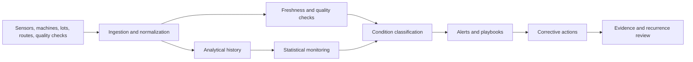

# Agricultural and Cold-Chain Observability for Food Production

**Audience:** Food producers, agricultural operators, cold-chain logistics teams, food processors, quality leaders, operations technology teams  
**Canonical URL:** `/whitepapers/agriculture-food-cold-chain-observability/`  
**Related papers:** Real-time statistical monitoring for live operations; ClickHouse for high-volume observability; the 12-Condition Framework; Cendryva self-hosted ML observability  
**Author:** Cendryva  
**Published:** 2026-05-25  
**Version:** 1.0  
**License:** CC BY 4.0
**Contact:** research@cendryva.com

## Abstract

Agriculture and food production are increasingly sensor-driven. Farms, greenhouses, packing houses, processing plants, refrigerated warehouses, and cold-chain logistics networks generate continuous signals: soil moisture, temperature, humidity, equipment state, lot movement, pest pressure, yield forecasts, cold-room exceptions, shipment telemetry, and quality checks.

The operational challenge is not only collecting this data. The challenge is knowing which signals require action, which sources are missing, which conditions threaten quality or safety, and whether corrective action was taken in time.

This paper explains how observability principles can be applied to agriculture, food processing, and cold-chain operations. It also explains how Cendryva turns sensor-heavy operational data into conditions, alerts, decision evidence, and improvement loops.

## Executive Summary

Food and agriculture operations are exposed to variability: weather, biology, equipment reliability, transportation delays, labor constraints, energy costs, and regulatory expectations. Teams need to answer:

- Are crops, facilities, lots, and shipments within expected operating conditions?
- Which sensors, devices, or integrations are stale or missing?
- Which temperature or humidity excursions require review?
- Which assets or routes show recurring risk?
- Which quality signals indicate process drift?
- Which corrective actions were taken, and did they prevent recurrence?
- Can leaders see the same condition language across farm, facility, and logistics operations?

Cendryva provides an observability layer for these environments. It combines sensor and event ingestion, high-volume analytical history, freshness monitoring, statistical thresholds, 12-Condition classification, anomaly detection, and response evidence so food and agriculture teams can move from raw telemetry to operational action.

## Why Food Operations Need Observability

Food production is a chain of time-sensitive processes. A greenhouse irrigation issue can affect yield. A cold-room compressor problem can threaten inventory. A shipment temperature excursion can trigger quality review. A processing-line anomaly can create waste or safety concern.

Traditional reporting often arrives too late. Operators need live and historical visibility that supports decisions during the growing, handling, processing, storage, and transport windows.

Observability helps teams connect:

- what happened
- where it happened
- which lot, asset, crop, room, or route was affected
- whether the signal was fresh and trustworthy
- what condition the signal represented
- what action was taken
- whether the same pattern recurred

## Industry Focus: Precision Agriculture and Greenhouse Operations

Precision agriculture uses sensors, geospatial tools, models, and analytics to support decisions around irrigation, inputs, crop health, pest pressure, yield, and equipment utilization. Greenhouses add dense environmental telemetry: temperature, humidity, CO2, light, nutrient dosing, irrigation cycles, and climate-control equipment.

Useful signals include:

- soil moisture
- irrigation events
- weather station readings
- pest trap counts
- disease risk scores
- crop growth indicators
- greenhouse temperature and humidity
- nutrient dosing status
- equipment runtime and faults
- yield forecast variance

Cendryva can classify these signals into operational conditions. A greenhouse zone may be NORMAL, a field moisture signal may fall into DANGER, a pest pressure model may enter CHANGE, or a weather station feed may drop into NON_EXISTENCE. The operator sees not just a chart, but a condition, owner, and response path.

## Industry Focus: Food Processing and Quality Operations

Food processing plants need visibility across lines, lots, sanitation, quality checks, equipment states, ingredient movement, and environmental controls. A small deviation may be harmless, but repeated or severe deviations can create waste, downtime, or safety review.

Common signals include:

- line speed
- downtime reason codes
- temperature and humidity by zone
- metal detection or inspection events
- quality test results
- lot hold and release status
- sanitation completion
- equipment vibration and fault codes
- operator checks
- packaging defect rates

Cendryva helps quality and operations teams connect these signals to thresholds, condition history, and corrective actions. A defect rate in DANGER can route to line leadership. A missing sanitation record can be treated as NON_EXISTENCE rather than hidden as a blank field. A chronic equipment issue can be classified as LIABILITY and escalated for maintenance planning.

## Industry Focus: Cold-Chain Logistics

Cold-chain logistics depends on maintaining conditions across storage, loading, transport, handoff, and delivery. Temperature, humidity, door-open events, GPS location, route delays, reefer status, and custody events all matter.

Operational signals include:

- trailer or container temperature
- cold-room temperature
- humidity
- door-open duration
- route delay
- reefer power status
- battery health
- geofence arrival and departure
- lot or pallet movement
- exception review status

Cendryva can monitor cold-chain telemetry in real time and preserve decision evidence for review. If a shipment enters DANGER because temperature exceeds an operating band, the platform can route the condition, log the response, and preserve the event window for quality review.

## Preventive Controls and Corrective Action

Food safety programs often emphasize prevention, monitoring, corrective action, and records. The FDA's Food Safety Modernization Act moved the U.S. food safety system toward prevention-oriented controls. For many operations, that means detecting problems early, documenting actions, and preventing affected food from entering commerce when safety cannot be assured.

Observability supports this operating model by making control signals measurable and reviewable:

- critical readings are monitored
- missing records are visible
- deviations are classified
- corrective actions are logged
- recurrence can be analyzed
- evidence can be retained for review

Cendryva is not a replacement for a food safety plan, HACCP program, preventive controls program, or quality management system. It is an operational observability layer that helps teams see, classify, and respond to the signals those programs depend on.

## Freshness and Sensor Trust

Agriculture and cold-chain operations depend on devices that can fail, disconnect, drift, or report late. A missing sensor signal should not look like a safe condition.

Freshness monitoring should track:

- last reading time
- expected update interval
- gateway or network status
- device battery state
- calibration status
- duplicate readings
- impossible values
- location mismatch
- ingestion delay

Cendryva treats stale and missing signals as first-class conditions. A room sensor in NON_EXISTENCE is an operational state, not a background IT issue. A temperature reading in DOUBT can require manual verification before product disposition.

## From Raw Measurements to Conditions

Food and agriculture operations use many units and thresholds. The 12-Condition Framework gives teams a shared interpretation layer.

| Condition     | Food and agriculture interpretation                   |
| ------------- | ----------------------------------------------------- |
| POWER         | Exceptional yield, throughput, or quality performance |
| AFFLUENCE     | Strong favorable performance                          |
| ABUNDANCE     | More resource or capacity than needed                 |
| NORMAL        | Within expected range                                 |
| BELOW_NORMAL  | Mild degradation or early warning                     |
| DANGER        | Material deviation requiring review                   |
| EMERGENCY     | Immediate product, safety, or operational risk        |
| NON_EXISTENCE | Missing sensor, record, or process evidence           |
| DOUBT         | Low-confidence or conflicting data                    |
| CHANGE        | Rapid shift in conditions or process behavior         |
| POWER_CHANGE  | Rapid favorable improvement                           |
| LIABILITY     | Chronic source of waste, downtime, or risk            |

The condition does not replace the measurement. It explains what the measurement means right now.

## Architecture Pattern

This pattern connects sensor telemetry, analytical history, freshness checks, condition classification, corrective action, and recurrence review. Cendryva provides the operating layer that makes those connections usable across teams.

## What Cendryva Delivers

For agriculture, food processing, and cold-chain operations, Cendryva delivers:

- sensor and event ingestion
- high-volume time-series analytics
- source freshness monitoring
- missing-signal detection
- threshold and anomaly monitoring
- 12-Condition classification
- lot, asset, zone, and route context
- alerts and corrective-action playbooks
- decision and response evidence
- recurring issue analysis
- self-hosted deployment options for sensitive operations

The value is operational: Cendryva helps teams identify risk earlier, act consistently, preserve evidence, and improve processes across farms, facilities, and logistics networks.

## Implementation Checklist

Food and agriculture teams adopting observability should define:

- critical sensor and process signals
- expected update intervals
- acceptable operating ranges
- condition thresholds
- device calibration and trust rules
- lot, asset, route, and zone identifiers
- corrective-action playbooks
- alert ownership
- evidence retention requirements
- integration points with quality and maintenance systems
- recurring issue review cadence
- escalation criteria for product safety or quality review

## Conclusion

Agriculture and food production are becoming data-rich, but data volume alone does not protect quality, yield, safety, or customer trust. Teams need to know which signals matter, whether those signals are trustworthy, and what action was taken when conditions changed.

Observability turns farms, facilities, and cold-chain networks into measurable operating systems. It connects telemetry, thresholds, freshness, conditions, corrective actions, and evidence.

Cendryva brings this pattern into one platform. It helps food and agriculture teams move from scattered sensor dashboards to coordinated operational response, with enough history and context to improve the next crop, batch, shipment, or shift.

## Scope and Limitations

This is a vendor-authored paper from Cendryva. Readers should weigh the analysis with that potential bias in mind. The paper describes an observability operating pattern; it is not a certification, audit opinion, or guarantee of regulatory compliance.

The paper covers operational observability for precision agriculture, food processing, and cold-chain logistics. It does not cover crop science, food formulation, equipment design, transportation contracts, or pricing strategy. Specific product, kit, or device integrations are out of scope.

Cendryva is not a food safety plan, HACCP program, preventive controls program, FSMA traceability solution, or quality management system. It is an operational data layer that helps teams see, classify, and respond to signals that those programs depend on. Food safety, traceability, and quality programs remain the responsibility of the operator and any qualified individuals or consultants engaged for that purpose. This paper is not legal, regulatory, or food-safety advice. Operators should consult their food safety qualified individuals, regulatory counsel, and certifying bodies for their specific obligations.

Regulatory expectations evolve. FSMA rules, traceability requirements (including FSMA Section 204), and equivalent regimes outside the United States change over time. Readers should verify current requirements with the relevant authority before relying on any specific control framing in this document.

Examples in this paper are illustrative. Thresholds for temperature, humidity, dwell time, defect rates, and similar measures must be set per product, per process, per facility, and per regulatory environment. They are not benchmarks of a specific deployment.

Jurisdictional note: regulatory references in this paper are primarily United States (FDA, USDA). Operators in other jurisdictions should reference the equivalent local authorities and standards (such as EFSA in the European Union and national competent authorities elsewhere).

## References and Further Reading

### Food safety regulations and standards

- U.S. Food and Drug Administration. *Food Safety Modernization Act (FSMA)*. fda.gov.
- U.S. Food and Drug Administration. *FSMA Final Rule on Requirements for Additional Traceability Records for Certain Foods (Section 204)*. 2022.
- U.S. Food and Drug Administration. *Hazard Analysis and Risk-Based Preventive Controls for Human Food (Final Rule)*. 2015.
- U.S. Department of Agriculture, Food Safety and Inspection Service. *HACCP-Based Inspection Models Project and related guidance*. usda.gov.
- ISO 22000:2018. *Food safety management systems — Requirements for any organization in the food chain*. International Organization for Standardization.
- Codex Alimentarius Commission. *General Principles of Food Hygiene (CXC 1-1969)*. FAO/WHO.

### Cold-chain and traceability

- GS1. *EPCIS and Core Business Vocabulary (CBV) Standards*. gs1.org.
- USDA Agricultural Marketing Service. *Cold Chain and Transportation Guidance*. ams.usda.gov.
- International Safe Transit Association. *ISTA cold-chain testing standards*. ista.org.

### Sensors, IoT, and data

- National Institute of Standards and Technology. *NIST SP 800-213: IoT Device Cybersecurity Guidance for the Federal Government*. 2021.
- OpenTelemetry. *Specification and Semantic Conventions*. Cloud Native Computing Foundation.

### Related Cendryva whitepapers

- *Real-Time Statistical Monitoring for Live Operations*. Cendryva.
- *ClickHouse for High-Volume ML and Statistical Observability*. Cendryva.
- *The 12-Condition Framework*. Cendryva.
