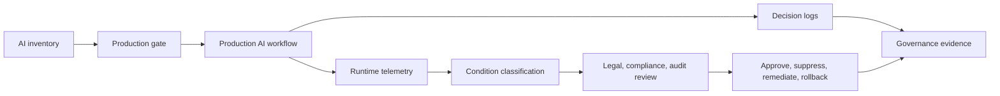

# AI Governance Risk Register for Legal, Compliance, and Audit Teams

**Format:** Risk register and controls model  
**Audience:** General counsel, compliance leaders, internal audit, risk managers, privacy teams, AI governance committees, model owners  
**Canonical URL:** `/whitepapers/ai-governance-legal-compliance-risk-register/`  
**Related papers:** Model drift detection in regulated environments; HIPAA-ready ML decision logs; model registry production gates; Cendryva self-hosted ML observability  
**Author:** Cendryva  
**Published:** 2026-05-25  
**Version:** 1.0  
**License:** CC BY 4.0
**Contact:** research@cendryva.com

## Purpose

Legal, compliance, and audit teams are being asked to oversee AI systems that change quickly, operate across departments, and influence real business decisions. Policies, review boards, and spreadsheets are necessary, but they are not enough when AI models, prompts, rules, and automated workflows are already running in production.

This risk register gives governance teams a practical structure for identifying, monitoring, and evidencing AI operational risk.

Cendryva helps turn AI governance from a static policy file into a living control system: model inventory, production gates, decision logs, drift monitoring, exception tracking, evidence history, and condition-based oversight.

## Governance Premise

AI governance fails when controls exist on paper but not in the operational path.

The control question is not only:

> Did someone approve this AI system?

The stronger question is:

> Can we prove which version was active, which controls were applied, what it decided, whether behavior changed, who responded, and what evidence remains?

Cendryva is designed to preserve that operational proof.

## Risk Register

| Risk                             | Common failure mode                                             | Control objective                                                 | Cendryva evidence                                             |
| -------------------------------- | --------------------------------------------------------------- | ----------------------------------------------------------------- | ------------------------------------------------------------- |
| Undocumented AI use              | Teams deploy models, prompts, or automations outside governance | Maintain AI inventory and ownership                               | Model registry, workflow inventory, owner mapping             |
| Unapproved production change     | Model or prompt changes without review                          | Gate production promotion                                         | Promotion records, approval logs, rollback target             |
| Decision opacity                 | Organization cannot reconstruct AI-assisted action              | Preserve decision evidence                                        | Decision logs, model version, input freshness, output, action |
| Model drift                      | AI behavior degrades after deployment                           | Monitor production behavior                                       | Drift scores, affected cohorts, condition history             |
| Data quality failure             | AI operates on stale or missing data                            | Monitor source freshness                                          | NON_EXISTENCE, DOUBT, and freshness evidence                  |
| Privacy overexposure             | Sensitive data appears in dashboards or prompts unnecessarily   | Minimize and restrict data use                                    | Role-based views, data separation, access logs                |
| Bias or disparate impact concern | Outputs differ materially across protected or sensitive groups  | Monitor outcome and segment behavior where lawful and appropriate | Segment metrics, review queues, exception evidence            |
| Human oversight failure          | Required human review is skipped or ineffective                 | Track review and disposition                                      | Reviewer actions, overrides, escalations                      |
| Vendor or third-party AI risk    | External model or API changes behavior unexpectedly             | Monitor dependencies and outputs                                  | Vendor model/version metadata, anomaly and drift history      |
| Audit evidence gap               | Policies exist but evidence is scattered                        | Centralize operational evidence                                   | Control history, decision history, response history           |

## Control Area 1: AI Inventory and Ownership

Governance begins with knowing what exists. AI inventory should include models, prompts, rules, decision services, scoring workflows, agentic workflows, and embedded vendor AI features.

**Required evidence**

- system name
- owner
- business process
- model or prompt version
- data sources
- intended use
- user or customer impact
- risk classification
- approval status
- monitoring owner
- retirement or review date

**Cendryva fit**

Cendryva connects model and workflow inventory to runtime telemetry, decision logs, and condition history. This prevents the inventory from becoming stale as soon as production changes.

## Control Area 2: Production Gates

A production gate determines whether an AI system is allowed to affect business operations. This aligns with the broader idea in NIST AI RMF and ISO/IEC 42001 that AI governance should cover lifecycle management, monitoring, and continual improvement.

**Gate criteria**

- risk classification is complete
- owner approval is recorded
- validation evidence is attached
- source data is available and fresh
- human oversight requirements are configured
- decision logging is active
- rollback or suppression path exists
- monitoring thresholds are defined

**Cendryva fit**

Cendryva links promotion records to model versions, validation evidence, decision logs, drift monitoring, and rollback controls. Legal and audit teams can see whether governance requirements were operationalized, not merely approved.

## Control Area 3: Decision Logs

Decision logs are the evidence layer for AI-assisted business processes. They help teams reconstruct what happened when a model, prompt, or automated workflow influenced an outcome.

**Decision log fields**

- timestamp
- workflow
- model, prompt, or rule version
- source freshness status
- input summary or controlled reference
- output or recommendation
- confidence or score
- policy checks
- human review status
- action taken
- override or exception
- trace ID

**Cendryva fit**

Cendryva preserves AI decision evidence without forcing every sensitive input into broad visibility. It supports role-based views and evidence separation so legal, compliance, audit, and operations teams can review the right level of detail.

## Control Area 4: Drift, Change, and Exceptions

AI systems can change behavior because data changes, prompts change, user behavior changes, business policies change, or third-party dependencies change. Governance teams need to know when production behavior moves outside expected boundaries.

**Signals to monitor**

- score distribution shift
- model output change
- prompt version change
- feature freshness
- error rate
- override rate
- exception rate
- segment-level outcome movement
- user complaint or appeal pattern
- downstream business metric change

**Cendryva fit**

Cendryva classifies these signals using the 12-Condition Framework. DANGER can indicate material behavior shift. DOUBT can indicate low-confidence evidence. NON_EXISTENCE can indicate missing telemetry. LIABILITY can indicate chronic unresolved control weakness.

## Control Area 5: Human Oversight

Many AI governance programs require human review for high-impact or uncertain decisions. But oversight is only meaningful if it is recorded and measured.

**Oversight evidence**

- whether review was required
- who reviewed
- what evidence was shown
- whether recommendation was accepted, modified, or rejected
- reason code
- escalation path
- time to review
- post-review outcome

**Cendryva fit**

Cendryva connects decision logs to reviewer action and disposition. This lets governance teams distinguish actual oversight from a policy checkbox.

## Control Area 6: Privacy and Data Minimization

AI governance often intersects with privacy risk. The NIST Privacy Framework emphasizes managing privacy risk from data processing. AI systems may increase risk when they expose unnecessary data, retain too much context, or create broad access to sensitive information.

**Controls**

- minimize inputs to what is necessary
- separate identifiers from analytical metrics where practical
- restrict sensitive fields by role
- log access to sensitive evidence
- define retention periods
- avoid unnecessary free-text propagation
- monitor unexpected data source changes

**Cendryva fit**

Cendryva separates operational signals, decision metadata, raw references, and role-specific views so oversight does not require indiscriminate data exposure.

## Condition Model for AI Governance

| Condition     | Governance interpretation                                   |
| ------------- | ----------------------------------------------------------- |
| POWER         | Control or monitored outcome materially improved            |
| AFFLUENCE     | Strong control performance                                  |
| NORMAL        | AI system operating inside approved boundaries              |
| BELOW_NORMAL  | Early control weakness or minor degradation                 |
| DANGER        | Material control, drift, privacy, or decision risk          |
| EMERGENCY     | Immediate high-impact risk or required intervention         |
| NON_EXISTENCE | Missing evidence, owner, telemetry, review, or decision log |
| DOUBT         | Evidence is incomplete, conflicting, or low confidence      |
| CHANGE        | Material version, behavior, or process shift                |
| POWER_CHANGE  | Rapid improvement after control remediation                 |
| LIABILITY     | Chronic unresolved governance weakness                      |
| ABUNDANCE     | Excess review capacity or control buffer                    |

## Cendryva Governance Architecture

## What Cendryva Delivers

For legal, compliance, and audit teams, Cendryva delivers:

- AI system and model inventory linkage
- production gate evidence
- model, prompt, and rule version traceability
- decision logs for AI-assisted workflows
- source freshness monitoring
- drift and anomaly detection
- 12-Condition governance classification
- human review and override evidence
- exception and remediation history
- privacy-aware operational views
- rollback and suppression support
- audit-ready evidence packages

The value is defensibility: Cendryva helps governance teams prove that AI systems are known, approved, monitored, reviewable, and reversible.

## Audit Questions Cendryva Helps Answer

1. Which AI systems are in production?
2. Who owns each AI system?
3. Which version made a specific decision?
4. Was the system approved for that workflow?
5. Were required data sources fresh?
6. Was human review required and completed?
7. Did model behavior drift after deployment?
8. Were exceptions documented and remediated?
9. Can sensitive inputs be reviewed without broad exposure?
10. Can the organization roll back or suppress the system if risk rises?

## Scope and Limitations

This is a vendor-authored paper from Cendryva. Readers should weigh the analysis with that potential bias in mind. The risk register and control areas are an operational pattern, not a substitute for a formal AI governance program designed for the reader's organization, jurisdiction, and use cases.

**This paper is not legal, regulatory, audit, or compliance advice.** AI governance obligations vary by jurisdiction, sector, business model, contract terms, and the specific intended use of each AI system. Counsel, internal audit, compliance, privacy, and risk leadership for the reader's organization remain responsible for determining the correct controls. Readers should consult qualified legal counsel and their internal compliance and audit functions before relying on any framing in this document for a specific obligation.

The paper covers operational governance evidence (inventory, gates, decision logs, drift signals, oversight evidence, exceptions). It does not cover model validation methodology, statistical fairness testing techniques, contract drafting, procurement diligence questionnaires, board-level reporting templates, incident disclosure thresholds, or sector-specific safety case construction.

The risk register is illustrative. Real risk taxonomies should reflect the organization's own risk appetite, regulatory exposure, model inventory, and threat landscape. The presence of a control area in this document does not imply sufficiency for any specific regulation or audit framework.

AI regulation is evolving quickly. The EU AI Act, NIST AI RMF profiles, ISO/IEC standards, state-level AI laws, sectoral guidance (financial services, health, employment), and enforcement positions change over time. Verify current requirements at the time of use rather than treating any control example here as durable. Jurisdictional note: the references include US (NIST, COSO), international (ISO/IEC, OECD), and EU sources; readers operating elsewhere should map to local authorities.

No fairness, bias, or disparate-impact monitoring described here should be implemented without legal review. Lawful and appropriate use of protected-class data varies materially across jurisdictions and sectors.

## References and Further Reading

### AI risk management frameworks and standards

- National Institute of Standards and Technology. *AI Risk Management Framework (AI RMF 1.0)*. NIST AI 100-1, January 2023.
- National Institute of Standards and Technology. *Generative AI Profile (NIST AI 600-1)*. 2024.
- ISO/IEC 42001:2023. *Information technology — Artificial intelligence — Management system*. International Organization for Standardization.
- ISO/IEC 23894:2023. *Information technology — Artificial intelligence — Guidance on risk management*. International Organization for Standardization.
- ISO/IEC 22989:2022. *Information technology — Artificial intelligence — Artificial intelligence concepts and terminology*. International Organization for Standardization.
- OECD. *Recommendation of the Council on Artificial Intelligence (OECD AI Principles)*. OECD/LEGAL/0449, 2019, updated 2024.

### Regulatory and supervisory references

- European Union. *Regulation (EU) 2024/1689 (Artificial Intelligence Act)*. Official Journal of the European Union, 2024.
- Board of Governors of the Federal Reserve System and Office of the Comptroller of the Currency. *Supervisory Guidance on Model Risk Management (SR 11-7 / OCC 2011-12)*. 2011.
- U.S. Department of Health and Human Services, Office for Civil Rights. *HIPAA Privacy Rule*. 45 CFR Part 160 and Subparts A and E of Part 164.
- U.S. Federal Trade Commission. *Statements and guidance on AI, automated decision-making, and unfair or deceptive practices*. ftc.gov.

### Privacy, controls, and assurance

- National Institute of Standards and Technology. *NIST Privacy Framework 1.0*. January 2020.
- Committee of Sponsoring Organizations of the Treadway Commission (COSO). *Internal Control — Integrated Framework*. 2013.
- AICPA. *Trust Services Criteria (used in SOC 2 reporting)*. American Institute of Certified Public Accountants.

### Related Cendryva whitepapers

- *Model Drift Detection in Regulated Environments*. Cendryva.
- *HIPAA-Ready ML Decision Logs*. Cendryva.
- *Model Registry Production Gates*. Cendryva.
- *Cendryva Self-Hosted ML Observability*. Cendryva.
