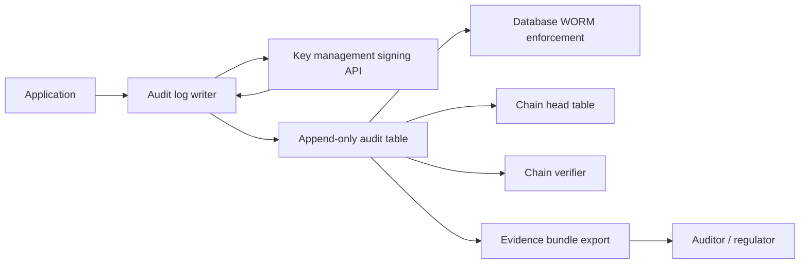

# Audit Trails for AI Decisions: What Compliance Teams Need From ML Platforms

**Audience:** Compliance officers, internal audit, privacy officers, IT GRC leaders, ML platform buyers, vendor risk teams
**Canonical URL:** `/whitepapers/audit-trails-for-ai-decisions-compliance-buyer-education/`
**Related papers:** HIPAA-ready ML decision logs; building an ML decision log for SOC 2, HIPAA, and model risk management; AI governance risk register; Cendryva self-hosted ML observability
**Author:** Cendryva
**Published:** 2026-05-25
**Version:** 1.0
**License:** CC BY 4.0
**Contact:** research@cendryva.com

## Abstract

When a regulator, an internal auditor, a model risk officer, or a counsel asks "what did the model do," the answer should not be a screenshot of a dashboard. It should be a structured, signed, tamper-evident record that lets a third party reconstruct the decision, the inputs, the version, the policy state, and the downstream action.

Compliance teams evaluating ML platforms are often presented with the phrase "audit trail" and given a description that does not match what an examination actually needs. Application logs, access logs, change logs, and pipeline logs are all valuable, but none of them on their own constitute an audit trail for an AI decision. The vocabulary collapse is the source of many bad procurement decisions.

This paper is written for the buyer side. It defines what an audit trail for AI decisions actually means in practice, separates it from application logging, lays out a concrete checklist a compliance team can use to interview vendors, and explains the retention, integrity, and export controls that an examiner will eventually ask for.

## Executive Summary

A useful audit trail for AI decisions has a specific shape. It is per-inference, not per-batch. It is append-only and tamper-evident. It is signed by a key the application process cannot read directly. It is tenant-scoped so one customer cannot read or invalidate another customer's evidence. It captures enough context to reconstruct what the model did and what happened next, while minimizing unnecessary regulated-data retention.

A compliance buyer should be able to ask any candidate vendor:

- Is the audit trail per-decision or per-application-event?
- Are records append-only, with corrections expressed as new events?
- Are records hash-chained and signed?
- Where do the signing keys live and who can use them?
- How is tenant isolation enforced at the audit layer?
- What fields are captured, and what is the data minimization policy?
- What are the retention classes and who sets them?
- Can the trail be exported as an evidence bundle for an examination?
- Can the trail be verified independently, without trusting the application that wrote it?
- What happens to the trail during a vendor upgrade, a database migration, or a disaster recovery event?

Vendors that cannot answer these questions clearly should be treated as immature for regulated workloads. Vendors that answer them with a generic logging story should be pressed for the specific design choices behind tamper evidence, signing, and chain verification.

Cendryva is described later in the paper. The first half is buyer education that applies regardless of which platform an organization eventually selects.

## What Compliance Means By Audit Trail

The phrase "audit trail" gets used loosely. For an examination of an AI system, it has a narrower meaning. An audit trail for AI decisions should let an independent reviewer answer the following without the cooperation of the application that wrote it:

1. Which version of which model produced a given decision?
2. What input context was available at the time, including freshness and provenance?
3. What output did the model produce, with what confidence, and against what threshold?
4. What policy state applied, and was the output allowed to act?
5. Who or what acted on it next, with what disposition?
6. Has the record been altered since it was written?
7. Can a contiguous sequence of decisions for a tenant, a model, or a time window be reconstructed?

Application logs do not answer these questions reliably. They are written for engineers, retained on shorter timelines, and rotated, truncated, or rewritten by the application itself. They are not designed to survive examination.

## Decision Logs Versus Application Logs

The clearest way to explain the distinction is by responsibility:

| Concern | Application log | Audit trail for AI decisions |
| -- | -- | -- |
| Audience | Engineers, on-call | Auditors, regulators, model risk, counsel |
| Granularity | Per-event, debug-friendly | Per-decision, reconstructable |
| Mutability | Often rotated, sometimes rewritten | Append-only |
| Integrity | None enforced | Hash chain, signature |
| Access control | Usually broad | Narrow, role and purpose scoped |
| Retention | Days to weeks | Years, by policy |
| Schema stability | Frequently changes | Schema-controlled by policy |
| Sensitive data | Often present accidentally | Minimized by design |
| Export | Engineer query | Evidence bundle |

A team that conflates the two ends up storing many gigabytes of debug data with no examination value, and discovers during an incident that the records they actually need do not exist.

## The Buyer's Checklist

A practical checklist a compliance buyer can take into a vendor evaluation. The wording is deliberately direct.

### Granularity

- Is there one audit record per inference, or only per application-level event?
- Can a single record be located by request ID, decision ID, or trace ID?
- Are the records linked to the model version that produced them?

### Integrity

- Are records append-only by design? Are corrections expressed as new events that reference the prior event?
- Is each record hash-chained to the previous record in its chain scope?
- Is each record signed? With what algorithm and what key?
- Where do the signing keys live? Can the application process read the private key, or does it only have a signing capability?
- Is chain verification implemented and exposed as an operational endpoint or job?
- Is there a database-level enforcement mechanism, such as a trigger or a write-once retention policy, that prevents updates and deletes?

### Access control

- Who can write to the audit store? Who can read? Who can export?
- Are reads logged?
- Is administrative access separated from operational access, with break-glass logged and reviewed?
- Is tenant isolation enforced at the row level, the chain level, and the export level?

### Schema and content

- Is the schema documented and version-controlled?
- What fields are required, and which are optional?
- What is the data minimization policy? Are full payloads avoided in favor of feature summaries and scoped hashes?
- How are identifiers represented to minimize regulated-data exposure?
- Are reason codes and policy state captured, not just inputs and outputs?

### Retention

- Are retention classes assigned by workflow, regulatory regime, and policy?
- Who can change retention, and is that change itself audited?
- How is legal hold supported?
- What happens at the end of a retention period, and is the deletion recorded?

### Export and verification

- Can an evidence bundle for a specific tenant, time window, model, or decision be exported in a structured format?
- Can chain verification be performed on the export, independent of the live application?
- Are signatures verifiable using public keys the enterprise controls?

### Operations

- What happens to the audit trail during a database migration?
- What happens during a disaster recovery event?
- What happens during a version upgrade of the platform?
- Is there a documented operator runbook for the audit chain?

### Multi-tenant context

- Are audit chains tenant-scoped, or shared globally?
- Can one tenant cause an integrity failure that affects another tenant?
- Are exports scoped to a tenant by default?

These questions are not a wish list. They map to controls that examiners and auditors actually ask about. A vendor that handles them well will answer concretely; a vendor that handles them poorly will redirect to a generic logging story.

## What "Append-Only" Really Means

Append-only is a frequently abused phrase. In a serious implementation, it means at least three things simultaneously:

- **Application-level discipline.** The application code only inserts; it never updates or deletes audit rows.
- **Database-level enforcement.** A trigger or a permission policy makes updates and deletes fail at the database layer, so an application bug or a malicious operator cannot rewrite history through the normal data path.
- **Privilege separation.** The role used by the application has insert and select grants only. Update and delete grants are revoked at the database level for the application role. Operators who can change schema or run direct SQL are separate from the role that runs the platform.

A system that satisfies only the first level is append-only by convention. A system that satisfies all three is append-only by enforcement, which is what an examiner expects.

## What Signing Actually Buys

Signing produces a verifiable claim that a specific record was created by a specific identity at a specific time. For that claim to be meaningful:

- The private key must not be readable by the application process. A common pattern is a transit signing API in a key management system such as Vault, where the application sends a payload and receives a signature without ever seeing the key material.
- The public key must be retrievable so any reviewer can verify the signature without trusting the application or the database.
- Key rotation must be supported so a compromised or retired key can be replaced without invalidating prior records.
- The signature should cover the chain reference, not only the record body, so a record cannot be re-parented to a different chain after the fact.

A "signed" audit log where the application reads the private key from a config file does not satisfy these properties.

## What Hash Chaining Actually Buys

Hash chaining ties each record to the previous record in its chain scope. Inserting, deleting, or reordering records breaks the chain in a way an independent verifier can detect.

For chaining to be useful:

- The chain scope should be explicit. A common choice is one chain per tenant, or one chain per tenant per resource category. A single global chain is brittle and creates cross-tenant coupling.
- The chain head should be tracked in a separate table so chain integrity can be verified without scanning the entire history.
- Verification should be implemented and run periodically. An unsigned, unchained, or unverified record set is not tamper-evident.

## Data Minimization Is A Control, Not An Afterthought

An audit trail that copies the full source payload of every decision quickly becomes a second uncontrolled system of record for whatever sensitive data the application handles. For healthcare, that means duplicating PHI into the audit store. For financial services, that means duplicating customer financial information into the audit store. Both create new breach surfaces and new examination targets.

Practical minimization controls:

- Store feature summaries and feature hashes rather than raw source documents.
- Represent identifiers as scoped, salted hashes when direct identifiers are not needed.
- Avoid free-text fields that can accidentally capture sensitive content.
- Use structured reason codes rather than narrative explanations where possible.
- Apply field-level redaction policies tied to role and purpose for any read path that exposes audit content.

The goal is an audit trail that is useful enough to investigate the event and narrow enough to not become a parallel medical record or a parallel customer database.

## Retention Is A Policy Decision, Not A Default

Different regulatory regimes and different workflows have different retention expectations. A single global default usually fails at least one of them.

A mature platform supports:

- Retention classes assigned per workflow or per audit category.
- Policy-driven changes to retention with their own audit events.
- Legal hold that suspends retention for a defined scope.
- Documented end-of-retention behavior, including whether a deletion is recorded.

The buyer should expect to set retention. The platform should not set it on the buyer's behalf in a way the buyer cannot inspect.

## Industry Focus: Healthcare and Life Sciences

A covered entity using ML for utilization management or care coordination should expect every model recommendation to be reconstructable during an OCR audit, a complaint investigation, or a patient access request. The audit trail should let the privacy officer answer "which staff member viewed this recommendation," "what features were used," "which model version produced it," and "what action followed," without depending on the application that wrote the record.

For life sciences and clinical research, the same shape applies with additional 21 CFR Part 11 considerations for electronic records used in regulated activities. Signed, tamper-evident records are the language Part 11 speaks.

## Industry Focus: Financial Services

For banks and insurers, the audit trail should support model risk management under SR 11-7 and OCC Bulletin 2011-12. An examiner asking about ongoing monitoring expects to see per-decision evidence, version traceability, drift event records, and rollback records, all under integrity controls that survive the examiner's verification.

For broker-dealers and investment advisers, SEC and FINRA recordkeeping rules drive specific retention and accessibility requirements. The audit trail should be exportable in a structured form that satisfies those requirements without manual reformatting.

## Architecture Pattern

The signer never returns the private key. The writer never updates rows. The trigger fails updates and deletes from the application role. The verifier walks the chain. The exporter scopes by tenant. The reviewer can verify the export with the public key without trusting the application.

## How Cendryva Applies This Pattern

Cendryva implements the controls described above as the audit spine of the platform.

- **Per-decision granularity.** Each ML decision, drift detection, and promotion event writes an audit row. The writer is `apps/api/src/services/domains/audit/immutable-audit-log.service.ts`.
- **Append-only with database enforcement.** `migrations/postgres/V002__Audit_Trail_And_Logs.sql` adds a BEFORE UPDATE OR DELETE trigger that raises an exception. The operator-time `REVOKE UPDATE, DELETE` from the application role is documented in `docs/operations/AUDIT-WORM-OPERATIONS.md`.
- **Hash chaining.** Records include `previous_hash` and a `chain_scope`. The `audit_log_chains` table tracks chain heads. `verifyChain` in the immutable audit log service walks signatures and previous-hash linkage.
- **Signing through Vault.** `apps/api/src/services/platform/vault/vault.service.ts` performs Ed25519 sign and verify through Vault transit. The application process never reads the private key. The provider abstraction is in `apps/api/src/services/domains/audit/audit-signing-key-provider.ts`.
- **Tenant scope.** Chain scope is tenant-aware. Row-level security on related tables uses `current_org_id()` defined in `migrations/postgres/V001__Identity_And_Tenancy.sql`.
- **System-internal traffic.** Platform-internal jobs use `SYSTEM_ORGANIZATION_ID` and `SYSTEM_ACTOR_ID` sentinels exported from `packages/types/src/system-identity.ts` so background workers, scheduled jobs, and system callers produce signed, persisted, verifiable records.
- **Minimum necessary middleware.** `apps/api/src/middleware/minimum-necessary.ts` enforces field-level redaction by role and purpose so read paths cannot leak fields outside the requester's scope.
- **HIPAA controls catalog.** `src/compliance/hipaa.rs` and `src/bin/hipaa_report.rs` produce a control catalog mapping that can be exported as evidence.

The buyer can verify these claims by reading the cited files and running the audit test suite.

## Implementation Checklist

A compliance team taking the platform into production should:

- Confirm the application database role has insert and select grants only on the audit table, with update and delete revoked.
- Confirm the signing key lives in the enterprise KMS or Vault and is not readable by the application.
- Confirm chain verification is scheduled, monitored, and alerted on.
- Confirm retention classes are set by policy and changes are audited.
- Confirm evidence export is scoped to a tenant and verifiable independently.
- Confirm minimum-necessary middleware is enabled on read paths that expose audit content.
- Confirm the operator runbook for the audit chain is published and tested.

## Conclusion

Audit trails for AI decisions are not a marketing feature. They are the evidence layer on which the rest of an organization's regulated AI posture depends. The shape of that layer is specific: per-decision, append-only, hash-chained, signed by a key the application cannot read, tenant-scoped, retention-aware, and exportable as an evidence bundle.

A compliance team that knows the shape can interview vendors with the specificity the conversation requires. A vendor that takes the controls seriously will answer concretely. A vendor that does not will hide behind the word "logging."

This paper is meant to give compliance teams a vocabulary that survives the procurement conversation. The companion Cendryva papers describe how those controls are implemented in one specific platform.

## Implementation Status

This section maps the Cendryva claims above to the codebase as of the publication date.

**Per-decision audit writes** - SHIPPED
- Code: `apps/api/src/services/domains/audit/audit.service.ts`, `apps/api/src/services/domains/audit/immutable-audit-log.service.ts`.

**Append-only enforcement** - SHIPPED
- Schema: `migrations/postgres/V002__Audit_Trail_And_Logs.sql` (`enforce_audit_logs_worm` trigger).
- Operator runbook: `docs/operations/AUDIT-WORM-OPERATIONS.md`.

**Hash chaining and chain head tracking** - SHIPPED
- Schema: `audit_log_chains` table in `migrations/postgres/V002__Audit_Trail_And_Logs.sql`.
- Code: `src/data/audit_logs.rs`, `apps/api/src/services/domains/audit/immutable-audit-log.service.ts` (`verifyChain`).

**Ed25519 signing through Vault transit** - SHIPPED
- Code: `apps/api/src/services/platform/vault/vault.service.ts` (`transitSign`, `transitVerify`), `apps/api/src/services/domains/audit/audit-signing-key-provider.ts`, `apps/api/src/services/domains/audit/audit-signing-key-provider.factory.ts`.

**Tenant-scoped row-level security** - SHIPPED
- Schema: `migrations/postgres/V001__Identity_And_Tenancy.sql` (`current_org_id()`), `migrations/postgres/V006__ML_Schema_And_RLS.sql`, multiple later migrations enabling RLS.

**System-internal traffic sentinels** - SHIPPED
- Code: `packages/types/src/system-identity.ts`.

**Minimum-necessary middleware** - SHIPPED
- Code: `apps/api/src/middleware/minimum-necessary.ts`.

**HIPAA controls catalog with evidence export** - SHIPPED
- Code: `src/compliance/hipaa.rs`, `src/bin/hipaa_report.rs`, `docs/compliance/HIPAA-CONTROLS-MAPPING.md`.

**Evidence bundle export tooling** - PARTIAL
- Per-tenant audit export endpoints exist for compliance-controlled workflows. A standalone signed evidence bundle format (single-file, independently verifiable archive with embedded public key references) is DEFERRED to a future release. Current exports are queryable from the audit tables under the operator runbook.

## Scope and Limitations

This is a vendor-authored paper from Cendryva. It is buyer education aimed at compliance, internal audit, and privacy professionals evaluating ML platforms. It is not an independent product review, an endorsement, or a substitute for vendor-specific security review.

In scope: vocabulary, controls, and a checklist for evaluating audit trails for AI decisions. A reference description of how Cendryva implements those controls.

Out of scope: prescriptive retention periods for any specific regulatory regime, contractual templates for vendor agreements, certification or attestation guidance for any specific framework, and product-by-product comparison against named competitors.

This paper is not legal, regulatory, or audit advice. HIPAA, SOC 2, SR 11-7, NIST AI RMF, EU AI Act, GDPR, FFIEC, SEC, FINRA, and 21 CFR Part 11 are referenced as commonly applicable regimes. Specific obligations depend on the regulated entity's role, contracts, controlling jurisdiction, and supervisory relationships. Engage qualified counsel, model risk officers, and accredited assessors before treating any pattern in this paper as a compliance prescription.

Standards and regulations change. References reflect publicly available sources at the publication date in the header. Re-verify current versions before relying on a specific rule.

## References and Further Reading

### Audit and logging standards

- NIST. *Special Publication 800-92: Guide to Computer Security Log Management*. https://csrc.nist.gov/pubs/sp/800/92/final
- International Organization for Standardization. *ISO/IEC 27001:2022*. Information security management.
- AICPA. *SOC 2 Trust Services Criteria*. https://www.aicpa-cima.com/
- IETF. *RFC 5424: The Syslog Protocol*. https://datatracker.ietf.org/doc/html/rfc5424
- IETF. *RFC 8417: Security Event Token (SET)*. https://datatracker.ietf.org/doc/html/rfc8417

### Healthcare and life sciences

- HHS Office for Civil Rights. *HIPAA Security Rule*. https://www.hhs.gov/hipaa/for-professionals/security/index.html
- HHS Office for Civil Rights. *HIPAA Audit Protocol*. https://www.hhs.gov/hipaa/for-professionals/compliance-enforcement/audit/protocol/index.html
- US Food and Drug Administration. *21 CFR Part 11: Electronic Records; Electronic Signatures*. https://www.ecfr.gov/current/title-21/chapter-I/subchapter-A/part-11

### Financial services

- Board of Governors of the Federal Reserve System and Office of the Comptroller of the Currency. *Supervisory Guidance on Model Risk Management (SR Letter 11-7 / OCC Bulletin 2011-12)*. 2011. https://www.federalreserve.gov/supervisionreg/srletters/sr1107.htm
- Federal Financial Institutions Examination Council. *IT Examination Handbook: Audit*. https://ithandbook.ffiec.gov/

### Privacy frameworks

- Organisation for Economic Co-operation and Development. *OECD Guidelines on the Protection of Privacy and Transborder Flows of Personal Data*. 2013 update. https://www.oecd.org/sti/ieconomy/privacy.htm

### Related Cendryva whitepapers

- *HIPAA-ready ML decision logs*.
- *Building an ML decision log for SOC 2, HIPAA, and model risk management*.
- *AI governance risk register for legal, compliance, and audit teams*.
- *Cendryva self-hosted ML observability*.
