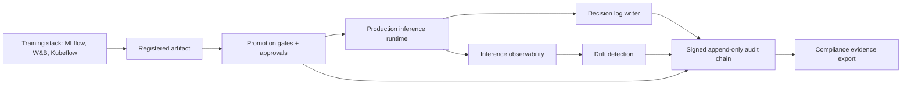

# Beyond MLflow: Production Monitoring, Drift Detection, and Auditability for Enterprise ML

**Audience:** ML platform leads, model risk officers, MLOps engineers, compliance and audit teams, infrastructure architects
**Canonical URL:** `/whitepapers/beyond-mlflow-production-monitoring-drift-auditability/`
**Related papers:** Cendryva self-hosted ML observability; model drift detection in regulated environments; from model registry to production gate; HIPAA-ready ML decision logs
**Author:** Cendryva
**Published:** 2026-05-25
**Version:** 1.0
**License:** CC BY 4.0
**Contact:** research@cendryva.com

## Abstract

MLflow and the surrounding generation of experiment trackers, model registries, and training pipeline tools changed how teams build models. They standardized how experiments are recorded, how runs are compared, how artifacts are versioned, and how a trained model graduates from a notebook into a registry. That is real progress for the training side of the machine learning lifecycle.

But the questions that determine whether an ML system is safe to operate are not training questions. They are production questions. Which version answered a specific request. What inputs were present and how fresh they were. Whether the input population still resembles the validation baseline. Whether prediction latency, calibration, or downstream outcome drifted. Whether decisions can be reconstructed during an audit. Whether an operator can revert a bad model without paging a data scientist.

This paper separates the responsibilities of a training-time registry from the responsibilities of a production observability and governance layer. It explains what MLflow and similar tools are good at, what they were not built to do, and which controls regulated and operationally serious teams need in production. It then describes how Cendryva is structured as a production-side companion to whatever training registry an organization already uses.

## Executive Summary

A practical way to read the MLOps landscape is to split it into two halves with different design centers.

- **Training-time tools** optimize experimentation, reproducibility, artifact management, and handoff. MLflow Tracking, the MLflow Model Registry, Weights and Biases, Kubeflow Pipelines, and similar systems fit here. They are valuable, and most regulated teams already use one.
- **Production-time tools** optimize inference observability, drift detection, decision logging, threshold response, model promotion gates, rollback paths, and tamper-evident audit. This is a different problem and usually a different operational owner.

Teams that confuse the two end up with strong experiment hygiene and weak production accountability. The model registry shows what was trained. It rarely shows what is currently serving traffic, what feature freshness looked like during an incident, or which decisions a regulator needs to inspect.

The production-time controls a regulated enterprise needs include:

- A real-time inference observability surface that records version, latency, errors, feature freshness, and prediction characteristics per request.
- Distribution drift detection on input features and outputs, with severity classification and operational thresholds.
- A decision log that is signed, hash-chained, and append-only, and that survives an examiner asking what the model did on a specific day.
- A promotion workflow with explicit gates, approvals, rollback paths, and entitlements rather than a flag flipped in a UI.
- Tenant-aware persistence so a multi-tenant SaaS or multi-business-unit platform cannot leak data between scopes.
- Self-hosted deployment options for organizations that cannot send model inputs and decisions to a third-party SaaS.

Cendryva is built around these production-time controls. It is not a replacement for a training-time registry. It is the layer that takes a model artifact, runs it in production, observes it, gates it, logs every decision, and produces evidence that compliance, audit, and incident teams can use.

## What MLflow Is Good At

MLflow is the most widely adopted open-source experiment tracking and model registry. Its strengths are real and worth naming explicitly:

- **Run tracking.** Parameters, metrics, code versions, and artifacts can be recorded per training run. Teams can compare runs, reproduce results, and keep a notebook discipline that scales beyond one engineer.
- **Artifact management.** Models, evaluation reports, and supporting files can be stored alongside the run that produced them.
- **Model registry with stages.** A trained model can be registered with versioned entries and stage labels such as Staging or Production. Reviewers can record approvals.
- **Framework breadth.** PyTorch, scikit-learn, XGBoost, TensorFlow, ONNX, and others can be packaged through MLflow flavors.
- **Open source and self-hostable.** The tracking server and registry can run inside an organization's own infrastructure.

For a team building models, this is a strong starting point. It solves the "where did this model come from" problem, which used to require a wiki page and a hope.

## What MLflow Was Not Built To Do

The gap is not a defect in MLflow. It is a scope choice. MLflow was built to support the training lifecycle. Production-time controls are adjacent concerns that have to be assembled separately. The most common gaps regulated teams hit:

### 1. There Is No First-Class Production Decision Log

A model registry records the model. A production decision log records what the model did. These are different stores. MLflow does not capture per-inference records with input summaries, output, feature freshness, policy state, downstream action, and integrity metadata. That layer has to be built or bought.

### 2. Drift Detection Is Not In Scope

MLflow does not run statistical drift tests on production inputs against a registered baseline. There is no built-in KS, PSI, or Jensen-Shannon analysis, no feature sample storage, no severity classification, and no link from a drift event back to the model version or the decision log.

### 3. Promotion Stages Are Not Promotion Gates

A stage label such as Staging or Production is a string in a registry table. It does not force an approval, an entitlement check, a validation result, or a rollback path. Anyone with write access to the registry can change the stage. Regulated teams typically need a finite-state machine with required approvals, validation evidence, plan-level entitlement, and an audit row for every transition.

### 4. The Tracking Server Is Not Tamper-Evident

The MLflow backing store is a normal database. Rows can be updated and deleted by anyone with database privileges. An auditor cannot prove that a recorded approval was not silently rewritten. For SOC 2, HIPAA, SR 11-7, and similar regimes, write-once retention, hash chaining, and key-isolated signing are the difference between an audit log and a regular log.

### 5. There Is No Tenant Model

MLflow assumes one organization is operating the registry. Multi-tenant SaaS deployments that have to keep tenant A and tenant B fully separated at the data layer need to enforce that elsewhere. Row-level security, tenant-scoped audit chains, and per-tenant key management are application-level concerns.

### 6. Inference Is Out of Scope

MLflow can serve a model through `mlflow models serve`, but the production inference path in a regulated enterprise usually runs through a different system because of latency, isolation, observability, and control requirements. A real production inference layer needs request validation, session caching, structured error handling, tracing, and a path to GPU or specialized runtimes that is not provided by the registry itself.

These gaps are why production-side platforms exist. The point is not that MLflow is wrong. The point is that running production ML requires a different layer with different design constraints, and that layer has to be present whether the team builds it, buys it, or assembles it from a half-dozen tools.

## What Production ML Actually Needs

A practical list of production-time capabilities, in roughly the order regulated teams discover they need them:

| Capability | Production question it answers | Why it is not a training concern |
| -- | -- | -- |
| Inference observability | What did the system do per request, with what latency, error rate, and version mix? | The registry has no concept of live traffic |
| Decision log | Can we reconstruct a specific decision later? | Training runs do not produce per-request records |
| Feature freshness | Was the model deciding on stale or missing data? | Feature pipelines are operational, not training-time |
| Drift detection | Does today's input population still resemble the validation set? | Baselines are produced at validation; drift is observed in production |
| Severity classification | Is this a notification, a review item, an incident, or a rollback trigger? | Training does not classify production conditions |
| Threshold response | Who acts, what runbook, what automation, what gate? | Response is a production policy, not a training output |
| Promotion gates | Did the right humans approve the right state transition with evidence? | Stage labels are not gates |
| Rollback path | Can an operator revert without re-running training? | Training does not own rollback |
| Tamper-evident audit | Can we prove the record was not altered? | Standard tracking stores are mutable |
| Tenant isolation | Can we serve multiple regulated customers without leakage? | Single-tenant assumption is common in registries |
| Air-gap and self-host | Can we run all of this without sending data outside our boundary? | Many SaaS observability tools cannot |

A team that treats these as production responsibilities, separate from the training stack, ends up with a much clearer architecture. Training-time tools own runs, artifacts, and metadata. Production-time tools own traffic, drift, decisions, gates, and evidence.

## The Decision Log Is The Center

If a regulated team had to pick one production-time control to invest in first, it should be the decision log. Almost every other capability becomes weaker without it.

A drift alert is hard to investigate without sample decisions from before and after the window. A rollback is hard to justify without records of what the previous version was doing. A breach investigation cannot move without per-request actor, version, and disposition. A model risk officer cannot answer the SR 11-7 reconstruction question without a per-decision evidence record.

A production decision log must be more than application logging. It must be:

- **Per-inference, not per-batch.** One row per scored request, with enough context to reconstruct the event.
- **Append-only.** Mistakes are corrected by writing a new event referencing the prior event.
- **Hash-chained.** Each record incorporates the hash of the previous record in its chain scope so silent insertion or rewriting is detectable.
- **Signed.** A signature produced with a key the application process cannot read directly, so a database administrator cannot fabricate records.
- **Tenant-scoped.** Chains are scoped to a tenant so one customer cannot read or invalidate another customer's evidence.
- **Schema-stable.** Fields and field meanings should not silently change between releases.
- **Retention-aware.** Different workflows have different retention classes, set by policy rather than by which engineer wrote the table.

MLflow does not provide this and was not designed to. A production platform either provides it or assembles it from a sealed audit store, a key management system, and a careful database migration. Most teams underestimate this work until an incident or examination forces them to face it.

## Drift Detection Is A Workflow, Not A Chart

Drift detection is widely talked about and often implemented as a notebook job that produces a chart. That implementation does not survive contact with operations.

A useful drift program is a workflow with the following pieces:

1. **Approved baseline.** A validation-time sample stored with feature names, transformations, window, cohort, model version, and approval owner. Without this, drift comparisons are inconsistent across alerts.
2. **Production feature samples.** A storage layer that captures representative production samples by `(organization, model, feature, window)`. ClickHouse and other columnar stores are well suited for the high-cardinality time-series this produces.
3. **Statistical tests.** Multiple complementary tests. KS for continuous features, PSI for binned or score-style features, Jensen-Shannon for divergence. No single number is sufficient.
4. **Severity classification.** Drift magnitude alone is not severity. Severity factors in model risk tier, sample size, label availability, and operational consequence.
5. **Audit linkage.** Every drift event becomes a row in the tamper-evident audit log so a later review can reconstruct what was detected, when, with what magnitude, and what action followed.
6. **Response workflow.** Notify, inspect, recalibrate, retrain, rollback, suppress, or route to human review. Each action is itself an audit event.

This is the difference between drift-as-a-dashboard and drift-as-a-governed-control. The dashboard is fine for data scientists. The governed control is what an examiner expects to see.

## Promotion Gates, Not Stage Labels

In MLflow, a Production tag is a label. In a regulated platform, promotion to production should be a finite-state machine with explicit gates:

- A `draft` state where the model exists but is not deployable.
- A `staging` state where the model can be exercised against shadow traffic or evaluation cohorts.
- A `production` state that requires explicit approvals, validation evidence, and a plan-level entitlement.
- An `archived` state with a clear retention policy.

Each transition writes an audit row with the actor, the prior and new state, the evidence references, and a signature. Production promotion can be gated on a per-plan entitlement so customers without the right tier cannot promote a model to production by accident or design. Rollback is a first-class transition with its own audit row, not a database update.

This is the difference between a label that anyone with table access can change and a control that survives a regulator asking who approved what, when, and with what evidence.

## Industry Focus: Healthcare ML Operations

A health system uses ML to prioritize post-discharge outreach. The training team uses MLflow to track experiments and register candidate model versions. Operations needs to run the model against current cohorts, log every recommendation, monitor for drift across facilities, freeze promotion if drift is severe, and reconstruct any specific recommendation during a privacy review.

MLflow handles the first half. The team needs a separate production-time platform for the second half: a decision log with PHI minimization, a tamper-evident audit chain, feature freshness monitoring per facility, drift detection per cohort, severity classification, promotion gates with sign-off, and self-hosted deployment so PHI never leaves approved infrastructure.

## Industry Focus: Financial Services Model Risk

A bank uses ML to score credit applications, triage fraud, and prioritize collections. SR 11-7 expects model inventory, validation, ongoing monitoring, and a clear governance process. The training team uses an experiment tracker for development. Model risk management needs production evidence: which version scored which application, what features were available, whether the input distribution still matches the validated population, and a tamper-evident record of every monitoring event and rollback.

The training tracker cannot answer these questions on its own. Production-side monitoring, decision logging, drift detection, and promotion gating are required.

## Architecture Pattern

Two halves, two design centers, one boundary at the registered artifact. The training stack does what it is good at. The production stack carries the controls regulated operations actually need.

## How Cendryva Applies This Pattern

Cendryva is structured as the production-side companion. It does not replace MLflow or any other training tracker, and it does not try to.

- **Production inference runtime.** A Rust ONNX-based runtime in `src/rms/inference/prediction_service.rs` and `src/rms/inference/session_cache.rs`, with model loading at `src/rms/inference/model_loader.rs` supporting both local disk and S3-compatible object stores.
- **Promotion gates.** A finite-state machine in `apps/api/src/services/ml/model-promotion.service.ts` backed by Postgres tables introduced in `migrations/postgres/V006__ML_Schema_And_RLS.sql` (`model_promotions`, `model_promotion_approvals`, `model_promotion_events`, and a `state` column on `ml_models`). Production promotion is gated by the `PRODUCTION_MODEL_PROMOTION` entitlement enforced by `apps/api/src/services/ml/data-client-entitlement.checker.ts`.
- **Drift detection.** Statistical tests in `apps/api/src/services/ml/drift-statistics.ts` (KS, PSI, Jensen-Shannon) and orchestration in `apps/api/src/services/ml/model-monitoring.service.ts`. Feature samples are stored in ClickHouse (`migrations/clickhouse/1709424028_add_feature_samples_table.sql`) and read through `apps/api/src/services/ml/clickhouse-feature-sample.loader.ts`. Each drift detection emits a signed audit row through `apps/api/src/services/ml/audit-log.audit-sink.ts`.
- **Tamper-evident audit chain.** Implemented in `migrations/postgres/V002__Audit_Trail_And_Logs.sql` with hash-chained, WORM-trigger-protected rows and a chain table. The writer is `apps/api/src/services/domains/audit/immutable-audit-log.service.ts`, signing happens through `apps/api/src/services/domains/audit/audit-signing-key-provider.ts` and Vault transit (`apps/api/src/services/platform/vault/vault.service.ts`).
- **Self-hosted packaging.** Kubernetes manifests under `infrastructure/k8s/`, Terraform under `infrastructure/terraform/`, and docker-compose profiles for local development. No managed-cloud lock-in.

The training stack remains the team's choice. Cendryva picks up at the registered artifact and carries it through promotion, inference, observation, drift, decision logging, and audit.

## Implementation Checklist

A team building the production half of MLOps should be able to answer:

- Where is the registered artifact and how does it move into production?
- Who approves promotion, and what evidence is required for each transition?
- What does the decision log capture per inference, and how is it minimized?
- Is the decision log append-only, hash-chained, and signed by a key the application cannot read directly?
- How are baselines stored, and how is drift measured against them?
- Which actions can drift trigger, and who owns each one?
- How is promotion entitled per tenant or per plan?
- Is rollback a first-class state transition with its own audit row?
- Can the entire stack run in the organization's own infrastructure?

If any answer is "we use MLflow for that," it is worth a closer look. MLflow probably does not, and a regulated examination will surface the gap.

## Conclusion

MLflow and similar training-time tools deserve their adoption. They solved a real problem and made experimentation reproducible at scale. They are not, however, a production observability and governance layer, and they were never designed to be.

Production ML in regulated environments is a different system with different controls. Decision logs, drift detection, promotion gates, tamper-evident audit, and tenant-aware deployment are not optional features on top of a training registry. They are the production stack itself.

A clear separation of responsibilities makes both halves stronger. The training stack stays focused on runs and artifacts. The production stack carries the evidence, observability, and gating that regulators, examiners, and incident reviewers actually ask for. Cendryva is built to be that production stack.

## Implementation Status

This section maps the Cendryva claims above to the codebase as of the publication date.

**Rust ONNX inference runtime** - SHIPPED
- Code: `src/rms/inference/prediction_service.rs`, `src/rms/inference/session_cache.rs`, `src/rms/inference/model_loader.rs`, `src/rms/inference/onnx_loader.rs`.
- Notes: Real `ort::Session::run` execution, dashmap-backed session cache, S3-compatible model loading. CPU only in v1; GPU execution providers DEFERRED.

**Promotion finite-state machine and gates** - SHIPPED
- Code: `apps/api/src/services/ml/model-promotion.service.ts`, `apps/api/src/services/ml/data-client-promotion.repository.ts`, `apps/api/src/services/ml/data-client-entitlement.checker.ts`, `apps/api/src/services/ml/model-promotion.factory.ts`.
- Schema: `migrations/postgres/V006__ML_Schema_And_RLS.sql` (`model_promotions`, `model_promotion_approvals`, `model_promotion_events`, `state` column on `ml_models`).
- Notes: Each transition writes a signed audit row. Production promotion requires `PRODUCTION_MODEL_PROMOTION`.

**Drift detection** - SHIPPED
- Code: `apps/api/src/services/ml/drift-statistics.ts`, `apps/api/src/services/ml/model-monitoring.service.ts`, `apps/api/src/services/ml/clickhouse-feature-sample.loader.ts`, `apps/api/src/services/ml/model-monitoring.factory.ts`, `apps/api/src/services/ml/audit-log.audit-sink.ts`.
- Schema: `migrations/clickhouse/1709424028_add_feature_samples_table.sql`.

**Tamper-evident audit chain** - SHIPPED
- Code: `apps/api/src/services/domains/audit/immutable-audit-log.service.ts`, `apps/api/src/services/domains/audit/audit-signing-key-provider.ts`, `apps/api/src/services/platform/vault/vault.service.ts`, `src/data/audit_logs.rs`.
- Schema: `migrations/postgres/V002__Audit_Trail_And_Logs.sql` (hash chain, WORM trigger).
- Notes: Writer cutover complete; legacy unsigned rows preserved and excluded from `verifyChain`.

**Self-hosted packaging** - SHIPPED
- Code: `infrastructure/k8s/`, `infrastructure/terraform/`, `Dockerfile`, `docker-compose.yml`.

**MLflow integration adapter** - DEFERRED
- An optional adapter to pull artifacts from an MLflow registry into the Cendryva promotion pipeline is not in v1. Organizations currently push registered artifacts to Cendryva's storage layer manually.

## Scope and Limitations

This is a vendor-authored whitepaper from Cendryva. It is intended for ML platform, model risk, and MLOps practitioners deciding how to allocate responsibilities between training-time and production-time tools. It is not a competitive review of any specific vendor, an endorsement of any specific deployment, or a substitute for product evaluation in the reader's own environment.

In scope: a separation of training-time and production-time MLOps responsibilities, the production-time controls regulated teams typically need, and a reference architecture that pairs a training registry with a production observability and governance layer.

Out of scope: detailed feature comparison across registries, prescriptive training pipeline design, model validation methodology, and product-specific configuration guidance for any vendor including MLflow, Weights and Biases, Kubeflow, SageMaker Model Registry, Vertex AI Model Registry, Azure ML, Databricks, or Domino. References to MLflow describe its public capabilities at the time of writing; consult current MLflow documentation before designing around any specific behavior.

This paper is not legal, regulatory, model risk, or audit advice. Regulatory expectations referenced here (SR 11-7, HIPAA, SOC 2, NIST AI RMF, EU AI Act, and similar) apply in specific jurisdictions and to specific institution types. Engage qualified counsel, model risk officers, and accredited assessors before treating any pattern in this paper as a compliance prescription.

Empirical claims about Cendryva are limited to the file paths and tests cited in the Implementation Status section, valid as of the publication date in the header. Architectural patterns and capabilities will continue to evolve; readers should re-verify before relying on a specific claim.

## References and Further Reading

### MLOps and training-time tooling

- The Linux Foundation. *MLflow Documentation*. https://mlflow.org/docs/latest/
- Google Cloud. *MLOps: Continuous delivery and automation pipelines in machine learning*. https://cloud.google.com/architecture/mlops-continuous-delivery-and-automation-pipelines-in-machine-learning
- Kubeflow Authors. *Kubeflow Documentation*. https://www.kubeflow.org/docs/
- Weights and Biases. *Documentation*. https://docs.wandb.ai/

### Hidden costs of operating ML

- Sculley, D., Holt, G., Golovin, D., Davydov, E., Phillips, T., Ebner, D., Chaudhary, V., Young, M., Crespo, J.-F., and Dennison, D. *Hidden Technical Debt in Machine Learning Systems*. Advances in Neural Information Processing Systems 28, 2015.
- Breck, E., Cai, S., Nielsen, E., Salib, M., and Sculley, D. *The ML Test Score: A Rubric for ML Production Readiness and Technical Debt Reduction*. IEEE International Conference on Big Data, 2017.

### Drift literature

- Gama, J., Zliobaite, I., Bifet, A., Pechenizkiy, M., and Bouchachia, A. *A survey on concept drift adaptation*. ACM Computing Surveys, Vol. 46, Issue 4, Article 44, 2014.

### Risk and governance

- NIST. *Artificial Intelligence Risk Management Framework (AI RMF 1.0)*. NIST AI 100-1, 2023. https://www.nist.gov/itl/ai-risk-management-framework
- Board of Governors of the Federal Reserve System and Office of the Comptroller of the Currency. *Supervisory Guidance on Model Risk Management (SR Letter 11-7 / OCC Bulletin 2011-12)*. 2011. https://www.federalreserve.gov/supervisionreg/srletters/sr1107.htm
- AICPA. *SOC 2 Trust Services Criteria*. https://www.aicpa-cima.com/

### Related Cendryva whitepapers

- *Cendryva self-hosted ML observability*.
- *Model drift detection in regulated environments*.
- *From model registry to production gate*.
- *HIPAA-ready ML decision logs*.
