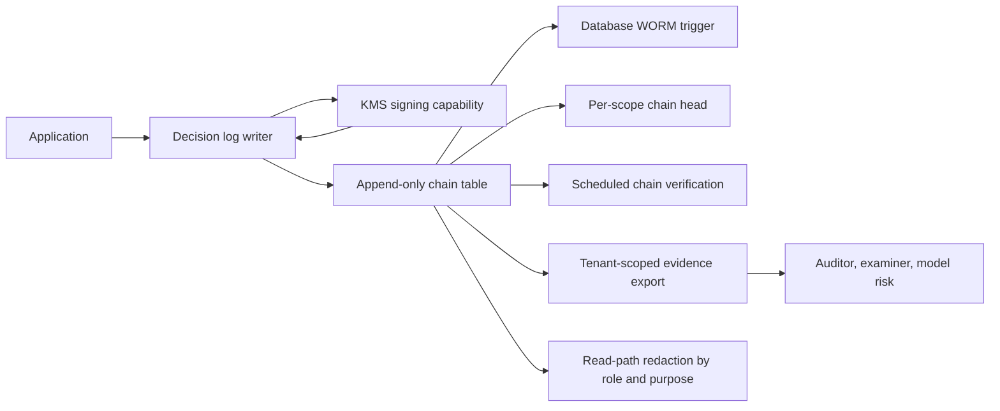

# Building an ML Decision Log for SOC 2, HIPAA, and Model Risk Management

**Audience:** Model risk officers, compliance leaders, security and audit teams, ML platform engineers, regulated SaaS architects
**Canonical URL:** `/whitepapers/building-ml-decision-log-soc2-hipaa-mrm/`
**Related papers:** HIPAA-ready ML decision logs; audit trails for AI decisions; the 12-Condition Framework; Cendryva self-hosted ML observability
**Author:** Cendryva
**Published:** 2026-05-25
**Version:** 1.0
**License:** CC BY 4.0
**Contact:** research@cendryva.com

## Abstract

Most organizations subject to SOC 2, HIPAA, and model risk management programs design their audit logs three times: once for SOC 2 evidence, once for HIPAA Security Rule audit controls, and once for SR 11-7-style ongoing monitoring evidence. This is a waste. The three regimes overlap on most of the structural requirements an ML decision log has to satisfy. A single, well-designed decision log can serve all three at once if it is built deliberately.

This paper is the technical anatomy of that single log. It walks through the fields, the integrity controls, the retention model, the tenant scoping, the replay properties, and the export discipline that satisfy SOC 2 trust services criteria, HIPAA Security Rule audit controls, and SR 11-7 ongoing monitoring expectations in one schema. It then maps each control to its source so a compliance team can use the design without re-deriving the cross-regime matrix.

The shape of the log matters because it determines what a future examination, audit, or model risk review can actually answer. A log built for one regime usually fails for the others. A log built from a cross-regime requirements matrix usually serves all three.

## Executive Summary

Three regimes converge on a small number of structural requirements for an ML decision log:

- **Per-decision records.** A row per inference with enough context to reconstruct the event.
- **Identity and integrity.** Who produced the record, signed by a key the application cannot read, with a hash chain to the previous record.
- **Tenant scope.** Each record belongs to a single tenant; chains do not cross tenants.
- **Retention.** Records persist long enough to satisfy the most stringent applicable retention requirement.
- **Access control.** Reads are governed by role and purpose; reads are themselves logged.
- **Exportability.** Records can be exported as evidence bundles for examination.
- **Data minimization.** Sensitive payloads are summarized rather than copied.

If a single log satisfies all of these, it serves SOC 2 (trust services criteria around logging, change management, and monitoring), HIPAA (Section 164.312(b) audit controls), and SR 11-7 (ongoing monitoring evidence for model performance and use). A compliance team that builds three different logs to satisfy these regimes is doing extra work.

This paper lays out the schema, the integrity model, the retention and minimization controls, and the export discipline that satisfy the cross-regime matrix. It then maps each design choice to Cendryva's implementation as a worked example.

## The Cross-Regime Matrix

The three regimes share more than they differ. The following matrix shows where they overlap.

| Requirement | SOC 2 | HIPAA Security Rule | SR 11-7 |
| -- | -- | -- | -- |
| System activity logging | CC7.2, CC7.3 | 164.312(b) audit controls | Ongoing monitoring of model use |
| Integrity of records | PI1.4, CC6.1 | 164.312(c) integrity | Defensible evidence of monitoring |
| Access controls on logs | CC6.1, CC6.2, CC6.3 | 164.308(a)(4), 164.312(a)(1) | Limited access to validation evidence |
| Retention | CC7.3, CC7.4 | Workflow-driven; minimum 6 years for some records | Through model life and beyond as needed |
| Change management for log schema | CC8.1 | 164.308(a)(1)(ii)(A) risk analysis | Validation of monitoring methods |
| Evidence export for review | Required for attestation | 164.524 access; 164.528 accounting | Provided to model risk function and examiners |
| Tenant or environment scope | CC6.6 (logical access) | 164.308(a)(4) | Per-model, per-scope evidence |

A single log designed to the strongest column for each row satisfies all three. The exercise is not to find the lowest common denominator. It is to build to the strongest applicable requirement so each regime gets what it needs from the same underlying record set.

## The Anatomy of a Cross-Regime Decision Log

The schema below is a reference shape, not a prescription. Field names will differ across implementations. The intent is to show what each regime expects and how a single row can satisfy all three.

### Identity and Time

| Field | Purpose | Regime |
| -- | -- | -- |
| `event_id` | Primary key | All |
| `request_id` | Correlation across the request path | SOC 2, HIPAA |
| `trace_id` | Distributed trace correlation | SOC 2 |
| `tenant_id` | Tenant scope | All |
| `actor_id` | Service identity that wrote the record | All |
| `user_id` | End user, where applicable | HIPAA, SOC 2 |
| `request_time` | When the request was received | All |
| `scoring_time` | When the model produced the output | SR 11-7 |
| `action_time` | When downstream action was taken | All |

### Model Context

| Field | Purpose | Regime |
| -- | -- | -- |
| `model_id` | Model identifier | All |
| `model_version` | Version that produced the output | SR 11-7 |
| `artifact_hash` | Cryptographic hash of the deployed artifact | SR 11-7 |
| `runtime_version` | Inference runtime version | SOC 2 |
| `feature_freshness` | Staleness of input features | SR 11-7 |
| `feature_summary` | Structured summary of feature state | All |

### Output and Policy

| Field | Purpose | Regime |
| -- | -- | -- |
| `prediction` | The model output | All |
| `score` | Confidence or score | SR 11-7 |
| `threshold_state` | Threshold applied at scoring time | SR 11-7 |
| `policy_state` | Approval or guardrail state | HIPAA, SOC 2 |
| `disposition` | Downstream action | All |
| `reviewer_id` | Human reviewer, where applicable | HIPAA, SR 11-7 |
| `override_reason` | Reason code for human override | All |

### Integrity Metadata

| Field | Purpose | Regime |
| -- | -- | -- |
| `previous_hash` | Hash of the previous record in chain scope | All |
| `signature` | Signature over the record | All |
| `signing_key_id` | Identifier of the key that produced the signature | All |
| `chain_scope` | Tenant or resource scope of the chain | All |
| `signed_at` | When the signature was produced | All |

### Retention and Export Metadata

| Field | Purpose | Regime |
| -- | -- | -- |
| `retention_class` | Policy that governs retention | All |
| `legal_hold` | Whether a legal hold applies | All |
| `redaction_policy_id` | Which redaction policy applies on read | HIPAA, SOC 2 |

A row containing these fields can be read by a SOC 2 auditor looking for trust-services evidence, by an HIPAA investigator reconstructing access and use, and by a model risk reviewer establishing ongoing monitoring. The same row, not three different ones.

## Integrity: Append-Only, Hash-Chained, Signed

Each regime expects integrity, but the implementation pattern is the same.

- **Append-only writes.** Records are inserted, never updated. Corrections are new records that reference the prior event. Database-level enforcement (a trigger or a write-once policy) prevents updates and deletes from the application role. The application role is granted insert and select only.
- **Hash chaining.** Each record incorporates the hash of the previous record in its chain scope. Insertion, deletion, or reordering breaks the chain in a detectable way. Chain heads are tracked separately to make verification efficient.
- **Signing.** Each record is signed by a key the application process cannot read directly. A KMS or HSM with a signing capability (such as Vault transit) holds the private key and exposes a signing API.
- **Verification.** A chain verification job runs on a schedule. Failures alert. Verification scopes to a tenant so one tenant's issue does not impair another.

These controls are not specific to any regime. They are the structural integrity model that all three regimes expect.

## Tenant Scope as a First-Class Property

Tenant scope is not a query filter. It is a property of the record, the chain, the signing key context (where the threat model requires per-tenant keys), and the export. Practical patterns:

- Every record carries a tenant identifier in its primary key or sort key.
- The chain scope is per-tenant or per-tenant-per-resource-category.
- Chain heads are tracked per scope.
- Exports default to a tenant.
- Cross-tenant queries from operator surfaces are audited and require justification.

A platform that satisfies these properties can serve multiple regulated tenants without one tenant's activity affecting another's audit posture.

## Retention as a Cross-Regime Decision

Retention is the area where the regimes most often produce different answers. A single retention model that satisfies the strongest applicable requirement is usually the right design.

- HIPAA requires retention of documentation related to compliance for six years (45 CFR Section 164.316(b)(2)(i)). The records themselves are not directly governed by that period, but documentation referring to them is.
- SOC 2 retention is driven by the engagement letter and the trust services criteria. A year of evidence is common, often longer for change records.
- SR 11-7 expects evidence sufficient to support model risk decisions through the life of the model and for some period after retirement.

The cross-regime baseline is usually multi-year, with retention classes per workflow and per regulatory regime. Retention class is a field on the record. Policy changes are themselves audited. Legal hold suspends retention for a defined scope.

## Data Minimization

The cross-regime design needs to avoid becoming a parallel system of record for regulated content.

- Store feature names, ranges, and freshness rather than raw source documents.
- Represent identifiers as scoped, salted hashes when direct identifiers are not required.
- Avoid free-text fields that can accidentally capture sensitive content.
- Use structured reason codes rather than narrative explanations where possible.
- Apply field-level redaction policies tied to role and purpose for any read path.

This pattern satisfies HIPAA minimum-necessary obligations (164.502(b)) and aligns with SOC 2 privacy and confidentiality criteria. It also protects the platform: a minimized log is a smaller breach surface and a smaller examination target.

## Access Control and Read Logging

Reads on a decision log are themselves audit-relevant. A serious implementation:

- Role-based access with explicit grants per workflow.
- Purpose-of-use claims on the request that determine which fields are visible.
- Every read logged with the actor, the scope, and the purpose.
- Administrative access separated from operational access and logged on break-glass.

This satisfies HIPAA Section 164.312(a) access control and Section 164.312(b) audit controls simultaneously. It satisfies SOC 2 CC6.1 through CC6.3 with the same controls. It satisfies SR 11-7 expectations around access to validation evidence.

## Export as Evidence Bundles

A regulator, an auditor, or a model risk reviewer should be able to receive evidence in a structured, verifiable format. Practical patterns:

- Export is scoped to a tenant, a model, a time window, or a specific decision.
- Export includes the records, the chain head, and the public keys needed to verify signatures.
- The export format is documented and stable across versions.
- Export operations are themselves audited.

A receiver should be able to verify signatures without trusting the exporting application. That is the property that makes the export defensible.

## Replay and Reconstruction

For SR 11-7 in particular, the ability to reconstruct what a model did at a specific time is central. The decision log must support:

- Query by tenant, model, version, time window, and decision identifier.
- Linkage from decision rows to drift events, promotion events, and rollback events for the same model.
- Stable schema across releases so an old record can still be parsed by current tooling.

The audit chain becomes the system of truth for model behavior. Application logs, dashboards, and analytical views become derived views over the chain.

## Industry Focus: Healthcare and Life Sciences

A covered entity using ML for utilization management should be able to answer, from a single decision log, who saw what data, which model version produced which recommendation, whether the recommendation was acted on, and whether any access pattern is anomalous. The same records support HIPAA Section 164.312(b) audit controls, SOC 2 trust services criteria, and ongoing monitoring expectations from clinical safety reviews.

Section 164.528 accounting of disclosures requires that certain disclosures be tracked and made available to individuals. A well-designed decision log integrates with the disclosure accounting workflow so the disclosure log and the decision log share infrastructure.

## Industry Focus: Financial Services

A bank using ML for credit decisions should be able to answer, from a single decision log, what version was active, what features were used, whether drift was within tolerance, and what downstream decision followed. The same records support SOC 2 evidence for system controls, SR 11-7 evidence for ongoing monitoring, and any state-level adverse action recordkeeping that may apply.

For broker-dealers, SEC Rule 17a-4 and FINRA recordkeeping rules may impose additional retention obligations on the records that drive customer-facing decisions. The cross-regime log can be retention-class-tagged to satisfy these in the same store.

## Architecture Pattern

The writer signs through the KMS. The trigger blocks updates and deletes. The chain head tracks per-scope state. Verification scopes to a tenant. Exports verify independently. Read paths redact by role and purpose.

## How Cendryva Applies This Pattern

Cendryva implements the cross-regime log as the audit spine of the platform. The schema below maps to the design in this paper.

- **Cross-regime fields on `audit_logs`.** `migrations/postgres/V002__Audit_Trail_And_Logs.sql` adds the integrity columns (`previous_hash`, `signature`, `signing_key_id`, `chain_scope`, `signed_at`) and creates the `audit_log_chains` table for chain heads.
- **Append-only enforcement.** The `enforce_audit_logs_worm` BEFORE UPDATE OR DELETE trigger in the same migration raises an exception. The operator-time REVOKE of UPDATE and DELETE from the application role is documented in `docs/operations/AUDIT-WORM-OPERATIONS.md`.
- **Writer and chain verification.** `apps/api/src/services/domains/audit/immutable-audit-log.service.ts` is the production writer. `verifyChain` walks signatures and previous-hash linkage. `src/data/audit_logs.rs` is the dumb-storage data layer in cendryva-data.
- **Signing through Vault.** `apps/api/src/services/platform/vault/vault.service.ts` exposes `transitSign` and `transitVerify`. `apps/api/src/services/domains/audit/audit-signing-key-provider.ts` and `audit-signing-key-provider.factory.ts` produce the signer. `VaultBackedSigningKeyProvider` uses Ed25519 keys via Vault transit so the private key never leaves Vault.
- **Tenant-scoped chains.** Chain scope is per-tenant via the `chain_scope` column and `audit_log_chains` table. RLS on related tables uses `current_org_id()` from `migrations/postgres/V001__Identity_And_Tenancy.sql`.
- **Decision-log linkage for ML.** Drift detection events flow to the chain through `apps/api/src/services/ml/audit-log.audit-sink.ts`. Promotion transitions flow through `apps/api/src/services/ml/model-promotion.service.ts`. Each event becomes a signed row.
- **Read-path redaction by role and purpose.** `apps/api/src/middleware/minimum-necessary.ts` enforces field-level redaction on read paths.
- **HIPAA-specific compliance primitives.** `src/compliance/hipaa.rs` (64 controls) and `src/bin/hipaa_report.rs` produce a control catalog. BAA registry, breach notification scaffolding, and Section 164.528 accounting of disclosures live under `apps/api/src/services/domains/compliance/`.
- **System-internal traffic.** `packages/types/src/system-identity.ts` exports `SYSTEM_ORGANIZATION_ID` and `SYSTEM_ACTOR_ID` so background workers produce signed, persisted, verifiable rows like customer traffic.
- **Strict-mode default in non-production.** `apps/api/src/services/domains/audit/audit.service.ts::strictModeEnabled()` makes the writer strict in any environment except `NODE_ENV=production` when `AUDIT_REQUIRE_SIGNED_WRITES` is unset.

The same audit chain supports SOC 2 evidence, HIPAA Security Rule audit controls, and model risk management ongoing monitoring evidence. It is not three logs. It is one log, designed against the cross-regime matrix.

## Implementation Checklist

A team building the cross-regime decision log should be able to evidence:

- The application database role has insert and select grants only on the audit table.
- The append-only trigger is in place and exercised by tests.
- Every record is hash-chained to the previous record in its scope.
- Every record is signed by a key the application cannot read directly.
- Chain verification runs on a schedule and alerts on failure.
- Retention classes are set by policy and changes are audited.
- Read-path redaction is enforced by role and purpose.
- Exports are tenant-scoped and independently verifiable.
- The schema covers identity, time, model context, output, policy, integrity, and retention fields.
- Drift, promotion, and rollback events linked to the same models are findable in the chain.

## Conclusion

A decision log is the most important production-time control in a regulated ML platform. It is what makes monitoring defensible, what makes audits answerable, and what makes incidents reviewable. Designing it three times for three regimes is unnecessary and usually produces three weaker logs. Designing it once, against a cross-regime matrix, produces a log that satisfies SOC 2, HIPAA, and SR 11-7 at the same time.

The shape is specific. Per-decision rows, identity and time fields, model and policy context, integrity metadata, retention controls, tenant scope, append-only enforcement, signing through a key the application cannot read, and exportable evidence bundles. None of this is exotic. All of it is necessary.

Cendryva is the worked example. The schema, the trigger, the chain, the signer, the redaction middleware, and the cross-regime control catalogs are in the codebase today and traceable through the Implementation Status section.

## Implementation Status

This section maps the Cendryva claims above to the codebase as of the publication date.

**Cross-regime audit log schema** - SHIPPED
- Schema: `migrations/postgres/V002__Audit_Trail_And_Logs.sql` (integrity columns, `audit_log_chains` table, WORM trigger).

**Append-only enforcement** - SHIPPED
- Schema: `enforce_audit_logs_worm` trigger in the V002 migration. Operator REVOKE pattern documented in `docs/operations/AUDIT-WORM-OPERATIONS.md`.

**Writer and chain verification** - SHIPPED
- Code: `apps/api/src/services/domains/audit/immutable-audit-log.service.ts`, `src/data/audit_logs.rs`.

**Vault-backed Ed25519 signing** - SHIPPED
- Code: `apps/api/src/services/platform/vault/vault.service.ts` (`transitSign`, `transitVerify`), `apps/api/src/services/domains/audit/audit-signing-key-provider.ts`, `audit-signing-key-provider.factory.ts`.

**Tenant-scoped chains** - SHIPPED
- Schema: `chain_scope` column and `audit_log_chains` in V002.
- RLS helpers: `current_org_id()` in `migrations/postgres/V001__Identity_And_Tenancy.sql`.

**ML decision-log linkage** - SHIPPED
- Code: `apps/api/src/services/ml/audit-log.audit-sink.ts`, `apps/api/src/services/ml/model-promotion.service.ts`, `apps/api/src/services/ml/model-monitoring.service.ts`.

**Read-path redaction** - SHIPPED
- Code: `apps/api/src/middleware/minimum-necessary.ts`.

**HIPAA controls catalog and Section 164.528 accounting** - SHIPPED
- Code: `src/compliance/hipaa.rs`, `src/bin/hipaa_report.rs`, `apps/api/src/services/domains/compliance/disclosure-accounting.service.ts`.

**BAA registry and breach notification scaffolding** - SHIPPED (BAA) / PARTIAL (breach)
- Code: `apps/api/src/services/domains/compliance/baa.service.ts`, `apps/api/src/services/domains/compliance/breach-notification.service.ts`, `apps/api/src/routes/compliance.ts`.

**System-internal traffic sentinels** - SHIPPED
- Code: `packages/types/src/system-identity.ts`.

**Strict-mode default in non-production** - SHIPPED
- Code: `apps/api/src/services/domains/audit/audit.service.ts::strictModeEnabled()`.

**`CHECK (signature <> '' OR signing_key_id = 'legacy-unsigned')` constraint** - DEFERRED
- Pre-baked SQL is at `scripts/operations/post-cutover-audit-check-constraint.sql`. Operator-side post-cutover hardening once `AUDIT_REQUIRE_SIGNED_WRITES=true` has been live in production for a documented window.

**Standalone independently verifiable evidence bundle format** - DEFERRED
- Per-tenant audit export endpoints exist. A single-file, signed, independently verifiable archive with embedded public key references is DEFERRED to a future release.

## Scope and Limitations

This is a vendor-authored paper from Cendryva. It is intended for model risk officers, compliance leaders, and ML platform engineers designing a decision log that has to satisfy multiple regulatory regimes simultaneously. It is not a legal opinion, an attestation, or a substitute for assessment by qualified counsel, model risk officers, or accredited auditors.

In scope: a cross-regime matrix for SOC 2, HIPAA Security Rule, and SR 11-7-style model risk management; a reference schema and integrity model for an ML decision log; retention, minimization, access control, and export patterns; and a description of how Cendryva implements these controls.

Out of scope: prescriptive retention periods for any specific regulatory regime, contractual templates, certification or attestation guidance for any specific framework, and product-by-product comparisons against named competitors.

This paper is not legal, regulatory, model risk, or audit advice. SOC 2, HIPAA, SR 11-7, OCC Bulletin 2011-12, NIST publications, FDA SaMD guidance, ONC HTI-1, SEC Rule 17a-4, FINRA recordkeeping rules, EU AI Act, GDPR, and similar regimes apply in specific jurisdictions and to specific institution types. Engage qualified counsel, model risk officers, and accredited assessors before treating any pattern in this paper as a compliance prescription.

Standards, regulations, and agency guidance change. Citations reflect publicly available sources at the publication date in the header. Re-verify current versions before relying on a specific rule.

## References and Further Reading

### SOC 2

- AICPA. *SOC 2 Trust Services Criteria*. https://www.aicpa-cima.com/
- AICPA. *Description Criteria for a Description of a Service Organization's System in a SOC 2 Report*.

### HIPAA

- US Department of Health and Human Services. *HIPAA Administrative Simplification Regulations*. 45 CFR Parts 160, 162, and 164. https://www.ecfr.gov/current/title-45/subtitle-A/subchapter-C
- HHS Office for Civil Rights. *HIPAA Security Rule*. https://www.hhs.gov/hipaa/for-professionals/security/index.html
- HHS Office for Civil Rights. *HIPAA Audit Protocol*. https://www.hhs.gov/hipaa/for-professionals/compliance-enforcement/audit/protocol/index.html
- NIST. *Special Publication 800-66 Revision 2: Implementing the HIPAA Security Rule - A Cybersecurity Resource Guide*. 2024. https://csrc.nist.gov/pubs/sp/800/66/r2/final

### Model risk management

- Board of Governors of the Federal Reserve System and Office of the Comptroller of the Currency. *Supervisory Guidance on Model Risk Management (SR Letter 11-7 / OCC Bulletin 2011-12)*. 2011. https://www.federalreserve.gov/supervisionreg/srletters/sr1107.htm
- European Central Bank. *Guide for the Targeted Review of Internal Models (TRIM)*. 2017 and updates. https://www.bankingsupervision.europa.eu/
- NIST. *Artificial Intelligence Risk Management Framework (AI RMF 1.0)*. 2023. https://www.nist.gov/itl/ai-risk-management-framework

### Logging and event standards

- NIST. *Special Publication 800-92: Guide to Computer Security Log Management*. https://csrc.nist.gov/pubs/sp/800/92/final
- IETF. *RFC 5424: The Syslog Protocol*. https://datatracker.ietf.org/doc/html/rfc5424
- IETF. *RFC 8417: Security Event Token (SET)*. https://datatracker.ietf.org/doc/html/rfc8417

### Securities and recordkeeping

- US Securities and Exchange Commission. *Rule 17a-4: Records to be preserved by certain exchange members, brokers and dealers*. https://www.ecfr.gov/current/title-17/chapter-II/part-240/subject-group-ECFR04dba2c34d9b1c2/section-240.17a-4

### Related Cendryva whitepapers

- *HIPAA-ready ML decision logs*.
- *Audit trails for AI decisions*.
- *The 12-Condition Framework*.
- *Cendryva self-hosted ML observability*.
