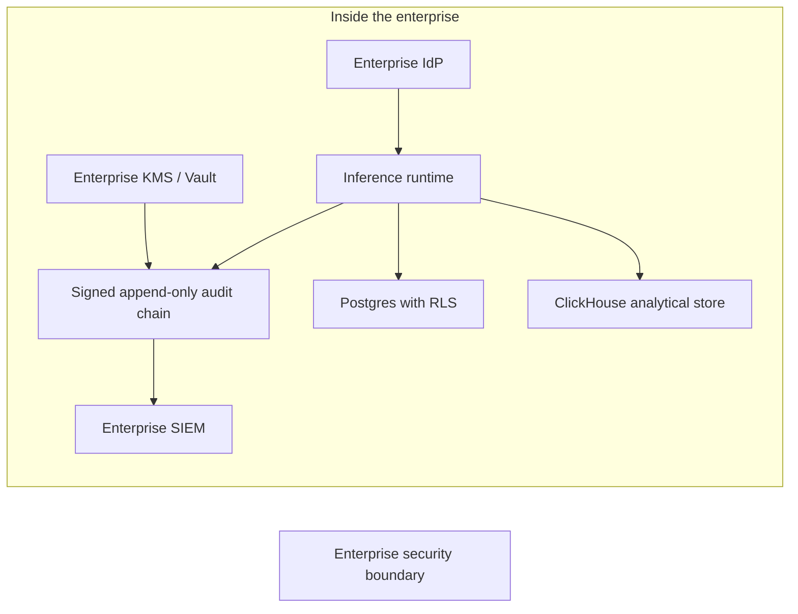

# The Case for Self-Hosted MLOps in Healthcare and Financial Services

**Audience:** CISOs, CIOs, model risk officers, privacy and compliance leaders, healthcare and financial services architects, procurement
**Canonical URL:** `/whitepapers/case-for-self-hosted-mlops-regulated-industries/`
**Related papers:** Cendryva self-hosted ML observability; HIPAA-ready ML decision logs; building an ML decision log for SOC 2, HIPAA, and model risk management; multi-tenant ML platforms
**Author:** Cendryva
**Published:** 2026-05-25
**Version:** 1.0
**License:** CC BY 4.0
**Contact:** research@cendryva.com

## Abstract

Healthcare and financial services organizations sit under a different gravity than a generic SaaS buyer. Data residency, breach surface, business associate accountability, supervisory expectations, examination support, and operational continuity all shift the calculus when an MLOps platform is being chosen. A managed-cloud ML monitoring or governance product that is acceptable for a consumer analytics team can be a liability for a hospital system, a payer, an insurer, a clearing bank, or a registered investment adviser.

This paper makes the case that for healthcare and financial services, self-hosted MLOps should be the default architecture and managed-cloud should be the exception that requires explicit justification. It walks through the controls that change when ML monitoring and decision logging move outside the enterprise boundary, the compliance regimes that pressure the choice, and the operating model a self-hosted platform supports.

It is not an argument against cloud. It is an argument that the boundary should be drawn around the regulated workload, the regulated data, and the regulated evidence, and that the MLOps layer belongs inside that boundary.

## Executive Summary

A regulated enterprise should be able to answer six questions before adopting any MLOps platform that will see protected health information, customer financial information, model inputs, or model decisions:

1. Where physically and legally does the data live, and under whose key?
2. Who is in scope for an examination of this system, and can we produce evidence on demand?
3. If the vendor has an incident, how does our breach surface change?
4. Can we operate the system through a sustained vendor outage?
5. What does the vendor see, log, and store about our model behavior?
6. Can we exit cleanly, or are we structurally dependent on a third party for our own compliance posture?

Managed-cloud MLOps usually answers these questions with vendor-friendly defaults: data lives in the vendor's region, the vendor manages keys, examinations require vendor cooperation, an incident on the vendor's side becomes our breach, an outage on the vendor's side becomes our outage, and the vendor logs and stores a copy of our model behavior.

Self-hosted MLOps inverts those answers. Data stays in approved infrastructure under enterprise keys. Examinations look at systems the enterprise operates. Incidents are scoped to the enterprise. Outages are within the enterprise's control plane. Logs and decision records do not leave the enterprise. Exit is a deployment change, not a contract escape.

The choice is not theoretical. HIPAA business associate liability, OCC and Federal Reserve supervisory expectations, FFIEC examination practice, FedRAMP authorization for federal workloads, GDPR cross-border restrictions, and state insurance regulator data-handling expectations all push regulated teams toward keeping the MLOps layer inside their own boundary.

Cendryva is designed for this. It runs in the enterprise's own infrastructure, on the enterprise's own keys, under the enterprise's own audit chain, and with the enterprise's own tenancy model. That is what self-hosted means in practice.

## What Self-Hosted Actually Means

Self-hosted is a frequently abused term. For the purposes of this paper it means all of the following:

- **Runtime in enterprise infrastructure.** The platform's services run on infrastructure the enterprise operates, whether that is on-premises, in a private cloud account, in a sovereign region, or air-gapped. The vendor does not need network access to the platform for it to function.
- **Data in enterprise storage.** Model decision logs, drift evidence, feature samples, audit chains, and operational telemetry land in databases and object stores the enterprise controls. The vendor does not have a copy.
- **Keys under enterprise control.** Encryption keys for data at rest, transit credentials, and audit signing keys live in the enterprise's key management system. The vendor cannot decrypt data with its own keys.
- **Identity in enterprise systems.** Access is governed by the enterprise's identity provider, RBAC, and approval workflows.
- **Updates on enterprise schedule.** Version upgrades happen when the enterprise decides, not when the vendor pushes.
- **Logs in enterprise SIEM.** Operational and audit logs are ingested into the enterprise's logging and SIEM pipeline.

A SaaS product with an option to deploy a private connector or a private collector is not self-hosted in this sense. A "single-tenant cloud" where the vendor still manages the keys, the data plane, and the upgrade cadence is not self-hosted in this sense. The distinction matters because regulators, auditors, and counsel ask about these specific controls, not about marketing terms.

## The Five Reasons Self-Hosting Belongs as the Default

### 1. Data Residency and Sovereignty

Healthcare data is governed by HIPAA and a growing set of state privacy laws in the United States, by PIPEDA in Canada, by GDPR in the European Union, by the UK GDPR, and by sector-specific regimes in many other jurisdictions. Financial data is governed by GLBA, FFIEC guidance, state insurance and banking regulators, and an international web of supervisory expectations. Cross-border data transfer rules under GDPR Articles 44 through 50 alone have caused multiple structural shifts in cloud architecture decisions over the last decade.

A self-hosted MLOps deployment keeps the data in the jurisdiction and infrastructure the enterprise has already cleared. There is no separate cross-border transfer assessment to do for the monitoring layer. There is no separate data processing agreement that has to track the regulatory perimeter.

### 2. Reduced Breach Surface

A vendor incident becomes a customer incident faster than most teams expect. If a SaaS MLOps platform stores model inputs, decision logs, or feature samples, then a breach at the vendor exposes the regulated data inside those records. For HIPAA covered entities, that exposure can trigger 45 CFR Part 164 Subpart D breach notification obligations. For financial services, it can trigger state breach notification laws, FFIEC incident response expectations, and counterparty obligations.

The honest way to reduce vendor breach surface is to not give the vendor the data. Self-hosting removes the regulated data from the vendor's perimeter and removes the vendor from the breach analysis.

### 3. Examination and Audit Posture

Regulated examinations are easier when the auditor and the operating team are looking at systems the enterprise controls. HHS Office for Civil Rights audits, FFIEC IT examinations, OCC model risk reviews under SR 11-7, SOC 2 attestations, and ISO 27001 certifications all benefit from direct evidence collection.

When the MLOps layer is self-hosted, evidence collection is a matter of running queries against systems the enterprise already documents in its information security management system. When the layer is hosted by a vendor, evidence collection often becomes a coordinated request that depends on the vendor's response time, scope, and data export capabilities. That gap shows up in examination timelines and findings.

### 4. Operational Continuity

A managed-cloud MLOps platform with a sustained outage takes the enterprise's ML observability with it. For a model that is advisory, that may be inconvenient. For a model in a fraud queue, a clinical triage path, an algorithmic trading firewall, or a credit decision flow, losing observability while inference continues is a real risk.

Self-hosted MLOps shares the enterprise's own continuity posture. Backups, failover, disaster recovery, and runbooks are all inside the enterprise's operations program. Outages are scoped to systems the enterprise manages.

### 5. Business Associate and Vendor Risk Reduction

Every vendor that touches protected health information is, under HIPAA, a business associate that needs an agreement, a security review, and ongoing monitoring. Every vendor that touches customer financial information is, under GLBA and most state banking and insurance regimes, a third-party risk obligation that needs onboarding, ongoing risk assessment, and offboarding documentation.

Self-hosting eliminates a category of business associates and third parties from the regulated workload. The MLOps platform becomes a piece of software the enterprise runs, not a service the enterprise is dependent on. That simplification compounds across procurement, security review, vendor risk management, and exit planning.

## Why Managed-Cloud MLOps Is Tempting And Often Not Worth It

Managed-cloud MLOps has real advantages. Setup is faster. Operations are someone else's problem. New features arrive without an upgrade project. Teams that have never deployed a stateful service can stand up monitoring in an afternoon.

For unregulated workloads, that tradeoff is usually correct. For regulated workloads, the same advantages turn into liabilities:

| Advantage | What it looks like in a regulated environment |
| -- | -- |
| Faster setup | Faster onboarding of a business associate; longer security review |
| Vendor manages operations | Vendor sees model behavior, decision logs, and feature samples |
| Automatic upgrades | Loss of change control; reduced ability to test before production |
| Multi-tenant by default | Shared infrastructure for sensitive workloads |
| Managed scaling | Cost and behavior depend on a vendor's roadmap |
| Vendor-side observability | Operational telemetry leaves the enterprise boundary |
| Vendor-side keys | Encryption posture is partially outside enterprise control |

These are not always disqualifying. They are tradeoffs that need to be made explicitly, documented, and accepted by the right risk owners. The mistake is treating managed-cloud as the default and self-hosted as the unusual case. For healthcare and financial services, the defaults should flip.

## The HIPAA Lens

HIPAA does not prohibit cloud services. It does, however, create explicit obligations that change when the MLOps platform is self-hosted versus hosted by a vendor.

- **Business associate agreements.** A vendor that creates, receives, maintains, or transmits PHI on behalf of a covered entity is a business associate. A self-hosted deployment that never sends PHI outside the enterprise does not require a business associate relationship with the platform vendor.
- **Security Rule technical safeguards.** 45 CFR Sections 164.312(a) through (e) cover access control, audit controls, integrity, person or entity authentication, and transmission security. Each is easier to evidence when the platform runs inside infrastructure the enterprise already evidences.
- **Breach notification.** 45 CFR Section 164.404 obligations are triggered by unauthorized acquisition, access, use, or disclosure of PHI. A self-hosted platform reduces the third parties whose incidents can trigger this analysis.
- **Minimum necessary.** Section 164.502(b) limits PHI use to the minimum needed for the purpose. A self-hosted platform makes it tractable to enforce field-level redaction based on role and purpose because the request path is fully inside the enterprise.

The point is not that managed-cloud cannot satisfy HIPAA. The point is that self-hosting collapses a category of work that managed-cloud requires.

## The Financial Services Lens

For banks, broker-dealers, insurers, and investment advisers, the supervisory expectations around ML and decision systems are converging on the model risk management discipline that the Federal Reserve and OCC formalized in SR 11-7 and OCC Bulletin 2011-12.

Three points matter for the self-hosted decision:

- **Effective challenge requires traceability.** Independent model validation expects to see what the model did in production, with what version, against what inputs. A self-hosted decision log is owned by the enterprise and is available to its model risk function without an external request.
- **Ongoing monitoring is a first-class control.** Drift detection, performance monitoring, and outcome analysis must be documented, reviewable, and reportable. Self-hosting puts the data and the controls under the enterprise's own change management.
- **Third-party model risk is its own discipline.** OCC Bulletin 2013-29 and similar guidance treat vendor models and vendor systems as a managed risk. The fewer third parties in the critical decision path, the simpler third-party model risk management becomes.

Financial regulators are not asking for self-hosting by name. They are asking for control, traceability, and accountability. Self-hosting is one of the cleanest ways to deliver those.

## The Operating Model Self-Hosting Enables

Self-hosting is not only a control posture. It is an operating model. A well-built self-hosted MLOps platform should support the following without depending on a vendor:

- Multi-tenant or multi-business-unit isolation with row-level security and per-tenant key contexts.
- Decision logging with append-only writes, hash chaining, and signing under enterprise-controlled keys.
- Drift detection that reads from the enterprise's own analytical store.
- Promotion gates that enforce approvals and entitlements before a model can serve production traffic.
- Tenant-scoped audit chains that can be exported as evidence bundles during examinations.
- Self-service deployment via standard infrastructure-as-code tooling.
- Air-gapped installation profiles for environments that cannot reach the public internet.

These are not exotic features. They are the baseline for an MLOps platform that a regulated enterprise can operate without a vendor's runtime involvement.

## Industry Focus: A Multi-Hospital Health System

A health system runs ML for discharge prioritization, sepsis risk, scheduling optimization, and revenue cycle workflows. PHI flows through feature pipelines, model inputs, and downstream workflow actions. The system's compliance program already covers EHR, billing, claims, and analytics platforms.

Adding a managed-cloud MLOps vendor adds another business associate, another data processing agreement, another set of cross-region considerations for any tenant that needs to keep data inside a state or country, another breach surface, and another examination dependency.

A self-hosted Cendryva deployment runs inside the system's existing private cloud account or on-premises footprint. Decision logs land in the system's Postgres. ClickHouse-backed feature samples live in the system's analytical environment. Audit signing keys come from the system's Vault deployment. The MLOps layer becomes one more workload the operations team already knows how to run, not a new vendor relationship.

## Industry Focus: A Mid-Size Bank with a Growing ML Footprint

A bank uses ML for fraud scoring, customer prioritization, and credit underwriting support. Its model risk function operates under SR 11-7 and is reviewed by federal examiners. A managed-cloud MLOps platform would put model decision evidence in vendor infrastructure, complicate examination evidence collection, and add a vendor to the third-party model risk inventory.

A self-hosted deployment puts the decision log under the bank's own retention policy, the audit chain under the bank's own signing keys, and the drift detection inside the bank's analytical environment. Model risk reviewers can query the same database they already use for audit evidence. Examiners see a system the bank operates end to end.

## Architecture Pattern

The boundary is around the regulated workload. The MLOps platform sits inside the boundary and consumes the enterprise's identity, key management, persistence, analytics, and SIEM. No piece of the regulated workload depends on a vendor's runtime.

## How Cendryva Applies This Pattern

Cendryva is built to run inside this boundary. Concretely:

- **No managed-cloud runtime requirement.** Deployment artifacts live in `infrastructure/k8s/`, `infrastructure/terraform/`, `Dockerfile`, `docker-compose.yml`, `docker-compose.gpu.yml`, and `docker-compose.vagrant.yml`. The platform runs in the enterprise's Kubernetes, the enterprise's VMs, or air-gapped infrastructure.
- **Enterprise-controlled keys.** Audit signing uses the enterprise's Vault deployment through `apps/api/src/services/platform/vault/vault.service.ts` and `apps/api/src/services/domains/audit/audit-signing-key-provider.ts`. The Ed25519 private key never leaves Vault.
- **Tenant-aware persistence with RLS.** Row-level security is defined in `migrations/postgres/V006__ML_Schema_And_RLS.sql` and additional migrations. Tenant scope is set per request via `current_setting('app.current_org_id')`, defined in `migrations/postgres/V001__Identity_And_Tenancy.sql`.
- **WORM-protected audit chain.** Append-only enforcement comes from a BEFORE UPDATE OR DELETE trigger in `migrations/postgres/V002__Audit_Trail_And_Logs.sql`. The writer is `apps/api/src/services/domains/audit/immutable-audit-log.service.ts`.
- **Self-hosted analytical store.** ClickHouse schema and column-level AES-GCM encryption live in `src/clickhouse/schema.rs`, `src/clickhouse/setup.rs`, and `src/clickhouse/encryption.rs`.
- **Inference under enterprise control.** The Rust ONNX runtime in `src/rms/inference/prediction_service.rs` runs in the enterprise's compute footprint with no callbacks to a vendor service.

The vendor relationship with Cendryva does not include access to the running platform. It includes source, documentation, support, and updates the enterprise applies on its own cadence.

## Implementation Checklist

A team adopting self-hosted MLOps for regulated workloads should be able to evidence:

- Deployment runs in approved infrastructure with documented residency.
- Encryption keys are managed by the enterprise's KMS or HSM.
- Identity and access are governed by the enterprise's identity provider.
- Audit logs are signed by enterprise-controlled keys and chained for tamper evidence.
- Decision logs include enough context to reconstruct events without unnecessary regulated-data retention.
- Drift and observability data live in the enterprise's own analytical store.
- The platform supports air-gapped or restricted-network operation if required.
- Exit and migration paths do not depend on vendor cooperation.
- The MLOps layer is in scope for the enterprise's existing examinations rather than requiring vendor coordination.

## Conclusion

Self-hosting is not the right choice for every workload. For regulated workloads in healthcare and financial services, it should be the default. The compliance regimes that govern these industries push toward keeping regulated data, decision evidence, and control responsibility inside the enterprise's own boundary. Managed-cloud MLOps can be a reasonable choice for specific, narrow use cases, but it should be justified explicitly rather than adopted by default.

The operational consequence is clear. The MLOps layer becomes one of the systems the enterprise operates, alongside its EHR, its claims system, its core banking platform, or its trading systems. That is what a regulated software footprint looks like, and that is the footprint Cendryva is built to fit inside.

## Implementation Status

This section maps the Cendryva claims above to the codebase as of the publication date.

**Self-hosted deployment artifacts** - SHIPPED
- Code: `infrastructure/k8s/` (Kubernetes manifests), `infrastructure/terraform/`, `Dockerfile`, `docker-compose.yml`, `docker-compose.gpu.yml`, `docker-compose.vagrant.yml`.

**Enterprise-controlled signing keys** - SHIPPED
- Code: `apps/api/src/services/platform/vault/vault.service.ts`, `apps/api/src/services/domains/audit/audit-signing-key-provider.ts`, `apps/api/src/services/domains/audit/audit-signing-key-provider.factory.ts`.

**Tenant-scoped row-level security** - SHIPPED
- Schema: `migrations/postgres/V001__Identity_And_Tenancy.sql` (`current_org_id()`), `migrations/postgres/V006__ML_Schema_And_RLS.sql`, and RLS-enabled tables in V009, V011, V012, V013, V017.

**WORM-protected audit chain** - SHIPPED
- Schema: `migrations/postgres/V002__Audit_Trail_And_Logs.sql` (WORM trigger, chain table).
- Code: `apps/api/src/services/domains/audit/immutable-audit-log.service.ts`, `src/data/audit_logs.rs`.

**Self-hosted analytical store with column-level encryption** - SHIPPED
- Code: `src/clickhouse/schema.rs`, `src/clickhouse/setup.rs`, `src/clickhouse/encryption.rs`, `src/clickhouse/retention.rs`.

**HIPAA controls catalog** - SHIPPED
- Code: `src/compliance/hipaa.rs`, `src/bin/hipaa_report.rs`, `docs/compliance/HIPAA-CONTROLS-MAPPING.md`.

**Air-gapped installation profile** - PARTIAL
- Container images and Helm charts run without external network calls, but a curated offline package bundle for air-gapped registries is not yet a first-class artifact. DEFERRED to a future release.

**FedRAMP authorization** - DEFERRED
- The platform is designed to support FedRAMP controls, but no FedRAMP authorization package has been pursued. This is intentional and noted here so a federal buyer reads the right expectation.

## Scope and Limitations

This is a vendor-authored paper from Cendryva. It is intended for security, compliance, and architecture leaders evaluating where the MLOps layer belongs in a regulated enterprise. It is not legal, regulatory, or audit advice, and it is not a substitute for security review by qualified counsel and risk owners.

In scope: the case for self-hosted MLOps in healthcare and financial services, the controls that change when the MLOps layer moves outside the enterprise boundary, and a reference operating model for self-hosted deployment.

Out of scope: a defense of any specific managed-cloud product, a prescriptive infrastructure design for any specific enterprise, a security threat model for any specific deployment, and detailed migration planning between specific vendors.

HIPAA, GLBA, FFIEC, SR 11-7, OCC Bulletin 2011-12, OCC Bulletin 2013-29, GDPR, FedRAMP, SOC 2, and ISO 27001 are referenced as widely applicable regimes. Specific obligations depend on the regulated entity's role, contracts, controlling jurisdiction, and supervisory relationships. Engage qualified counsel, model risk officers, and accredited assessors before treating any pattern in this paper as a compliance prescription.

Regulatory expectations change. Citations reflect publicly available sources at the publication date in the header. Re-check current versions before relying on any specific rule.

## References and Further Reading

### Healthcare regulation

- US Department of Health and Human Services. *HIPAA Administrative Simplification Regulations*. 45 CFR Parts 160, 162, and 164. https://www.ecfr.gov/current/title-45/subtitle-A/subchapter-C
- HHS Office for Civil Rights. *The HIPAA Security Rule*. https://www.hhs.gov/hipaa/for-professionals/security/index.html
- HHS Office for Civil Rights. *Breach Notification Rule*. https://www.hhs.gov/hipaa/for-professionals/breach-notification/index.html
- HHS Office for Civil Rights. *HIPAA Audit Protocol*. https://www.hhs.gov/hipaa/for-professionals/compliance-enforcement/audit/protocol/index.html

### Financial services supervision

- Board of Governors of the Federal Reserve System and Office of the Comptroller of the Currency. *Supervisory Guidance on Model Risk Management (SR Letter 11-7 / OCC Bulletin 2011-12)*. 2011. https://www.federalreserve.gov/supervisionreg/srletters/sr1107.htm
- Office of the Comptroller of the Currency. *Bulletin 2013-29: Third-Party Relationships - Risk Management Guidance*. 2013. https://www.occ.gov/news-issuances/bulletins/2013/bulletin-2013-29.html
- Federal Financial Institutions Examination Council. *IT Examination Handbook*. https://ithandbook.ffiec.gov/

### Federal and certification frameworks

- FedRAMP Program Management Office. *FedRAMP Security Controls Baselines*. https://www.fedramp.gov/
- NIST. *Special Publication 800-53 Revision 5: Security and Privacy Controls for Information Systems and Organizations*. https://csrc.nist.gov/pubs/sp/800/53/r5/upd1/final
- AICPA. *SOC 2 Trust Services Criteria*. https://www.aicpa-cima.com/
- International Organization for Standardization. *ISO/IEC 27001:2022*.

### Cross-border data

- European Union. *General Data Protection Regulation (Regulation (EU) 2016/679)*, Articles 44 through 50 on transfers to third countries.

### Related Cendryva whitepapers

- *Cendryva self-hosted ML observability*.
- *HIPAA-ready ML decision logs*.
- *Building an ML decision log for SOC 2, HIPAA, and model risk management*.
- *Multi-tenant ML platforms: schema isolation, encryption, and tenant-aware observability*.
