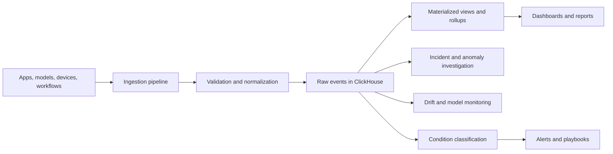

# ClickHouse for High-Volume ML and Statistical Observability

**Audience:** Telecom analytics teams, gaming operations teams, connected-device platforms, data platform teams, analytics engineers, SRE teams  
**Canonical URL:** `/whitepapers/clickhouse-high-volume-observability/`  
**Related papers:** Cendryva self-hosted ML observability; real-time statistical monitoring; model drift detection in regulated environments; Cendryva technical architecture  
**Author:** Cendryva  
**Published:** 2026-05-25  
**Version:** 1.0  
**License:** CC BY 4.0
**Contact:** research@cendryva.com

## Abstract

Modern observability is no longer limited to server logs and infrastructure metrics. Telecom networks, multiplayer games, streaming platforms, connected-device fleets, and digital marketplaces need to analyze model scores, feature freshness, product events, sensor readings, customer journeys, session quality, workflow queues, machine telemetry, and operational conditions at high volume. These signals are often time-oriented, append-heavy, wide, and queried through aggregation rather than single-row lookup.

ClickHouse is a strong fit for this class of workload because it is a column-oriented analytical database designed for fast reads over large datasets, high-throughput ingestion, compression, partitioning, sparse indexing, and SQL-based analytical queries. Used correctly, it can serve as the analytical backbone for ML observability and statistical operations.

This paper explains where ClickHouse fits, how to design observability schemas, when to use rollups and materialized views, and how to avoid common mistakes when storing high-volume operational signals.

## Executive Summary

Production observability data has a distinctive shape:

- events arrive continuously
- most writes are append-only
- queries scan time windows
- dashboards aggregate by service, tenant, model, region, segment, or device
- analysts need SQL access
- retention requirements vary by signal type
- recent data is queried more often than older data
- raw events and summarized rollups are both useful

Row-oriented transactional databases are excellent for application state, identity, configuration, and durable business records. They are not always the right store for billions of metric points, traces, model scores, feature snapshots, sensor readings, and event records.

ClickHouse fills the analytical role. It enables teams to retain large volumes of operational history and query it quickly for dashboards, anomaly inspection, drift analysis, service health, executive summaries, and incident investigation.

Cendryva uses this analytical pattern to give high-event-volume teams a productized observability layer: raw event history, rollups, condition history, freshness monitoring, anomaly inspection, model telemetry, and executive health views without forcing application databases to serve analytical workloads they were not designed to handle.

## Why Observability Data Needs a Different Store

Transactional data asks questions like:

- What is the current state of this customer?
- Which model version is approved?
- What is the configuration for this tenant?
- Has this workflow step completed?

Observability data asks different questions:

- How did p99 latency change over the last 30 days?
- Which facilities saw rising defect rates this week?
- Which feature drifted after the last deployment?
- How many devices stopped reporting in the last hour?
- Which game regions saw matchmaking queue spikes?
- Which customer journey step created the largest drop-off?
- Which model version produced the most manual overrides?

These questions scan many rows but only a subset of columns. They group, filter, aggregate, and compare over time. A column-oriented database reads only the columns needed for a query, which can substantially reduce I/O for analytical workloads.

## ClickHouse as the Analytical Layer

ClickHouse is designed for online analytical processing. It stores data by column rather than row, supports SQL queries, and provides table engines such as the MergeTree family for high-performance analytical storage.

For observability, ClickHouse is commonly useful for:

- time-series metrics
- structured logs and events
- trace spans
- model inference telemetry
- feature freshness snapshots
- drift and anomaly scores
- product analytics
- industrial telemetry
- operational state history
- aggregated rollups

It should usually complement, not replace, transactional storage. PostgreSQL or another OLTP system can remain the source of record for users, organizations, configurations, model registry metadata, workflow state, and permissions. ClickHouse can serve the high-volume analytical questions.

## Industry Focus: Telecom, Gaming, and Connected Operations

### Telecom Network Operations

Network teams analyze packet loss, latency, tower utilization, handoff events, outage reports, and customer-impact signals. ClickHouse can support time-window queries by tower, region, carrier partner, service type, and incident period.

### Multiplayer Game Operations

Game teams track matchmaking latency, session length, regional load, economy events, anti-cheat signals, crash rates, and player progression. The workload is high-volume, event-heavy, and often requires fast cohort analysis.

### Connected Buildings and Facilities

Facilities teams monitor HVAC telemetry, occupancy, energy consumption, equipment fault codes, access events, and comfort complaints. Analytical queries often compare buildings, floors, rooms, device types, and weather periods.

### Retail Store Operations

Retail operations teams monitor checkout wait time, shelf availability, staffing levels, point-of-sale events, promotion performance, returns, and local inventory movement. Real-time rollups help teams detect store-level exceptions without waiting for batch reports.

### Streaming, Mobility, and Dispatch

Mobility platforms analyze trip events, idle time, routing estimates, pickup delays, vehicle health, and geographic demand. ClickHouse can support aggregate queries over rapidly changing location and operations data.

### Industrial Telemetry

Factories, mines, utilities, and logistics hubs produce machine readings, alarms, batch results, sensor values, and maintenance events. These signals are naturally time-oriented and often queried by asset, site, production line, or shift.

The common pattern is analytical volume, not industry. ClickHouse is valuable when teams need to ask fast questions over large operational histories.

For these operators, Cendryva's value is not simply storing more data. It is turning high-volume telemetry into usable operational intelligence: which region degraded, which build changed behavior, which devices stopped reporting, which model version affected routing, and which conditions need response.

## Schema Design Principles

ClickHouse performance depends heavily on table design. Teams should model for query patterns, not merely mirror application tables.

A good observability schema defines:

- event time
- ingestion time
- entity identifiers
- tenant or organization context
- service or source
- metric name or event type
- numeric value fields
- categorical dimensions
- model or artifact version where relevant
- trace or decision identifiers
- quality and freshness flags
- retention class

Example event shape:

| Field         | Purpose                                          |
| ------------- | ------------------------------------------------ |
| `event_time`  | When the measured event occurred                 |
| `ingested_at` | When the platform received it                    |
| `tenant_id`   | Isolation and filtering                          |
| `source_type` | Model, device, service, app, workflow, connector |
| `source_id`   | Specific model, device, service, or workflow     |
| `metric_name` | Signal name                                      |
| `value`       | Numeric measurement                              |
| `unit`        | Unit of measure                                  |
| `condition`   | Operational classification                       |
| `dimensions`  | Structured attributes for filtering              |
| `trace_id`    | Correlation with request or decision             |

The exact schema should avoid both extremes: one giant unstructured blob that is hard to query, or thousands of narrow tables that fragment analysis.

## Partitioning, Ordering, and Sparse Indexes

ClickHouse MergeTree tables use partitioning, sorting keys, and sparse indexes to reduce the amount of data scanned. The most important design choice is often the `ORDER BY` key because it controls how data is physically organized.

For observability workloads, common ordering patterns include:

- `(tenant_id, metric_name, event_time)`
- `(source_id, event_time)`
- `(model_name, model_version, event_time)`
- `(service_name, endpoint, event_time)`
- `(site_id, asset_id, event_time)`

The right key depends on the most common filters. If most queries filter by tenant, source, and time, the sort order should help skip irrelevant data. If most queries are global time-window scans, the design may differ.

Poor ordering can turn a targeted query into a large scan. Good ordering lets ClickHouse skip data parts and granules that cannot match the query.

## Raw Events and Rollups

Raw events are valuable for investigation. Rollups are valuable for dashboards and long-range trends. Most observability systems need both.

Raw data supports:

- forensic inspection
- debugging
- unusual query shapes
- model and decision traceability
- ad hoc analysis

Rollups support:

- fast dashboards
- executive summaries
- long-range trend analysis
- lower storage cost for older data
- lower query load during peak use

Common rollup intervals:

- 1 minute for recent operational views
- 5 minutes for service dashboards
- 1 hour for daily summaries
- 1 day for historical trend analysis

The raw retention period may be shorter than the rollup retention period. For example, teams may retain raw high-cardinality events for 30 or 90 days while keeping daily aggregates for years.

## Materialized Views and Aggregation

Materialized views can transform inserted data into aggregated tables. This is useful when the same queries are run repeatedly: counts by status, latency histograms, model score distributions, condition counts, or defect rates by production line.

Good candidates for pre-aggregation:

- request count by service and minute
- p95/p99 latency sketches by endpoint
- drift score summaries by model and cohort
- condition counts by tenant and hour
- sensor min/max/avg by device and interval
- queue depth summaries by facility and shift

Pre-aggregation should be used carefully. If teams aggregate too early or lose dimensions, they may make later investigations impossible. A good design preserves raw events for bounded periods and builds rollups for common analytical paths.

## High-Cardinality Dimensions

Observability workloads often contain high-cardinality fields: user IDs, device IDs, trace IDs, session IDs, request IDs, order IDs, and model decision IDs. These fields are useful for correlation but expensive if used carelessly in dashboards and group-by queries.

Design patterns:

- keep high-cardinality identifiers available for lookup and investigation
- avoid grouping dashboards by unbounded identifiers
- use sampled or filtered views for trace-level inspection
- create separate tables for different query patterns when necessary
- use dictionaries or dimension tables for stable metadata
- keep ordering keys aligned with common filters

High cardinality is not automatically bad. It becomes a problem when query patterns and storage layout ignore it.

## Freshness, Late Data, and Backfill

Operational data rarely arrives perfectly. Sources can be delayed, devices can buffer readings, connectors can retry, and event time may differ from ingestion time.

A robust ClickHouse observability design tracks both:

- `event_time`: when the thing happened
- `ingested_at`: when it arrived

This distinction supports:

- late-arrival detection
- source freshness monitoring
- backfill analysis
- incident reconstruction
- data quality scoring

If a facility stops sending telemetry, the problem may be the machines, the network, the connector, or the ingestion pipeline. Freshness metrics help separate missing reality from missing data.

## Query Patterns That Matter

A platform should optimize for the questions users actually ask.

Common observability queries:

- latest value by source
- trend by metric over time
- count by condition over time
- top degraded sources
- before-and-after deployment comparison
- anomaly score by cohort
- missing-data sources
- high-latency endpoints
- model output distribution
- feature freshness by model version
- event count by tenant and time window
- incident-period reconstruction

Teams should benchmark these query shapes early. Synthetic benchmarks are useful, but representative production-shaped data is better.

## Data Quality and Governance

Analytical speed is not enough. Observability data must be trustworthy.

Governance concerns include:

- schema versioning
- metric definitions
- units and conversions
- tenant isolation
- retention classes
- access control
- lineage from source to rollup
- replay and backfill procedures
- data quality scoring
- ownership of critical signals

When metric definitions drift, dashboards become misleading even if the database is fast. A high-volume analytics layer must be paired with a metric governance layer.

## Architecture Pattern

This pattern separates ingestion, raw analytical storage, rollup generation, investigation, and operational response. ClickHouse serves the analytical core, while downstream systems turn analysis into action.

## How Cendryva Applies This Pattern

Cendryva uses a split data architecture: transactional systems manage identity, configuration, workflow state, and model metadata, while ClickHouse-style analytical storage supports high-volume metric history, rollups, anomaly inspection, drift analysis, and executive health views.

This enables:

- fast time-window queries
- multi-tenant metric summaries
- model observability analysis
- condition history
- source freshness tracking
- operational trend reporting
- incident-period reconstruction

The purpose is not to move every record into an analytical store. The purpose is to put each workload in the storage system that matches its access pattern.

## Implementation Checklist

Teams adopting ClickHouse for observability should define:

- primary query patterns
- raw event schema
- rollup schema
- partitioning strategy
- ordering keys
- retention policy by signal type
- tenant isolation model
- freshness and late-arrival handling
- backfill process
- high-cardinality field strategy
- materialized view plan
- dashboard query budget
- data quality checks
- ownership for metric definitions
- access control and export rules

## Conclusion

High-volume observability is an analytical workload. It needs a storage layer designed for scanning, filtering, grouping, aggregating, and comparing large histories of operational signals.

ClickHouse is well suited to this role because its column-oriented design, MergeTree engines, partitioning, sparse indexes, compression, and SQL interface align with the shape of modern observability data.

The architectural lesson is straightforward: keep transactional state in transactional systems, and put analytical history in an analytical engine. When teams make that separation intentionally, they can observe models, products, facilities, devices, and operations at a scale that ordinary dashboards over application databases cannot sustain.

## Scope and Limitations

This is a vendor-authored paper from Cendryva, and Cendryva uses ClickHouse-style analytical storage as part of its own architecture. Readers should weigh the analysis with that potential bias in mind. The paper is not affiliated with or endorsed by ClickHouse Inc.

The paper covers schema and architectural patterns for using a column-oriented analytical database to support ML and statistical observability workloads. It does not cover specific deployment topologies, capacity planning calculations, hardware sizing for a given workload, replication and sharding configuration in detail, backup and disaster-recovery runbooks, or cost modeling for a specific cloud provider or self-hosted environment.

No specific performance figures are claimed in this paper. ClickHouse performance varies substantially with schema design, partitioning, ordering keys, query shape, hardware, ingestion patterns, compression configuration, and cardinality. Any prospective performance benefit described here is general and is not a benchmark of a specific deployment or workload. Teams should benchmark with representative production-shaped data before making architectural commitments.

The architectural recommendation (separate transactional state from analytical history) is a general pattern. It is not the right answer for every workload. Small datasets, strongly transactional analytics, or workloads with very specific consistency requirements may be better served by other engines.

ClickHouse, OpenTelemetry, and adjacent open-source projects evolve quickly. Configuration recommendations, table engine features, and best practices may change with new releases. Verify recommendations against the current documentation at the time of implementation.

Operational governance of analytical data (retention, access control, lineage, metric definitions) is the responsibility of the operator and any qualified privacy, security, and compliance functions. Where observability data includes regulated information (such as protected health information or personal data subject to data-protection law), readers should consult appropriate legal and security expertise.

## References and Further Reading

### ClickHouse documentation and engineering

- ClickHouse. *Official Documentation*. clickhouse.com/docs.
- ClickHouse. *MergeTree Engine Family*. Official documentation.
- ClickHouse. *Materialized Views and AggregatingMergeTree*. Official documentation.
- Altinity. *ClickHouse Operator for Kubernetes*. github.com/Altinity/clickhouse-operator.

### Columnar storage and analytical databases

- Stonebraker, Michael, et al. *C-Store: A Column-Oriented DBMS*. Proceedings of VLDB, 2005.
- Lamb, Andrew, et al. *The Vertica Analytic Database: C-Store 7 Years Later*. Proceedings of the VLDB Endowment, 2012.
- Abadi, Daniel J., Samuel R. Madden, and Nabil Hachem. *Column-Stores vs. Row-Stores: How Different Are They Really?*. SIGMOD, 2008.

### Observability and telemetry

- OpenTelemetry. *Specification, SDKs, and Semantic Conventions*. Cloud Native Computing Foundation.
- Sridharan, Cindy. *Distributed Systems Observability*. O'Reilly Media, 2018.
- Majors, Charity, Liz Fong-Jones, and George Miranda. *Observability Engineering*. O'Reilly Media, 2022.

### Streaming and ingestion

- Apache Kafka. *Official Documentation*. kafka.apache.org.
- Kreps, Jay. *The Log: What every software engineer should know about real-time data's unifying abstraction*. LinkedIn Engineering, 2013.

### Related Cendryva whitepapers

- *Cendryva Self-Hosted ML Observability*. Cendryva.
- *Real-Time Statistical Monitoring for Live Operations*. Cendryva.
- *Model Drift Detection in Regulated Environments*. Cendryva.
- *Cendryva Technical Architecture*. Cendryva.
