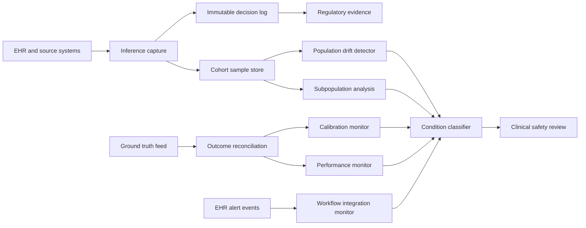

# Monitoring Clinical AI Models After Deployment

**Audience:** Clinical AI program leaders, hospital and health-system informatics, regulatory affairs and quality teams, medical device manufacturers, payer and provider compliance leaders  
**Canonical URL:** `/whitepapers/clinical-ai-post-deployment-monitoring/`  
**Related papers:** Designing HIPAA-Ready ML Systems With Immutable Decision Logs; model drift detection in regulated environments; Cendryva self-hosted ML observability; clinical trial operations command center brief  
**Author:** Cendryva  
**Published:** 2026-05-25  
**Version:** 1.0  
**License:** CC BY 4.0
**Contact:** research@cendryva.com

## Abstract

Clinical AI is past the proof-of-concept stage. Diagnostic image classifiers, sepsis early-warning models, readmission risk predictors, clinical documentation aides, and prior-authorization assistants now run in production at hospitals and health systems. The regulatory and clinical safety conversation has shifted accordingly. Pre-market validation, with carefully curated datasets and a frozen model, is no longer the whole story. The harder question is how the model behaves after deployment, on a real patient population that changes over time, in workflows that change with it.

The FDA's Predetermined Change Control Plan (PCCP) guidance and the AI/ML Software as a Medical Device action plan have made post-market monitoring a regulatory expectation, not a courtesy. ONC's HTI-1 final rule extends transparency obligations to the predictive decision support interventions surfaced in certified health IT. CONSORT-AI and SPIRIT-AI reporting guidelines establish what good clinical AI evidence looks like at study time. None of these documents is a runtime monitoring specification, but together they define the operational substrate that a clinical AI program must build.

This paper describes the operational difference between training-time validation and post-market surveillance, the clinical safety signals that matter in production (population drift, subpopulation performance, calibration drift, workflow integration drift), and the architectural pattern that makes post-deployment monitoring auditable. It positions Cendryva as the operational substrate that hospitals, payers, and clinical AI vendors can self-host to meet PCCP and HTI-1 expectations without sending PHI to a third-party monitoring vendor.

## Executive Summary

Clinical AI failure modes are different from consumer ML failure modes. The cost of a missed sepsis alert is not the same as a missed product recommendation. The cost is also not borne by the same people who built the model.

Five propositions:

- Pre-market validation is necessary but not sufficient. A model that passed validation on a curated set can drift in production within weeks if the patient population, lab assay, or upstream documentation pattern changes.
- Post-market surveillance is the regulatory direction of travel. PCCP, the FDA AI/ML SaMD action plan, HTI-1, and the EU AI Act all push toward continuous, evidence-backed monitoring.
- Subpopulation performance is where most clinical safety risk lives. Aggregate AUC can stay flat while performance in a subpopulation (age band, race, comorbidity cluster, payer mix) silently degrades.
- Calibration drift is as dangerous as accuracy drift. A model that becomes overconfident or underconfident in a specific risk band changes downstream clinical action.
- Workflow integration drift matters and is rarely measured. A model can be technically healthy and clinically irrelevant if the alert pattern, EHR integration, or clinician acceptance has changed.

Cendryva is built to be the operational substrate underneath this work. It is self-hosted (PHI stays in the enterprise boundary), it produces an immutable audit log of every model decision and configuration change, it supports cohort and subpopulation drift analysis, and it ships HIPAA controls catalog and BAA-aware deployment defaults.

## The Operational Difference Between Validation and Surveillance

A clinical AI validation study answers a defined question on a defined dataset at a defined point in time. The dataset is usually curated for the question, the population is usually well-characterized, and the workflow context is usually simplified or simulated. Validation is necessary, and a model that fails validation has no business in clinical use.

Post-market surveillance answers a different set of questions, continuously, on the actual deployed population:

- Is the input distribution still close enough to validation that the validation result is meaningful?
- Is the model's calibration still close to the validation calibration?
- Is performance similar across the subpopulations the validation study examined?
- Is the workflow integration still operating as designed?
- Has the clinician acceptance rate changed?
- Has the downstream action rate changed?
- Have the upstream data sources (labs, vitals, documentation, claims feeds) changed schema, cadence, or accuracy?
- Has the patient mix changed in a way the validation did not anticipate?

These are operational questions, not statistical questions about a frozen dataset. Answering them requires a continuously updated population sample, a baseline reference, a comparison engine, a threshold system, an alert path, a review workflow, and an audit log.

## Regulatory Substrate

Three documents define most of the current US clinical AI post-deployment expectations.

### FDA Predetermined Change Control Plan

The FDA's PCCP guidance, finalized in late 2024 following the 2023 draft, allows a device manufacturer to specify in advance the kinds of changes a machine learning model may undergo after authorization without requiring a new submission. The PCCP includes a Modification Protocol (how changes will be implemented) and an Impact Assessment (how the manufacturer will determine whether the change preserves safety and effectiveness).

A real PCCP requires the manufacturer to operate continuous monitoring infrastructure capable of detecting when a planned change is warranted and capable of evidencing that the change was implemented within the planned bounds. PCCP makes post-deployment monitoring a built-in part of the product, not an after-the-fact good practice.

### FDA AI/ML SaMD Action Plan

The 2021 action plan established the policy framework PCCP later operationalized. It emphasized a Total Product Lifecycle approach, real-world performance monitoring, transparency to users, and good machine learning practice. It is the policy backdrop against which most current US clinical AI surveillance discussions happen.

### ONC HTI-1 Final Rule

The ONC HTI-1 final rule (issued in 2023, with predictive decision support interventions (DSI) compliance dates beginning in 2024-2025) extends transparency obligations to certified health IT. Developers of certified health IT must provide source attribute information about predictive DSIs and apply intervention risk management practices. The rule does not specify runtime monitoring architecture, but it does codify that downstream users (clinicians, patients, regulators) are entitled to information about the prediction's source, intended use, and risk management.

### Reporting Guidelines

CONSORT-AI and SPIRIT-AI extend the CONSORT and SPIRIT trial reporting frameworks to AI interventions. They specify what should be in a published trial of a clinical AI tool. They do not specify production monitoring, but they shape the evidence expectations that post-market monitoring inherits.

## Clinical Safety Signals That Matter

### Population Drift

The distribution of patients, encounters, lab values, vitals, demographics, comorbidities, and care settings flowing through the model. Population drift can be triggered by seasonal disease patterns, payer mix changes, service-line expansion, a new EHR rollout, a change in a referral pattern, or a change in coding practice. None of these is necessarily a problem, but the model was validated on a specific distribution, and a large shift invalidates the validation evidence.

Useful detectors: KS-statistic per feature, PSI per feature, multivariate drift detectors (PCA reconstruction error, domain classifier). These should be cohort-aware: site, service line, payer, demographic group.

### Subpopulation Performance Drift

Aggregate model performance is not enough. A model with stable overall AUC can have meaningfully degraded performance in a subpopulation: a specific age band, race or ethnicity group, sex, payer, comorbidity cluster, or care setting. Subpopulation performance is where most clinical safety risk hides.

Useful detectors: stratified performance metrics (AUC, sensitivity, specificity, calibration) per subpopulation, with thresholds and alerting on relative degradation rather than only absolute level.

### Calibration Drift

Calibration is the relationship between predicted probability and observed outcome rate. A model can stay discriminative (AUC stable) while becoming overconfident or underconfident in specific risk bands. Calibration drift changes downstream clinical decisions: a sepsis early-warning score that becomes overconfident may trigger more interventions; a readmission risk score that becomes underconfident may misallocate care management resources.

Useful detectors: calibration slope and intercept tracked over time, reliability diagrams, Hosmer-Lemeshow-style binned comparisons. Calibration is also subpopulation-sensitive.

### Outcome Reconciliation Drift

When ground truth is available (after a delay), the reconciliation between prediction and outcome is the gold-standard signal. The reconciliation cadence depends on the clinical use case: hours for sepsis, weeks for readmission, months for chronic disease progression.

Useful detectors: cohort outcome curves, prediction-versus-outcome lag distribution, false-positive and false-negative rate trends.

### Workflow Integration Drift

The model lives inside a workflow. The clinician sees an alert in the EHR, accepts or dismisses it, takes or does not take a downstream action. Each of these touchpoints is observable, and each of them can drift independently of the model itself.

Useful detectors: alert volume, acceptance rate, dismissal-with-reason analysis, time-to-action distribution, downstream order rate, override pattern.

### Input Data Quality Drift

The model's inputs come from EHR fields, lab systems, vitals monitors, documentation, and claims feeds. A lab assay change, a documentation template change, a vendor swap, or a feed delay can change the inputs without changing the model. The model may still work but on inputs that no longer mean what they meant at validation.

Useful detectors: per-field missingness rate, value-range checks, schema versioning, feed-freshness watchdogs.

## Architecture Pattern



Five design points:

- Inference capture is the source of truth. Every model invocation should produce a record before the result reaches the clinician.
- The decision log must be WORM. Auditors, the safety committee, and the regulator should not have to trust a database that allows silent overwrites.
- Cohort sampling is the input to drift and subpopulation analysis. The sample must preserve enough demographic and clinical context to support stratified comparison.
- Outcome reconciliation lags inference. The architecture must handle late-arriving ground truth without distorting the original decision record.
- The clinical safety review path is the loop that closes the system. A monitoring signal that does not reach a human with authority to change the deployment is not monitoring; it is logging.

## Subpopulation Analysis in Practice

Subpopulation analysis has to be designed before it is needed. Three practical guidelines:

**Define the subpopulations in advance.** The validation study and the production monitoring should track the same subpopulation slices. Discovering an underperforming subpopulation in production is harder if the slice was not measured at validation.

**Use confidence intervals, not point estimates.** Small subpopulations have noisy performance estimates. Alerting on a single-window point estimate produces false alarms; alerting on confidence-interval shifts produces real signals.

**Avoid information leakage across slices.** If the model uses race, age, or sex as features, the subpopulation analysis must account for the feature's role. The monitoring system should not become the second source of disparate impact.

## Workflow Integration Monitoring

A clinical AI tool is part of a workflow, and the workflow tells the truth.

- Alert volume per shift, unit, and condition.
- Acceptance and dismissal rates per clinician role.
- Time from alert to downstream order.
- Override-with-reason categorization (false alarm, redundant, low priority, other).
- Patient-level alert burden (alert fatigue).
- Order rate, change rate, and outcome rate for alerted vs. non-alerted cohorts.

This data is usually available from the EHR, the alerting system, or the model serving wrapper. Capturing it is an architectural choice. Once captured, it is a leading indicator: workflow drift often precedes a clinician deciding the model is no longer trustworthy, which is the moment a clinical AI program loses its license to operate.

## Industry Focus: Hospital and Health-System Deployments

A health system runs a sepsis early-warning model integrated into the EHR. The model was validated on patient data from two years ago. Two changes have happened since: the lab swapped a procalcitonin assay for a different vendor, and the system opened a new oncology service line.

Post-deployment monitoring should catch both:

- The procalcitonin distribution shifts in the input feature drift monitor.
- The new oncology service-line cohort appears with a different baseline risk profile, and its subpopulation performance is tracked separately.
- The calibration monitor flags that high-risk-band predictions are now overconfident in the oncology cohort.
- The workflow monitor flags an increase in dismissal-with-reason in the new unit.

Each signal lands in the WORM audit log, is classified into a named state, and reaches the clinical safety committee with the evidence trail attached. The PCCP filed with the FDA documented the protocol for handling exactly this scenario.

## How Cendryva Applies This Pattern

Cendryva is built as a self-hosted operational substrate for clinical AI surveillance. PHI stays in the enterprise boundary. The decision log is signed and chain-linked. Subpopulation and cohort analysis are first-class. The 12-Condition Framework provides a stable language for clinical safety review.

- Inference capture and decision logging: `apps/api/src/services/domains/audit/immutable-audit-log.service.ts`, `migrations/postgres/V002__Audit_Trail_And_Logs.sql` (WORM columns plus chain table).
- Cohort analysis: `apps/api/src/services/ml/cohort-analysis.service.ts`.
- Drift detection: `apps/api/src/services/ml/drift-statistics.ts`, `apps/api/src/services/ml/model-monitoring.service.ts`.
- Feature sample storage in ClickHouse: `migrations/clickhouse/1709424028_add_feature_samples_table.sql`, `apps/api/src/services/ml/clickhouse-feature-sample.loader.ts`.
- Threshold and condition classification: `src/statistics/thresholds/`, `apps/api/src/services/12-conditions/state-machine.ts`.
- HIPAA controls catalog: `src/compliance/hipaa.rs`, `src/bin/hipaa_report.rs`.
- Compliance services (BAA, breach notification, disclosure accounting): `apps/api/src/services/domains/compliance/`.
- Minimum-necessary access middleware: `apps/api/src/middleware/minimum-necessary.ts`.
- HIPAA / data quality schema: `migrations/postgres/V007__Data_Quality_And_HIPAA.sql`.

## Implementation Checklist

For a clinical AI program designing post-deployment monitoring:

- Define the subpopulation slices to be tracked, matching the validation study.
- Choose drift detectors per feature with subpopulation stratification.
- Build the cohort sample store with retention sufficient for stratified analysis.
- Configure the calibration monitor with windows appropriate for the outcome lag.
- Wire outcome reconciliation with handling for late ground truth.
- Instrument workflow integration (alert volume, acceptance rate, override reasons).
- Define the condition or state taxonomy for clinical safety review.
- Establish the WORM audit log before turning on monitoring.
- Document the PCCP-aligned change protocol and the trigger thresholds.
- Schedule the clinical safety committee review cadence.
- Define the rollback or fallback path if the model is suspended.
- Map HIPAA controls, BAA obligations, and breach notification timers to the deployment.

## Conclusion

Clinical AI surveillance is no longer optional. The regulatory direction is toward continuous, evidence-backed post-deployment monitoring, and the clinical safety case is independently strong. A model that passed validation on a curated set can drift in production within weeks. A model with stable aggregate accuracy can degrade in a subpopulation. A model that is technically healthy can lose clinician trust because of workflow integration changes.

The operational substrate for this work has specific requirements: inference capture before the result reaches the clinician, an immutable decision log, cohort-aware drift detection, subpopulation performance tracking, calibration monitoring, outcome reconciliation that handles late ground truth, and workflow integration telemetry. It also has compliance requirements: PHI residency, BAA-aware deployment, HIPAA controls evidence, and audit retention.

Cendryva is built to be that substrate, self-hosted, with WORM audit, multi-tenant security, drift and cohort analysis, condition classification, and a HIPAA controls catalog. The clinical AI program still owns the clinical safety decisions. The platform's job is to make those decisions reconstructable, the evidence inspectable, and the operational loop closeable.

## Implementation Status

This section maps the architectural claims above to the Cendryva codebase as of the publication date in the header.

**Immutable decision and audit log** — SHIPPED
- Code: `apps/api/src/services/domains/audit/immutable-audit-log.service.ts`, `apps/api/src/services/domains/audit/audit.service.ts`, `apps/api/src/services/domains/audit/audit-log-integrity.service.ts`, `src/data/audit_logs.rs`.
- Schema: `migrations/postgres/V002__Audit_Trail_And_Logs.sql` (WORM columns, chain table, trigger).
- Tests: 52 audit tests plus 5 Postgres integration WORM tests.

**Cohort analysis** — SHIPPED
- Code: `apps/api/src/services/ml/cohort-analysis.service.ts`, `apps/api/src/services/ml/cohort-analysis.service.test.ts`.

**Drift detection (KS, PSI, JS divergence)** — SHIPPED
- Code: `apps/api/src/services/ml/drift-statistics.ts`, `apps/api/src/services/ml/model-monitoring.service.ts`, `apps/api/src/services/ml/audit-log.audit-sink.ts`.
- Tests: 48 drift tests.

**Feature sample storage** — SHIPPED
- Code: `apps/api/src/services/ml/clickhouse-feature-sample.loader.ts`, `apps/api/src/services/ml/feature-store.service.ts`.
- Migration: `migrations/clickhouse/1709424028_add_feature_samples_table.sql`.

**Threshold and condition classification** — SHIPPED
- Code: `src/statistics/thresholds/static_threshold.rs`, `src/statistics/thresholds/dynamic.rs`, `src/statistics/thresholds/seasonal.rs`, `apps/api/src/services/12-conditions/state-machine.ts`, `apps/api/src/services/12-conditions/evaluators.ts`.

**HIPAA controls catalog and PHI registry** — SHIPPED
- Code: `src/compliance/hipaa.rs` (64 entries), `src/compliance/phi.rs`, `src/compliance/phi_registry.rs`, `src/bin/hipaa_report.rs`.
- Notes: Generates a control-mapping report. PHI registry tracks field-level PHI classification.

**Compliance services (BAA, breach notification, disclosure accounting)** — SHIPPED
- Code: `apps/api/src/services/domains/compliance/baa.service.ts`, `apps/api/src/services/domains/compliance/breach-notification.service.ts`, `apps/api/src/services/domains/compliance/disclosure-accounting.service.ts`.
- Routes: `apps/api/src/routes/compliance.ts`.

**Minimum-necessary access middleware** — SHIPPED
- Code: `apps/api/src/middleware/minimum-necessary.ts`, `apps/api/src/middleware/minimum-necessary.test.ts`.

**Data quality and HIPAA schema** — SHIPPED
- Migration: `migrations/postgres/V007__Data_Quality_And_HIPAA.sql`.

**Self-hosted packaging** — SHIPPED
- Kubernetes manifests under `infrastructure/k8s/`, Terraform under `infrastructure/terraform/`, `Dockerfile`, `docker-compose.yml`.

**Deferred**
- Pre-built calibration monitor templates for common clinical risk scores (the threshold and reconciliation primitives exist; turnkey templates for sepsis, readmission, and deterioration scores are a planned addition).
- Native EHR integration adapters (FHIR R4, Epic, Cerner). Current pattern is to ingest via the Cendryva API; FHIR-shaped adapters are a planned addition.
- A pre-built PCCP evidence-report generator. The audit trail and signing infrastructure ship; the PCCP-aligned narrative report is a documentation task that can be assembled from existing audit queries.
- Subpopulation performance dashboards out-of-the-box. The cohort analysis service supports the data path; opinionated dashboard templates are not yet shipped.

**How to verify locally**

```
cargo test --lib compliance
pnpm --filter @cendryva/api test ml/cohort-analysis
pnpm --filter @cendryva/api test ml/model-monitoring
pnpm --filter @cendryva/api test compliance
cargo run --bin hipaa_report
```

## Scope and Limitations

This is a vendor-authored paper from Cendryva. It describes the operational and architectural pattern for clinical AI post-deployment monitoring and how Cendryva implements the substrate. It is not a regulatory submission template, not a clinical safety committee charter, and not a substitute for qualified regulatory, clinical, and legal counsel.

**In scope.** Clinical safety signals that matter in production, the regulatory substrate (PCCP, FDA AI/ML SaMD action plan, HTI-1, CONSORT-AI, SPIRIT-AI), an architectural pattern for surveillance, and the mapping to Cendryva primitives.

**Out of scope.** Specific FDA submission language. Clinical validation study design. Specific EHR integration code. Hospital governance structure for clinical AI committees. Pharmacovigilance for AI-influenced therapeutic decisions.

**Not regulatory, clinical, or legal advice.** PCCP, FDA AI/ML SaMD policy, ONC HTI-1, and EU AI Act obligations require qualified regulatory affairs, clinical safety, and legal counsel. The mapping suggestions in this paper are architectural, not regulatory.

**Time-bounded items.** FDA guidance and ONC rules evolve. PCCP guidance was finalized in late 2024; HTI-1 DSI compliance dates are phased; the EU AI Act risk-tiering for medical AI is being implemented at the national level through 2026. Re-verify the current state at the time of design.

**Empirical claims.** Drift, subpopulation degradation, calibration drift, and workflow integration drift are well-documented in the clinical AI literature; the references section points to canonical sources.

## References and Further Reading

US regulatory

- US Food and Drug Administration. *Marketing Submission Recommendations for a Predetermined Change Control Plan for Artificial Intelligence/Machine Learning (AI/ML)-Enabled Device Software Functions*. Final guidance, 2024. https://www.fda.gov/regulatory-information/search-fda-guidance-documents/marketing-submission-recommendations-predetermined-change-control-plan-artificial
- US Food and Drug Administration. *Artificial Intelligence/Machine Learning (AI/ML)-Based Software as a Medical Device (SaMD) Action Plan*. 2021. https://www.fda.gov/medical-devices/software-medical-device-samd/artificial-intelligence-and-machine-learning-software-medical-device
- Office of the National Coordinator for Health Information Technology. *HTI-1 Final Rule (Health Data, Technology, and Interoperability)*. 2023. https://www.healthit.gov/topic/laws-regulation-and-policy/health-data-technology-and-interoperability-certification-program
- US Department of Health and Human Services. *HIPAA Security Rule, 45 CFR Part 164 Subpart C*. https://www.hhs.gov/hipaa/for-professionals/security/index.html

Clinical AI reporting guidelines

- Liu, X. et al. *Reporting guidelines for clinical trial reports for interventions involving artificial intelligence: the CONSORT-AI extension*. The Lancet Digital Health, 2020. https://www.thelancet.com/journals/landig/article/PIIS2589-7500(20)30218-1/fulltext
- Cruz Rivera, S. et al. *Guidelines for clinical trial protocols for interventions involving artificial intelligence: the SPIRIT-AI extension*. The Lancet Digital Health, 2020.

Clinical AI safety and operations

- Sculley, D. et al. *Hidden Technical Debt in Machine Learning Systems*. NeurIPS, 2015. https://papers.nips.cc/paper/5656-hidden-technical-debt-in-machine-learning-systems
- Agency for Healthcare Research and Quality. *AHRQ Patient Safety Network resources on clinical AI and decision support*. https://psnet.ahrq.gov/
- Wong, A. et al. *External Validation of a Widely Implemented Proprietary Sepsis Prediction Model in Hospitalized Patients*. JAMA Internal Medicine, 2021.

EU and international

- European Commission. *EU AI Act*. Regulation (EU) 2024/1689. https://eur-lex.europa.eu/eli/reg/2024/1689/oj
- International Medical Device Regulators Forum. *Software as a Medical Device: Possible Framework for Risk Categorization and Corresponding Considerations*. https://www.imdrf.org/

Cendryva foundations

- Cendryva. *Designing HIPAA-Ready ML Systems With Immutable Decision Logs*. https://cendryva.com/whitepapers/hipaa-ready-ml-decision-logs/
- Cendryva. *Model Drift Detection in Regulated Environments*. https://cendryva.com/whitepapers/model-drift-detection-regulated-ai/
- Cendryva. *Cendryva: A Self-Hosted ML Observability Platform for Regulated Enterprises*. https://cendryva.com/whitepapers/self-hosted-ml-observability/
