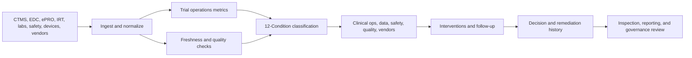

# Clinical Trial Operations Command Center Brief

**Format:** Command center brief  
**Audience:** Sponsors, CROs, research operations leaders, site networks, decentralized trial teams, clinical data operations, quality and compliance teams  
**Canonical URL:** `/whitepapers/clinical-trial-operations-command-center-brief/`  
**Related papers:** HIPAA-ready ML decision logs; learning operations observability; real-time statistical monitoring for live operations; AI governance risk register  
**Author:** Cendryva  
**Published:** 2026-05-25  
**Version:** 1.0  
**License:** CC BY 4.0
**Contact:** research@cendryva.com

## Mission Brief

Clinical trials are complex operating systems. Enrollment, site activation, protocol adherence, participant engagement, visit completion, data capture, safety workflows, monitoring, payments, supply logistics, and reporting all move at once. Each function has its own system and metrics, but trial leaders often lack a shared live view of operational condition.

The command center objective is simple: know which parts of the trial are healthy, which are drifting, which signals are missing, and which owner is responsible for action.

Cendryva provides an observability layer for trial operations. It turns site, participant, protocol, safety, data, and operational signals into conditions, routes response, preserves evidence, and helps teams manage trial execution before timelines or data quality degrade.

## Command Center Operating Picture

| Operating domain       | Critical question                             | Cendryva condition view                                          |
| ---------------------- | --------------------------------------------- | ---------------------------------------------------------------- |
| Enrollment             | Are sites enrolling as expected?              | BELOW_NORMAL, DANGER, or POWER_CHANGE by site/cohort             |
| Site activation        | Are startup milestones blocked?               | NON_EXISTENCE for missing documents, LIABILITY for chronic delay |
| Participant engagement | Are visits, ePRO, or device tasks slipping?   | DANGER for adherence risk, DOUBT for incomplete source feeds     |
| Protocol deviations    | Are deviations increasing?                    | CHANGE or DANGER by site, visit, or procedure                    |
| Safety workflows       | Are events routed and reviewed on time?       | EMERGENCY for severe workflow risk                               |
| Data operations        | Are queries, forms, and source feeds current? | NON_EXISTENCE or DOUBT for stale data                            |
| Monitoring             | Are monitoring actions closing issues?        | LIABILITY for recurring unresolved findings                      |
| Reporting readiness    | Are required outputs complete and traceable?  | Condition history and evidence packages                          |

## Why Trial Operations Need Observability

Good clinical practice emphasizes quality, integrity of clinical data, and protection of trial participants. Trial operations teams need evidence that activities are being conducted, reviewed, and documented appropriately.

Yet operational signals often fragment across:

- CTMS
- EDC
- eCOA/ePRO
- eConsent
- IRT/RTSM
- safety systems
- central labs
- wearable/device platforms
- site payment systems
- monitoring tools
- spreadsheets and emails

Dashboards can show status, but they often do not answer whether a signal is fresh, whether a delay is material, whether a deviation pattern is worsening, or whether corrective action worked.

Cendryva fills that gap by applying observability and condition classification to the operating signals behind trial execution.

## Focus Area: Enrollment and Site Performance

Enrollment performance is rarely uniform. Some sites outperform, some underperform, some activate slowly, and some show early promise but later stall.

**Signals to monitor**

- site activation milestones
- screened participants
- screen failure rate
- enrollment rate
- cohort or stratum progress
- enrollment forecast variance
- site staff availability
- referral source performance
- participant withdrawal
- diversity and representation indicators where appropriate

**Cendryva command value**

- Classify enrollment health by site, geography, cohort, and time window.
- Identify underperforming sites before aggregate timelines slip.
- Detect POWER_CHANGE after recruitment intervention.
- Preserve evidence of site outreach, protocol amendment impact, or recruitment action.

## Focus Area: Participant Engagement and Decentralized Trial Signals

Decentralized and hybrid trials introduce new signals: devices, apps, remote visits, ePRO completion, home health workflows, shipment status, and telehealth interactions.

**Signals to monitor**

- ePRO completion
- device last sync
- wearable data completeness
- remote visit completion
- missed task rate
- kit shipment status
- participant support contacts
- app error rate
- visit-window risk

**Cendryva command value**

- Treat missing device or ePRO feeds as NON_EXISTENCE, not silence.
- Classify visit-window risk before protocol deviation occurs.
- Mark low-confidence device data as DOUBT.
- Route participant-engagement issues to the right operations owner.
- Preserve intervention evidence without overexposing participant details.

## Focus Area: Protocol Deviations and Quality Signals

Protocol deviations are operational signals. A single deviation may be manageable; a pattern may indicate site training gaps, protocol complexity, system issues, or participant burden.

**Signals to monitor**

- deviation count by site
- deviation type
- missed visit windows
- missing procedure
- late data entry
- query aging
- monitoring findings
- CAPA status
- repeat issue category

**Cendryva command value**

- Detect deviation patterns by site, visit, and procedure.
- Classify repeated findings as LIABILITY.
- Route DANGER conditions to clinical operations or quality owners.
- Connect corrective actions to subsequent condition changes.

## Focus Area: Safety and Review Workflows

Safety workflows require timeliness, traceability, and clear ownership. Cendryva does not replace a safety system or pharmacovigilance process, but it can monitor operational signals around routing, review, and evidence completeness.

**Signals to monitor**

- adverse event entry timing
- serious adverse event workflow status
- medical review queue age
- missing follow-up
- reconciliation status
- site response delay
- unresolved safety query
- escalation status

**Cendryva command value**

- Classify severe workflow delay as EMERGENCY.
- Identify missing or stale safety workflow signals.
- Preserve evidence of routing, review, and disposition.
- Give operations leaders visibility without replacing regulated safety systems.

## Focus Area: Data Freshness and Inspection Readiness

Clinical trial data quality depends on timeliness and completeness. FDA guidance on computerized systems used in clinical trials emphasizes controls around digital records and systems that create, modify, maintain, archive, retrieve, or transmit trial information.

**Signals to monitor**

- EDC form completion
- query aging
- source data verification status
- lab feed status
- device data freshness
- data reconciliation status
- monitor visit findings
- document completeness
- audit trail exceptions

**Cendryva command value**

- Detect stale or missing data sources as operational conditions.
- Classify inspection-readiness gaps before study closeout.
- Connect data-quality issues to sites, vendors, or workflows.
- Preserve evidence of remediation actions and outcomes.

## Condition Model for Trial Operations

| Condition     | Trial operations meaning                                         |
| ------------- | ---------------------------------------------------------------- |
| POWER         | Exceptional positive site, cohort, or workflow performance       |
| AFFLUENCE     | Strong favorable operating state                                 |
| ABUNDANCE     | More capacity or enrollment momentum than needed                 |
| NORMAL        | Within expected trial operating range                            |
| BELOW_NORMAL  | Mild underperformance or early warning                           |
| DANGER        | Material timeline, quality, safety workflow, or data risk        |
| EMERGENCY     | Immediate participant safety, data integrity, or escalation risk |
| NON_EXISTENCE | Missing data feed, document, site activity, or evidence          |
| DOUBT         | Low-confidence, conflicting, or incomplete trial signal          |
| CHANGE        | Rapid shift in enrollment, deviation, or data behavior           |
| POWER_CHANGE  | Rapid improvement after intervention                             |
| LIABILITY     | Chronic unresolved site, vendor, data, or workflow burden        |

## Command Center Architecture

## What Cendryva Delivers

For clinical trial operations, Cendryva delivers:

- multi-system trial signal ingestion
- site, cohort, participant-workflow, and vendor context
- source freshness and missing-signal detection
- enrollment and site-performance condition monitoring
- protocol deviation and quality trend monitoring
- decentralized-trial signal observability
- safety workflow operational visibility
- decision and remediation evidence
- 12-Condition classification
- inspection-readiness and reporting support
- self-hosted deployment options for sensitive research data

The value is operational: Cendryva helps trial leaders detect execution risk earlier, coordinate response across functions, preserve evidence, and improve trial delivery without replacing regulated source systems.

## Command Center Readiness Checklist

1. Can leaders see site performance by condition, not only by raw enrollment count?
2. Can missing device, lab, or EDC feeds be detected quickly?
3. Can protocol deviation patterns be tied to sites and corrective actions?
4. Can safety workflow delays be escalated as operational conditions?
5. Can decentralized trial engagement signals be monitored without overexposing participant data?
6. Can vendor performance be classified and reviewed over time?
7. Can AI or model-assisted recommendations be traced to version and evidence?
8. Can remediation actions be connected to subsequent improvement?
9. Can study teams prepare evidence packages for governance or inspection review?
10. Can leadership distinguish acute DANGER from chronic LIABILITY?

## Scope and Limitations

This is a vendor-authored paper from Cendryva. Readers should weigh the analysis with that potential bias in mind. The command center concept presented here is an operational observability pattern, not a regulated source system, an electronic data capture (EDC) system, an electronic trial master file (eTMF), a pharmacovigilance database, or a safety reporting system.

**This paper is not legal, regulatory, medical, clinical, or compliance advice.** Clinical trial obligations vary by jurisdiction, sponsor, protocol, therapeutic area, participant population, and study phase. Sponsors, CROs, qualified medical reviewers, regulatory affairs, quality assurance, and clinical operations leadership for each study remain responsible for determining the correct controls and processes. Readers should consult their regulatory, quality, medical, and legal experts for guidance specific to their study.

The paper covers operational signals around enrollment, site performance, participant engagement, protocol deviations, safety workflow timeliness, data freshness, and inspection readiness. It does not cover protocol design, statistical analysis plans, clinical endpoints, dose decisions, medical monitoring judgment, regulatory submissions, randomization methodology, or any matter that requires qualified medical or biostatistical expertise.

Cendryva does not replace EDC, CTMS, IRT/RTSM, eCOA/ePRO, eTMF, safety/pharmacovigilance, or regulatory submission systems. It is an operational observability layer over those systems. Regulated records and submissions remain in the validated source systems that own them.

The condition examples are illustrative. Real thresholds for enrollment health, deviation rates, query aging, visit-window risk, and safety workflow timing must be defined per study, per protocol, per site, and per regulatory environment. They are not benchmarks of a specific trial.

Regulatory and standards expectations evolve. ICH E6(R3), FDA guidance (including on decentralized trials and computerized systems), EMA guidance, 21 CFR Part 11, HIPAA, GDPR, and equivalent regimes change over time. Verify current requirements at the time of use.

Jurisdictional note: this paper references US (FDA, HHS), international (ICH), and EU (EMA) sources. Sponsors operating in other jurisdictions should reference local competent authorities (such as PMDA in Japan, Health Canada, MHRA in the United Kingdom, NMPA in China, ANVISA in Brazil, and equivalent bodies elsewhere).

Any AI or model-assisted features used in trial operations are subject to additional governance and validation expectations. See related Cendryva guidance on AI governance and model risk.

## References and Further Reading

### Good Clinical Practice and trial conduct

- International Council for Harmonisation. *ICH E6(R3) Good Clinical Practice (GCP)*. ICH, 2025.
- International Council for Harmonisation. *ICH E8(R1) General Considerations for Clinical Studies*. ICH, 2021.
- International Council for Harmonisation. *ICH E9(R1) Statistical Principles for Clinical Trials, Addendum on Estimands and Sensitivity Analysis*. ICH, 2019.
- U.S. Food and Drug Administration. *Good Clinical Practice (CDER program page)*. fda.gov.
- European Medicines Agency. *ICH E6 Good Clinical Practice scientific guideline*. ema.europa.eu.

### Regulatory and electronic records

- U.S. Code of Federal Regulations. *21 CFR Part 11 — Electronic Records; Electronic Signatures*.
- U.S. Food and Drug Administration. *Guidance for Industry: Computerized Systems Used in Clinical Investigations*. 2007.
- U.S. Food and Drug Administration. *Conduct of Clinical Trials of Medical Products During the COVID-19 Public Health Emergency* and subsequent decentralized clinical trial guidance. fda.gov.
- U.S. Food and Drug Administration. *Decentralized Clinical Trials for Drugs, Biological Products, and Devices (Draft Guidance)*. 2023.

### Data standards and risk-based monitoring

- Clinical Data Interchange Standards Consortium (CDISC). *Operational Data Model (ODM), Study Data Tabulation Model (SDTM), and related standards*. cdisc.org.
- TransCelerate BioPharma. *Risk-Based Monitoring (RBM) Position Paper and Methodology Toolkit*. transceleratebiopharmainc.com.

### Privacy and security

- U.S. Department of Health and Human Services, Office for Civil Rights. *HIPAA Privacy Rule*. 45 CFR Part 160 and Subparts A and E of Part 164.
- European Union. *General Data Protection Regulation (GDPR), Regulation (EU) 2016/679*.
- National Institute of Standards and Technology. *NIST Privacy Framework 1.0*. 2020.

### Related Cendryva whitepapers

- *HIPAA-Ready ML Decision Logs*. Cendryva.
- *AI Governance Risk Register for Legal, Compliance, and Audit Teams*. Cendryva.
- *Real-Time Statistical Monitoring for Live Operations*. Cendryva.
- *Learning Operations Observability*. Cendryva.
