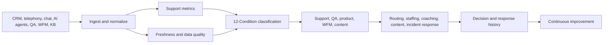

# Customer Support and Contact Center AI Operations Playbook

**Format:** Operating playbook  
**Audience:** Customer support leaders, contact center operators, BPO leaders, customer experience teams, AI agent teams, QA and workforce management teams  
**Canonical URL:** `/whitepapers/customer-support-contact-center-ai-operations-playbook/`  
**Related papers:** Real-time statistical monitoring for live operations; the 12-Condition Framework; model drift detection in regulated environments; Cendryva self-hosted ML observability  
**Author:** Cendryva  
**Published:** 2026-05-25  
**Version:** 1.0  
**License:** CC BY 4.0
**Contact:** research@cendryva.com

## Playbook Goal

Customer support operations are changing fast. Contact centers now combine human agents, AI assistants, chatbots, knowledge bases, QA workflows, workforce management, routing engines, customer sentiment tools, and CRM data. The result is more signal, but not always more operational clarity.

This playbook shows how support organizations can monitor queues, service levels, AI assist quality, escalation health, knowledge gaps, customer sentiment, QA outcomes, and agent workload as one operating system.

Cendryva gives support leaders a way to turn support signals into conditions, route response to owners, monitor AI-assisted workflows, preserve decision evidence, and identify recurring liabilities before customer experience suffers.

## Operating Thesis

Support operations fail when leaders cannot see the difference between:

- normal demand and abnormal demand
- a busy queue and a broken routing policy
- an agent performance issue and a knowledge-base issue
- an AI assistant improvement and an AI assistant hallucination risk
- a customer sentiment dip and a product incident
- a real SLA breach and a stale data feed

Cendryva provides a condition-aware observability layer across those signals. It does not replace the contact center platform, CRM, QA tool, workforce management system, or chatbot. It connects their signals into an operating model.

## Control Room View

| Signal area          | Questions to answer                 | Cendryva condition examples                                            |
| -------------------- | ----------------------------------- | ---------------------------------------------------------------------- |
| Queue health         | Are customers waiting too long?     | DANGER for rising wait time, EMERGENCY for severe SLA breach           |
| Routing              | Are cases reaching the right team?  | DOUBT for conflicting skill/routing data                               |
| Agent workload       | Are teams overloaded or underused?  | BELOW_NORMAL for rising occupancy stress, ABUNDANCE for spare capacity |
| AI assistant quality | Is AI helping or harming?           | CHANGE for sudden deflection shift, DANGER for bad escalation outcomes |
| Knowledge health     | Are answers current and useful?     | LIABILITY for recurring article gaps                                   |
| Customer sentiment   | Is experience degrading?            | DANGER for negative sentiment spike                                    |
| Data freshness       | Are source systems current?         | NON_EXISTENCE for stale CRM, telephony, or chatbot feed                |
| Escalation           | Are severe issues moving correctly? | EMERGENCY for stuck priority escalations                               |

## Workflow 1: Queue and SLA Monitoring

**Objective:** Identify service-level risk before it becomes a customer experience failure.

**Signals to monitor**

- wait time
- abandonment rate
- callback delay
- first response time
- resolution time
- backlog age
- channel volume
- staffing coverage
- priority case aging
- reopen rate

**Cendryva operating pattern**

1. Ingest queue and case signals from contact center, CRM, chat, email, and workforce tools.
2. Compare current signals against channel, queue, product, time-of-day, and region baselines.
3. Classify the queue state using the 12-Condition Framework.
4. Route DANGER and EMERGENCY states to operations owners.
5. Preserve response evidence: staffing change, routing change, deflection action, or incident escalation.

The goal is not another support dashboard. The goal is a coordinated operating response.

## Workflow 2: AI Agent and Chatbot Oversight

**Objective:** Monitor AI-assisted support as a production system with risk, drift, and quality controls.

AI assistants can reduce handle time and improve self-service, but they can also produce wrong answers, miss context, over-deflect, or create customer frustration. NIST AI RMF emphasizes lifecycle governance and risk management for AI systems. In support operations, that means monitoring AI behavior after deployment.

**Signals to monitor**

- containment rate
- escalation rate
- answer acceptance
- customer satisfaction after AI interaction
- fallback rate
- hallucination or policy-violation flags
- article citation coverage
- average turns to resolution
- human override rate
- topic drift
- model or prompt version

**Cendryva operating pattern**

- Trace AI decisions to model or prompt version.
- Monitor score, containment, escalation, and override distributions.
- Treat low-confidence or conflicting outcomes as DOUBT.
- Trigger DANGER when AI containment rises but downstream customer satisfaction falls.
- Preserve AI decision evidence for QA and governance review.

This lets teams separate healthy automation from silent customer experience degradation.

## Workflow 3: Knowledge Base and Content Operations

**Objective:** Identify when poor or stale knowledge content is driving support load.

Support organizations often treat knowledge as a content library, but it behaves like operational infrastructure. Stale articles, missing procedures, contradictory answers, and poor search relevance all create tickets.

**Signals to monitor**

- failed search rate
- no-result searches
- article deflection rate
- article satisfaction
- repeat contact after article view
- agent copy/paste frequency
- AI citation frequency
- outdated article age
- policy update lag
- product release content gaps

**Cendryva operating pattern**

- Classify content gaps as BELOW_NORMAL, DANGER, or LIABILITY.
- Connect recurring customer issues to missing or stale knowledge.
- Route knowledge conditions to content owners.
- Track whether article updates reduce tickets or escalations.
- Preserve improvement history.

Knowledge operations become measurable, not anecdotal.

## Workflow 4: QA, Coaching, and Agent Support

**Objective:** Improve agent performance without confusing training needs with broken systems.

Agent metrics are often misread. A high handle time may indicate poor performance, but it can also indicate product complexity, bad routing, broken tools, missing knowledge, or unusually difficult customers.

**Signals to monitor**

- QA score
- handle time
- transfer rate
- reopen rate
- escalation rate
- customer satisfaction
- policy adherence
- coaching completion
- tool latency
- case complexity

**Cendryva operating pattern**

- Compare agent metrics against queue, topic, and complexity context.
- Flag DOUBT when data quality or sample size is insufficient.
- Detect team-level DANGER before individual blame.
- Connect coaching actions to outcome changes.
- Identify systemic LIABILITY conditions such as broken tools or chronic knowledge gaps.

This supports fairer and more useful performance management.

## Workflow 5: Product Incident Detection from Support Signals

**Objective:** Use support operations as an early-warning system for product and service issues.

Support channels often detect incidents before monitoring does. Customers report broken workflows, billing failures, shipping issues, login problems, integration errors, and confusing product changes.

**Signals to monitor**

- topic volume spike
- negative sentiment spike
- new issue clusters
- escalation concentration
- repeat contacts
- impacted customer segment
- release correlation
- known-issue article views
- refund or concession rate

**Cendryva operating pattern**

- Detect CHANGE in topic distribution.
- Classify severe customer-impact clusters as DANGER or EMERGENCY.
- Link support signals to product, region, release, or customer segment.
- Route conditions to product operations, engineering, or incident owners.
- Preserve decision and response history for post-incident review.

Support becomes part of the operating nervous system, not a downstream complaint channel.

## AI and Privacy Guardrails

Customer support data can contain personal, financial, health, employment, or account information depending on the business. NIST Privacy Framework encourages organizations to manage privacy risk across data processing activities. Support observability should therefore avoid unnecessary exposure of sensitive customer content.

Guardrails should include:

- minimizing raw conversation visibility in broad dashboards
- separating aggregate metrics from case details
- role-based access to sensitive transcripts
- redaction or summarization where appropriate
- access logs for sensitive records
- retention controls by data type
- model and prompt version traceability
- human review for high-impact AI actions

Cendryva supports this by separating signals, metrics, decisions, and role-specific operational views.

## Condition Model for Support Operations

| Condition     | Support operations meaning                              |
| ------------- | ------------------------------------------------------- |
| POWER         | Exceptional service improvement or automation success   |
| AFFLUENCE     | Strong favorable operating state                        |
| ABUNDANCE     | Spare capacity or support coverage                      |
| NORMAL        | Within expected service range                           |
| BELOW_NORMAL  | Early service degradation                               |
| DANGER        | Material SLA, quality, or customer experience risk      |
| EMERGENCY     | Severe customer-impacting breakdown                     |
| NON_EXISTENCE | Missing CRM, chat, telephony, AI, or QA signal          |
| DOUBT         | Low-confidence or conflicting evidence                  |
| CHANGE        | Rapid shift in volume, topic, sentiment, or AI behavior |
| POWER_CHANGE  | Rapid improvement after process or content change       |
| LIABILITY     | Chronic queue, knowledge, tooling, or policy burden     |

## Cendryva Operating Architecture

## What Cendryva Delivers

For customer support and contact center operations, Cendryva delivers:

- multi-source support signal ingestion
- queue, SLA, and backlog monitoring
- source freshness and missing-signal detection
- AI assistant and chatbot observability
- model, prompt, and decision traceability
- 12-Condition classification
- knowledge gap and content health monitoring
- QA, coaching, and outcome evidence
- alert routing and playbook support
- executive service health summaries
- self-hosted deployment options for sensitive customer data

The value is operational: Cendryva helps support leaders see service risk earlier, manage AI-assisted workflows responsibly, connect problems to owners, and preserve evidence of what changed.

## 30-60-90 Playbook

### First 30 Days: Service Health Foundation

- Connect CRM, contact center, chat, and workforce signals.
- Define queue and SLA conditions.
- Configure source freshness rules.
- Identify top recurring LIABILITY areas.
- Build the first support leadership view.

### Days 31-60: AI and Knowledge Operations

- Add AI assistant, chatbot, and knowledge-base telemetry.
- Trace AI behavior to model or prompt version.
- Define DANGER and DOUBT rules for AI-assisted workflows.
- Route knowledge gaps to content owners.
- Begin evidence logging for corrective actions.

### Days 61-90: Cross-Functional Response

- Connect support-topic spikes to product and incident owners.
- Add QA and coaching outcome signals.
- Review condition history by queue, topic, product, and segment.
- Tune thresholds.
- Publish executive service health summaries.

## Scope and Limitations

This is a vendor-authored playbook from Cendryva. It is intended to share operating patterns observed in customer support and contact center operations and to show how the Cendryva platform fits those patterns. It is not a neutral analyst report and it is not a substitute for an independent assessment of any specific contact center, vendor, or AI system.

In scope: operational observability patterns for queues, service levels, AI-assisted support, knowledge base health, QA, and customer-impact incident detection. Out of scope: vendor-by-vendor evaluation of contact center suites, CRMs, chatbots, or workforce management tools; staffing and labor-relations advice; pricing and procurement guidance; and any prescription of specific service-level targets, which are business decisions for each operator.

This document is not legal, regulatory, accessibility, employment, or privacy advice. Regulations that touch contact centers, including TCPA, TSR, state recording-consent laws, and sector-specific rules for healthcare, financial services, or public sector work, vary by jurisdiction and evolve over time. Telephony consent and recording rules in particular differ across US states and across countries. Consult qualified counsel and compliance professionals for obligations that apply to your operation.

Any metric thresholds, condition labels, or response times described here are illustrative defaults, not benchmarks. Performance, deflection, and quality results depend on traffic profile, product complexity, agent and AI model maturity, knowledge content, and integration health. Numbers should be calibrated against the operator's own baselines.

References to AI risk management, privacy, and observability frameworks reflect publicly available guidance as of the publication date. Standards bodies update their documents; readers should consult the current version of any referenced framework.

## References and Further Reading

### Standards and frameworks

- International Organization for Standardization. *ISO 18295-1: Customer Contact Centres - Requirements for Customer Contact Centres*. 2017. https://www.iso.org/standard/64739.html
- NIST. *Artificial Intelligence Risk Management Framework (AI RMF 1.0)*. 2023. https://www.nist.gov/itl/ai-risk-management-framework
- NIST. *NIST Privacy Framework: A Tool for Improving Privacy through Enterprise Risk Management*. 2020. https://www.nist.gov/privacy-framework
- AICPA. *SOC 2 Trust Services Criteria*. 2017 (revised). https://www.aicpa-cima.com/topic/audit-assurance/audit-and-assurance-greater-than-soc-2
- COPC Inc. *COPC Customer Experience (CX) Standard for Contact Centers*. Current edition.

### Regulations relevant to contact centers (US)

- US Federal Communications Commission. *Telephone Consumer Protection Act (TCPA) Rules*. 47 CFR 64.1200.
- US Federal Trade Commission. *Telemarketing Sales Rule (TSR) and Robocall Enforcement*. 16 CFR Part 310. https://www.ftc.gov/legal-library/browse/rules/telemarketing-sales-rule

### Technical references

- OpenTelemetry. *OpenTelemetry Specification and Documentation*. https://opentelemetry.io/docs/
- Google Cloud Architecture Center. *MLOps: Continuous delivery and automation pipelines in machine learning*. https://cloud.google.com/architecture/mlops-continuous-delivery-and-automation-pipelines-in-machine-learning

### Related Cendryva whitepapers

- Cendryva. *Real-time statistical monitoring for live operations*.
- Cendryva. *The 12-Condition Framework*.
- Cendryva. *Model drift detection in regulated environments*.
- Cendryva. *Cendryva self-hosted ML observability*.
