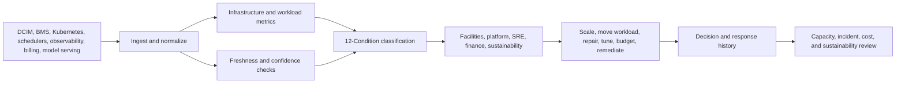

# Data Center and AI Infrastructure Operations Control Plane Specification

**Format:** Control plane specification  
**Audience:** Data center operators, AI infrastructure teams, platform engineering leaders, SRE teams, finance operations, sustainability and facilities leaders  
**Canonical URL:** `/whitepapers/data-center-ai-infrastructure-control-plane-spec/`  
**Related papers:** ClickHouse for high-volume observability; sustainability operations field guide; sub-5ms inference at scale; the 12-Condition Framework  
**Author:** Cendryva  
**Published:** 2026-05-25  
**Version:** 1.0  
**License:** CC BY 4.0
**Contact:** research@cendryva.com

## Control Plane Objective

Data centers and AI infrastructure have become strategic operating systems. GPU clusters, storage, network fabrics, cooling, power, job schedulers, Kubernetes workloads, model-serving platforms, and energy budgets all interact. A single bottleneck can look like a platform issue, a facilities issue, a cost issue, or an availability issue depending on which team is looking.

This specification defines an observability control plane for data center and AI infrastructure operations.

Cendryva provides the layer that turns infrastructure telemetry, platform signals, facility metrics, job outcomes, and financial context into conditions, response workflows, and evidence history.

## Control Plane Scope

| Layer | Signals | Operating risk | Cendryva role |
| --- | --- | --- | --- |
| Power | load, redundancy, UPS status, circuit capacity | capacity exhaustion, outage exposure | Condition classification and owner routing |
| Cooling | temperature, humidity, airflow, chilled water, rack hotspots | thermal throttling, hardware risk | DANGER/EMERGENCY monitoring |
| Compute | CPU, GPU, accelerator utilization, node health | stranded capacity, failed jobs, queue delays | Capacity and job-health observability |
| Kubernetes | pods, nodes, autoscaling, resource pressure | SLO breach, inefficient scaling | Workload condition and freshness monitoring |
| Storage | latency, IOPS, capacity, error rate | training failures, degraded serving | Asset and workload impact evidence |
| Network | packet loss, congestion, fabric health | distributed workload failure | Cross-layer correlation |
| Finance | reserved capacity, cloud spend, utilization, chargeback | cost leakage | LIABILITY and variance tracking |
| Sustainability | energy use, PUE-style metrics, emissions factors | energy waste and reporting gaps | Environmental operations evidence |

## Operating Problem

AI infrastructure is expensive, constrained, and cross-functional. Platform teams care about job success and SLOs. Facilities teams care about power and cooling. Finance cares about utilization and spend. Sustainability teams care about energy and emissions. Product teams care about model availability.

Without a shared control plane:

- GPU utilization looks high while useful job throughput is low
- cooling alerts are disconnected from workload placement
- autoscaling hides inefficient jobs
- cost reports arrive too late to change behavior
- capacity planning relies on stale utilization summaries
- model-serving incidents lack facility and infrastructure context
- sustainability reporting misses operational root causes

Cendryva connects these views into one operating model.

## Control Objective 1: Capacity and Utilization

**Goal:** Understand whether infrastructure is available, useful, and allocated to the right work.

**Signals**

- GPU utilization
- GPU memory pressure
- CPU and memory usage
- queue depth
- pending jobs
- job success rate
- preemption rate
- idle reserved capacity
- node health
- accelerator errors
- model-serving saturation

**Cendryva behavior**

- Classify clusters, queues, and workloads as NORMAL, BELOW_NORMAL, DANGER, or LIABILITY.
- Identify stranded capacity as ABUNDANCE or LIABILITY depending on context.
- Detect job queues moving into DANGER before product timelines slip.
- Preserve evidence of scheduling, quota, or capacity actions.

## Control Objective 2: Power and Cooling

**Goal:** Keep infrastructure within physical operating constraints while supporting high-density compute.

ENERGY STAR emphasizes data center energy efficiency because reducing energy waste can save money while improving performance. For AI infrastructure, power and cooling are not background facilities concerns; they directly affect workload reliability and capacity.

**Signals**

- rack inlet temperature
- facility temperature and humidity
- power draw by room, row, rack, or cluster
- UPS status
- breaker or circuit utilization
- cooling system alarms
- airflow anomalies
- thermal throttling
- hardware failure clusters

**Cendryva behavior**

- Connect thermal or power conditions to affected workloads.
- Classify rack or room conditions as BELOW_NORMAL, DANGER, or EMERGENCY.
- Treat missing facilities telemetry as NON_EXISTENCE.
- Preserve response evidence for facilities, platform, and executive review.

## Control Objective 3: Kubernetes and Workload Autoscaling

**Goal:** Monitor workload scaling, resource pressure, and capacity decisions.

Kubernetes supports workload autoscaling and node autoscaling patterns, but autoscaling does not automatically mean the system is healthy. Scaling can mask inefficient workloads, insufficient quotas, slow image pulls, queue delays, or cost overruns.

**Signals**

- pod pending rate
- node pressure
- horizontal pod autoscaler behavior
- node autoscaler behavior
- request versus limit utilization
- image pull failures
- eviction rate
- restart rate
- SLO breach rate
- workload queue age

**Cendryva behavior**

- Classify workloads by service health and scaling behavior.
- Mark low-confidence scaling signals as DOUBT.
- Identify chronic over-provisioning as LIABILITY.
- Connect autoscaling events to cost, latency, and job success outcomes.

## Control Objective 4: AI Job and Model Serving Reliability

**Goal:** Track whether AI workloads complete successfully and model-serving systems meet operational expectations.

**Signals**

- training job duration
- checkpoint frequency
- failed job reason
- inference latency
- model-serving throughput
- queue wait time
- GPU allocation delay
- data loading errors
- model version
- experiment or pipeline owner

**Cendryva behavior**

- Connect job outcomes to infrastructure and data conditions.
- Trace model-serving incidents to model version, cluster, node, and facility context.
- Classify rising failure patterns as CHANGE or DANGER.
- Preserve owner and remediation history.

## Control Objective 5: Cost, Chargeback, and Sustainability

**Goal:** Turn infrastructure spending and energy use into controllable operational signals.

**Signals**

- spend by team, workload, model, or cluster
- reserved versus used capacity
- idle GPU hours
- failed-job cost
- energy use by cluster or facility
- workload efficiency
- storage growth
- data egress
- budget variance

**Cendryva behavior**

- Classify chronic cost leakage as LIABILITY.
- Identify POWER_CHANGE after scheduling or utilization improvements.
- Connect energy variance to workload placement and facility conditions.
- Provide finance and sustainability teams with evidence, not only invoices.

## Condition Model for AI Infrastructure

| Condition | Infrastructure interpretation |
| --- | --- |
| POWER | Exceptional utilization, efficiency, or reliability improvement |
| AFFLUENCE | Strong favorable operating state |
| ABUNDANCE | Spare capacity or redundancy buffer |
| NORMAL | Within expected operating range |
| BELOW_NORMAL | Early degradation or narrowing capacity |
| DANGER | Material reliability, capacity, cost, or facility risk |
| EMERGENCY | Immediate outage, thermal, power, or customer-impacting risk |
| NON_EXISTENCE | Missing telemetry, owner, workload evidence, or facility signal |
| DOUBT | Low-confidence or conflicting infrastructure evidence |
| CHANGE | Rapid shift in workload, capacity, cost, or thermal behavior |
| POWER_CHANGE | Rapid improvement after optimization |
| LIABILITY | Chronic underutilization, cost leak, failed jobs, or reliability burden |

## Cendryva Control Plane Architecture

## What Cendryva Delivers

For data center and AI infrastructure operations, Cendryva delivers:

- multi-source infrastructure signal ingestion
- facility, cluster, workload, model, and cost context
- source freshness and missing-signal detection
- 12-Condition classification
- GPU and compute capacity monitoring
- Kubernetes workload and autoscaling observability
- power and cooling condition tracking
- model-serving and job reliability evidence
- cost and utilization liability analysis
- sustainability and energy variance support
- owner routing and response history
- self-hosted deployment options for sensitive infrastructure data

The value is operational control: Cendryva helps teams see where capacity, reliability, facility conditions, and cost are drifting before infrastructure becomes the bottleneck.

## Acceptance Criteria

1. Platform teams can see which clusters or workloads are in DANGER.
2. Facilities teams can see which power or cooling conditions affect workloads.
3. Finance can identify chronic cost liabilities by team or workload.
4. Sustainability teams can trace energy variance to operating context.
5. SREs can connect model-serving incidents to infrastructure and model version.
6. Missing telemetry is visible as NON_EXISTENCE, not silent health.
7. Autoscaling behavior is tied to SLO, cost, and capacity outcomes.
8. Corrective actions are preserved for incident and capacity reviews.
9. Leaders can compare utilization and reliability without separate exports.
10. Chronic failed jobs, idle capacity, and thermal issues are tracked as liabilities.

## Scope and Limitations

This is a vendor-authored specification from Cendryva. It describes a control plane pattern for data center and AI infrastructure operations and explains how Cendryva fits that pattern. It is not an independent benchmark, certification, or audit of any data center, hyperscaler, hardware vendor, or scheduling platform.

In scope: a layered observability model spanning power, cooling, compute, Kubernetes, storage, network, finance, and sustainability signals, along with operating workflows that connect facilities, platform, SRE, finance, and sustainability owners. Out of scope: facility design and electrical engineering, mechanical and HVAC engineering, chip selection, GPU procurement strategy, network fabric design, hyperscaler price negotiation, carbon accounting methodology selection, and the safety engineering of physical infrastructure.

This document is not engineering, safety, or regulatory advice. Data center design, electrical work, fire suppression, refrigerant handling, and high-density power and cooling work are governed by codes and standards that vary by jurisdiction (for example NFPA 70, NFPA 75, NFPA 76, local electrical codes, and applicable building and environmental regulations). Engage licensed professionals for design and operation of physical infrastructure. Sustainability and emissions disclosure obligations also vary by jurisdiction and evolve.

References to tier definitions, thermal envelopes, PUE, efficiency ratios, autoscaling behaviors, and condition thresholds are illustrative. Actual operating envelopes depend on equipment vendor specifications, site conditions, workload mix, and contractual SLOs. Any quantitative target in this document should be validated against the operator's own measurements before being used for production decisions.

Standards and guidance referenced here, including Uptime Institute tiers, ASHRAE TC 9.9 thermal guidelines, OCP specifications, ENERGY STAR program documents, and Kubernetes documentation, are revised periodically. Readers should consult the current version of any referenced material.

## References and Further Reading

### Facility, power, and cooling

- Uptime Institute. *Tier Standard: Topology* and *Tier Standard: Operational Sustainability*. https://uptimeinstitute.com/tiers
- ASHRAE Technical Committee 9.9. *Thermal Guidelines for Data Processing Environments*. Latest edition.
- Open Compute Project. *OCP Specifications and Contributions*. https://www.opencompute.org/
- The Green Grid. *PUE: A Comprehensive Examination of the Metric*. White Paper #49.
- US EPA. *ENERGY STAR for Data Centers*. https://www.energystar.gov/products/data_centers

### Compute, scheduling, and observability

- Kubernetes. *Autoscaling Workloads*. https://kubernetes.io/docs/concepts/workloads/autoscaling/
- Kubernetes. *Node Autoscaling*. https://kubernetes.io/docs/concepts/cluster-administration/node-autoscaling/
- Kubernetes SIG-Scheduling. *Scheduler Design and Configuration*. https://github.com/kubernetes/community/tree/master/sig-scheduling
- NVIDIA. *Data Center GPU Manager (DCGM) Documentation*. https://docs.nvidia.com/datacenter/dcgm/
- Prometheus. *Prometheus Documentation*. https://prometheus.io/docs/
- OpenTelemetry. *OpenTelemetry Specification and Documentation*. https://opentelemetry.io/docs/

### Sustainability and reporting

- Greenhouse Gas Protocol. *Corporate Standard and Scope 2 Guidance*. https://ghgprotocol.org/

### Related Cendryva whitepapers

- Cendryva. *ClickHouse for high-volume observability*.
- Cendryva. *Sustainability operations field guide*.
- Cendryva. *Sub-5ms inference at scale*.
- Cendryva. *The 12-Condition Framework*.
