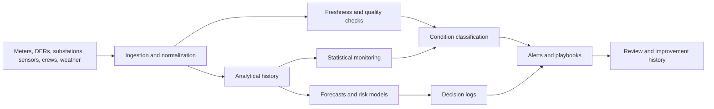

# Energy and Utilities Observability for Distributed Infrastructure Operations

**Audience:** Utilities, energy operators, DER aggregators, microgrid operators, grid modernization teams, operations technology leaders  
**Canonical URL:** `/whitepapers/energy-utilities-distributed-infrastructure-observability/`  
**Related papers:** Cendryva self-hosted ML observability; real-time statistical monitoring for live operations; ClickHouse for high-volume observability; the 12-Condition Framework  
**Author:** Cendryva  
**Published:** 2026-05-25  
**Version:** 1.0  
**License:** CC BY 4.0
**Contact:** research@cendryva.com

## Abstract

Energy systems are becoming more distributed, digital, and dynamic. Utilities and operators now coordinate grid assets, distributed energy resources, batteries, smart meters, sensors, field crews, customer programs, outage workflows, and forecasting models. These systems produce continuous telemetry, but operators need more than data volume. They need trustworthy operational signals, freshness monitoring, condition classification, and response evidence.

As distributed energy resources, electrification, storage, and grid modernization initiatives expand, operational observability becomes essential. Teams need to understand when telemetry is stale, when assets are drifting from expected behavior, when forecasts are degrading, and when field or control-room response is required.

This paper explains how observability patterns apply to energy, utilities, and distributed infrastructure operations. It also explains how Cendryva helps turn grid and asset signals into conditions, alerts, decisions, and reviewable operating history.

## Executive Summary

Energy and utility operations depend on many moving signals:

- load forecasts
- feeder and substation telemetry
- distributed energy resource output
- battery state
- meter events
- outage reports
- weather conditions
- asset health
- crew status
- customer program participation
- market or dispatch signals

The operational questions are time-sensitive:

- Which assets are outside expected range?
- Which telemetry streams are stale or incomplete?
- Which regions are experiencing abnormal demand or voltage behavior?
- Which DER or storage fleets are not following expected output?
- Which model or forecast influenced a dispatch decision?
- Which condition triggered field review or control-room response?
- Can the operator reconstruct what happened after an outage, excursion, or near miss?

Cendryva provides an observability layer for these questions. It combines high-volume telemetry ingestion, ClickHouse-backed analytical history, statistical monitoring, 12-Condition classification, model and decision traceability, freshness checks, and response evidence so energy teams can coordinate action across assets, models, and operators.

## Why Energy Operations Need Observability

The modern grid is a system of systems. Generation, distribution, storage, customer load, distributed energy resources, communications, weather, markets, and field operations all interact. As the Department of Energy notes in grid modernization efforts, integrating energy sources, storage, distributed generation, and secure operation is a core challenge for the grid's future.

Traditional dashboards often show a narrow slice of this complexity. Operators need a layer that can ask:

- Is this signal normal for this asset and time window?
- Is the source reporting on time?
- Is the forecast still reliable?
- Did a model recommendation trigger an operational action?
- Are similar assets showing the same pattern?
- Is this an acute emergency or a chronic liability?

Observability brings together telemetry, analytical history, thresholds, model context, and action tracking.

## Industry Focus: Utility Distribution Operations

Distribution utilities manage feeders, substations, transformers, switches, meters, outage reports, vegetation risk, voltage conditions, and field crews. They need timely visibility into both physical assets and digital systems.

Useful signals include:

- feeder load
- voltage excursions
- transformer temperature
- outage event volume
- smart meter last-heard status
- switch and breaker events
- crew dispatch status
- customer call volume
- restoration estimates
- weather risk
- asset inspection backlog

Cendryva can classify these signals into operational conditions. A feeder may be NORMAL, a transformer temperature pattern may enter DANGER, a meter region may fall into NON_EXISTENCE because last-heard data is missing, or a chronic inspection backlog may become LIABILITY.

This helps operations teams prioritize response without reducing complex infrastructure to disconnected charts.

## Industry Focus: Distributed Energy Resources and Microgrids

Distributed energy resources create new observability requirements. Solar, batteries, controllable loads, EV charging, customer-sited assets, and microgrids can all affect grid behavior. NREL's work on distributed energy resource management systems highlights the need to manage consumer demand and DERs efficiently as they proliferate.

Operational signals include:

- DER output versus expected output
- battery state of charge
- inverter status
- dispatch compliance
- forecast error
- aggregation availability
- site communication status
- control command latency
- local load conditions
- islanding or resilience mode state

Cendryva helps DER and microgrid operators monitor these signals as conditions. A battery fleet can be in BELOW_NORMAL when reserve falls toward threshold. A DER aggregation can move into DOUBT when communications are incomplete. A microgrid can enter EMERGENCY when operating constraints require immediate review.

## Industry Focus: Field Assets and Maintenance

Utilities and energy operators manage expensive assets across wide geographies. Maintenance decisions depend on telemetry, inspections, weather exposure, age, loading, fault history, and crew availability.

Signals include:

- asset health score
- inspection completion
- fault frequency
- oil or gas readings where applicable
- vibration or thermal readings
- maintenance backlog
- parts availability
- crew travel time
- safety condition reports
- repeat failure patterns

Cendryva connects asset signals to owner, condition, and action. A predictive maintenance model can produce a risk score, but Cendryva can show whether the score is based on fresh telemetry, which model version produced it, whether the asset's condition is DANGER or LIABILITY, and whether a field action was completed.

## Forecasts, Models, and Decision Evidence

Energy operations increasingly use models for load forecasting, outage prediction, DER output forecasting, vegetation risk, asset health, and dispatch support. These models influence decisions but can degrade when weather, customer behavior, grid topology, or asset conditions shift.

Decision evidence should capture:

- model version
- forecast window
- input freshness
- asset or region context
- output and confidence
- threshold or condition state
- operator or automated action
- override or disposition
- downstream outcome

Cendryva links model outputs to operational telemetry and decision logs. That helps teams answer not only "what did the forecast say?" but "what did the organization do with it?"

## Freshness and Data Quality

In energy operations, stale data can be dangerous. A device that stops reporting may look stable when it is actually invisible. A forecast based on missing weather data may still produce output. A DER dispatch system may show expected output while a communications gap hides noncompliance.

Freshness monitoring should track:

- last-heard time by asset
- expected reporting interval
- ingestion lag
- missing meter or sensor regions
- communications status
- impossible values
- duplicate events
- stale weather or market inputs
- model input completeness

Cendryva treats missing or stale telemetry as an operational condition. NON_EXISTENCE, DOUBT, and DANGER states make data visibility itself part of the control picture.

## Condition Classification for Energy Operations

Cendryva's 12-Condition Framework provides a shared language across grid, asset, DER, and field signals.

| Condition     | Energy operations interpretation                   |
| ------------- | -------------------------------------------------- |
| POWER         | Exceptional favorable performance or reserve       |
| AFFLUENCE     | Strong favorable operating state                   |
| ABUNDANCE     | More capacity or reserve than needed               |
| NORMAL        | Within expected operating range                    |
| BELOW_NORMAL  | Early degradation or narrowing reserve             |
| DANGER        | Material operational risk requiring review         |
| EMERGENCY     | Immediate safety, reliability, or service risk     |
| NON_EXISTENCE | Missing telemetry, asset data, or process evidence |
| DOUBT         | Conflicting or low-confidence signal               |
| CHANGE        | Rapid shift in load, output, or asset condition    |
| POWER_CHANGE  | Rapid favorable recovery or improvement            |
| LIABILITY     | Chronic asset, backlog, or reliability burden      |

The framework helps operators compare unlike signals without pretending they are the same metric.

## Architecture Pattern

This pattern links telemetry, analytical history, forecasts, conditions, decision logs, and operational response. Cendryva provides the layer that connects these signals across teams and time windows.

## What Cendryva Delivers

For energy and utility operations, Cendryva delivers:

- high-volume telemetry ingestion
- ClickHouse-backed time-series analytics
- asset, region, fleet, and route context
- source freshness and missing-signal detection
- statistical monitoring and anomaly detection
- model version and forecast traceability
- decision logs for dispatch, maintenance, and review
- 12-Condition classification
- alerts and response playbooks
- operational evidence history
- self-hosted deployment options for sensitive infrastructure

The value is operational: Cendryva helps energy teams see degraded conditions earlier, separate missing telemetry from healthy operation, connect model recommendations to action, and preserve evidence for review.

## Implementation Checklist

Energy and utility teams adopting observability should define:

- critical assets, regions, and operating contexts
- telemetry sources and expected reporting intervals
- freshness thresholds
- operating ranges and condition thresholds
- forecast and model ownership
- decision-log schema
- field response playbooks
- outage and exception review workflows
- DER and storage monitoring requirements
- evidence retention rules
- access controls for sensitive infrastructure data
- review cadence for recurring liabilities

## Conclusion

Energy operations are becoming more distributed, sensor-rich, and model-assisted. That creates enormous opportunity, but it also increases the need for trustworthy operational observability.

Teams need to know not only what a meter, DER, asset, or model reported, but whether the signal was fresh, whether the condition was normal, what action was taken, and whether the issue recurred.

Cendryva brings this into one operating layer. It helps utilities and energy operators transform telemetry into conditions, conditions into response, and response into reviewable evidence.

## Scope and Limitations

This is a vendor-authored whitepaper from Cendryva. It describes observability patterns for energy and utility operations and explains how Cendryva supports those patterns. It is not an independent assessment of any utility, ISO, RTO, DER aggregator, OT vendor, or grid platform.

In scope: software-side observability for grid telemetry, DER and storage signals, forecast and model outputs, field asset signals, freshness checks, condition classification, and decision evidence. Out of scope: physical grid engineering, protective relaying design, substation electrical work, market bidding strategy, rate design, real-time control of grid assets, and any safety-critical control function. Cendryva is an observability and operational evidence layer, not a SCADA, EMS, DMS, ADMS, or DERMS.

This document is not engineering, safety, regulatory, market, or cybersecurity advice. Operation of bulk electric systems, distribution systems, and critical infrastructure is governed by mandatory standards and regulations that vary by jurisdiction, including NERC Reliability Standards and NERC CIP in North America, FERC orders in the United States, IEC standards internationally, EU network codes in Europe, and national regulators elsewhere. Engage qualified power systems engineers, cybersecurity professionals, and regulatory counsel for obligations that apply to a specific system.

Any signal thresholds, condition labels, freshness windows, or response patterns described here are illustrative defaults, not engineering set points. Operating limits for feeders, transformers, DER fleets, batteries, and microgrids must be derived from equipment ratings, interconnection agreements, and applicable standards. Any performance claim in this paper should be validated against the operator's own measurements and engineering studies.

Standards and guidance referenced here are revised periodically. Readers should consult the current published version of any referenced standard or rule.

## References and Further Reading

### Standards and interconnection

- IEEE. *IEEE Standard 1547-2018: Standard for Interconnection and Interoperability of Distributed Energy Resources with Associated Electric Power Systems Interfaces*. https://standards.ieee.org/ieee/1547/5915/
- International Electrotechnical Commission. *IEC 61850: Communication Networks and Systems for Power Utility Automation*. https://www.iec.ch/
- OpenADR Alliance. *OpenADR 2.0 and 3.0 Specifications*. https://www.openadr.org/

### Cybersecurity and reliability

- North American Electric Reliability Corporation. *NERC Critical Infrastructure Protection (CIP) Reliability Standards*. https://www.nerc.com/pa/Stand/Pages/CIPStandards.aspx
- NIST. *NIST Cybersecurity Framework 2.0*. 2024. https://www.nist.gov/cyberframework
- NIST. *Smart Grid Group and Smart Grid Interoperability Framework*. https://www.nist.gov/engineering-laboratory/smart-grid

### Regulation and market design (US)

- US Federal Energy Regulatory Commission. *Order No. 2222: Participation of Distributed Energy Resource Aggregations in Markets Operated by RTOs and ISOs*. 2020. https://www.ferc.gov/media/ferc-order-no-2222-fact-sheet
- US Department of Energy. *Grid Modernization Initiative*. https://www.energy.gov/grid-modernization-initiative
- US Department of Energy. *Distributed Energy Resources Topic Page*. https://www.energy.gov/topics/distributed-energy-resources

### Research and technical references

- National Renewable Energy Laboratory. *Distributed Energy Resource Management Systems*. https://www.nrel.gov/grid/distributed-energy-resource-management-systems
- OpenTelemetry. *OpenTelemetry Specification and Documentation*. https://opentelemetry.io/docs/

### Related Cendryva whitepapers

- Cendryva. *Cendryva self-hosted ML observability*.
- Cendryva. *Real-time statistical monitoring for live operations*.
- Cendryva. *ClickHouse for high-volume observability*.
- Cendryva. *The 12-Condition Framework*.
