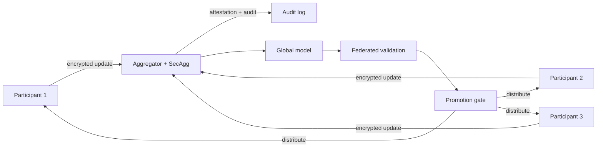

# Federated Learning and Privacy-Preserving Model Improvement in Enterprise Systems

**Audience:** ML platform leaders, privacy engineers, security architects, healthcare and financial services data science teams, cross-organization research consortia  
**Canonical URL:** `/whitepapers/federated-learning-privacy-preserving-model-improvement/`  
**Related papers:** Cendryva self-hosted ML observability; HIPAA-ready ML decision logs; model risk management for financial AI systems; model drift detection in regulated environments  
**Author:** Cendryva  
**Published:** 2026-05-25  
**Version:** 1.0  
**License:** CC BY 4.0
**Contact:** research@cendryva.com

## Abstract

Federated learning (FL) is the architectural pattern that trains a shared model across multiple parties without centralizing the underlying data. Cross-silo FL trains across a small number of institutional participants (hospitals, banks, research labs); cross-device FL trains across a large number of edge devices (phones, vehicles, sensors). Both variants combine well with differential privacy, secure aggregation, and trusted execution environments to produce a privacy-preserving model improvement workflow.

The architectural pattern is real, the use cases are real, and the operational complexity is also real. Federated learning is not free. It demands careful orchestration, careful aggregation, careful privacy accounting, careful drift handling, and careful governance. For many regulated teams, the right answer is centralized training with strong privacy controls, not federated learning. For some teams, federated learning is the only path because the data cannot move.

This paper explains the federated learning architecture, the privacy-preserving techniques that pair with it (differential privacy, secure aggregation), the operational realities, and a decision rubric for when FL actually makes sense. It is also honest about Cendryva's current scope: production-grade federated learning is not shipped today. The codebase contains a research-quality FedAvg simulator that supports method exploration; production deployment patterns are an architectural roadmap, not a shipped product. This paper positions the pattern and the integration interface stubs rather than overstating the product.

## Executive Summary

Five propositions:

- Federated learning solves a specific problem: improving a model across parties when the underlying data cannot or should not be centralized. It is not a general-purpose privacy tool.
- Cross-silo FL (hospitals, banks, research consortia) and cross-device FL (phones, vehicles, sensors) have meaningfully different operational profiles.
- Differential privacy and secure aggregation are usually paired with FL but solve different threats. They are not interchangeable and they have real utility costs.
- The realistic operational complexity is significant: orchestration, client heterogeneity, communication efficiency, privacy budgeting, drift, validation, and governance.
- For many regulated teams, centralized training with strong privacy controls (data minimization, tokenization, anonymization, secure enclaves) is the better operational answer. FL becomes the right answer when centralization is genuinely impossible.

Cendryva's honest status: production federated learning is on the architectural roadmap, not in the shipped product. The codebase includes a FedAvg simulator suitable for method research and integration prototyping. The audit, threshold, monitoring, and condition-classification primitives that a production FL deployment would need already ship. The orchestration, privacy budgeting, and secure aggregation layers required for production FL are deferred.

## What Federated Learning Is, and What It Is Not

Federated learning trains a shared model across multiple data holders, with the raw data staying at each holder and only model updates moving across the network. The shared model is improved by aggregating those updates.

What FL is:

- A way to train across data silos that cannot be centralized for legal, contractual, or operational reasons.
- A method that pairs naturally with differential privacy for additional protection against gradient inversion.
- A method that pairs naturally with secure aggregation for additional protection against the aggregator itself.
- An active research field with practical production deployments at hyperscalers (Google for keyboard suggestions, Apple for differential-privacy aggregated telemetry).

What FL is not:

- A general substitute for data minimization, anonymization, or governance.
- A magic privacy guarantee. Without additional techniques (DP, secure aggregation), model updates can leak information about training data.
- A drop-in replacement for centralized training. The operational mechanics are different.
- A solution when the data could be centralized cheaply and legally; in that case centralized training with privacy controls is usually simpler.

## Cross-Silo vs. Cross-Device

The two variants have similar mathematics and very different operations.

### Cross-Silo FL

A small number (typically 2-100) of institutional participants. Examples: hospitals collaborating on a sepsis model without sharing PHI, banks collaborating on a fraud model without sharing transaction data, manufacturers collaborating on a defect-detection model without sharing trade secrets.

Operational characteristics:

- Each participant is a real organization with engineering capacity.
- Participants are reachable and reasonably reliable.
- Local data volumes are large.
- Local training resources are substantial.
- Round-trip cadence can be slow (hours or days).
- Governance is contractual: data use agreements, consortium charters, IRB approval for research, regulatory clearance.

### Cross-Device FL

A large number (potentially millions) of edge devices. Examples: smartphone keyboard suggestions, vehicle fleet behavior models, distributed sensor anomaly detection.

Operational characteristics:

- Devices are intermittently connected.
- Local data volumes per device are small.
- Local compute and battery are constrained.
- Participants are anonymous and may join or drop out per round.
- Round-trip cadence is fast (minutes or seconds) but only a fraction of devices participate per round.
- Governance is product-level: privacy policy, OS-level consent, vendor accountability.

The Cendryva audience profile (regulated enterprise, healthcare, financial services) overlaps mostly with the cross-silo case. The rest of this paper assumes cross-silo unless otherwise noted.

## Differential Privacy

Differential privacy (DP) is a formal mathematical framework for limiting how much any single training example can influence a model output. The intuition: if removing or replacing a single example produces a near-identical output, then the output cannot tell an observer much about that example.

DP introduces a noise term, calibrated by privacy parameters (epsilon, delta), at some point in the pipeline. Common choices:

- DP-SGD: noise is added to the per-example gradient during local training.
- Output perturbation: noise is added to the final model update before it is shared.
- Aggregate perturbation: noise is added by the aggregator.

DP carries a utility cost. Smaller epsilon means stronger privacy and weaker model. The right epsilon depends on the threat model, the data sensitivity, and the use case. Privacy budgeting (tracking cumulative epsilon spent across rounds) is a real operational requirement.

## Secure Aggregation

Secure aggregation (SecAgg) protects against the aggregator itself. With SecAgg, the aggregator can compute the sum of client updates without seeing any individual update.

Common constructions use additive secret sharing with pairwise masks that cancel in the sum. The construction tolerates a configurable number of dropouts and requires a public-key infrastructure or equivalent.

SecAgg complements DP: DP protects against the model leaking training data; SecAgg protects against the aggregator seeing individual updates. Use cases that care about the aggregator's trust posture (regulatory consortia where no single party should see another party's update) usually need both.

## Trusted Execution Environments

TEEs (Intel SGX, AMD SEV, ARM TrustZone, AWS Nitro Enclaves) provide a hardware-isolated environment where computation can run with cryptographic attestation. For FL, a TEE can host the aggregator and attest to clients that the aggregator code is running unchanged.

TEEs are not a substitute for DP or SecAgg, but they reduce the trust burden on the aggregator's operator. They introduce real operational complexity: attestation infrastructure, hardware-vendor dependencies, side-channel mitigation, and slower performance than native execution.

## Realistic Operational Complexity

The brochures of federated learning underplay what it costs to operate. Honest list:

- **Client heterogeneity.** Participants have different data distributions, different local compute, different schedules, and different definitions of the same features. The aggregator inherits all of this.
- **Communication efficiency.** Model updates can be large. Compression, sparsification, and quantization reduce cost but introduce additional approximation error.
- **Round orchestration.** The aggregator must select clients, distribute the global model, set the local training budget, collect updates within a time bound, and decide what to do about late or missing updates.
- **Drift handling.** The shared model can drift relative to any single participant's data. The participant may see local performance degrade even as the global model improves.
- **Privacy accounting.** Tracking cumulative privacy budget across rounds, across participants, and across model versions is non-trivial.
- **Validation.** Validating a federated model requires either federated validation (each participant runs validation locally and reports aggregate metrics) or a separate validation set, which raises governance questions of its own.
- **Governance.** Cross-silo FL requires explicit data use agreements, consortium roles, and audit trails for who participated in which round.

For most regulated teams, the question is whether the operational cost is justified by the inability to centralize. If the data could be centralized under a BAA, a DUA, or a tokenization regime, centralized training is usually simpler.

## When FL Actually Makes Sense

FL is the right answer when:

- Centralization is legally prohibited (cross-jurisdiction PHI restrictions, sovereignty requirements).
- Centralization is contractually prohibited (consortium agreements where no party will share raw data).
- Centralization is economically prohibitive (cross-device case where moving data per round is too expensive).
- The data is genuinely too sensitive to leave the participant's boundary even with strong tokenization or de-identification.
- The participants have a long-running collaboration where the operational overhead is amortized.

FL is the wrong answer when:

- Centralization is possible with reasonable governance.
- The use case can be served by a publicly trained model with private fine-tuning.
- The use case can be served by federated analytics (aggregate statistics) rather than federated learning.
- The team does not have the engineering capacity to operate the aggregator, the participant clients, the privacy accounting, and the audit trail.

The honest answer for many enterprise teams is "not yet." This is not a criticism; it is a recognition of operational priorities.

## Architecture Pattern (Cross-Silo)



Five design points:

- The aggregator should be auditable. The audit log should record which participants joined each round, what their data size contribution was, and what aggregate update was produced.
- The privacy budget per participant should be tracked across rounds and should be enforceable.
- The federated validation step should produce evidence that the global model meets bounds in each participant's local environment before promotion.
- The promotion gate is governed by the consortium charter, not by any single participant.
- Drift monitoring after promotion uses the same primitives as centrally trained models, with additional per-participant slices.

## How Cendryva Applies This Pattern (Today)

Honest statement: Cendryva does not ship a production federated learning system today. The codebase contains a research-quality FedAvg simulator suitable for method exploration and integration prototyping. The supporting primitives that a production FL deployment would need (audit, threshold, monitoring, condition classification) ship and are usable.

What ships today:

- A FedAvg simulator that implements the McMahan et al. (2017) protocol with optional differential-privacy Gaussian noise on client updates. Code: `apps/api/src/services/domains/ml/federated-averaging.ts`, `apps/api/src/services/domains/ml/federated-learning-infra.ts`. Tests: `federated-averaging.test.ts`, `federated-learning-infra.test.ts`. Purpose: research and integration prototyping. Not a production aggregator.
- The WORM audit log that a production aggregator would write to: `apps/api/src/services/domains/audit/immutable-audit-log.service.ts`.
- Vault-backed signing infrastructure that a production aggregator could use for round attestation: `apps/api/src/services/platform/vault/vault.service.ts`.
- The drift and cohort analysis primitives that a federated model would be monitored with after promotion: `apps/api/src/services/ml/drift-statistics.ts`, `apps/api/src/services/ml/cohort-analysis.service.ts`.
- The model promotion FSM with approval gates: `apps/api/src/services/ml/model-promotion.service.ts`.
- The threshold and condition classification layer: `src/statistics/thresholds/`, `apps/api/src/services/12-conditions/state-machine.ts`.

What does not ship today (deferred):

- A production aggregator service with client authentication, round orchestration, and dropout handling.
- Secure aggregation (additive secret sharing or any equivalent construction).
- TEE-attested aggregator hosting.
- Privacy budget accounting across rounds and participants.
- Federated validation orchestration.
- Cross-silo identity, key exchange, and contractual onboarding.
- Client SDKs in Python or other languages for participant-side integration.

The codebase is structured so that a production FL aggregator could be added as a service that consumes the existing audit, signing, threshold, and promotion primitives. That is an architectural statement, not a shipping commitment.

## Decision Rubric: Federated vs. Centralized vs. Federated Analytics

| Question | Lean federated learning | Lean centralized + privacy controls | Lean federated analytics |
|---|---|---|---|
| Can the data be centralized under a BAA or DUA? | No | Yes | Either |
| Are you training a new model? | Yes | Yes | No, computing statistics |
| Do you have aggregator and participant engineering capacity? | Yes | Either | Yes, lightweight |
| Is the consortium long-running? | Yes | Either | Either |
| Are aggregate statistics enough for the use case? | No | No | Yes |
| Is the operational overhead acceptable to all parties? | Yes | N/A | Yes |
| Is the privacy threat model adversarial across participants? | Yes (need SecAgg) | No | Sometimes |

Federated analytics (computing privacy-preserving aggregate statistics rather than training models) is often the right answer for cross-silo measurement use cases. It has much lower operational complexity than federated learning.

## Implementation Checklist (For a Team Considering FL)

- Confirm the data cannot be centralized under reasonable governance.
- Map the consortium charter, data use agreements, and approval bodies.
- Decide whether FL or federated analytics fits the use case.
- Pick a privacy threat model and the corresponding techniques (DP, SecAgg, TEE).
- Establish privacy budget accounting and the per-participant cap.
- Select the aggregator topology and the trust model.
- Define the round cadence, dropout policy, and client selection.
- Define the federated validation protocol.
- Define the promotion gate and the consortium-level approver chain.
- Establish the WORM audit log for round and promotion events.
- Plan for post-promotion drift monitoring with per-participant slices.
- Plan for rollback and consortium-level governance of model retirement.

## Conclusion

Federated learning is a real architectural pattern for a real problem: training a shared model across parties that cannot share raw data. It pairs with differential privacy, secure aggregation, and trusted execution environments to produce a privacy-preserving workflow. The operational complexity is substantial and the decision to adopt FL should be deliberate.

For many regulated teams, the right answer is centralized training with strong privacy controls, or federated analytics for aggregate-statistics use cases. FL becomes the right answer when centralization is genuinely impossible.

Cendryva's honest position: production federated learning is on the architectural roadmap, not in the shipped product. The codebase contains a research-quality FedAvg simulator and the supporting audit, threshold, monitoring, and promotion primitives that a production FL deployment would need. A production FL aggregator would add to the existing platform; it is not the platform.

This paper exists to position the architectural pattern, surface the realistic operational complexity, and describe the integration interface stubs honestly rather than overstating what is shipped.

## Implementation Status

This section maps the architectural claims above to the Cendryva codebase as of the publication date in the header. This is the most-deferred paper in the Cendryva whitepaper set.

**FedAvg simulator (research-grade)** — SHIPPED
- Code: `apps/api/src/services/domains/ml/federated-averaging.ts`, `apps/api/src/services/domains/ml/federated-learning-infra.ts`.
- Tests: `apps/api/src/services/domains/ml/federated-averaging.test.ts`, `apps/api/src/services/domains/ml/federated-learning-infra.test.ts`.
- Notes: Implements the McMahan et al. (2017) FedAvg protocol with weighted averaging and optional differential-privacy Gaussian noise on client updates. This is a research and integration prototype, not a production aggregator. There is no network protocol, no client authentication, no secure aggregation, and no privacy budgeting layer.

**WORM audit log (usable substrate for a production aggregator)** — SHIPPED
- Code: `apps/api/src/services/domains/audit/immutable-audit-log.service.ts`, `apps/api/src/services/domains/audit/audit.service.ts`, `src/data/audit_logs.rs`.
- Schema: `migrations/postgres/V002__Audit_Trail_And_Logs.sql`.

**Vault-backed signing (usable for round attestation)** — SHIPPED
- Code: `apps/api/src/services/platform/vault/vault.service.ts`, `apps/api/src/services/domains/audit/audit-signing-key-provider.ts`.

**Drift and cohort analysis (post-promotion monitoring)** — SHIPPED
- Code: `apps/api/src/services/ml/drift-statistics.ts`, `apps/api/src/services/ml/cohort-analysis.service.ts`, `apps/api/src/services/ml/model-monitoring.service.ts`.

**Model promotion FSM with approval gates (consortium promotion gate)** — SHIPPED
- Code: `apps/api/src/services/ml/model-promotion.service.ts`, `apps/api/src/services/ml/data-client-promotion.repository.ts`.
- Schema: `migrations/postgres/V006__ML_Schema_And_RLS.sql`.

**Threshold and condition classification** — SHIPPED
- Code: `src/statistics/thresholds/`, `apps/api/src/services/12-conditions/state-machine.ts`.

**Deferred (production FL is not shipped)**
- Production federated aggregator service with client authentication, round orchestration, client selection, and dropout handling.
- Secure aggregation (additive secret sharing, masked summation, or any equivalent SecAgg construction).
- Trusted execution environment hosting for the aggregator (SGX, SEV, Nitro Enclaves) with attestation infrastructure.
- Privacy budget accounting across rounds and participants with enforceable per-participant caps.
- Differential privacy beyond the simulator's optional Gaussian noise (DP-SGD with proper privacy accounting, output perturbation with calibrated noise, RDP accountant).
- Federated validation orchestration where each participant runs local validation and reports privacy-preserving aggregate metrics.
- Cross-silo identity, key exchange, and contractual onboarding flows.
- Participant SDKs in Python or other languages for client-side integration with a production aggregator.
- Communication-efficient update compression (top-k sparsification, quantization, structured updates).
- Cross-device FL (large-scale client pools, partial participation, on-device training coordination).

**How to verify the simulator locally**

```
pnpm --filter @cendryva/api test ml/federated-averaging
pnpm --filter @cendryva/api test ml/federated-learning-infra
```

The tests exercise the FedAvg math, the weighted averaging, the optional DP noise, and the round-summary structure. They do not exercise any network protocol because none ships.

## Scope and Limitations

This is a vendor-authored paper from Cendryva. It positions the federated learning architectural pattern and is honest about Cendryva's current scope. It is not a product page and it is not a research paper.

**In scope.** Federated learning architecture (cross-silo and cross-device), differential privacy and secure aggregation as paired techniques, trusted execution environments as supporting infrastructure, realistic operational complexity, a decision rubric for FL adoption, the integration interface stubs that exist in the Cendryva codebase, and an honest deferred list.

**Out of scope.** Specific FedAvg or FedProx algorithm derivations. Specific differential privacy proofs. Cryptographic protocol design for secure aggregation. Side-channel analysis of TEE implementations. Detailed comparisons of FL frameworks (NVIDIA FLARE, Flower, PySyft, TensorFlow Federated).

**Honest framing.** This is the deferred-heavy paper in the Cendryva set. Production federated learning is on the architectural roadmap, not in the shipped product. Readers should treat the architectural sections as a description of the pattern, not a description of a Cendryva feature.

**Not legal, privacy, or regulatory advice.** Privacy regulations (GDPR, HIPAA, state privacy laws, sector-specific guidance) apply to FL deployments and require qualified counsel. Cross-jurisdiction FL deployments raise additional sovereignty and data transfer questions.

**Time-bounded items.** FL research, framework maturity, and TEE hardware capabilities all move quickly. Re-verify the state of the named frameworks and the regulatory landscape at the time of design.

## References and Further Reading

Foundational FL papers

- McMahan, H. B., Moore, E., Ramage, D., Hampson, S., and Aguera y Arcas, B. *Communication-Efficient Learning of Deep Networks from Decentralized Data*. AISTATS, 2017. https://arxiv.org/abs/1602.05629
- Kairouz, P. et al. *Advances and Open Problems in Federated Learning*. Foundations and Trends in Machine Learning, 14 (1-2), 2021. https://arxiv.org/abs/1912.04977
- Bonawitz, K. et al. *Towards Federated Learning at Scale: System Design*. SysML, 2019. https://arxiv.org/abs/1902.01046
- Bonawitz, K. et al. *Practical Secure Aggregation for Privacy-Preserving Machine Learning*. ACM CCS, 2017. https://eprint.iacr.org/2017/281

Differential privacy

- Dwork, C. and Roth, A. *The Algorithmic Foundations of Differential Privacy*. Foundations and Trends in Theoretical Computer Science, 9 (3-4), 2014. https://www.cis.upenn.edu/~aaroth/Papers/privacybook.pdf
- Abadi, M. et al. *Deep Learning with Differential Privacy*. ACM CCS, 2016. https://arxiv.org/abs/1607.00133

FL frameworks and implementations

- NVIDIA. *NVIDIA FLARE documentation*. https://nvflare.readthedocs.io/
- Flower. *Flower federated learning framework*. https://flower.ai/docs/
- OpenMined. *PySyft documentation*. https://github.com/OpenMined/PySyft
- Google. *TensorFlow Federated*. https://www.tensorflow.org/federated

Trusted execution environments

- Costan, V. and Devadas, S. *Intel SGX Explained*. Cryptology ePrint Archive, 2016. https://eprint.iacr.org/2016/086
- AMD. *AMD SEV-SNP whitepaper*. https://www.amd.com/system/files/TechDocs/SEV-SNP-strengthening-vm-isolation-with-integrity-protection-and-more.pdf
- AWS. *AWS Nitro Enclaves documentation*. https://docs.aws.amazon.com/enclaves/

Cendryva foundations

- Cendryva. *Cendryva: A Self-Hosted ML Observability Platform for Regulated Enterprises*. https://cendryva.com/whitepapers/self-hosted-ml-observability/
- Cendryva. *Designing HIPAA-Ready ML Systems With Immutable Decision Logs*. https://cendryva.com/whitepapers/hipaa-ready-ml-decision-logs/
- Cendryva. *Model Risk Management for Financial AI Systems*. https://cendryva.com/whitepapers/model-risk-management-financial-ai-systems/
