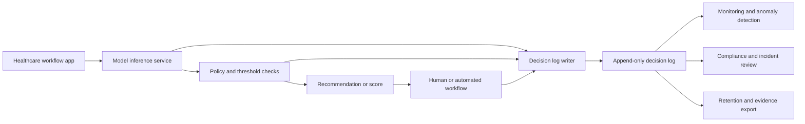

# Designing HIPAA-Ready ML Systems With Immutable Decision Logs

**Audience:** Healthcare providers, payers, life sciences teams, healthcare technology leaders, ML platform teams, security and compliance leaders  
**Canonical URL:** `/whitepapers/hipaa-ready-ml-decision-logs/`  
**Related papers:** Cendryva self-hosted ML observability; model drift detection in regulated environments; audit trails for AI decisions; model risk management for financial AI systems  
**Author:** Cendryva  
**Published:** 2026-05-25  
**Version:** 1.0  
**License:** CC BY 4.0
**Contact:** research@cendryva.com

## Abstract

Machine learning systems used in healthcare and life sciences environments can affect triage, utilization management, care coordination, revenue cycle operations, trial operations, adverse event review, fraud review, scheduling, and patient outreach. Even when a model is advisory rather than autonomous, organizations need the ability to reconstruct what happened: which model version was used, what information was available at the time, what output was produced, who or what acted on it, and whether the system behaved inside approved operational boundaries.

HIPAA does not prescribe a machine learning architecture. It does, however, establish privacy, security, and breach notification obligations for covered entities and business associates that create, receive, maintain, or transmit protected health information. A healthcare ML platform should therefore be designed around traceability, access control, data minimization, integrity, availability, and reviewable operational evidence.

This paper explains how immutable decision logs can support HIPAA-ready ML operations without turning every model event into uncontrolled sensitive data retention.

## Executive Summary

Healthcare ML systems need more than model accuracy metrics. They need accountable operations. A HIPAA-ready ML platform should help teams answer:

- Which model or ruleset produced a recommendation?
- Which version was active at the time?
- What input context was used?
- Was protected health information exposed only to authorized users and systems?
- Were access, configuration, and decision events recorded?
- Can the organization investigate a complaint, incident, anomaly, or suspected breach?
- Can the organization preserve evidence without retaining unnecessary raw PHI?

Immutable decision logs are the audit spine for these questions. They provide durable, tamper-evident records of model activity and surrounding operational context. They do not replace HIPAA policies, business associate agreements, risk analysis, access management, or breach response procedures. They provide the technical evidence layer those governance processes depend on.

Cendryva gives healthcare and life sciences teams a way to make this evidence layer operational. Instead of scattering model context across application logs, BI exports, support systems, and notebooks, Cendryva connects model versions, production telemetry, decision logs, drift monitoring, and threshold-based review into one self-hosted observability plane.

## HIPAA-Ready Is Not HIPAA-Certified

"HIPAA-ready" means a system is designed to support HIPAA-aligned administrative, physical, and technical safeguards in environments where HIPAA applies. It does not mean the software is automatically compliant in every deployment. Compliance depends on the entity's role, contracts, policies, procedures, workforce training, risk analysis, implementation choices, and actual use of the system.

The distinction matters because HIPAA applies differently depending on whether an organization is a covered entity, business associate, subcontractor, or outside HIPAA's scope. Software architecture can support compliance, but it cannot independently determine legal obligations.

For healthcare ML systems, a HIPAA-ready platform should provide:

- strong identity and access controls
- tenant and environment isolation
- encryption for sensitive data in transit and at rest
- auditable event records
- retention controls
- breach investigation support
- data minimization patterns
- operational monitoring and alerting
- evidence export for compliance and incident review

## Why Decision Logs Matter for Healthcare ML

Healthcare workflows are context-sensitive. A model recommendation may be reviewed by a clinician, acted on by an operations team, routed into a case management queue, or used to prioritize outreach. If an outcome is challenged later, the organization needs a reliable account of what the model did and what humans or systems did next.

Without a decision log, teams are often left reconstructing events from application logs, database snapshots, model registries, and support tickets. That reconstruction is slow, incomplete, and difficult to trust. A decision log makes the model event itself a first-class record.

Decision logs help with:

- clinical safety review
- privacy and security incident investigation
- model performance monitoring
- drift and anomaly response
- access review
- customer and patient complaint handling
- audit evidence collection
- model rollback and post-incident analysis

The design goal is not to store everything. The goal is to store the right evidence, with appropriate controls, in a form that can be trusted later.

## What an ML Decision Log Should Capture

A healthcare ML decision log should capture enough context to reconstruct the event without creating unnecessary PHI exposure. The exact schema depends on the workflow, but a practical baseline includes:

| Field category      | Examples                                                                 | Purpose                                        |
| ------------------- | ------------------------------------------------------------------------ | ---------------------------------------------- |
| Event identity      | decision ID, request ID, trace ID                                        | Correlate model events with system activity    |
| Time                | request time, scoring time, action time                                  | Reconstruct sequence of events                 |
| Actor context       | service account, user role, tenant, organization                         | Support access review and accountability       |
| Model context       | model name, version, artifact hash, runtime version                      | Identify what produced the output              |
| Input context       | feature names, feature freshness, hashed identifiers, redacted summaries | Preserve decision context while minimizing PHI |
| Output context      | prediction, score, confidence, classification, recommendation            | Record what the system produced                |
| Policy context      | guardrails, approval status, threshold state, routing rule               | Explain whether the output was actionable      |
| Operational context | latency, errors, retry state, environment, deployment region             | Support reliability and incident review        |
| Human workflow      | reviewer ID, queue, override, disposition, reason code                   | Connect model output to downstream action      |
| Integrity metadata  | cryptographic hash, previous log hash, signature, retention class        | Support tamper evidence and chain of custody   |

The strongest implementations separate raw payload storage from audit metadata. For example, a log may store feature names, ranges, freshness status, model version, output, and a salted hash of the source record rather than copying the full clinical note or claim record into the audit store.

## Immutability and Tamper Evidence

An immutable decision log should make unauthorized alteration detectable. Immutability can be implemented through append-only storage, write-once retention controls, cryptographic hash chains, signed event envelopes, restricted administrative access, and independent backup or replication.

Useful patterns include:

- **Append-only writes:** records are added, not updated in place.
- **Correction events:** mistakes are corrected by adding a new event that references the prior event.
- **Hash chaining:** each event includes the hash of the previous event in the sequence.
- **Signed envelopes:** events are signed by a trusted service identity.
- **Separation of duties:** operators who run model services cannot silently rewrite audit history.
- **Retention classes:** logs are retained according to workflow, legal, and organizational policy.
- **Exportable evidence bundles:** incident reviewers can export a bounded, verifiable record set.

Immutability should not become indiscriminate retention. Healthcare organizations still need policies for retention periods, deletion obligations, patient rights workflows, and data minimization.

## Data Minimization for Decision Logs

Decision logs can become privacy liabilities if they duplicate sensitive records unnecessarily. A HIPAA-ready design uses data minimization by default.

Practical minimization controls include:

- storing identifiers as scoped hashes when direct identifiers are not needed
- storing feature summaries instead of raw source documents
- separating PHI payloads from model audit metadata
- encrypting fields with different sensitivity levels separately
- limiting free-text fields that may accidentally capture PHI
- using structured reason codes instead of narrative notes where possible
- applying retention classes by workflow type
- restricting export access to authorized compliance and security workflows

The audit record should be useful enough to investigate the event, but narrow enough to avoid becoming a second uncontrolled medical record system.

## Access Control and Tenant Isolation

Healthcare ML platforms should enforce access controls at every decision-log boundary:

- write access from trusted services only
- read access by role, tenant, and purpose
- administrative access with approval and monitoring
- segmented environments for production, staging, and development
- separate keys or encryption contexts for tenants or regulated workloads
- audit events for every log read, export, retention change, and policy change

Tenant isolation is especially important for platforms that serve multiple healthcare organizations, business units, or covered-entity relationships. Logs should not be globally searchable across tenants by default, and operational support workflows should avoid broad access to PHI-bearing records.

## Decision Logs and the HIPAA Security Rule

The HIPAA Security Rule requires covered entities and business associates to protect electronic protected health information through administrative, physical, and technical safeguards. Decision logs can support those safeguards by recording system activity, preserving integrity evidence, and enabling security review.

Relevant technical design concerns include:

- unique user identification
- emergency access procedures
- automatic logoff or session control for review tools
- encryption and decryption controls
- audit controls for systems that handle ePHI
- integrity controls to detect improper alteration or destruction
- transmission security for data in motion

Decision logs should be integrated with the broader security program. They are useful only if the surrounding identity, encryption, monitoring, and incident response processes are mature enough to act on them.

## Decision Logs and Breach Investigation

When a privacy or security incident occurs, investigators need facts quickly. A decision-log system can reduce response time by answering:

- what records or identifiers were involved
- which users, services, or systems accessed the decision context
- whether data was exported or transmitted
- whether the event was caused by a model, user action, integration, or policy misconfiguration
- whether the same pattern affected other patients, tenants, or time windows
- whether the system preserved enough evidence to assess impact

This is not only a forensic concern. Breach notification obligations depend on determining what happened and whether protected health information was compromised. A strong decision-log design helps teams move from speculation to evidence.

## Operational Monitoring for Healthcare ML

Decision logs are most valuable when paired with production monitoring. Healthcare ML teams should monitor:

- model version usage
- request volume by tenant and workflow
- prediction latency
- failed or timed-out inference calls
- feature freshness
- missing input data
- drift from validation baselines
- unexpected output distributions
- override rates and human disagreement
- downstream workflow outcomes
- access and export anomalies

Monitoring should connect model behavior to operational thresholds. For example, a sudden increase in missing features may matter more than raw model latency if the model is still responding but basing outputs on degraded context.

## Industry Focus: Care Coordination and Clinical Operations

Consider a model that helps prioritize follow-up outreach for patients after discharge. The model does not make a clinical decision by itself; it ranks cases for review by a care coordination team.

A HIPAA-ready decision log for each recommendation might include:

- patient record reference as a scoped identifier
- tenant and facility context
- model name and version
- feature freshness and source-system status
- risk score and priority band
- threshold policy used for routing
- queue assignment
- reviewer action and disposition
- timestamped audit event chain

If the care team later investigates an outcome, the organization can determine whether the recommendation came from the approved model version, whether source data was fresh, whether the case was routed correctly, and what action was taken after the recommendation.

With Cendryva, this workflow can combine model version traceability, feature freshness monitoring, immutable decision logs, and operational condition classification. That gives clinical operations leaders a stronger answer than "the model said so." It gives them a reviewable timeline of data, model, policy, and human action.

## Industry Focus: Life Sciences and Trial Operations

Life sciences organizations increasingly use ML to support site selection, patient matching, safety signal triage, supply forecasting, and protocol operations. These workflows may involve sensitive health information, regulated processes, and high operational cost when signals are missed or misrouted.

Cendryva can help these teams:

- monitor model outputs and source freshness by study, site, cohort, or geography
- preserve decision evidence for operational review
- classify signal health using thresholds and conditions
- detect abnormal workflow patterns before they become expensive delays
- keep observability data inside approved infrastructure
- connect model recommendations to downstream review and disposition

The result is not merely a dashboard. It is an evidence-backed operational layer for ML-assisted trial and life sciences workflows.

## Industry Focus: Claims Review and Fraud Triage

In claims operations, an ML model may flag claims for review based on patterns, thresholds, or anomaly scores. The decision log should capture the model version, scoring rationale, threshold state, reviewer workflow, and disposition while avoiding unnecessary duplication of the full claim record.

Useful log details include:

- claim reference as a scoped identifier
- model version and artifact hash
- anomaly score and threshold
- reason code categories
- reviewer assignment and override
- export and access events
- final disposition

This supports operational review without requiring the ML observability system to become the system of record for every claim detail.

## Architecture Pattern



This pattern separates operational workflow from audit capture. The inference system produces a model output, the policy layer determines whether and how it can be acted on, and the decision-log writer records the event in an append-only store. Monitoring, audit review, and retention workflows consume the log without being able to silently rewrite it.

## Implementation Checklist

Healthcare teams designing decision logs for ML systems should evaluate:

- Whether the organization is a covered entity, business associate, subcontractor, or outside HIPAA scope
- Whether business associate agreements and data processing terms match actual system behavior
- Which model events require decision logging
- Which fields are necessary for review and which create avoidable PHI exposure
- How event integrity will be protected
- How access to decision logs will be authorized, monitored, and reviewed
- How retention periods will be assigned by workflow
- How logs will support breach investigation and incident response
- How model versioning, deployment, and rollback records connect to decision logs
- How patients, members, or customers are represented without unnecessary identifiers
- How evidence bundles can be exported without overexposing unrelated records

## How Cendryva Supports HIPAA-Ready ML Operations

Cendryva is designed to support HIPAA-ready ML observability through:

- self-hosted deployment options for sensitive environments
- tenant-aware access control and isolation patterns
- model version and artifact traceability
- production inference observability
- drift and anomaly monitoring
- threshold-based operational classification
- decision-log patterns for audit review
- event-driven response workflows
- separation between analytical telemetry and transactional records
- deployment models that keep sensitive data within approved infrastructure

The result is a platform architecture that treats healthcare ML as an operational system requiring evidence, not just an analytical model requiring evaluation.

## Conclusion

Healthcare organizations adopting ML need to know more than whether a model performed well in validation. They need to know what happened in production, whether the system acted within approved boundaries, and whether the organization can reconstruct events during review.

Immutable decision logs provide that evidence layer. When combined with access control, data minimization, encryption, retention policy, drift monitoring, and model version governance, they help healthcare teams operate ML systems with the accountability expected in regulated environments.

HIPAA-ready ML is not a single feature. It is a system design discipline. Decision logs are where that discipline becomes reviewable.

## Implementation Status

This section maps the architectural claims above to the Cendryva codebase as of the publication date in the header. Each item lists the file path, what ships today, what is deferred, and the test count.

**WORM audit log persistence** — SHIPPED
- Schema: `migrations/postgres/V002__Audit_Trail_And_Logs.sql` adds `previous_hash`, `signature`, `signing_key_id`, `chain_scope`, and `signed_at` columns to `audit_logs`, a new `audit_log_chains` table, and an `enforce_audit_logs_worm` BEFORE UPDATE OR DELETE trigger that raises an exception. The operator-time `REVOKE UPDATE, DELETE ON audit_logs FROM <app_role>` step is documented in the migration and in the operations doc.
- Data layer: `src/data/audit_logs.rs` in cendryva-data provides the transactional signed insert plus chain head upsert, with tenant-scoped queries (`find_by_resource`, `find_for_chain_verification`, `find_chain_head`).
- API layer: `apps/api/src/services/domains/audit/immutable-audit-log.service.ts` in cendryva-api persists via the data client (no more in-memory array), and `verifyChain` re-walks signatures and previous-hash linkage end to end.
- Production writer cutover: SHIPPED. `apps/api/src/services/domains/audit/audit.service.ts` now routes every write through `ImmutableAuditLogService.appendLog`. Every call site of `AuditLogService#log` (auth, metrics, admin, agents, valuable-final-products, global HTTP audit interceptor) now produces signed, chain-linked rows. A new `AUDIT_REQUIRE_SIGNED_WRITES` feature flag lets operators graduate from fail-soft to fail-loud after monitoring confirms the new path is healthy. Legacy unsigned rows written before the cutover are preserved as historical evidence and explicitly excluded from `verifyChain`.
- Per-call-site cleanup: SHIPPED. The legacy `AuditLogRepository.create()` unsigned-write method was removed from `apps/api/src/db/postgres-audit-log-repository.ts`; the shim is now read-only (`findById`, `find`, `count`) and only feeds `AuditQueryService`. The repository's read methods remain because `dataClient.findAuditLogs` returns both legacy unsigned rows and the new signed rows, which is what the audit UI needs to render the full historical timeline. The data-tier `dataClient.createAuditLog` HTTP method is preserved as a primitive but is no longer called from cendryva-api.

**Vault-backed signing** — SHIPPED
- Code: `apps/api/src/services/platform/vault/vault.service.ts` (`transitSign`, `transitVerify`), `apps/api/src/services/domains/audit/audit-signing-key-provider.ts` (provider interface), `apps/api/src/services/domains/audit/audit-signing-key-provider.factory.ts` (prod-vs-dev selector mirroring the `credential.service.ts` pattern).
- Providers: `VaultBackedSigningKeyProvider` uses Ed25519 keys via Vault transit so the private key never leaves Vault. `InMemorySigningKeyProvider` is for dev and test only and emits a loud console warning at construction.
- Tests: 52 tests passing (`pnpm --filter @cendryva/api test audit`), including 8 new tenant isolation and chain integrity tests plus 5 Postgres-backed WORM integration tests.

**HIPAA Security Rule controls catalog** — SHIPPED
- Code: `src/compliance/hipaa.rs` contains 64 control entries spanning §164.308 administrative, §164.310 physical, §164.312 technical, §164.314 organizational, and §164.316 documentation safeguards.
- Status breakdown: 8 Implemented, 17 PartialEvidence, 0 NotImplemented, 3 NotApplicable, 36 OrganizationalResponsibility.
- Binary: `cargo run --bin hipaa_report` exports the catalog as Markdown or JSON. Companion document at `docs/compliance/HIPAA-CONTROLS-MAPPING.md`.

**Operator documentation** — SHIPPED
- Code: `docs/operations/AUDIT-WORM-OPERATIONS.md` covers the REVOKE pattern, Vault environment variables (`VAULT_ADDR`, `VAULT_TOKEN`, `VAULT_AUDIT_SIGNING_KEY`, `VAULT_TRANSIT_PATH`), one-time Vault setup commands, a key rotation strategy stub, and chain verification SQL.

**Minimum-necessary middleware** — SHIPPED (Wave 1)
- Code: `apps/api/src/middleware/minimum-necessary.ts` enforces field-level redaction by role × purpose so operations roles never see treatment-only PHI fields.
- Companion docs: `docs/compliance/PHI-HANDLING.md` describes the tagging contract and how a request's `purpose-of-use` claim selects the redaction policy.

**PHI tagging foundation** — SHIPPED (Wave 1)
- Code: `src/compliance/phi.rs` defines the PHI tag taxonomy (identifier, treatment, payment, operations); `src/compliance/phi_registry.rs` is the per-feature registry that the API middleware consults at request time.
- Status: tag catalog + registry are in place. Per-feature tagging coverage continues to roll out feature-by-feature.

**Compliance workflow primitives** — SHIPPED (v1 foundations)
- **BAA registry** — SHIPPED. Tracks counterparty, scope, permitted uses, expiration, and signing evidence (URI + SHA-256). Lifecycle events (`created` / `signed` / `modified` / `terminated` / `superseded`) emit signed WORM audit rows. Endpoints at `/api/v1/compliance/baas`. Code: `apps/api/src/services/domains/compliance/baa.service.ts`, `apps/api/src/routes/compliance.ts`, `src/data/baa.rs`. Schema in `migrations/postgres/V007__Data_Quality_And_HIPAA.sql`. See `docs/compliance/BAA-MANAGEMENT.md`. HIPAA catalog: §164.308(b)(1) → `PartialEvidence`.
- **Breach notification workflow** — PARTIAL. Records incident, four-factor risk assessment input, and reportability determination as structured operator input (no automated heuristic). Auto-schedules required notifications with deadlines: individual at discovery+60d, HHS at discovery+60d if affected≥500 else next March 1, media at discovery+60d if affected≥500 in single state/jurisdiction. Generates §164.404(c)(1) content templates with `[OPERATOR TO COMPLETE]` placeholders. Cendryva does NOT send notifications, draft language, or judge "low probability of compromise" — those are operator/counsel inputs. Code: `apps/api/src/services/domains/compliance/breach-notification.service.ts`, `src/data/phi_breach.rs`. See `docs/compliance/BREACH-NOTIFICATION-WORKFLOW.md`. HIPAA catalog: §§ 164.402 / 164.404 / 164.406 / 164.408 / 164.410 → `PartialEvidence`.
- **§164.528 accounting of disclosures** — SHIPPED. Disclosure log with WORM audit cross-reference; `getAccountingForIndividual` produces the §164.528(b) report, applying the §164.528(a)(1)(i)/(ii) TPO+authorization exemptions. Optional auto-recording hook in `minimumNecessaryMiddleware` for instrumented routes. Code: `apps/api/src/services/domains/compliance/disclosure-accounting.service.ts`, `src/data/phi_disclosure.rs`. See `docs/compliance/DISCLOSURE-ACCOUNTING.md`. HIPAA catalog: §164.528 → `Implemented`.

**Wave 2 compliance hardening — PARTIAL (customer wiring still required)**
- **HHS breach-portal submission** — PARTIAL. The HHS portal at <https://ocrportal.hhs.gov/ocr/breach/breach_report.jsf> is a human-driven web form (no public API). Cendryva ships `HhsBreachSubmissionService` (`apps/api/src/services/domains/compliance/hhs-breach-submission.service.ts`) which generates a structured `HhsBreachFormFields` payload pre-filled from the incident record, emits stepwise submission instructions with the correct >=500 / <500 deadline guidance, and records the operator's confirmation number against the incident (`hhs_confirmation_number` / `hhs_submitted_at` / `hhs_submitted_by` columns on `phi_breach_incidents`). Endpoints `GET /api/v1/compliance/breaches/:id/hhs-submission-payload` and `POST /api/v1/compliance/breaches/:id/hhs-submission-confirmation`. Customer must complete operator-judgment fields (safeguards, location of breached PHI, actions taken), submit via the portal, and record the returned confirmation number. HIPAA catalog: §164.408 → `PartialEvidence` (evidence pointer updated to include this service).
- **E-signature integration for BAAs** — PARTIAL. Provider-agnostic interface ships at `apps/api/src/services/domains/compliance/e-signature.service.ts` with `LoggingESignatureProvider` (default no-op) and `DocuSignProvider` stub (throws `ProviderNotConfiguredError` until env vars are set; TODO comments point at the exact DocuSign REST endpoints to implement). `BaaService.requestSignature` persists the envelope id + provider on the BAA row (new `signing_envelope_id` + `signing_provider` columns on `business_associate_agreements`), and `ESignatureService.reconcile` flips the BAA active when the provider reports completion. Endpoint `POST /api/v1/compliance/baas/:id/request-signature`. Customer must configure `DOCUSIGN_INTEGRATION_KEY`, `DOCUSIGN_USER_ID`, `DOCUSIGN_ACCOUNT_ID`, `DOCUSIGN_BASE_URL`, `DOCUSIGN_PRIVATE_KEY`, implement the four stubbed API calls, swap `LoggingESignatureProvider` for `DocuSignProvider` in the routes wiring, and wire a webhook handler that calls `reconcile`. HIPAA catalog: §164.308(b)(3) → `PartialEvidence` (upgraded; evidence pointer added for the e-signature interface).
- **Automated four-factor risk scoring (§164.402(2))** — PARTIAL. `scoreFourFactorRisk(input)` in `apps/api/src/services/domains/compliance/breach-risk-scoring.service.ts` produces a structured recommendation with weighted sub-scores (PHI nature 30%, recipient identity 20%, acquired-or-viewed 30%, mitigation 20%; threshold 50 for `reportable`), a rationale that walks each of the four factors, and an `ADVISORY ONLY` disclaimer making clear the covered entity's privacy officer / risk officer / counsel makes the final determination. Endpoint `POST /api/v1/compliance/breaches/:id/risk-score`. The score never auto-applies — `determineReportability` still requires an explicit operator call with a human rationale. HIPAA catalog: §164.402 remains `PartialEvidence` (evidence pointer updated to include the scoring heuristic + ADVISORY ONLY language).
- **Patient-portal delivery of §164.528 report** — PARTIAL. `DisclosureDeliveryService` (`apps/api/src/services/domains/compliance/disclosure-delivery.service.ts`) wraps the existing `DisclosureAccountingService` with a delivery scaffold: `EmailDeliveryChannel` (SMTP via the existing `EmailService`), `SecureDownloadLinkChannel` (signed `base64url(payload).base64url(sig)` URL with default `HmacDownloadLinkSigner` — swap in a Vault-transit signer for production), and `NoOpChannel`. New `phi_disclosure_accounting_requests` table records the request, channel, status, delivery receipt, and entry/exempt counts; lifecycle emits `compliance.disclosure_accounting.requested` / `.delivered` / `.failed` WORM audit rows. Endpoints `POST /api/v1/compliance/disclosures/accounting-requests` and `GET /api/v1/compliance/disclosures/accounting-requests/:id`. v1 renders the report as JSON; PDF rendering depends on the customer's PDF stack. Customer must wire SMTP credentials (or set `PATIENT_PORTAL_BASE_URL` + build the portal page that resolves the signed token + serves the JSON / rendered PDF), wire a `VaultBackedDownloadLinkSigner` for production link signing, and enforce the §164.528(c)(2) one-free-per-12-months fee policy at the billing / portal layer.

**Deferred (operator-side hardening)**
- `CHECK (signature <> '' OR signing_key_id = 'legacy-unsigned')` constraint on `audit_logs` is **inlined into V002** alongside the `CREATE TABLE audit_logs` statement. Every fresh bootstrap and every existing deployment that runs V002 gets the constraint automatically. The legacy escape is a defense-in-depth break-glass; the production writer always emits signed rows, so the escape is never reached in normal operation.

**System-internal traffic** — SHIPPED
- Code: `packages/types/src/system-identity.ts` exports `SYSTEM_ORGANIZATION_ID` and `SYSTEM_ACTOR_ID` sentinels. The promotion factory and audit sink resolve missing tenant context to the sentinel rather than dropping into in-memory storage, so platform-internal traffic (background workers, scheduled jobs) is signed, persisted, and verifiable like customer traffic. The sentinel org has no subscription entitlements, so any production-only feature gate correctly returns "false" for system callers.
- Operator query example included in `docs/operations/AUDIT-WORM-OPERATIONS.md` under "System-internal traffic."

**Strict-mode default (non-production)** — SHIPPED
- Code: `apps/api/src/services/domains/audit/audit.service.ts::strictModeEnabled()`. When `AUDIT_REQUIRE_SIGNED_WRITES` is unset, the writer is strict in any environment except `NODE_ENV=production`. This catches misconfigured signing keys, Vault outages, and unmigrated call sites in dev/test/staging before they reach production, while preserving the gradual flag-flip schedule for the production rollout.

**How to verify locally**

```
pnpm --filter @cendryva/api test audit
cargo test --lib compliance::hipaa
cargo run --bin hipaa_report -- --format markdown
```

## Scope and Limitations

This is a vendor-authored whitepaper from Cendryva. It describes design patterns for HIPAA-ready ML decision logs and explains how Cendryva supports those patterns. It is not a HIPAA compliance certification, a legal opinion, a clinical guideline, or an independent assessment of any specific deployment, covered entity, business associate, model, or workflow.

This document is not legal advice, medical advice, regulatory advice, or a substitute for professional consultation. HIPAA obligations depend on an organization's role under the rule (covered entity, business associate, subcontractor, or outside HIPAA scope), the specific systems and contracts involved, workforce policies, training, and risk analysis. Other regimes may apply in parallel, including state privacy laws (for example California, Texas, and Washington consumer-health laws), 42 CFR Part 2 for substance use disorder records, the FTC Health Breach Notification Rule for non-HIPAA health data, FDA requirements for Software as a Medical Device, ONC HTI-1 requirements for predictive decision support interventions in certified health IT, and international regimes such as GDPR or PIPEDA when patient data crosses borders. The scope here is US HIPAA. Consult qualified privacy counsel and regulatory experts for the rules that apply to a specific system.

In scope: log schema, immutability and tamper-evidence patterns, data minimization, access control, drift and operational monitoring, and decision-log support for breach investigation and clinical operations review. The shipped implementation backing these patterns is summarized in the Implementation Status section above. Out of scope: model validation methodology for clinical claims, IRB and study design, device classification decisions, contractual drafting of business associate agreements, security risk analysis for a specific entity, and prescriptive retention periods, which depend on organizational policy, state law, statutes of limitations, and contractual requirements.

"HIPAA-ready" describes architectural support for HIPAA-aligned safeguards. It does not assert that any deployment is, by itself, compliant. Compliance is a property of the operating organization and its full control environment, not of any single software product. Any threshold, retention class, or workflow described here is a reference pattern, not a prescription.

Standards, regulations, and agency guidance referenced here, including HHS OCR materials, NIST publications, FDA SaMD guidance, and ONC rules, are updated periodically. Readers should consult the currently effective version of any referenced regulation or guidance.

## References and Further Reading

### HIPAA regulations and guidance

- US Department of Health and Human Services. *HIPAA Administrative Simplification Regulations*. 45 CFR Parts 160, 162, and 164. https://www.ecfr.gov/current/title-45/subtitle-A/subchapter-C
- HHS Office for Civil Rights. *Summary of the HIPAA Privacy Rule*. https://www.hhs.gov/hipaa/for-professionals/privacy/laws-regulations/index.html
- HHS Office for Civil Rights. *The HIPAA Security Rule*. https://www.hhs.gov/hipaa/for-professionals/security/index.html
- HHS Office for Civil Rights. *Breach Notification Rule*. https://www.hhs.gov/hipaa/for-professionals/breach-notification/index.html
- HHS Office for Civil Rights. *Covered Entities and Business Associates*. https://www.hhs.gov/hipaa/for-professionals/covered-entities/index.html
- HHS Office for Civil Rights. *HIPAA Audit Protocol*. https://www.hhs.gov/hipaa/for-professionals/compliance-enforcement/audit/protocol/index.html

### Adjacent US regulations and frameworks

- US Food and Drug Administration. *Software as a Medical Device (SaMD): Clinical Evaluation* and related guidance. https://www.fda.gov/medical-devices/digital-health-center-excellence/software-medical-device-samd
- Office of the National Coordinator for Health IT. *HTI-1 Final Rule: Health Data, Technology, and Interoperability - Certification Program Updates, Algorithm Transparency, and Information Sharing*. 2024. https://www.healthit.gov/topic/laws-regulation-and-policy/health-data-technology-and-interoperability-certification-program

### Security and AI governance

- NIST. *Special Publication 800-66 Revision 2: Implementing the HIPAA Security Rule - A Cybersecurity Resource Guide*. 2024. https://csrc.nist.gov/pubs/sp/800/66/r2/final
- NIST. *Special Publication 800-53 Revision 5: Security and Privacy Controls for Information Systems and Organizations*. https://csrc.nist.gov/pubs/sp/800/53/r5/upd1/final
- NIST. *Artificial Intelligence Risk Management Framework (AI RMF 1.0)*. 2023. https://www.nist.gov/itl/ai-risk-management-framework

### Related Cendryva whitepapers

- Cendryva. *Cendryva self-hosted ML observability*.
- Cendryva. *Model drift detection in regulated environments*.
- Cendryva. *Audit trails for AI decisions*.
- Cendryva. *Model risk management for financial AI systems*.
