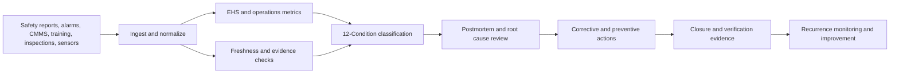

# Industrial EHS Incident Postmortem Template and Operating Guide

**Format:** Incident postmortem template and operating guide  
**Audience:** EHS leaders, plant managers, safety teams, operations leaders, maintenance teams, quality teams, industrial analytics teams  
**Canonical URL:** `/whitepapers/industrial-ehs-incident-postmortem-template/`  
**Related papers:** Manufacturing and logistics inference; agriculture and cold-chain observability; real-time statistical monitoring for live operations; the 12-Condition Framework  
**Author:** Cendryva  
**Published:** 2026-05-25  
**Version:** 1.0  
**License:** CC BY 4.0
**Contact:** research@cendryva.com

## Purpose

Industrial safety programs depend on what happens before and after an incident: hazard identification, near-miss capture, equipment condition monitoring, corrective action, training, maintenance, and recurrence prevention. Yet many organizations still treat incident investigation as a form, not an operating loop.

This template shows how to structure postmortems and operating evidence for industrial EHS, plant operations, and safety-critical workflows.

Cendryva provides the observability layer that connects safety observations, equipment telemetry, operational conditions, corrective actions, and recurrence history so teams can learn faster and prevent repeat events.

## Postmortem Header

| Field                      | Description                                                                |
| -------------------------- | -------------------------------------------------------------------------- |
| Incident ID                | Unique identifier                                                          |
| Site / area / line         | Physical location                                                          |
| Date and time              | Event and discovery time                                                   |
| Incident type              | Injury, near miss, equipment event, environmental event, process deviation |
| Severity                   | Actual and potential severity                                              |
| Condition at time          | 12-Condition state before/during event                                     |
| Owner                      | EHS or operations owner                                                    |
| Investigation lead         | Responsible investigator                                                   |
| Corrective action due date | Target closure                                                             |
| Recurrence status          | First event, repeat event, chronic pattern                                 |

## Executive Summary Template

Use this summary for leadership review:

1. What happened?
2. What was the actual and potential impact?
3. Which signals were available before the event?
4. Which signals were stale, missing, or ignored?
5. What immediate containment occurred?
6. What root causes and contributing factors were identified?
7. What corrective and preventive actions were assigned?
8. How will recurrence be monitored?

Cendryva strengthens this summary by preserving the condition history, telemetry freshness, action evidence, and owner response timeline.

## Focus Area: Near Miss and Hazard Reporting

Near misses are early warnings. If they are captured but not trended, the organization misses the chance to prevent future harm. OSHA guidance emphasizes investigating incidents and concerns to identify root causes and prevent recurrence.

**Signals to monitor**

- near-miss volume
- hazard report category
- time to triage
- time to corrective action
- repeat location
- repeat equipment
- observer role or shift
- unresolved action age
- severe potential classification

**Cendryva operating value**

- Classify repeat hazards as LIABILITY.
- Escalate severe-potential near misses as DANGER.
- Detect missing or stale safety observations as NON_EXISTENCE.
- Connect corrective action to later condition improvement.

## Focus Area: Equipment and Process Alarms

Industrial incidents often have precursors: abnormal vibration, temperature drift, pressure variation, line stops, overrides, alarms, lockout/tagout exceptions, or maintenance delays.

**Signals to monitor**

- alarm count by asset
- critical alarm age
- bypass or override events
- maintenance backlog
- inspection status
- vibration or thermal anomalies
- repeat fault code
- line stop frequency
- process deviation
- spare parts constraint

**Cendryva operating value**

- Classify equipment risk by asset, line, and shift.
- Treat chronic unresolved alarms as LIABILITY.
- Escalate EMERGENCY when alarm severity and operational exposure require immediate action.
- Preserve evidence of shutdown, repair, inspection, or temporary control.

## Focus Area: Corrective and Preventive Action

Corrective actions often fail because they are assigned but not verified. Preventive action requires evidence that the risk actually decreased.

**Signals to monitor**

- action owner
- due date
- closure evidence
- verification status
- recurrence after closure
- training completion
- engineering control status
- procedural update
- audit finding link
- management review status

**Cendryva operating value**

- Route overdue actions as DANGER.
- Mark missing closure evidence as NON_EXISTENCE.
- Track recurrence after action closure.
- Show POWER_CHANGE when a corrective action produces measurable improvement.

## Focus Area: Training, Competency, and Shift Handoff

Human performance signals matter, but they should be interpreted carefully. A safety event may involve training, staffing, procedure clarity, fatigue, tooling, supervision, or equipment design.

**Signals to monitor**

- required training completion
- refresher status
- qualification by task
- shift handoff completion
- procedure acknowledgment
- contractor orientation
- language or accessibility needs
- overtime or fatigue indicators where appropriate
- coaching completion

**Cendryva operating value**

- Detect training gaps before assigning work.
- Mark conflicting qualification records as DOUBT.
- Route missing handoff evidence as NON_EXISTENCE.
- Connect training interventions to incident and near-miss trends.

## Root Cause Evidence Checklist

For each postmortem, collect evidence across categories:

| Category          | Evidence examples                                                      |
| ----------------- | ---------------------------------------------------------------------- |
| People            | staffing, training, fatigue, handoff, communication                    |
| Process           | procedure, work instruction, permit, lockout/tagout, change management |
| Equipment         | alarms, maintenance, inspection, condition monitoring                  |
| Environment       | lighting, noise, temperature, weather, layout, housekeeping            |
| Materials         | chemical, part, packaging, tooling, contamination                      |
| Management system | ownership, audit findings, prior actions, review cadence               |
| Data quality      | missing signal, stale sensor, conflicting record                       |

The goal is not blame. The goal is recurrence prevention.

## Hierarchy of Controls Lens

NIOSH describes the hierarchy of controls as a preferred order of actions for controlling hazards. Postmortems should evaluate whether corrective actions rely too heavily on training and reminders when stronger controls are feasible.

**Control review**

- Elimination: Can the hazard be removed?
- Substitution: Can a safer material or process be used?
- Engineering controls: Can the hazard be isolated?
- Administrative controls: Can procedures, scheduling, or signage reduce exposure?
- PPE: Is personal protective equipment appropriate and verified?

Cendryva can track corrective action type and recurrence. If a PPE-only response repeatedly leaves a condition in LIABILITY, leadership can see that a stronger control may be needed.

## Condition Model for EHS Operations

| Condition     | EHS interpretation                                                |
| ------------- | ----------------------------------------------------------------- |
| POWER         | Significant safety improvement or risk reduction                  |
| AFFLUENCE     | Strong favorable operating state                                  |
| ABUNDANCE     | Excess capacity or protective buffer                              |
| NORMAL        | Within expected safe operating range                              |
| BELOW_NORMAL  | Early safety or process degradation                               |
| DANGER        | Material hazard, overdue action, or elevated exposure             |
| EMERGENCY     | Immediate safety, environmental, or equipment risk                |
| NON_EXISTENCE | Missing inspection, training, evidence, or sensor signal          |
| DOUBT         | Conflicting or low-confidence safety evidence                     |
| CHANGE        | Rapid shift in hazard, alarm, or incident pattern                 |
| POWER_CHANGE  | Rapid improvement after corrective action                         |
| LIABILITY     | Chronic unresolved hazard, repeated alarm, or recurring near miss |

## Cendryva Postmortem Architecture

## What Cendryva Delivers

For industrial EHS and plant operations, Cendryva delivers:

- multi-source safety and operations signal ingestion
- equipment, area, shift, and owner context
- source freshness and missing-evidence detection
- 12-Condition classification
- near-miss and hazard trend monitoring
- corrective-action evidence
- recurring liability analysis
- training and competency signal monitoring
- postmortem evidence history
- executive safety condition summaries
- self-hosted deployment options for sensitive operational data

The value is prevention: Cendryva helps teams see safety degradation earlier, connect incidents to operating signals, verify corrective actions, and reduce recurrence.

## Postmortem Closure Criteria

Close an incident only when:

1. Immediate containment is documented.
2. Root causes and contributing factors are recorded.
3. Corrective actions are assigned to owners.
4. Stronger controls were considered using the hierarchy of controls.
5. Closure evidence is attached.
6. Verification method is defined.
7. Recurrence monitoring is active.
8. Related chronic liabilities are reviewed.
9. Training or procedure changes are communicated.
10. Leadership can see the condition trend after closure.

## Scope and Limitations

This is a vendor-authored template and operating guide from Cendryva. It describes a structure for industrial EHS postmortems and explains how Cendryva's observability layer fits that structure. It is not a safety certification, a regulatory submission, or an independent assessment of any site, line, asset, or safety management system.

This document is not legal advice, regulatory advice, safety engineering advice, medical advice, or industrial hygiene advice. Occupational safety, process safety, environmental, and worker compensation requirements vary by jurisdiction and by industry. In the United States these include OSHA general industry, construction, and maritime standards, EPA environmental regulations, DOT hazardous materials rules, MSHA mining regulations, and state plan requirements. Outside the United States, requirements differ by country and region. Engage qualified safety, industrial hygiene, environmental, and legal professionals for obligations that apply to a specific operation.

In scope: postmortem structure, evidence categories, condition labeling, corrective and preventive action tracking, and recurrence monitoring patterns. Out of scope: hazard analysis methodology selection (HAZOP, FMEA, LOPA, bow-tie), process safety information development, mechanical integrity programs, emergency response planning, safety instrumented system design, and any safety-critical control function. Cendryva is an operational evidence and observability layer, not a safety instrumented system or a permit-to-work system.

Any condition labels, thresholds, closure criteria, or response patterns described here are illustrative defaults, not engineering set points or required recordkeeping. Reportable event criteria, retention periods, and investigation timelines are defined by regulation, by company policy, and by collective bargaining agreements where applicable. Use the operator's own policies, the relevant regulator's recordkeeping rules (for example 29 CFR 1904 in the United States), and qualified counsel to determine what must be recorded and retained.

Standards and guidance referenced here, including OSHA, NIOSH, ISO, IEC, ANSI, and CCPS materials, are updated periodically. Readers should consult the currently effective version of any referenced standard or regulation.

## References and Further Reading

### US occupational safety and recordkeeping

- US Occupational Safety and Health Administration. *29 CFR Part 1910: Occupational Safety and Health Standards (General Industry)*. https://www.osha.gov/laws-regs/regulations/standardnumber/1910
- US Occupational Safety and Health Administration. *29 CFR Part 1904: Recording and Reporting Occupational Injuries and Illnesses*. https://www.osha.gov/laws-regs/regulations/standardnumber/1904
- US Occupational Safety and Health Administration. *Recommended Practices for Safety and Health Programs*. OSHA 3885. https://www.osha.gov/safety-management
- US Occupational Safety and Health Administration. *Incident Investigation Fact Sheet*. https://www.osha.gov/incident-investigation
- US National Institute for Occupational Safety and Health. *Hierarchy of Controls*. https://www.cdc.gov/niosh/hierarchy-of-controls/index.html

### International and process safety standards

- International Organization for Standardization. *ISO 45001:2018 Occupational Health and Safety Management Systems - Requirements with Guidance for Use*. https://www.iso.org/iso-45001-occupational-health-and-safety.html
- International Electrotechnical Commission. *IEC 61511: Functional Safety - Safety Instrumented Systems for the Process Industry Sector*. https://www.iec.ch/
- Center for Chemical Process Safety, AIChE. *Guidelines for Investigating Process Safety Incidents*. 3rd edition. https://www.aiche.org/ccps
- American National Standards Institute and American Society of Safety Professionals. *ANSI/ASSP Z10: Occupational Health and Safety Management Systems*. https://www.assp.org/standards/standards-topics/management-systems-z10

### Root cause analysis references

- US National Transportation Safety Board. *Investigation Manuals and Most Wanted List*. https://www.ntsb.gov/
- US Department of Energy. *Root Cause Analysis Guidance Document* (DOE-NE-STD-1004). https://www.standards.doe.gov/

### Related Cendryva whitepapers

- Cendryva. *Manufacturing and logistics inference*.
- Cendryva. *Agriculture and cold-chain observability*.
- Cendryva. *Real-time statistical monitoring for live operations*.
- Cendryva. *The 12-Condition Framework*.
