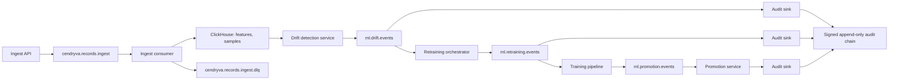

# Kafka-Driven Retraining: Event-Based ML Operations for Drift Response

**Audience:** ML platform engineers, data platform leads, MLOps practitioners, model risk officers, infrastructure architects
**Canonical URL:** `/whitepapers/kafka-driven-retraining-event-based-ml-operations/`
**Related papers:** Model drift detection in regulated environments; from model registry to production gate; Cendryva self-hosted ML observability; beyond MLflow
**Author:** Cendryva
**Published:** 2026-05-25
**Version:** 1.0
**License:** CC BY 4.0
**Contact:** research@cendryva.com

## Abstract

Drift detection is most often treated as an analytical reporting concern. A job runs, a number is computed, a chart updates, and a human is expected to notice. This works for low-stakes models and breaks for everything else. Drift signals that should trigger retraining, recalibration, promotion freezes, or rollbacks deserve to flow through the same kind of durable, ordered, replayable pipeline that handles every other operational event in a modern data platform.

This paper makes the case for treating ML drift response as an event-driven workflow on top of Kafka, with explicit topics, ordering guarantees, dead-letter handling, replay support, and audit linkage. It walks through the topology, the failure modes, and the operational properties that matter when a regulated ML system has to respond to drift without losing evidence.

It then describes how Cendryva uses Kafka as the spine for ingest and event-driven workflows, how drift detection emits structured events into the audit chain, and how the retraining orchestrator coordinates the work in a way an examiner can later reconstruct.

## Executive Summary

A useful event-driven retraining pipeline has six properties:

- **Topics are explicit and stable.** Producers know what they emit, consumers know what they accept, and schemas are versioned.
- **Ordering is preserved where it matters.** For a given tenant, model, and chain scope, events are processed in the order they were observed.
- **Backpressure is real.** Slow consumers do not silently drop events; they are throttled, queued, or dead-lettered with reason.
- **Replay is supported.** A bad consumer release can be rolled back and the events re-processed against a fixed version.
- **Dead-letter handling is first class.** Bad messages do not block the pipeline and do not silently disappear; they go to a documented topic with reason and source metadata.
- **Audit linkage is structural.** Every event that drives a state change, including drift detection, retraining trigger, promotion change, and rollback, lands in a signed audit chain.

When drift is treated as an event with these properties, the entire response workflow becomes inspectable: an examiner can ask what drift was detected, what triggered the retraining decision, what validation gates ran, who approved promotion, and what the rollback path looked like. Without the event pipeline, those answers are scattered across application logs and harder to reconstruct.

Cendryva uses Kafka as the event spine, ClickHouse for high-volume telemetry storage, Postgres for transactional metadata, and a signed audit chain for evidence. The retraining orchestrator is the workflow that ties them together.

## Why Events, Not Cron Jobs

A cron job that runs nightly and decides whether to retrain has three weaknesses that matter in regulated operations:

1. **It is invisible to other consumers.** Other systems that care about drift, model freeze, or rollback have to poll the same data or wait for the cron job's side effects.
2. **It is hard to replay.** If the cron logic was wrong, fixing the run requires re-deriving inputs from logs that may have been rotated.
3. **It has no natural backpressure or fan-out.** Adding a second consumer requires building a second job that fights for the same inputs.

An event stream solves all three. Multiple consumers can subscribe. Replay is a partition offset reset. Schema is enforced at the topic. Audit can be wired in as another consumer.

This is not a Kafka-specific argument. Any durable, ordered, partitioned event broker works. Kafka is named here because it is the most widely adopted choice in enterprise data platforms and the one Cendryva ships against.

## Topic Topology

A practical Kafka topology for ML operations has a small number of well-defined topics, not one giant firehose. A reasonable starting point:

| Topic | Producers | Consumers | Notes |
| -- | -- | -- | -- |
| `cendryva.records.ingest` | Application ingest API | Ingest consumers, ClickHouse writer | Operational metric ingest |
| `cendryva.records.ingest.dlq` | Ingest consumers | Operators, replay tooling | Dead letter for failed ingest |
| `ml.drift.events` | Drift detection service | Retraining orchestrator, audit sink, alerting | Drift events with model, feature, severity |
| `ml.promotion.events` | Promotion service | Audit sink, deployment automation | Model state transitions with approvals |
| `ml.retraining.events` | Retraining orchestrator | Audit sink, training pipeline | Retraining requests, completions, validations |
| `ml.rollback.events` | Promotion service | Audit sink, deployment automation | Rollback transitions with reason |

Each topic has a stable schema, a partitioning key chosen to preserve ordering where it matters (commonly tenant and model identifiers), and a documented retention policy. Schema evolution should go through a registry so consumers can rely on compatible reads.

## Ordering Where It Matters

Kafka preserves ordering within a partition, not across partitions. The choice of partition key is the most important design decision for ordering semantics.

For drift, retraining, and promotion events, the partition key should pin all events for a given tenant and model into the same partition. That guarantees a drift event, a retraining request, and a promotion change for the same model are processed in the order they were emitted. It also limits cross-model coupling so a slow consumer for one model does not block others.

For ingest, the partition key is usually a tenant-organization identifier, sometimes combined with a metric category, so per-tenant ingest stays ordered without forcing the entire workload through a single partition.

## Backpressure and Throughput

A serious pipeline has documented behavior when consumers fall behind:

- Consumer lag is monitored and alerted.
- Slow consumers either scale horizontally with additional partitions and consumer instances or throttle producers via explicit signals.
- Hot partitions are identified and re-keyed when one tenant dominates.
- Compaction is enabled on topics where only the latest state per key matters.
- Retention is set high enough to support replay during incidents and low enough to keep storage bounded.

The point is not to handle every event under all conditions. The point is to have explicit behavior under load, so failure modes are predictable.

## Dead-Letter Handling

Bad messages happen. A schema mismatch, an unexpected null, a corrupted payload, or a downstream service rejecting a record can all cause processing to fail. A robust pipeline never silently drops a bad message.

Practical dead-letter design:

- A dedicated DLQ topic per consumer family, not one global DLQ.
- DLQ messages include the original payload, the original topic and partition, the offset, the consumer identity, and the failure reason.
- Operators can inspect DLQ contents through tooling that does not require ad-hoc Kafka access.
- Replay tooling can re-emit DLQ messages to the original topic after a fix, with provenance metadata so the replay is auditable.

This is the difference between a pipeline that loses events and a pipeline that quarantines them with full context.

## Replay as an Operational Capability

Replay is the property that lets a team fix a bug in a consumer without losing data. Practical replay requires:

- Idempotent consumers, so re-processing the same event does not double-count.
- Deterministic side effects, or at least observable side effects that can be reconciled.
- Sufficient retention on source topics to cover the replay window.
- Operator tooling for resetting consumer offsets safely, with audit of the reset itself.

For ML operations, replay matters most after a drift detection logic change. A team that improves a drift threshold should be able to re-evaluate recent windows against the new rule rather than wait for the next natural window.

## Drift Event Schema

A drift event should be specific enough to drive automation and structured enough to land in an audit chain. A reasonable shape:

| Field | Purpose |
| -- | -- |
| `event_id` | Unique identifier for the event |
| `tenant_id` | Tenant scope |
| `model_id` | Model identifier |
| `model_version` | Version that was monitored |
| `feature_name` | Feature evaluated, where applicable |
| `window_kind` | Window type (e.g. rolling, fixed) |
| `window_start`, `window_end` | Time range evaluated |
| `baseline_id` | Reference to the approved baseline |
| `statistic` | KS, PSI, JS, etc. |
| `score` | Numeric drift score |
| `severity` | Informational, watch, warning, critical |
| `sample_size` | Production sample count |
| `audit_event_id` | Linkage to the audit row written for this event |

The audit row is its own record in the signed chain. The Kafka event lets other consumers act on the drift without rereading the audit table.

## Retraining as an Event-Driven Workflow

A retraining decision should never be a side effect of a chart. It should be an explicit event whose preconditions are clear and whose outputs are auditable.

A typical event flow:

1. Drift detection service reads production feature samples and the approved baseline, computes statistics, and emits a `drift.detected` event with severity.
2. Retraining orchestrator subscribes to drift events. For events with severity above a configured threshold, it inspects model risk tier, label availability, and recent retraining history.
3. If preconditions are met, the orchestrator emits a `retraining.requested` event. If not, it emits a `retraining.suppressed` event with reason.
4. Training pipeline subscribes to `retraining.requested`, runs training, and emits `retraining.completed` with validation metrics.
5. Promotion service evaluates validation results against gates. If approved, it emits `promotion.transitioned` to staging or production. If not, it emits `promotion.rejected` with reason.
6. Each event in the chain lands in the signed audit log. An examiner can later reconstruct the entire sequence by querying the audit chain for the model.

This is not a hypothetical pattern. It is a direct translation of the drift response workflow most regulated teams already do informally, made explicit and auditable.

## Validation Gates Belong Between Events

Automated retraining without validation gates is a fast way to ship a worse model. The event pipeline should treat each gate as its own state:

- Training completes, validation metrics are computed, and a `validation.evaluated` event is emitted with structured results.
- Promotion gates compare validation against the previous version, drift posture, and policy thresholds.
- Human approval gates, when required, are explicit events that block downstream consumers until approval is recorded.
- Rollback paths are first-class transitions, not the absence of a promotion.

The shape of the pipeline reflects the shape of the governance, which is what makes it useful in regulated environments.

## Industry Focus: Financial Services Fraud Models

A bank runs ML for transaction fraud scoring. Fraud tactics shift constantly. Drift detection on input features, score distributions, and override rates flags meaningful change. An event-driven pipeline can react quickly: a critical drift event freezes promotion to production, opens a retraining workflow with the latest labeled data, runs validation against held-out partitions, and surfaces results to a model risk reviewer before any new version reaches the production scoring path.

Every event in that chain is recorded in the audit log under SR 11-7 expectations. An examiner can later see what triggered the retraining, what validated, what was approved, and what was deployed.

## Industry Focus: Healthcare Clinical Operations

A health system runs ML for discharge prioritization. A facility-level drift signal can indicate a meaningful change in the patient population, a feature pipeline issue, or both. The drift event triggers a workflow that first inspects feature freshness and source-system health, then evaluates whether retraining is appropriate. If the issue is operational rather than model-level, the pipeline emits a `retraining.suppressed` event with reason and routes the work to data engineering instead. Either path is recorded in the audit chain so a clinical safety reviewer can reconstruct the decision.

## Architecture Pattern

The audit chain is fed by every consumer that produces a state change. The DLQ is fed by any consumer that fails to process. The event topics are the contract between services.

## How Cendryva Applies This Pattern

Cendryva uses Kafka as the spine for ingest and is structured so drift and retraining flow through the same event-driven discipline.

- **Kafka ingest.** `apps/api/src/services/ingest/kafka-ingest-consumer.ts` runs the consumer for the configurable `cendryva.records.ingest` topic. The producer side is in `apps/api/src/services/ingest/ingest-producer.ts`. ClickHouse is the default sink via `apps/api/src/db/clickhouse-metric-repository.ts`.
- **Dead-letter handling.** `apps/api/src/services/ingest/kafka-dead-letter-sink.ts` produces to a configurable DLQ topic, defaulting to `cendryva.records.ingest.dlq`. A Postgres dead-letter sink also exists, and a composite sink can write to both.
- **Ingest consumer service.** `apps/api/src/services/ingest/ingest-consumer.service.ts` wraps the consumer loop, dead-letter routing, and tracking. `apps/api/src/services/ingest/async-ingest.service.ts` and `apps/api/src/services/ingest/async-ingest.types.ts` define the queue message contract.
- **ClickHouse-backed feature samples.** `migrations/clickhouse/1709424028_add_feature_samples_table.sql` stores production samples by tenant, model, feature, and window. `apps/api/src/services/ml/clickhouse-feature-sample.loader.ts` is the production loader.
- **Drift detection emitting audit events.** `apps/api/src/services/ml/model-monitoring.service.ts` orchestrates the drift tests in `apps/api/src/services/ml/drift-statistics.ts` and emits to the audit chain through `apps/api/src/services/ml/audit-log.audit-sink.ts`. The factory at `apps/api/src/services/ml/model-monitoring.factory.ts` wires the production path.
- **Retraining orchestrator.** The Rust orchestrator at `src/rms/retrain_orchestrator.rs` defines trigger types (`ScheduledWeekly`, `ScheduledMonthly`, `DriftDetected`, `PsiExceeded`, `Manual`), training coordination, A/B evaluation hooks, and promotion or rollback logic.
- **Retraining policy.** The TypeScript policy at `apps/api/src/services/ml/model-retraining.service.ts` evaluates whether retraining should start given trigger type, samples since last train, and drift score.
- **Promotion as an audited transition.** `apps/api/src/services/ml/model-promotion.service.ts` implements the FSM; each transition writes a signed audit row through the WORM audit chain in `migrations/postgres/V002__Audit_Trail_And_Logs.sql`.

The Cendryva pattern is not a fully event-sourced retraining workflow yet (some transitions are direct service calls rather than topic-mediated handoffs), but the ingest spine, the drift-to-audit linkage, and the dead-letter discipline are in place and ship today.

## Implementation Checklist

A team building event-driven ML operations on Kafka should be able to evidence:

- Each topic has a documented schema, partitioning strategy, and retention policy.
- Partition keys preserve ordering for tenant-and-model scopes that matter.
- Consumer lag is monitored and alerted.
- A DLQ topic exists per consumer family with structured failure metadata.
- Replay tooling can reset offsets safely and audit the reset.
- Drift events are emitted with severity and audit linkage.
- Retraining decisions are explicit events, not implicit cron side effects.
- Promotion and rollback are first-class state transitions, each producing an audit event.
- All state-change events land in the signed audit chain.

## Conclusion

Event-driven ML operations are not exotic. They are the same discipline data platform teams already apply to every other operational workflow, applied to the ML lifecycle. When drift, retraining, validation, promotion, and rollback are explicit events on durable topics, the entire workflow becomes inspectable and replayable. When they are scattered across cron jobs and notebooks, they become hard to operate and impossible to audit.

The pattern is independent of the broker. Kafka is the most widely adopted choice, and Cendryva ships against it, but any durable, ordered, partitioned broker would work. What matters is the discipline: topics over jobs, events over side effects, DLQ over silent drops, replay over re-derivation, and audit linkage over reconstruction from logs.

## Implementation Status

This section maps the Cendryva claims above to the codebase as of the publication date.

**Kafka ingest pipeline** - SHIPPED
- Code: `apps/api/src/services/ingest/kafka-ingest-consumer.ts`, `apps/api/src/services/ingest/ingest-producer.ts`, `apps/api/src/services/ingest/ingest-consumer.service.ts`, `apps/api/src/services/ingest/async-ingest.service.ts`, `apps/api/src/services/ingest/async-ingest.types.ts`.

**Kafka dead-letter sink** - SHIPPED
- Code: `apps/api/src/services/ingest/kafka-dead-letter-sink.ts`. ClickHouse DLQ schema in `migrations/clickhouse/1709424008_add_kafka_dead_letter_queue.sql`. Postgres dead-letter sink also available via `apps/api/src/services/ingest/postgres-ingest-stores.test.ts` companion service.

**Drift detection emitting audit events** - SHIPPED
- Code: `apps/api/src/services/ml/model-monitoring.service.ts`, `apps/api/src/services/ml/drift-statistics.ts`, `apps/api/src/services/ml/audit-log.audit-sink.ts`, `apps/api/src/services/ml/model-monitoring.factory.ts`.
- Schema: `migrations/clickhouse/1709424028_add_feature_samples_table.sql`.

**Rust retraining orchestrator** - SHIPPED
- Code: `src/rms/retrain_orchestrator.rs` with trigger enum, training coordination scaffolding, A/B evaluation hooks, and promotion or rollback decision logic.

**Retraining policy evaluation** - SHIPPED
- Code: `apps/api/src/services/ml/model-retraining.service.ts`.

**Promotion FSM with audit linkage** - SHIPPED
- Code: `apps/api/src/services/ml/model-promotion.service.ts`, `apps/api/src/services/ml/data-client-promotion.repository.ts`, `apps/api/src/services/ml/model-promotion.factory.ts`.
- Schema: `migrations/postgres/V006__ML_Schema_And_RLS.sql`.

**Fully event-sourced retraining handoff topics** - PARTIAL
- Today, drift detection writes audit events and the retraining policy is callable from API and worker contexts. Dedicated `ml.drift.events`, `ml.retraining.events`, and `ml.promotion.events` topics with cross-service consumers are DEFERRED. The current shipping path uses ingest topics for telemetry and direct service calls plus the audit chain for state changes.

**Schema registry integration** - DEFERRED
- A dedicated schema registry (e.g. Confluent Schema Registry or equivalent) is not yet wired. Topic schemas are defined in TypeScript types and Rust structs at the producer and consumer sides.

## Scope and Limitations

This is a vendor-authored paper from Cendryva. It is intended for engineers and architects designing event-driven ML operations on Kafka or a similar broker. It is not a Kafka tutorial, a broker comparison, or a substitute for the official Kafka documentation.

In scope: an event-driven pattern for ML drift response, retraining, and promotion; partitioning, ordering, backpressure, dead-letter, and replay properties; and a reference description of how Cendryva uses Kafka as an ingest and event spine.

Out of scope: detailed Kafka configuration guidance, cluster sizing, comparison against alternative brokers (Pulsar, RabbitMQ, Pub/Sub, Kinesis), schema evolution strategies for any specific registry, and prescriptive training pipeline design.

This paper is not legal, regulatory, model risk, or audit advice. Engage qualified counsel and risk owners before treating any pattern in this paper as a compliance prescription.

Empirical claims about Cendryva are limited to the file paths cited in the Implementation Status section, valid as of the publication date in the header.

## References and Further Reading

### Streaming systems

- Apache Software Foundation. *Apache Kafka Documentation*. https://kafka.apache.org/documentation/
- Kleppmann, Martin. *Designing Data-Intensive Applications*. O'Reilly, 2017.
- Confluent. *Schema Registry Documentation*. https://docs.confluent.io/platform/current/schema-registry/index.html

### MLOps and operations

- Google Cloud. *MLOps: Continuous delivery and automation pipelines in machine learning*. https://cloud.google.com/architecture/mlops-continuous-delivery-and-automation-pipelines-in-machine-learning
- Sculley, D., et al. *Hidden Technical Debt in Machine Learning Systems*. NeurIPS 2015.

### Drift and lifecycle

- Gama, J., Zliobaite, I., Bifet, A., Pechenizkiy, M., and Bouchachia, A. *A survey on concept drift adaptation*. ACM Computing Surveys, Vol. 46, Issue 4, Article 44, 2014.
- NIST. *Artificial Intelligence Risk Management Framework (AI RMF 1.0)*. 2023. https://www.nist.gov/itl/ai-risk-management-framework

### Governance

- Board of Governors of the Federal Reserve System and Office of the Comptroller of the Currency. *Supervisory Guidance on Model Risk Management (SR Letter 11-7 / OCC Bulletin 2011-12)*. 2011. https://www.federalreserve.gov/supervisionreg/srletters/sr1107.htm

### Related Cendryva whitepapers

- *Model drift detection in regulated environments*.
- *From model registry to production gate*.
- *Cendryva self-hosted ML observability*.
- *Beyond MLflow: production monitoring, drift detection, and auditability*.
