# Learning Operations Observability for Education and Workforce Training

**Audience:** Higher education leaders, workforce training providers, corporate learning teams, student success teams, education technology leaders, data governance teams  
**Canonical URL:** `/whitepapers/learning-operations-student-success-observability/`  
**Related papers:** The 12-Condition Framework; real-time statistical monitoring for live operations; Cendryva self-hosted ML observability; HIPAA-ready ML decision logs  
**Author:** Cendryva  
**Published:** 2026-05-25  
**Version:** 1.0  
**License:** CC BY 4.0
**Contact:** research@cendryva.com

## Abstract

Education and workforce training organizations increasingly depend on data to improve learner outcomes, program quality, retention, credential completion, instructor support, and operational efficiency. Learning management systems, advising platforms, assessments, attendance tools, coaching workflows, career services, and employer feedback systems all produce signals. The challenge is turning those signals into responsible action.

Learning analytics cannot stop at dashboards. Student success and workforce development programs need timely indicators, privacy-aware data handling, decision evidence, intervention tracking, and a shared language for when a cohort, course, learner group, or program needs attention.

This paper explains how learning operations observability can support colleges, bootcamps, apprenticeships, workforce boards, and corporate training organizations. It also explains how Cendryva helps turn learning signals into conditions, interventions, evidence, and improvement loops.

## Executive Summary

Learning organizations are under pressure to improve outcomes while managing privacy, equity, resource constraints, and program complexity. Teams need to know:

- Which learners or cohorts are falling behind?
- Which courses, instructors, modules, or assessments show abnormal patterns?
- Which signals are stale, incomplete, or unreliable?
- Which interventions were recommended, delivered, and effective?
- Which programs are improving, degrading, or persistently underperforming?
- Can advisors, instructors, and administrators see the same operational truth?
- Can the organization preserve evidence without over-collecting learner data?

Cendryva provides an observability layer for learning operations. It combines event ingestion, metric governance, privacy-aware signal design, statistical monitoring, 12-Condition classification, intervention logs, and outcome tracking so education and training teams can move from scattered dashboards to coordinated support.

## Why Learning Analytics Needs an Operations Layer

Learning analytics is often described as action-oriented: data should inform support, intervention, curriculum improvement, and institutional decisions. But many analytics programs struggle because the signal does not connect cleanly to action.

Common failure modes:

- dashboards show risk but do not assign ownership
- advisors receive alerts without context
- interventions are not logged consistently
- data freshness is unclear
- privacy constraints are handled after the fact
- instructors and administrators use different definitions
- program leaders cannot distinguish noise from real degradation
- outcomes are reviewed too late to help current learners

Learning operations observability closes this gap. It treats learner-support signals as operational signals with owners, thresholds, evidence, and response workflows.

## Industry Focus: Higher Education Student Success

Colleges and universities use analytics to support retention, progression, course completion, advising, financial aid outreach, and student wellbeing workflows. These efforts involve sensitive education records and require thoughtful governance.

Useful signals include:

- attendance or participation patterns
- LMS login and activity cadence
- assignment submission timeliness
- assessment performance trends
- course withdrawal risk
- advising appointment status
- financial aid task completion
- registration holds
- degree progress
- support service referrals
- instructor feedback patterns

Cendryva can help institutions classify these signals into operational conditions. A course section may be NORMAL, a cohort may be BELOW_NORMAL, a critical advising feed may be in NON_EXISTENCE, or a retention intervention may show POWER_CHANGE after a new support model.

The benefit is coordination. Advisors, faculty, program leaders, and administrators can work from a shared condition language while still seeing the underlying evidence and respecting access boundaries.

## Industry Focus: Workforce Training and Apprenticeships

Workforce training programs need to track progress from enrollment to credential to employment. Learners may move through classroom training, online modules, hands-on assessments, employer placements, coaching sessions, and certification exams.

Operational signals include:

- module completion
- skills assessment readiness
- credential exam pass rates
- attendance and punctuality
- coaching touchpoints
- employer placement status
- equipment or lab utilization
- cohort completion rate
- job placement outcomes
- post-placement retention

Cendryva helps training providers connect these signals to action. If a cohort's lab attendance falls into DANGER, the system can route the condition to the program manager. If credential readiness enters POWER_CHANGE after a curriculum adjustment, leaders can preserve and scale that pattern.

## Industry Focus: Corporate Learning and Compliance Training

Corporate learning teams manage onboarding, compliance training, role-based certifications, sales enablement, safety training, and leadership development. Failure to complete training can create operational, regulatory, customer, or safety risk.

Signals include:

- onboarding completion by role
- mandatory training overdue rate
- certification expiration risk
- assessment failure clusters
- manager approval delays
- training content engagement
- regional completion variance
- incident rate after training
- refresher requirement status

Cendryva gives corporate learning teams a way to monitor learning operations like a business-critical system. Instead of reporting completion after the deadline, teams can detect DANGER conditions early, identify the affected groups, route response to owners, and preserve evidence of remediation.

## Privacy-Aware Signal Design

Education data can be sensitive. In the United States, FERPA gives parents and eligible students rights related to access, amendment, and disclosure control for education records. Other jurisdictions and institutional policies may impose additional obligations.

Learning operations observability should apply privacy-aware design:

- collect only signals needed for a defined support or operational purpose
- separate direct identifiers from analytical metrics where practical
- restrict access by role and purpose
- log access to sensitive records
- avoid unnecessary free-text exposure
- preserve intervention evidence without over-collecting learner details
- define retention by signal type
- document data definitions and governance owners

Cendryva supports this approach by separating raw events, metric summaries, decision/intervention records, and access-controlled views. The goal is useful observability without turning every learner interaction into broadly visible surveillance data.

## From Risk Scores to Conditions

Learning analytics often produces risk scores. Scores can be useful, but they are not always actionable. A risk score needs context:

- Is the score based on fresh data?
- Is the model valid for this learner population?
- What action should be taken?
- Who owns that action?
- Was the intervention completed?
- Did the outcome improve?

Cendryva's 12-Condition Framework turns scores and metrics into operational conditions:

| Condition     | Learning operations interpretation                     |
| ------------- | ------------------------------------------------------ |
| POWER         | Exceptional progress or improvement                    |
| AFFLUENCE     | Strong performance above expected range                |
| NORMAL        | Learner, cohort, or program within expected range      |
| BELOW_NORMAL  | Mild underperformance or engagement decline            |
| DANGER        | Material risk requiring owner review                   |
| EMERGENCY     | Immediate support or escalation required               |
| NON_EXISTENCE | Required signal, record, or activity missing           |
| DOUBT         | Data quality or confidence too low for action          |
| CHANGE        | Significant shift in progress or engagement            |
| POWER_CHANGE  | Rapid positive improvement                             |
| LIABILITY     | Persistent program drag or unresolved operational debt |
| ABUNDANCE     | Excess capacity or support resource availability       |

This gives advisors, instructors, and operators a shared language for response without hiding the underlying metric.

## Intervention Logs and Evidence

A learning signal is only useful if it leads to action. Intervention logs should record:

- signal or condition that triggered review
- learner, cohort, course, or program context
- owner assigned
- recommended intervention
- action taken
- date and channel
- learner response where appropriate
- outcome or follow-up state
- reason for closure
- access and modification history

This evidence helps teams improve support models. It also prevents analytics from becoming a one-way alert stream where no one knows what happened after the warning.

## Freshness and Data Quality

Learning systems often integrate many sources: LMS, SIS, CRM, attendance tools, assessment platforms, employer systems, and support workflows. If one feed is stale, analytics can become misleading.

Freshness monitoring should track:

- last update by source
- expected update frequency
- missing sections, cohorts, or learners
- schema changes
- duplicate records
- delayed grade or completion data
- integration failures

Cendryva treats stale and missing signals as operational conditions. If an LMS feed stops updating, the platform can classify the affected analytics as NON_EXISTENCE or DOUBT instead of allowing teams to act on stale risk signals.

## Architecture Pattern

```mermaid
flowchart LR
  Sources[LMS, SIS, assessments, coaching, employer systems] --> Ingest[Ingestion and normalization]
  Ingest --> Governance[Privacy and access controls]
  Governance --> Metrics[Learning metrics]
  Metrics --> Conditions[Condition classification]
  Conditions --> Workflows[Advisor and program workflows]
  Workflows --> Interventions[Intervention logs]
  Interventions --> Outcomes[Outcome tracking]
  Outcomes --> Improvement[Program improvement loop]
```

This pattern keeps analytics connected to intervention and improvement. Cendryva provides the operating layer across ingestion, metrics, conditions, workflows, evidence, and outcomes.

## What Cendryva Delivers

For education and workforce training, Cendryva delivers:

- privacy-aware signal design
- self-hosted deployment options for sensitive learner data
- event and metric ingestion from learning systems
- data freshness and missing-signal detection
- 12-Condition classification for learner, cohort, course, and program signals
- intervention logs and decision evidence
- role-based operational views
- trend and outcome monitoring
- model drift monitoring where predictive analytics are used
- executive summaries for program health

The value is practical: Cendryva helps learning organizations detect problems early, coordinate support, preserve evidence of action, and improve programs without turning analytics into disconnected dashboards or opaque risk scores.

## Implementation Checklist

Learning organizations adopting observability should define:

- critical learner, cohort, course, and program signals
- privacy and access rules by role
- data minimization rules
- source freshness expectations
- metric definitions and owners
- condition thresholds
- intervention playbooks
- escalation paths
- evidence retention rules
- outcome measures
- equity and bias review process
- predictive model monitoring requirements
- governance review cadence

## Conclusion

Education and workforce training organizations do not need more disconnected dashboards. They need an operating layer that turns learning signals into responsible action.

Learning operations observability connects analytics, privacy, conditions, interventions, and outcomes. It helps teams see which learners, cohorts, courses, or programs need attention and whether support actions are working.

Cendryva brings this pattern into one platform. It gives learning organizations a way to monitor program health, coordinate support, preserve decision evidence, and improve outcomes while respecting the governance expectations that come with learner data.

## Scope and Limitations

This is a vendor-authored paper from Cendryva. It is intended as a practitioner reference for learning operations, student success, and workforce training leaders evaluating observability patterns. It is not independent academic research and it is not endorsed by any regulator, accreditor, or standards body.

In scope: signal design, condition classification, intervention logging, data freshness, and operating workflows for learner, cohort, course, and program signals across higher education, workforce training, apprenticeships, and corporate learning.

Out of scope: detailed curriculum design, pedagogy guidance, specific predictive model architectures, accessibility audits, vendor-by-vendor LMS or SIS comparisons, and admissions or financial aid eligibility decisioning.

This paper is not legal, regulatory, accreditation, or privacy compliance advice. Privacy obligations such as FERPA (20 U.S.C. 1232g and 34 CFR Part 99) apply primarily in the United States. Institutions operating in other jurisdictions are subject to different regimes (for example, GDPR in the European Union, PIPEDA in Canada, or state-level student data privacy laws). Consult qualified counsel and your institutional research, privacy, and compliance offices before adopting any signal, threshold, or intervention pattern described here.

Regulations, accreditor expectations, and learning analytics standards evolve. References reflect publicly available sources at the publication date in the metadata above. Re-check current versions before relying on any specific rule, standard, or threshold.

Empirical statements about benefits, condition severity, and intervention impact are illustrative. They describe patterns Cendryva has observed in design discussions and reference deployments. They are not controlled-trial outcomes and should not be cited as measured improvements without organization-specific evaluation.

## References and Further Reading

Privacy and student records (United States)

- U.S. Department of Education. *Family Educational Rights and Privacy Act (FERPA)*. 20 U.S.C. 1232g; 34 CFR Part 99. https://www2.ed.gov/policy/gen/guid/fpco/ferpa/index.html
- U.S. Department of Education, Privacy Technical Assistance Center (PTAC). *Resources and guidance for protecting student privacy*. https://studentprivacy.ed.gov/
- National Institute of Standards and Technology. *NIST SP 800-171: Protecting Controlled Unclassified Information in Nonfederal Systems and Organizations*. Revision 2, 2020.

Learning analytics and interoperability

- IMS Global Learning Consortium (1EdTech). *Caliper Analytics Specification*. https://www.imsglobal.org/activity/caliper
- ADL Initiative. *Experience API (xAPI) Specification*. https://adlnet.gov/projects/xapi/
- EDUCAUSE. *A Framework for Student Success Analytics*. 2022. https://library.educause.edu/resources/2022/5/a-framework-for-student-success-analytics

Reporting, quality, and accreditation

- U.S. Department of Education, National Center for Education Statistics. *Integrated Postsecondary Education Data System (IPEDS)*. https://nces.ed.gov/ipeds/
- Quality Matters. *QM Higher Education Rubric*. https://www.qualitymatters.org/qa-resources/rubric-standards

Observability and privacy frameworks

- OpenTelemetry. *OpenTelemetry Documentation*. https://opentelemetry.io/docs/
- National Institute of Standards and Technology. *NIST Privacy Framework, Version 1.0*. 2020. https://www.nist.gov/privacy-framework
