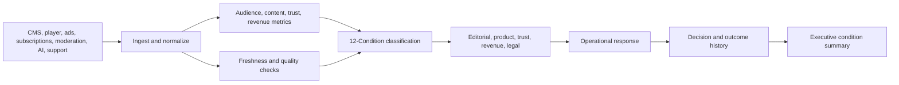

# Board Memo: Observability for Media, Publishing, and Creator Platform Operations

**Format:** Board memo  
**Audience:** Media executives, publishing leaders, creator platform operators, trust and safety leaders, product leaders, revenue operations teams  
**Canonical URL:** `/whitepapers/media-publishing-creator-platform-operations-board-memo/`  
**Related papers:** Security and fraud operations observability; customer support and contact center AI operations; the 12-Condition Framework; Cendryva self-hosted ML observability  
**Author:** Cendryva  
**Published:** 2026-05-25  
**Version:** 1.0  
**License:** CC BY 4.0
**Contact:** research@cendryva.com

## Memo Summary

Media, publishing, and creator platforms are operationally complex. They depend on content pipelines, recommendation systems, moderation queues, creator payouts, ad delivery, audience analytics, rights management, accessibility, subscription conversion, and customer support. Each area has dashboards, but leadership often lacks a unified operating view.

The strategic risk is not only content performance. It is operational opacity: leaders cannot always see when recommendation quality shifts, moderation queues degrade, audience measurement changes, rights workflows stall, revenue signals diverge, or AI-assisted content systems behave unexpectedly.

Cendryva provides an observability layer for media operations. It turns content, audience, trust, revenue, and platform signals into conditions, routes response to owners, preserves decision evidence, and gives executives a cross-functional view of operational health.

## Board-Level Question

Can the company prove that its content, recommendation, moderation, monetization, and creator operations are healthy, accountable, and improving?

If not, the company is exposed to:

- audience trust degradation
- creator dissatisfaction
- moderation backlog
- ad measurement disputes
- recommendation quality drift
- content rights exceptions
- accessibility gaps
- subscriber churn
- revenue leakage
- AI governance risk

## Executive Risk Map

| Risk area              | Early warning signal                                       | Cendryva operating response                                            |
| ---------------------- | ---------------------------------------------------------- | ---------------------------------------------------------------------- |
| Recommendation quality | Engagement shift, complaint spike, cohort drift            | Model/version traceability, drift monitoring, condition classification |
| Moderation backlog     | Queue age, appeal volume, policy override rate             | DANGER/EMERGENCY routing and response evidence                         |
| Creator health         | Payout delay, upload failure, support escalation           | Condition history by creator segment                                   |
| Audience measurement   | Missing events, tracking change, ad discrepancy            | Freshness and DOUBT classification                                     |
| Subscription revenue   | Conversion drop, cancel spike, payment issue               | Signal correlation across product, billing, and support                |
| Rights and licensing   | Asset clearance delay, takedown exception                  | Workflow evidence and owner routing                                    |
| Accessibility          | Caption delay, transcript gap, player errors               | NON_EXISTENCE and DANGER conditions                                    |
| AI-assisted content    | Prompt/version change, quality complaint, policy exception | Decision logs, version traceability, governance evidence               |

## Operating Area 1: Content Pipeline Health

Content operations include editorial planning, production, ingestion, transcoding, metadata, review, publishing, distribution, and archive. Problems can hide inside handoffs.

**Signals to monitor**

- ingest success rate
- transcoding latency
- metadata completeness
- editorial review backlog
- publishing delay
- asset availability
- rights clearance status
- localization readiness
- caption and transcript status
- distribution errors

**Cendryva value**

Cendryva classifies pipeline states across teams. A caption feed can be NON_EXISTENCE. A publishing delay can be DANGER. A recurring metadata gap can become LIABILITY. Leadership can see which operational constraint is blocking release quality or schedule.

## Operating Area 2: Recommendation and Personalization Oversight

Recommendation systems shape audience experience, creator exposure, inventory performance, and platform trust. They can drift because content mix, user behavior, seasonality, product changes, or model updates change the operating environment.

**Signals to monitor**

- recommendation click-through
- watch/read completion
- creator exposure distribution
- cold-start performance
- cohort engagement
- complaint or hide rate
- diversity and repetition signals
- model version
- ranking feature freshness
- downstream subscription or retention impact

**Cendryva value**

Cendryva connects recommendation metrics to model version, feature freshness, drift signals, and decision history. A sudden cohort engagement shift can become CHANGE. A harmful quality shift can become DANGER. A stale feature source can become DOUBT before the algorithm is blamed incorrectly.

## Operating Area 3: Moderation and Trust Operations

Trust operations combine policy, machine learning, human review, appeals, enforcement, safety signals, and creator/community support. The problem is often not detection alone; it is queue health and decision accountability.

**Signals to monitor**

- moderation queue age
- policy category volume
- appeal rate
- reversal rate
- reviewer disagreement
- automated enforcement rate
- repeat violation patterns
- escalation time
- creator support contacts
- policy update lag

**Cendryva value**

Cendryva helps trust teams distinguish normal load from system degradation. A policy queue can move into DANGER. A reversal-rate spike can indicate DOUBT. A chronic queue can become LIABILITY. Decision logs preserve what rule, model, or reviewer action led to enforcement.

## Operating Area 4: Revenue and Advertising Operations

Media monetization depends on subscriptions, advertising, sponsorship, commerce, affiliate revenue, creator revenue share, and campaign performance. Measurement disputes and missing signals can quickly become commercial problems. IAB guidance emphasizes common language and measurement consistency across advertising workflows.

**Signals to monitor**

- ad delivery success
- impression discrepancy
- fill rate
- campaign pacing
- viewability or completion signal
- subscription conversion
- churn signal
- payment failure
- creator payout status
- revenue per session

**Cendryva value**

Cendryva turns revenue operations into monitored conditions. A payment processor feed can become NON_EXISTENCE. Campaign pacing can become BELOW_NORMAL or DANGER. A creator payout issue can become EMERGENCY for high-impact segments. Evidence remains available for sales, finance, creator, and operations teams.

## Operating Area 5: AI-Assisted Editorial and Production

Media teams increasingly use AI for tagging, summarization, transcription, translation, content recommendations, moderation assistance, image generation, title testing, and production workflows. NIST AI RMF highlights the need to govern, measure, and manage AI risk across the lifecycle.

**Signals to monitor**

- model or prompt version
- quality review outcome
- correction rate
- policy exception
- hallucination or factuality flag
- editor override
- accessibility output quality
- localization error rate
- user complaint
- production time saved

**Cendryva value**

Cendryva traces AI-assisted decisions and outputs to version, workflow, review, and downstream action. This gives editorial, legal, product, and trust teams evidence when AI systems improve productivity or create risk.

## Condition Model for Media Operations

| Condition     | Media operations interpretation                                          |
| ------------- | ------------------------------------------------------------------------ |
| POWER         | Exceptional content, revenue, or workflow improvement                    |
| AFFLUENCE     | Strong favorable operating state                                         |
| ABUNDANCE     | Excess capacity or inventory                                             |
| NORMAL        | Within expected operating range                                          |
| BELOW_NORMAL  | Early degradation or weaker-than-expected performance                    |
| DANGER        | Material audience, trust, revenue, or workflow risk                      |
| EMERGENCY     | Immediate customer, creator, legal, or platform risk                     |
| NON_EXISTENCE | Missing signal, asset, feed, caption, evidence, or rights record         |
| DOUBT         | Low-confidence, conflicting, or incomplete evidence                      |
| CHANGE        | Rapid shift in audience, recommendation, moderation, or revenue behavior |
| POWER_CHANGE  | Rapid improvement after product, editorial, or operational change        |
| LIABILITY     | Chronic backlog, quality gap, rights issue, or revenue leakage           |

## Cendryva Board View

## What Cendryva Delivers

For media, publishing, and creator platforms, Cendryva delivers:

- content pipeline observability
- recommendation and personalization monitoring
- moderation queue and decision evidence
- audience and revenue signal monitoring
- source freshness and missing-feed detection
- AI model and prompt traceability
- 12-Condition classification
- rights, accessibility, and workflow exception tracking
- owner routing and playbook support
- executive health summaries
- self-hosted deployment options for sensitive operations

The value is executive clarity: Cendryva helps leaders see where the platform is healthy, where trust or revenue is at risk, which teams own response, and what evidence proves the organization acted.

## Board Actions to Request

1. Establish a cross-functional media operations signal inventory.
2. Define owner and threshold for each critical signal.
3. Require freshness monitoring for audience, revenue, moderation, and rights feeds.
4. Connect recommendation and AI-assisted workflows to version traceability.
5. Build condition-based executive summaries.
6. Preserve decision evidence for trust, legal, revenue, and creator-impact workflows.

## Scope and Limitations

This is a vendor-authored board memo from Cendryva. It is written for media, publishing, and creator platform executives weighing whether to adopt cross-functional operational observability. It is not independent research, an investment recommendation, or an endorsement by any standards body or regulator.

In scope: operating signal design across content pipelines, recommendation and personalization systems, trust and safety operations, advertising and subscription revenue, and AI-assisted editorial workflows. It addresses condition-based monitoring, ownership routing, and decision evidence.

Out of scope: editorial policy choices, specific content moderation taxonomies, ad-tech bidding mechanics, recommendation algorithm design, copyright dispute resolution, and platform-specific monetization tactics.

This memo is not legal, regulatory, or trust and safety compliance advice. Platform obligations vary significantly by jurisdiction. Examples include the EU Digital Services Act, the UK Online Safety Act, Section 230 of the U.S. Communications Decency Act, and emerging child-safety and AI transparency rules in multiple regions. Engage qualified counsel and your trust, legal, privacy, and policy teams before adopting any signal, threshold, or enforcement workflow described here.

Trust and safety regulation, content authenticity standards, and ad measurement standards continue to evolve. References reflect publicly available sources at the publication date in the metadata above. Re-check current versions before relying on any specific rule or standard.

Empirical statements about operational benefit, condition severity, and revenue or trust impact are illustrative patterns drawn from design discussions and reference deployments. They are not audited outcomes and should not be cited as measured results without organization-specific evaluation.

## References and Further Reading

Platform regulation and intermediary liability

- European Parliament and Council. *Regulation (EU) 2022/2065 on a Single Market For Digital Services (Digital Services Act)*. 2022. https://eur-lex.europa.eu/eli/reg/2022/2065/oj
- UK Parliament. *Online Safety Act 2023*. https://www.legislation.gov.uk/ukpga/2023/50/contents
- U.S. Congress. *Communications Decency Act, Section 230*. 47 U.S.C. 230.

Trust, safety, and content authenticity

- Trust and Safety Professional Association. *TSPA resources and curriculum*. https://www.tspa.org/
- Coalition for Content Provenance and Authenticity (C2PA). *C2PA Technical Specification*. https://c2pa.org/specifications/
- Content Authenticity Initiative. *CAI documentation*. https://contentauthenticity.org/

Advertising and audience measurement

- Interactive Advertising Bureau. *IAB Standards and Guidelines*. https://www.iab.com/guidelines/
- Media Rating Council. *MRC Measurement Standards*. https://mediaratingcouncil.org/

Observability, AI governance, and trust services

- OpenTelemetry. *OpenTelemetry Documentation*. https://opentelemetry.io/docs/
- National Institute of Standards and Technology. *AI Risk Management Framework (AI RMF 1.0)*. 2023. https://www.nist.gov/itl/ai-risk-management-framework
- American Institute of Certified Public Accountants (AICPA). *SOC 2 Trust Services Criteria*. https://www.aicpa-cima.com/topic/audit-assurance/audit-and-assurance-greater-than-soc-2

Accessibility

- World Wide Web Consortium. *Media Accessibility User Requirements (MAUR)*. https://www.w3.org/TR/media-accessibility-reqs/
