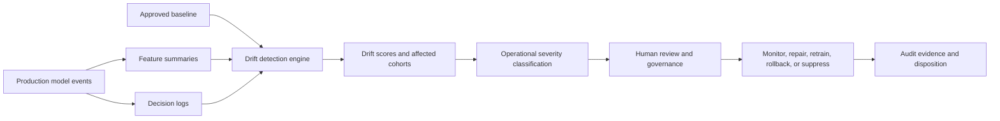

# Model Drift Detection in Regulated Environments

**Audience:** Insurance analytics leaders, supply-chain risk teams, ML platform teams, model risk leaders, compliance and operations stakeholders  
**Canonical URL:** `/whitepapers/model-drift-detection-regulated-ai/`  
**Related papers:** Cendryva self-hosted ML observability; HIPAA-ready ML decision logs; sub-5ms inference at scale; the 12-Condition Framework  
**Author:** Cendryva  
**Published:** 2026-05-25  
**Version:** 1.0  
**License:** CC BY 4.0
**Contact:** research@cendryva.com

## Abstract

Machine learning models are trained on historical data, but they operate in changing environments. Claim patterns shift, catastrophe seasons change, supplier reliability moves, fraud tactics adapt, shipping lanes are disrupted, source systems are replaced, and user behavior responds to the model itself. These changes can degrade model performance even when infrastructure appears healthy.

Model drift detection is the discipline of identifying meaningful changes between the data and behavior a model was validated on and the data and behavior it sees in production. In regulated environments, drift is not only a technical concern. It is an operational risk, a governance trigger, and sometimes a safety or compliance concern.

This paper explains a practical drift detection framework for regulated AI systems, including baseline design, statistical tests such as KS-statistic and PSI, operational thresholds, alert triage, decision logging, retraining triggers, and governance controls.

## Executive Summary

Regulated organizations need to know when an AI system no longer operates under the assumptions used to approve it. A model can become unreliable because:

- input feature distributions change
- target relationships change
- labels become delayed or unreliable
- feature pipelines become stale
- data quality degrades
- user behavior changes in response to predictions
- new subpopulations enter the production environment
- external conditions change the meaning of historical patterns

Drift detection provides early warning. It does not prove a model is wrong, and it does not automatically justify retraining. It creates an evidence-based signal that the model, data, workflow, or operating context needs review.

For regulated teams, a drift program should include:

- documented baselines
- feature-level and model-level monitoring
- statistically defensible tests
- operational thresholds and severity levels
- human review paths
- model version and decision-log linkage
- retraining, rollback, or suppression procedures
- evidence retention for audits and incident review

Cendryva turns drift detection into an operating workflow, not just a statistical chart. It connects drift signals to model versions, feature freshness, decision logs, affected cohorts, condition severity, and review actions so insurance and supply-chain teams can decide whether to monitor, repair, recalibrate, retrain, rollback, or route work to human review.

## Drift Is a Lifecycle Risk

AI risk does not end at deployment. The NIST AI Risk Management Framework emphasizes that AI systems should be measured, monitored, documented, and managed across their lifecycle. In insurance, logistics, and supply-chain environments, real-world performance can change as weather patterns, vendor behavior, claim mix, transport constraints, pricing assumptions, and macroeconomic conditions evolve.

The same pattern appears across regulated sectors. A claim triage model approved during a stable period may behave differently during a catastrophe season. A vendor risk model may degrade when a new supplier network changes lead-time patterns. A fraud model may lose sensitivity when adversaries adapt.

The core governance question is simple: is the model still operating in the environment it was approved for?

## Types of Drift

### Data Drift

Data drift occurs when the distribution of model inputs changes. For example, a feature representing claim severity, supplier lead time, shipment route, geographic mix, repair cost, or device signal may differ from the training or validation baseline.

Data drift can happen without immediate performance degradation, but it indicates that the model is seeing a different population or context.

### Concept Drift

Concept drift occurs when the relationship between inputs and outcomes changes. A feature may have predicted risk accurately in the past but become less predictive because behavior, policy, supply constraints, fraud tactics, weather exposure, or market conditions changed.

Concept drift is harder to detect because true labels are often delayed or incomplete.

### Prediction Drift

Prediction drift occurs when model outputs change distribution. A risk model may suddenly produce more high-risk classifications, a prioritization model may compress scores into a narrow band, or a recommendation system may route far more cases to manual review.

Prediction drift can be detected even before ground-truth labels arrive.

### Performance Drift

Performance drift occurs when measured accuracy, precision, recall, calibration, false positive rate, false negative rate, or business outcome metrics degrade. This is often the most important form of drift, but it may be delayed because labels and outcomes arrive later.

### Operational Drift

Operational drift occurs when model behavior changes because of system conditions rather than the underlying data distribution. Examples include stale features, missing upstream feeds, latency spikes, retry storms, schema changes, or partial outages.

In regulated environments, operational drift can be just as serious as statistical drift because the model may still return outputs while relying on degraded context.

## Baseline Design

Drift monitoring starts with a baseline. A weak baseline produces noisy alerts, missed degradation, or false confidence.

A useful baseline should specify:

- the time window used for comparison
- the population or cohort represented
- feature definitions and transformations
- model version and validation dataset
- label availability and expected delay
- known seasonality
- expected ranges by tenant, site, region, or business unit
- exclusion rules for incomplete or low-quality records
- approval owner and review date

Regulated teams should avoid a single global baseline when different cohorts behave differently. An insurer may need baselines by product, geography, channel, peril, or risk tier. A supply-chain team may need baselines by supplier, lane, site, part family, or customer segment.

## Statistical Methods

No single drift metric is sufficient. A practical system combines multiple tests and treats them as signals for review, not automatic verdicts.

### Kolmogorov-Smirnov Statistic

The two-sample Kolmogorov-Smirnov statistic compares empirical distributions and measures the maximum distance between their cumulative distribution functions. It is useful for continuous features and can detect distribution shifts without assuming a specific distribution shape.

KS is helpful for:

- continuous numerical features
- score distribution monitoring
- baseline versus current-window comparison
- identifying which features moved most

Limitations:

- sensitive to sample size
- less suited for categorical or highly discrete features
- identifies difference, not operational significance
- does not explain root cause by itself

### Population Stability Index

Population Stability Index, commonly used in credit risk monitoring, compares distribution buckets between a baseline population and a current population. It is practical for scorecards, binned numerical variables, and categorical feature monitoring.

PSI is helpful for:

- score stability tracking
- binned feature comparison
- executive-friendly drift reporting
- long-running model monitoring

Limitations:

- depends on sensible binning
- can hide shifts within bins
- thresholds vary by domain and risk tolerance
- not a substitute for model performance measurement

### Distribution and Distance Measures

Other useful methods include Jensen-Shannon divergence, Wasserstein distance, chi-square tests for categorical variables, z-tests for proportions, missingness-rate monitoring, feature freshness checks, and correlation-change monitoring.

The right method depends on feature type, sample size, domain risk, label availability, and the operational consequence of false alerts.

## Thresholds and Severity

Regulated teams should define thresholds before an incident. Thresholds should reflect both statistical movement and operational impact.

A practical severity model:

| Severity      | Signal                                                         | Typical response                                                              |
| ------------- | -------------------------------------------------------------- | ----------------------------------------------------------------------------- |
| Informational | Minor drift within expected seasonal range                     | Record and continue monitoring                                                |
| Watch         | Drift above normal variation in one or more features           | Review affected cohorts and feature pipelines                                 |
| Warning       | Material drift with uncertain model impact                     | Notify owner, inspect decisions, increase monitoring                          |
| Critical      | Drift plus degraded performance, safety risk, or policy breach | Escalate, freeze promotion, rollback, suppress model, or require human review |

Thresholds should not be universal. A small shift in a high-value claims model may deserve more attention than a larger shift in a low-impact operational forecast.

## Operational Response Workflow

Drift detection is only useful if it leads to a clear response. A regulated AI operating model should define who receives alerts, how severity is assigned, what evidence is reviewed, and which actions are allowed.

Recommended workflow:

1. Detect drift in a feature, output, cohort, or performance metric.
2. Attach model version, baseline, sample window, affected population, and decision-log references.
3. Classify severity.
4. Check for operational causes such as missing data, schema changes, stale features, or upstream outages.
5. Review recent decisions and downstream workflow impact.
6. Decide whether to monitor, recalibrate, retrain, rollback, suppress, or route to human review.
7. Record the disposition and evidence.

This workflow turns drift from a dashboard event into a governed operational process.

## Decision Logs and Drift Evidence

Decision logs make drift investigations practical. When a drift alert fires, teams need to inspect representative decisions from before, during, and after the drift window. They need to know which model version was active, what inputs were fresh, what outputs were produced, and how downstream workflows handled them.

A drift-ready decision log should connect:

- model version
- feature summaries
- feature freshness
- prediction output
- score or confidence
- cohort or tenant
- threshold state
- policy checks
- downstream action
- human override or disposition
- trace ID and event timestamp

Without this context, drift alerts often remain abstract. With decision logs, teams can connect statistical movement to real operational behavior.

## Retraining Is Not Always the Right First Response

Drift often triggers calls for retraining, but retraining is not always appropriate. A model may drift because an upstream system changed, labels are delayed, a data feed is missing, a new business rule took effect, or an external event temporarily changed behavior.

Before retraining, teams should ask:

- Is the drift real or caused by data quality issues?
- Is the affected cohort within the model's approved use?
- Has measured performance degraded?
- Are labels available and reliable?
- Would retraining encode a temporary or undesirable pattern?
- Does retraining require regulatory, compliance, or model risk approval?
- Is rollback or human review safer in the short term?

Retraining should be a controlled change, not an automatic reflex.

## Industry Focus: Insurance Claims and Underwriting Drift

An insurer uses models to triage claims, detect fraud, estimate loss severity, and support underwriting review. The models were validated on historical portfolios, but production conditions change: severe weather alters claim mix, repair costs rise, fraud rings adapt, and distribution partners submit different applicant profiles.

A strong drift program would:

- detect feature and prediction drift by product, geography, channel, and claim type
- link the change to model version, baseline, and portfolio period
- inspect source-system or partner submission changes
- compare downstream review rates, overrides, payouts, and false-positive indicators
- review representative decision logs
- route affected cohorts for manual review if needed
- document whether the issue is model drift, data quality degradation, fraud adaptation, or real portfolio movement

Cendryva supports this workflow by connecting drift detection with decision evidence and condition severity. A claims leader can see not only that a feature moved, but which claim segments are affected and which operational response was taken.

## Industry Focus: Supply-Chain and Vendor Risk

A manufacturer or distributor uses ML to forecast demand, anticipate supplier delays, route inventory, and flag vendor risk. A port closure, labor shortage, new supplier, or regional demand surge can invalidate assumptions without breaking the software stack.

A regulated response would:

- monitor drift by supplier, part family, route, plant, and customer segment
- compare forecast distributions before and after disruption windows
- inspect decision logs for allocation and expediting recommendations
- classify severity using operational thresholds, not only statistical distance
- route high-impact changes to procurement, logistics, or planning owners
- preserve evidence for post-incident review and supplier performance analysis

The model may still be functioning correctly by identifying a genuinely changed environment. Drift detection does not automatically mean model failure. It means assumptions require review, and Cendryva gives teams the telemetry and evidence to perform that review quickly.

## Cendryva Drift Detection Architecture



Cendryva connects drift detection to production observability, decision logging, and operational severity classification. The platform is designed to help teams move from "a metric changed" to "a governed response was taken with evidence."

## Implementation Checklist

Teams building drift monitoring for regulated AI systems should define:

- approved baseline windows and cohort segmentation
- feature-level, output-level, and performance-level drift metrics
- thresholds by model risk tier
- sample-size and data-quality requirements
- label delay assumptions
- alert routing and ownership
- decision-log linkage
- model version linkage
- review procedures and escalation paths
- retraining and rollback approval gates
- evidence retention requirements
- periodic baseline review cadence

## Conclusion

Model drift is not a rare exception. It is a normal consequence of deploying AI into changing environments. In regulated settings, the risk is not only that a model becomes less accurate. The risk is that the organization cannot detect, explain, or respond to that change with evidence.

A mature drift detection program combines statistical monitoring, operational telemetry, decision logs, human review, and governance. It treats drift as a lifecycle risk and connects detection to response.

Cendryva's approach is to make drift detection part of the same operational fabric as model observability, decision auditability, and threshold-based response. That is the level of accountability regulated AI systems require.

## Implementation Status

This section maps the architectural claims above to the Cendryva codebase as of the publication date in the header. Each item lists the file path, what ships today, what is deferred, and the test count.

**Drift statistics (KS, PSI, JS divergence)** — SHIPPED
- Code: `apps/api/src/services/ml/drift-statistics.ts`
- Types: `packages/types/src/ml-drift.ts`
- Tests: 48 tests passing (`pnpm --filter @cendryva/api test drift`) covering 22 unit cases, integration cases, and edge handling
- Notes: Implements the two-sample Kolmogorov-Smirnov statistic with asymptotic p-value, Population Stability Index with equal-frequency bucketing and an epsilon for zero buckets, and base-2 Jensen-Shannon divergence. Interpretive bands follow industry convention.

**Detection service** — SHIPPED
- Code: `apps/api/src/services/ml/model-monitoring.service.ts` (`detectDistributionDrift` method)
- Notes: Composes all three tests, emits an audit event via an injected sink, and returns a typed `DriftResult` with severity classification.

**ClickHouse-backed feature sample storage** — SHIPPED
- Migration: `migrations/clickhouse/1709424028_add_feature_samples_table.sql` (Wave 1).
- Code: `apps/api/src/services/ml/clickhouse-feature-sample.loader.ts` is the production `FeatureSampleLoader`, fronting `dataClient.getFeatureSamples` (which queries the ClickHouse `feature_samples` table by `(organization_id, model_id, feature_name, window_kind, window_start, window_end)`).
- Tests: 5 loader unit tests passing.

**Audit-wired drift detection** — SHIPPED
- Code: `apps/api/src/services/ml/audit-log.audit-sink.ts` adapts the drift service's `DriftAuditSink` port to the WORM-backed `auditLogService`. `apps/api/src/services/ml/model-monitoring.factory.ts` is the production factory that wires the ClickHouse loader plus the WORM audit sink by default. Each drift detection produces a signed audit row with `action: 'model.distribution_drift_detected'`.

**How to verify locally**

```
pnpm --filter @cendryva/api test drift
```

## Scope and Limitations

This is a vendor-authored paper from Cendryva. It is intended as a practitioner reference for model risk, ML platform, and operational teams designing drift detection programs in regulated environments. It is not independent academic research and it is not endorsed by any supervisor, regulator, or standards body.

In scope: baseline design, statistical drift tests (Kolmogorov-Smirnov, Population Stability Index, divergence and distance measures), severity thresholds, operational response workflows, decision logging, retraining and rollback gating, and reference patterns for insurance and supply-chain ML.

Out of scope: prescriptive training methodology, feature engineering guidance, specific model architectures, fairness and bias auditing methodologies, full model validation reports, and supervisor-specific examination procedures.

This paper is not legal, regulatory, model risk, or actuarial advice. Supervisory expectations cited or alluded to (for example, Federal Reserve SR 11-7, OCC Bulletin 2011-12, ECB TRIM guidance, NIST AI RMF, and FDA software-as-a-medical-device guidance) apply in specific jurisdictions and to specific institution types. Engage qualified counsel, your model risk function, and your supervisor before adopting any threshold, gating rule, or response workflow described here.

Model risk regulations and AI governance frameworks continue to evolve. References reflect publicly available sources at the publication date in the metadata above. Re-check current versions before relying on any specific rule or threshold.

Statistical thresholds (for example, PSI bands of 0.1 and 0.25, or KS p-value cutoffs) are commonly cited in industry practice but are not universal. Appropriate thresholds depend on sample size, feature semantics, label delay, model risk tier, and supervisory context. Industry examples for insurance and supply-chain behavior are illustrative; they are not measured outcomes from a specific deployment.

## References and Further Reading

Foundational drift literature

- Gama, J., Žliobaitė, I., Bifet, A., Pechenizkiy, M., and Bouchachia, A. *A survey on concept drift adaptation*. ACM Computing Surveys, Vol. 46, Issue 4, Article 44, 2014.
- Kolmogorov, A. N. *Sulla determinazione empirica di una legge di distribuzione*. Giornale dell'Istituto Italiano degli Attuari, 4, 83-91, 1933.
- Smirnov, N. V. *Table for estimating the goodness of fit of empirical distributions*. Annals of Mathematical Statistics, 19(2), 279-281, 1948.
- Karakoulas, G. *Empirical Validation of Retail Credit-Scoring Models*. RMA Journal, 2004. (Common source for the Population Stability Index methodology and the 0.10 / 0.25 interpretive bands.)

Model risk and supervisory guidance

- Board of Governors of the Federal Reserve System and Office of the Comptroller of the Currency. *Supervisory Guidance on Model Risk Management (SR Letter 11-7 / OCC Bulletin 2011-12)*. April 2011. https://www.federalreserve.gov/supervisionreg/srletters/sr1107.htm
- European Central Bank. *Guide for the Targeted Review of Internal Models (TRIM)*. 2017 and subsequent updates. https://www.bankingsupervision.europa.eu/

AI risk management and lifecycle governance

- National Institute of Standards and Technology. *Artificial Intelligence Risk Management Framework (AI RMF 1.0)*. NIST AI 100-1, January 2023. https://www.nist.gov/itl/ai-risk-management-framework
- U.S. Food and Drug Administration. *Marketing Submission Recommendations for a Predetermined Change Control Plan for Artificial Intelligence/Machine Learning-Enabled Device Software Functions*. 2023. https://www.fda.gov/

Adjacent statistical references

- MathWorks. *Population Stability Index*. Risk Management Toolbox documentation. https://www.mathworks.com/help/risk/risk.validation.populationstabilityindex.html
- Lin, J. *Divergence Measures Based on the Shannon Entropy*. IEEE Transactions on Information Theory, 37(1), 145-151, 1991. (Jensen-Shannon divergence background.)
