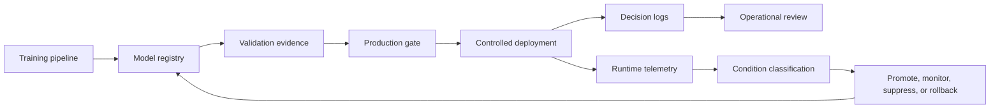

# From Model Registry to Production Gate: ML Promotion Controls for Asset-Heavy Operations

**Audience:** Field-service leaders, construction technology teams, mining operators, asset management teams, ML platform teams, operations executives  
**Canonical URL:** `/whitepapers/model-registry-production-gates-asset-operations/`  
**Related papers:** Cendryva self-hosted ML observability; sub-5ms inference at scale; model drift detection in regulated environments; ClickHouse for high-volume observability  
**Author:** Cendryva  
**Published:** 2026-05-25  
**Version:** 1.0  
**License:** CC BY 4.0
**Contact:** research@cendryva.com

## Abstract

Asset-heavy organizations increasingly use machine learning to prioritize inspections, predict equipment failures, route technicians, classify site risk, forecast parts demand, and optimize field operations. These models influence costly physical work: dispatching crews, stopping machines, ordering parts, delaying jobs, or escalating safety reviews.

In these environments, the hard problem is not only training a useful model. The hard problem is controlling when a model is allowed to affect production operations. A model registry stores versions and metadata, but a production gate determines whether a model can move from validation into operational use.

This paper explains how model registries, validation evidence, promotion gates, rollback controls, and decision logs work together for field-service, construction, mining, and other asset-heavy operations. It also explains how Cendryva turns model promotion from a loose handoff into a governed operating workflow.

## Executive Summary

Asset-heavy operations face a different kind of ML risk. A bad recommendation may not just reduce click-through rate or create an inaccurate dashboard. It may send a technician to the wrong site, delay critical maintenance, over-prioritize low-risk equipment, miss a safety signal, or create unnecessary downtime.

Teams need to answer:

- Which model version is approved for each region, asset class, or workflow?
- What validation evidence supported promotion?
- Which operational metrics must stay healthy after deployment?
- Who approved the model for production use?
- Can the system roll back quickly if field outcomes degrade?
- Can operators reconstruct which model influenced a specific dispatch, inspection, or maintenance recommendation?

Cendryva addresses this gap by connecting the model registry to production observability, decision logs, drift monitoring, condition classification, and rollback workflows. Instead of treating model registration as the finish line, Cendryva treats it as the start of controlled operational deployment.

## Why Model Registries Are Necessary but Not Sufficient

A model registry provides a central place to track model artifacts, versions, metadata, lineage, aliases, and lifecycle state. That is necessary for any serious ML program. But a registry alone does not guarantee production readiness.

Production readiness requires answers that go beyond "a model exists":

- Has it been validated on the right asset classes?
- Was it tested against recent field conditions?
- Does it meet latency and reliability requirements?
- Are the required features fresh and available?
- Does it behave acceptably across regions and operating environments?
- Are rollback and fallback procedures defined?
- Does the deployment have business-owner approval?
- Are decision logs and monitoring connected before rollout?

A production gate is the control point that enforces these requirements before a model can influence real operations.

## Industry Focus: Field Service and Maintenance Operations

Field-service organizations use ML to prioritize jobs, predict failures, estimate technician duration, recommend parts, and optimize routes. The operational cost of a wrong model can be immediate: missed service-level commitments, repeat truck rolls, idle technicians, unavailable parts, and dissatisfied customers.

For example, a predictive maintenance model may rank assets by failure risk. Before that model can change dispatch priority, the organization needs to know:

- whether the model was validated on the relevant asset families
- whether regional climate or usage patterns affect performance
- whether parts availability is incorporated
- whether technician feedback can override the recommendation
- whether high-risk recommendations are logged for review
- whether the model can be suppressed if false positives spike

Cendryva provides the connective tissue between model promotion and operational monitoring. It helps teams move from "the model passed offline validation" to "the model is approved, observed, reversible, and accountable in field operations."

## Industry Focus: Construction and Capital Projects

Construction teams can use ML for schedule risk, safety observations, equipment utilization, site logistics, subcontractor performance, and material delivery forecasts. These workflows are messy because each project has different constraints, crews, timelines, weather, vendors, and local rules.

A production gate for construction ML should consider:

- project type and phase
- site conditions and geography
- subcontractor mix
- safety-critical use cases
- data freshness from field systems
- human review requirements
- escalation thresholds
- post-deployment outcome tracking

Cendryva can map these considerations into model metadata, promotion criteria, decision logs, and condition-based monitoring. A site operations leader can see not only that a schedule-risk model was deployed, but where it is authorized, how it is performing, and which recommendations changed project workflows.

## Industry Focus: Mining and Heavy Equipment

Mining and heavy equipment operations run in harsh environments with high asset cost, safety implications, intermittent connectivity, and specialized operating conditions. Models may predict component failure, classify haul-road risk, detect abnormal telemetry, or recommend maintenance windows.

For these teams, promotion controls should include:

- equipment type and telemetry coverage
- operating environment and duty cycle
- validation by site or mine
- edge deployment constraints
- safety review requirements
- downtime impact analysis
- fallback rules when connectivity is limited
- decision logging for maintenance and safety review

Cendryva supports this operating model by tying model version, asset context, inference telemetry, drift signals, and decision history together. That makes model behavior reviewable in the language of maintenance, safety, and production rather than only in ML metrics.

## What a Production Gate Should Enforce

A production gate should be explicit, testable, and connected to the workflows the model will affect.

Typical gate requirements:

| Gate area          | Example requirement                                                    |
| ------------------ | ---------------------------------------------------------------------- |
| Artifact integrity | Model artifact hash and version are recorded                           |
| Validation         | Performance meets workflow-specific thresholds                         |
| Segment coverage   | Model is validated for the target region, asset class, or project type |
| Feature readiness  | Required inputs are fresh and available in production                  |
| Latency            | Inference fits the operational decision window                         |
| Safety and policy  | High-impact recommendations require review or guardrails               |
| Observability      | Metrics, traces, drift monitors, and decision logs are active          |
| Owner approval     | Business and technical owners approve promotion                        |
| Rollback           | Previous known-good model and fallback behavior are defined            |
| Post-launch review | Monitoring window and success criteria are scheduled                   |

The gate should not be a spreadsheet outside the system. It should be part of the operational platform so promotion evidence, runtime behavior, and rollback decisions remain connected.

## Registry Metadata That Matters

A useful registry entry for asset-heavy operations should capture more than model name and version.

Important fields include:

- model artifact hash
- training data window
- validation data window
- asset classes covered
- geography or operating environment
- approved workflow
- feature schema
- required data freshness
- validation metrics
- latency benchmark
- reviewer and approver
- promotion date
- rollback target
- monitoring policy
- drift baseline
- decision-log schema

These fields let teams answer whether a model is approved for a specific operational context, not merely whether it exists.

## Champion, Challenger, and Regional Rollout

Asset-heavy operations often need gradual deployment. A model may perform well in one region, asset class, or project type before it is trusted everywhere.

Common rollout patterns:

- **Champion only:** existing approved model serves all production traffic.
- **Challenger shadow mode:** new model scores events without affecting decisions.
- **Limited region rollout:** model influences decisions in one operating area.
- **Asset-class rollout:** model applies only to validated equipment types.
- **Human-review rollout:** model recommendations require approval before action.
- **Full promotion:** model becomes the primary production version.

Cendryva can support these patterns by linking rollout stage, model version, affected cohort, decision logs, and operational conditions. That lets teams compare challenger behavior without losing traceability.

## Decision Logs as Promotion Evidence

Promotion does not end at deployment. The first production window is part of validation.

Decision logs should record:

- model version
- asset, project, site, or route context
- feature freshness
- recommendation or score
- confidence or threshold state
- policy checks
- human override
- work order, dispatch, or maintenance outcome
- latency and runtime metadata
- trace ID and timestamp

These logs let teams compare what the model recommended with what happened in the field. They also support rollback review when downstream outcomes degrade.

## Observability After Promotion

A production gate should require monitoring before the model is allowed to influence operations.

Post-promotion monitoring should include:

- request volume by model version
- inference latency
- feature freshness
- missing input rate
- prediction distribution
- drift by region or asset class
- override rate
- field outcome metrics
- false-positive and false-negative indicators where available
- operational condition changes
- rollback triggers

The point is to catch problems while the organization can still respond, not after the model has quietly influenced weeks of operational decisions.

## Rollback and Suppression

Rollback should be boring. If a promoted model creates operational risk, teams should already know how to revert.

Rollback plans should define:

- previous known-good model
- traffic routing change
- fallback rules
- decision-log continuity
- owner approval path
- communication workflow
- post-rollback review
- criteria for re-promotion

Suppression is different from rollback. A model may be temporarily suppressed for a region, asset type, or workflow while remaining active elsewhere. This is especially useful in asset-heavy operations where local conditions can break assumptions without invalidating the model globally.

## Cendryva Promotion Control Architecture



Cendryva connects registry state, validation evidence, production telemetry, decision logs, and operational response. That turns model promotion into a closed loop rather than a one-way release event.

## Implementation Checklist

Teams building production gates for asset-heavy ML should define:

- model registry metadata schema
- artifact format and validation process
- workflow-specific promotion criteria
- segment coverage requirements
- feature freshness requirements
- latency and reliability thresholds
- decision-log schema
- rollout stages
- human approval rules
- drift baseline and monitoring windows
- rollback and suppression criteria
- field outcome metrics
- owner review cadence
- evidence retention policy

## Conclusion

Model registries organize ML artifacts. Production gates make those artifacts operationally accountable.

For field service, construction, mining, and other asset-heavy operations, this distinction matters. Models do not only produce predictions; they influence crews, equipment, schedules, safety reviews, and expensive physical decisions.

Cendryva helps teams bridge the gap between ML development and operational deployment. By connecting model registry metadata, validation evidence, production gates, decision logs, drift monitoring, and rollback workflows, Cendryva gives organizations a controlled way to put models into production without losing accountability.

The result is not slower innovation. It is safer, more repeatable model deployment for operations where the cost of uncontrolled change is too high.

## Implementation Status

This section maps the architectural claims above to the Cendryva codebase as of the publication date in the header. Each item lists the file path, what ships today, what is deferred, and the test count.

**Promotion state machine** - SHIPPED

- Code: `apps/api/src/services/ml/model-registry-state-machine.ts`.
- Types: `packages/types/src/ml-promotion.ts`.
- Tests: 34 transition tests passing (`pnpm --filter @cendryva/api test ml-promotion`).
- Notes: States are `Draft`, `Staging`, `Production`, and `Archived`. Transition guards enforce that artifacts are present and that the validation suite has passed before Staging, that shadow evaluation, approvals, and the absence of open critical drift are satisfied before Production, and that an incident reference accompanies a Production to Staging rollback.

**Promotion service with pluggable gates** - SHIPPED

- Code: `apps/api/src/services/ml/model-promotion.service.ts`.
- Tests: 16 service tests passing.
- Notes: Five gates ship today, each implementing a common `PromotionGate` interface: `ValidationSuiteGate`, `ShadowEvaluationGate`, `DriftGate`, `ApprovalGate`, and `IncidentReferenceGate`. The service composes them per transition. The workflow is `requestPromotion`, then `approvePromotion` with separation of duties enforced (self-approval is blocked), then `executePromotion` which atomically updates state and emits an audit event.

**HTTP routes** - SHIPPED

- Code: `apps/api/src/routes/ml.ts` (six new endpoints).
- Endpoints:
  - `POST /api/v1/ml/models/:modelId/versions/:version/promote`
  - `POST /api/v1/ml/promotions/:requestId/approve`
  - `POST /api/v1/ml/promotions/:requestId/reject`
  - `POST /api/v1/ml/promotions/:requestId/execute`
  - `GET /api/v1/ml/promotions`
  - `GET /api/v1/ml/models/:modelId/promotion-history`
- Tests: 39 route tests passing (`apps/api/src/routes/__tests__/ml-promotion.test.ts`). The RBAC matrix covers anonymous, no-role, viewer, admin, owner, and superadmin against every endpoint. End-to-end Playwright tests at `apps/e2e/tests/api/ml/ml-promotion.e2e.test.ts` verify the full lifecycle through real HTTP + persisted state, adding 21 cases (12 RBAC-rejection cases across the six endpoints, 5 admin schema/404/200-shape cases, 4 lifecycle scenarios — Draft → Staging request/approve/execute/history, self-approval 409, reject with reason, execute-without-gates 422 — plus a WORM trigger assertion that runs against Postgres when `DATABASE_URL` is set). The lifecycle scenarios `test.skip` with an explanatory reason when the API is running with `DATABASE_URL=postgres://…` because the route's `InMemoryModelRegistryAdapter` (apps/api/src/routes/ml.ts:499) is decoupled from the persistent `ml_models` table — until that adapter is replaced with a persistent `ModelRegistryRepository`, end-to-end happy-path coverage is only reachable against the route's in-memory fallback.
- Notes: All routes require authentication plus the admin, owner, or superadmin role. Approve enforces that the approver is not the requestor. The coverage inventory was regenerated via `node scripts/qa/generate-coverage-inventory.mjs` and the `api_endpoint_count` moved from 639 to 645. The route matrix test expanded from 17 to 23 routes (119 to 159 actor permutations). All six promotion endpoints now show `coverage_status: 'covered-or-referenced'` in `docs/qa/coverage-inventory.yml` referencing the new e2e file.

**Audit integration** - SHIPPED

- Code: `apps/api/src/services/ml/audit-log.audit-sink.ts` adapts the promotion service's `AuditSink` port to the production `auditLogService` (`apps/api/src/services/domains/audit/legacy-index.ts`), which routes every write through `ImmutableAuditLogService` → `dataClient.createSignedAuditLog` (the WORM-backed signed audit log; see `docs/operations/AUDIT-WORM-OPERATIONS.md`).
- Wiring: `apps/api/src/services/ml/model-promotion.factory.ts` is the default factory used by `routes/ml.ts`. Each promotion event (`requested`, `approved`, `rejected`, `executed`, `cancelled`) becomes a signed, chain-linked audit row.

**Persistent `model_promotions` table** - SHIPPED

- Code: `apps/api/src/services/ml/data-client-promotion.repository.ts` (the production `PromotionRepository`), backed by V006 (`migrations/postgres/V006*` — `model_promotions`, `model_promotion_approvals`, `model_promotion_events`).
- Wiring: The factory in `model-promotion.factory.ts` selects `DataClientPromotionRepository` whenever a request resolves a tenant org id. Promotion history now survives restart and is visible to every API process.
- Tests: 8 repository unit tests passing.

**`model_state` column on `ml_models`** - SHIPPED

- Migration: V006 adds a `state` column on `ml_models` with the FSM values (`Draft`/`Staging`/`Production`/`Archived`).
- Code: The route's in-memory `MlModel.state` is the runtime cache; the column is the durable source of truth read by `dataClient.getMlModel` / `listMlModelsPaginated`.

**Production promotion entitlement** - SHIPPED

- Feature key: `PRODUCTION_MODEL_PROMOTION` (declared in `packages/types/src/ml-promotion.ts`).
- Wiring: `apps/api/src/services/ml/data-client-entitlement.checker.ts` reads `entitlements.features` from `dataClient.getEntitlementsByOrg` (the same blob synced from Stripe by `StripeService.syncSubscription`).
- Per-plan map (`apps/api/src/services/domains/billing/stripe.service.ts`): FREE — denied; STARTER — denied; PROFESSIONAL — granted; ENTERPRISE — granted.
- Tests: `apps/api/src/tests/security/ml-promotion-subscription-matrix.test.ts` asserts every plan, plus a route-level test (`apps/api/src/routes/__tests__/ml-promotion.test.ts`) confirms the 403 ENTITLEMENT response.

**How to verify locally**

```
pnpm --filter @cendryva/api test ml-promotion
pnpm --filter @cendryva/api test routes/ml
node scripts/qa/generate-coverage-inventory.mjs
```

## Scope and Limitations

This is a vendor-authored paper from Cendryva. It is intended as a practitioner reference for ML platform teams, operations leaders, and asset management functions designing model promotion controls for field service, construction, mining, and similar asset-heavy environments. It is not independent academic research and it is not endorsed by any regulator or standards body.

In scope: model registry metadata, validation evidence, production gate criteria, champion-challenger and segmented rollout patterns, decision logging, post-promotion observability, rollback, and suppression workflows.

Out of scope: training data engineering, specific algorithm selection, hardware design for edge ML, asset-specific physics-of-failure modeling, safety case development, and detailed reliability engineering methodology.

This paper is not legal, safety engineering, regulatory, or model risk advice. Industries discussed (mining, construction, utilities, transportation, and other asset-heavy sectors) are subject to varied jurisdictional rules covering worker safety, equipment certification, environmental compliance, and AI governance. Examples include OSHA and MSHA regulations in the United States, the EU Machinery Regulation, and emerging AI-specific rules such as the EU AI Act. Engage qualified counsel, safety, and risk functions before adopting any gate, threshold, or rollback policy described here.

MLOps tooling, registry capabilities, and AI governance frameworks continue to evolve. References reflect publicly available sources at the publication date in the metadata above. Re-check current versions before relying on any specific feature, schema, or workflow.

The promotion state machine, gate framework, and HTTP routes described above ship in the codebase as of the publication date and are traceable through the Implementation Status section. Empirical statements about benefit, rollout speed, and operational impact are reference patterns drawn from design discussions and reference deployments. They are not audited outcomes from a specific deployment and should not be cited as measured improvements without organization-specific evaluation.

## References and Further Reading

MLOps, registries, and pipelines

- Google Cloud. *MLOps: Continuous delivery and automation pipelines in machine learning (Practitioners' guide to MLOps)*. https://cloud.google.com/architecture/mlops-continuous-delivery-and-automation-pipelines-in-machine-learning
- MLflow Project. *MLflow Model Registry Documentation*. https://mlflow.org/docs/latest/model-registry.html
- Kubeflow. *Kubeflow Pipelines Documentation*. https://www.kubeflow.org/docs/components/pipelines/
- ONNX. *Open Neural Network Exchange Specification*. https://github.com/onnx/onnx

Model risk and AI governance

- Board of Governors of the Federal Reserve System and Office of the Comptroller of the Currency. *Supervisory Guidance on Model Risk Management (SR 11-7 / OCC Bulletin 2011-12)*. 2011. https://www.federalreserve.gov/supervisionreg/srletters/sr1107.htm
- National Institute of Standards and Technology. *AI Risk Management Framework (AI RMF 1.0)*. 2023. https://www.nist.gov/itl/ai-risk-management-framework

Asset management and reliability

- International Organization for Standardization. *ISO 55000: Asset management - Overview, principles and terminology*. 2014. https://www.iso.org/standard/55088.html
- International Organization for Standardization. *ISO 55001: Asset management - Management systems - Requirements*. 2014.
- Society for Maintenance and Reliability Professionals. *SMRP Best Practices, 5th Edition*. https://smrp.org/

Observability and runtime

- OpenTelemetry. *OpenTelemetry Documentation*. https://opentelemetry.io/docs/
- ONNX Runtime. *ONNX Runtime Documentation*. https://onnxruntime.ai/docs/
