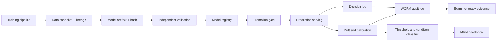

# Model Risk Management for Financial AI Systems

**Audience:** Bank and insurance model risk management teams, chief risk officers, internal audit, model validators, ML platform leads in regulated financial services, fintech compliance leaders  
**Canonical URL:** `/whitepapers/model-risk-management-financial-ai-systems/`  
**Related papers:** Model drift detection in regulated environments; HIPAA-ready ML decision logs; Cendryva self-hosted ML observability; AI governance risk register for legal, compliance, and audit teams  
**Author:** Cendryva  
**Published:** 2026-05-25  
**Version:** 1.0  
**License:** CC BY 4.0
**Contact:** research@cendryva.com

## Abstract

Model risk management at US banks and insurers is governed by SR 11-7 (Supervisory Guidance on Model Risk Management, jointly issued by the Federal Reserve and OCC in 2011) and the parallel OCC Bulletin 2011-12. These documents predate the modern AI/ML wave, but they remain the binding guidance for federally supervised institutions. The challenge is not whether SR 11-7 applies to ML models; the supervisors have been explicit that it does. The challenge is how to satisfy the standard for systems where the training data is large, the model is opaque, the retraining cadence is fast, and the operational behavior changes in ways the original validation could not anticipate.

This paper translates SR 11-7's three pillars (model inventory, validation, and ongoing monitoring) into a concrete MLOps pattern for financial AI systems. It describes the gap between traditional model risk (regression, ARIMA, scorecards) and modern AI (gradient boosting, deep learning, transformers), the specific evidence MRM examiners ask for in AI systems, and the operational architecture that makes the evidence reconstructable. It positions Cendryva as the MRM-compatible MLOps substrate that financial services teams can self-host inside their existing control framework.

## Executive Summary

SR 11-7 is older than most production ML systems in financial services. Its principles, however, have aged well: every model deserves an inventory entry, every model deserves independent validation, every model deserves ongoing monitoring, and every model risk decision deserves documented governance. The supervisors have repeatedly clarified that AI and ML models are in scope.

Five propositions:

- SR 11-7 applies to ML. The supervisors have confirmed this in OCC speeches, joint RFI responses, and the 2024 interagency RFI on AI use in financial services.
- The MRM triad (inventory, validation, monitoring) translates directly to MLOps, but the operational tooling has to change.
- ML model validation needs more than backtest performance; it needs reproducibility, lineage, sensitivity, and stability evidence.
- ML model monitoring needs continuous, evidence-backed surveillance, not quarterly reviews.
- The gap between traditional MRM and ML MRM is filled by infrastructure: model registry with promotion controls, immutable decision log, drift and stability monitoring, and tamper-evident governance.

Cendryva is built to be that infrastructure layer. It is self-hosted (data stays inside the bank or insurer boundary), it produces a WORM audit log of every model decision, configuration change, and promotion event, and it ships the threshold, drift, condition classification, and approval primitives MRM examiners look for.

## SR 11-7 in One Page

SR 11-7 defines a model as "a quantitative method, system, or approach that applies statistical, economic, financial, or mathematical theories, techniques, and assumptions to process input data into quantitative estimates." Machine learning systems are squarely inside this definition.

The guidance organizes model risk management around three pillars:

1. **Model development, implementation, and use.** The model must be designed for a defined purpose, with rigorous data and methodology, conceptual soundness, and appropriate testing. Implementation must be controlled and documented.
2. **Model validation.** An effective challenge by parties independent of the model owner. Validation covers conceptual soundness, ongoing monitoring, and outcomes analysis. Validation is required before use and on a defined cadence afterward.
3. **Governance, policies, and controls.** Roles, responsibilities, model inventory, change control, escalation, and reporting. The board and senior management own the model risk appetite.

OCC Bulletin 2011-12 is the OCC's substantively identical companion guidance. The ECB's TRIM (Targeted Review of Internal Models) and the Federal Reserve's CCAR and DFAST processes inherit and extend the same principles for specific use cases (Pillar 1 capital models, stress testing).

## Why ML Strains the Traditional MRM Pattern

Traditional MRM was built for models with the following properties:

- Small to moderate input dimensionality.
- Closed-form or near-closed-form mathematics that a validator can re-derive.
- Slow recalibration cadence (annual or semi-annual).
- Stable, well-documented data sources.
- Clear conceptual soundness narrative tied to economic or financial theory.

Modern ML systems often have different properties:

- High input dimensionality (hundreds or thousands of features).
- Non-linear, ensemble, or deep architectures that no validator can re-derive by hand.
- Fast retraining cadence (weekly, daily, on-event).
- Heterogeneous data sources, including unstructured text and graph features.
- Empirically motivated conceptual narrative ("this architecture wins on our benchmark") that does not directly map to economic theory.

The pillars still apply. The implementation has to change. A validator who is told to "effectively challenge" a daily-retrained gradient boosting model cannot do it with a spreadsheet, an annual review, and a memo. They need infrastructure that produces the evidence on a cadence and at a fidelity that supports continuous independent challenge.

## The MRM Inventory for ML

The model inventory is the foundation. For ML, the inventory must capture:

- Model identity (name, version, owner, business use).
- Risk tier (per the institution's model risk taxonomy).
- Training data lineage (source systems, snapshots, transformations, feature versions).
- Validation status and date.
- Approver record (who approved promotion to each environment).
- Production status (active, deprecated, suspended).
- Dependent models (this model feeds, or is fed by, these other models).
- Performance baseline at validation.
- Monitoring configuration (drift thresholds, calibration thresholds, escalation policy).
- Last review date and next review due date.

If the inventory cannot answer "which models are in production, who owns them, when were they last validated, and what is their current performance status," it is not yet an inventory. It is a list.

## Validation for ML Models

SR 11-7 specifies three components of model validation: conceptual soundness review, ongoing monitoring, and outcomes analysis. Each translates to ML with specific deliverables.

### Conceptual Soundness Review

For traditional models, conceptual soundness is often a narrative argument tied to theory. For ML, conceptual soundness requires:

- A documented business purpose tied to the model's outputs.
- An assessment of whether the chosen architecture is appropriate to the problem.
- An assessment of training data quality, representativeness, and potential bias sources.
- An assessment of feature provenance and stability.
- An assessment of overfitting risk and the controls used to mitigate it.
- An assessment of fairness and disparate impact for use cases where it applies.
- A reproducibility argument: can the validation team rebuild the model from the documented inputs?

The reproducibility test is often where ML systems fail MRM validation: the training pipeline is not deterministic, the data snapshot is not versioned, or the feature engineering lives in a notebook no one can rerun.

### Ongoing Monitoring

Ongoing monitoring is where ML diverges most sharply from traditional MRM. Traditional models are monitored quarterly. ML models drift faster than that. The monitoring substrate must produce:

- Continuous input drift detection per feature.
- Continuous output distribution monitoring.
- Continuous calibration monitoring.
- Continuous performance estimation when labels are available; confidence-based estimation when they are not.
- Subpopulation performance tracking.
- Stability metrics across retraining cycles.
- Threshold-based alerting with documented response paths.

### Outcomes Analysis

Outcomes analysis compares predicted to actual. For ML:

- Stratified outcome reconciliation by cohort, geography, product, segment.
- Backtesting on holdout and out-of-time samples on a defined cadence.
- Override analysis: how often did the model's recommendation get overridden, and what was the outcome of the overrides?
- Loss attribution: when the model contributed to a loss event, what did the decision record show at the time?

## The MRM Examiner View of an ML System

What an MRM examiner is likely to ask, and what the institution needs to produce:

- *"Show me the model inventory entry for this system."* A complete inventory record with owner, risk tier, validation status, approver chain.
- *"Show me the validation report and the date it was last refreshed."* A documented validation with the components above.
- *"Show me the production version this morning, and confirm it is the validated version."* A model registry record tied to the running artifact, with cryptographic identity (hash) verification.
- *"Show me the drift status for the last 90 days."* Continuous drift metrics with the configured thresholds, broken out by feature and cohort.
- *"Show me the override rate for this model in this quarter."* Outcome reconciliation that includes the override path.
- *"Show me the change history for this model."* A complete promotion and configuration history with approver identity, timestamp, and prior-state record.
- *"Show me who can change the threshold configuration, and the last five changes."* An RBAC record with an audit trail.
- *"Show me how the model was retrained last week and who approved it."* A retraining pipeline record with data snapshot lineage and approver attestation.

If the institution cannot answer these on demand, the MRM examination produces findings. If the answers depend on screenshots, spreadsheets, or unreproducible notebooks, the findings are worse.

## Governance for ML at the Edge of SR 11-7

SR 11-7 expects board-level model risk appetite, defined roles and responsibilities, a model risk policy, and escalation paths. For ML, the operational implementation includes:

- A model risk committee that reviews ML promotions and material changes.
- A defined risk tier per model with associated review cadence.
- A defined separation between model development, validation, and production operations.
- A documented escalation path when monitoring signals breach thresholds.
- A documented suspension and rollback procedure.
- Documented training and qualification for personnel involved in model development, validation, and operations.

The 2024 interagency RFI on AI use in financial services and subsequent guidance from the OCC and Federal Reserve have emphasized that AI does not change the obligations under existing model risk and operational risk frameworks. It changes how those obligations are implemented.

## The Gap Between Traditional and Modern Model Risk

Traditional model risk covers regression, ARIMA, scorecards, and similar interpretable models. Modern AI covers gradient boosting, deep learning, transformer-based architectures, and reinforcement learning systems. The gap is operational, not conceptual:

| Dimension | Traditional MRM | Modern AI MRM |
|---|---|---|
| Validator can re-derive math | Often yes | Rarely |
| Retraining cadence | Annual or longer | Weekly to daily |
| Input dimensionality | Tens | Hundreds to thousands |
| Conceptual soundness narrative | Economic theory | Empirical performance |
| Validation cadence | Annual | Continuous |
| Monitoring cadence | Quarterly | Continuous |
| Reproducibility tooling | Code and data archive | Pipeline, snapshot, hash, attestation |
| Decision evidence | Approval memos | Per-decision audit log |

The gap is closed by infrastructure. The MRM principles do not change; the tooling does.

## Architecture Pattern



Five design points:

- Every model artifact has a cryptographic identity tied to its training pipeline run.
- Promotion is gated by validation status and an approver chain.
- Every production decision produces a record before the result leaves the serving boundary.
- Drift, calibration, and performance monitoring run continuously and write to the same audit substrate.
- Examiner evidence is a query, not a forensic exercise.

## How Cendryva Applies This Pattern

Cendryva is built to be the MRM-compatible MLOps substrate. It is self-hosted, the audit trail is WORM with Vault-backed signing, and the model promotion workflow includes explicit approval gates.

- Model registry with promotion FSM and approval gates: `apps/api/src/services/ml/model-promotion.service.ts`, `apps/api/src/services/ml/data-client-promotion.repository.ts`, `apps/api/src/services/ml/model-registry-state-machine.ts`.
- Promotion schema: `migrations/postgres/V006__ML_Schema_And_RLS.sql` (`model_promotions`, `model_promotion_approvals`, `model_promotion_events`).
- Immutable decision and audit log: `apps/api/src/services/domains/audit/immutable-audit-log.service.ts`, `src/data/audit_logs.rs`.
- Audit log integrity verification: `apps/api/src/services/domains/audit/audit-log-integrity.service.ts`.
- Vault-backed signing: `apps/api/src/services/platform/vault/vault.service.ts`, `apps/api/src/services/domains/audit/audit-signing-key-provider.ts`.
- Drift detection (KS, PSI, JS divergence): `apps/api/src/services/ml/drift-statistics.ts`, `apps/api/src/services/ml/model-monitoring.service.ts`.
- Cohort analysis: `apps/api/src/services/ml/cohort-analysis.service.ts`.
- Threshold and condition classification: `src/statistics/thresholds/`, `apps/api/src/services/12-conditions/state-machine.ts`.
- Model monitoring audit sink: `apps/api/src/services/ml/audit-log.audit-sink.ts`.
- ONNX-based inference with versioned model registry: `src/rms/inference/prediction_service.rs`, `src/rms/inference/session_cache.rs`.

The promotion workflow requires the `PRODUCTION_MODEL_PROMOTION` entitlement, granted on PROFESSIONAL and ENTERPRISE plans, so non-production environments cannot promote into production without an explicit policy decision.

## Industry Focus: Bank Credit Risk

A bank deploys an ML-based credit decisioning model alongside its existing scorecard. SR 11-7 governs both. The ML model retrains weekly on new application data and weekly outcome refreshes.

The MRM-compatible deployment captures:

- Each weekly retrain produces a new model artifact with a hash and a lineage record (data snapshot version, feature pipeline version, training pipeline run identifier).
- The new artifact is automatically scored against validation criteria before it can be promoted (stability vs. prior version, calibration drift, subpopulation performance bounds).
- Promotion requires an explicit approver from the model risk function.
- The production decision log records every credit decision with model version, feature summary, output, override (if any), and adverse action reason.
- Drift, calibration, and override rate monitor continuously and escalate to the model risk committee on breach.
- The audit trail is WORM-signed; the examiner can verify integrity end-to-end.

When the examiner asks how the bank ensures the ML model is operating within MRM expectations, the answer is a documented workflow with reconstructable evidence, not a quarterly memo.

## Industry Focus: Insurance Pricing and Reserving

An insurer deploys an ML pricing model alongside its actuarial reserving models. State insurance regulators (through NAIC frameworks) and internal MRM both apply. The ML model retrains monthly and feeds rate filings that require state approval.

The MRM-compatible deployment captures the same primitives: lineage, validation, promotion gate, decision log, drift monitoring, override analysis, and approver chain. It additionally captures:

- The link between the ML model output and the rate filing version.
- The subpopulation analysis that supports the fair-pricing argument required by state regulators.
- The override pattern from underwriters, with reason categorization.
- The reserve sensitivity analysis driven by the ML model's loss-ratio projection.

The actuarial function and the model risk function may be organizationally distinct. The audit substrate has to serve both.

## Implementation Checklist

For a financial services institution adopting an MRM-compatible ML platform:

- Map the institution's model risk taxonomy and confirm every ML system is inventoried.
- Define the validation cadence per risk tier.
- Establish a model registry with cryptographic artifact identity.
- Establish a promotion FSM with explicit approver gates.
- Establish an immutable decision log with signed entries.
- Configure drift, calibration, and performance monitoring per model.
- Define the override capture pattern in the application stack.
- Define the escalation path when monitoring thresholds breach.
- Document the suspension and rollback procedure.
- Schedule the MRM committee review cadence.
- Schedule the periodic threshold and configuration review with the owner.
- Map the regulator-facing evidence package: inventory excerpt, validation report, monitoring report, change history.
- Run a tabletop MRM examination against the platform before the real one.

## Conclusion

SR 11-7 is older than the AI wave, but it is the right framework for the AI wave. The supervisors have said so, and the principles travel well. What does not travel well is the traditional MRM tooling: annual reviews, quarterly monitoring, spreadsheet inventories, and approval memos. ML systems generate too much volume and change too often for that pattern to hold.

The MRM-compatible response is operational: a model registry with cryptographic identity, a validation workflow that produces reproducible evidence, a continuous monitoring substrate with documented thresholds, an immutable decision log, and an approver chain that produces a tamper-evident governance trail.

Cendryva is built to be that substrate, self-hosted inside the institution's boundary, with WORM audit, Vault-backed signing, ML-specific drift and cohort analysis, threshold and condition classification, and an ONNX-based inference path with versioned model registry. The institution still owns the model risk decisions. The platform's job is to make the decisions reconstructable, the evidence inspectable, and the examiner conversation defensible.

## Implementation Status

This section maps the architectural claims above to the Cendryva codebase as of the publication date in the header.

**Model registry and promotion workflow** — SHIPPED
- Code: `apps/api/src/services/ml/model-promotion.service.ts` (FSM with gates), `apps/api/src/services/ml/data-client-promotion.repository.ts`, `apps/api/src/services/ml/model-promotion.factory.ts`, `apps/api/src/services/ml/model-registry-state-machine.ts`, `apps/api/src/services/ml/data-client-entitlement.checker.ts`.
- Schema: `migrations/postgres/V006__ML_Schema_And_RLS.sql` adds `model_promotions`, `model_promotion_approvals`, `model_promotion_events`, and a `state` column on `ml_models`.
- Notes: Production promotion requires the `PRODUCTION_MODEL_PROMOTION` entitlement (PROFESSIONAL and ENTERPRISE plans). Every promotion event lands in the WORM audit log.

**Immutable decision and audit log** — SHIPPED
- Code: `apps/api/src/services/domains/audit/immutable-audit-log.service.ts`, `apps/api/src/services/domains/audit/audit.service.ts`, `apps/api/src/services/domains/audit/audit-log-integrity.service.ts`, `src/data/audit_logs.rs`.
- Schema: `migrations/postgres/V002__Audit_Trail_And_Logs.sql` (WORM columns plus chain table and trigger).
- Tests: 52 audit tests plus 5 Postgres integration WORM tests.

**Vault-backed signing** — SHIPPED
- Code: `apps/api/src/services/platform/vault/vault.service.ts`, `apps/api/src/services/domains/audit/audit-signing-key-provider.ts`, `apps/api/src/services/domains/audit/audit-signing-key-provider.factory.ts`.
- Notes: Ed25519 signing with key material managed in Vault.

**Drift detection (KS, PSI, JS divergence)** — SHIPPED
- Code: `apps/api/src/services/ml/drift-statistics.ts`, `apps/api/src/services/ml/model-monitoring.service.ts`, `apps/api/src/services/ml/audit-log.audit-sink.ts`.
- Tests: 48 drift tests.

**Cohort and subpopulation analysis** — SHIPPED
- Code: `apps/api/src/services/ml/cohort-analysis.service.ts`, `apps/api/src/services/ml/cohort-analysis.service.test.ts`.

**Threshold engine and condition classification** — SHIPPED
- Code: `src/statistics/thresholds/static_threshold.rs`, `src/statistics/thresholds/dynamic.rs`, `src/statistics/thresholds/seasonal.rs`, `apps/api/src/services/12-conditions/state-machine.ts`, `apps/api/src/services/12-conditions/evaluators.ts`.

**ONNX inference with model identity** — SHIPPED
- Code: `src/rms/inference/prediction_service.rs`, `src/rms/inference/session_cache.rs`, `src/rms/inference/model_loader.rs`.
- Notes: Sessions are cached per `(model_id, version)` and the loader supports S3-backed artifacts with credential resolution.

**RBAC and policy enforcement** — SHIPPED
- Code: `apps/api/src/services/domains/security/rbac-policy-engine.ts`, `apps/api/src/services/domains/security/opa-client.ts`, `apps/api/src/services/domains/security/rbac-admin.service.ts`.
- Tests: `rbac-policy-engine.test.ts`, `opa-client.test.ts`, plus the access-control route matrix tests.

**Multi-tenant data model with row-level security** — SHIPPED
- Schema: `migrations/postgres/V001__Identity_And_Tenancy.sql`, `migrations/postgres/V006__ML_Schema_And_RLS.sql`.

**Self-hosted packaging** — SHIPPED
- Kubernetes manifests under `infrastructure/k8s/`, Terraform under `infrastructure/terraform/`, `Dockerfile`, `docker-compose.yml`.

**Deferred**
- Pre-built SR 11-7 validation-report templates (the primitives ship; turnkey templated narratives for a model validation function are a planned addition).
- Native integration with common bank model inventory tools (the API supports inventory queries; bidirectional adapters for vendor inventory products are a planned addition).
- CCAR and DFAST stress-testing scenario harnesses (general scenario evaluation can be assembled from existing primitives; opinionated stress-testing scaffolding is not yet shipped).
- Fairness and disparate impact analysis modules tailored to credit and insurance (cohort analysis primitives ship; pre-built fairness reports for specific use cases are a planned addition).

**How to verify locally**

```
cargo test --lib
pnpm --filter @cendryva/api test ml/model-promotion
pnpm --filter @cendryva/api test ml/model-monitoring
pnpm --filter @cendryva/api test domains/audit
pnpm --filter @cendryva/api test security/rbac
```

## Scope and Limitations

This is a vendor-authored paper from Cendryva. It explains how SR 11-7 model risk management expectations apply to modern AI/ML systems and how Cendryva implements the operational substrate. It is not legal, supervisory, or model risk advice and it is not a substitute for the institution's MRM function.

**In scope.** SR 11-7 and OCC 2011-12 principles applied to AI/ML; the model inventory, validation, monitoring, and governance triad; the operational gap between traditional and modern model risk; an examiner-facing evidence pattern; the Cendryva implementation mapping.

**Out of scope.** Specific examination response templates for any institution. Model validation for any specific class of credit, market, operational, or insurance model. CCAR or DFAST scenario design. Regulatory submission language. State insurance department filing procedures. EU CRR/CRD or Solvency II adaptation.

**Not legal, supervisory, or MRM advice.** SR 11-7, OCC 2011-12, the 2024 interagency RFI on AI use, NAIC AI bulletins, ECB TRIM, and state insurance regulator requirements require qualified counsel, MRM officers, and the institution's relationship managers with the relevant supervisors.

**Time-bounded items.** Supervisory guidance evolves. Re-verify the current state of SR 11-7 interpretations, OCC bulletins, NAIC model bulletins, and ECB AI guidance at the time of design.

**Empirical claims.** The MRM operational pattern is well-documented in supervisory speeches and industry guidance; the references section points to canonical sources.

## References and Further Reading

US supervisory guidance

- Board of Governors of the Federal Reserve System and OCC. *Supervisory Guidance on Model Risk Management (SR 11-7)*. April 4, 2011. https://www.federalreserve.gov/supervisionreg/srletters/sr1107.htm
- Office of the Comptroller of the Currency. *OCC Bulletin 2011-12: Sound Practices for Model Risk Management*. April 4, 2011. https://www.occ.gov/news-issuances/bulletins/2011/bulletin-2011-12.html
- Treasury, Federal Reserve, FDIC, OCC, CFPB, NCUA. *Request for Information and Comment on Financial Institutions' Use of Artificial Intelligence, Including Machine Learning*. 2021. https://www.federalreserve.gov/newsevents/pressreleases/files/bcreg20210329a1.pdf
- US Department of the Treasury. *Managing AI-Specific Cybersecurity Risks in the Financial Services Sector*. 2024. https://home.treasury.gov/

Stress testing

- Board of Governors of the Federal Reserve System. *Comprehensive Capital Analysis and Review (CCAR)*. https://www.federalreserve.gov/supervisionreg/ccar.htm
- Board of Governors of the Federal Reserve System. *Dodd-Frank Act Stress Tests (DFAST)*. https://www.federalreserve.gov/supervisionreg/dfa-stress-tests.htm

European supervisory guidance

- European Central Bank. *Guide for the Targeted Review of Internal Models (TRIM)*. 2017 (with updates). https://www.bankingsupervision.europa.eu/
- European Banking Authority. *Discussion paper on machine learning for IRB models*. https://www.eba.europa.eu/

Insurance and state regulators

- National Association of Insurance Commissioners. *NAIC Model Bulletin: Use of Artificial Intelligence Systems by Insurers*. 2023. https://content.naic.org/

Academic and practitioner literature

- Morini, M. *Model Risk Management*. Wiley Finance, 2011.
- Kim, K., Kreinovich, V., Sriboonchitta, S. (eds.). *Predictive Econometrics and Big Data*. Springer.

Cendryva foundations

- Cendryva. *Model Drift Detection in Regulated Environments*. https://cendryva.com/whitepapers/model-drift-detection-regulated-ai/
- Cendryva. *AI Governance Risk Register for Legal, Compliance, and Audit Teams*. https://cendryva.com/whitepapers/ai-governance-legal-compliance-risk-register/
- Cendryva. *From Model Registry to Production Gate*. https://cendryva.com/whitepapers/model-registry-production-gates-asset-operations/
