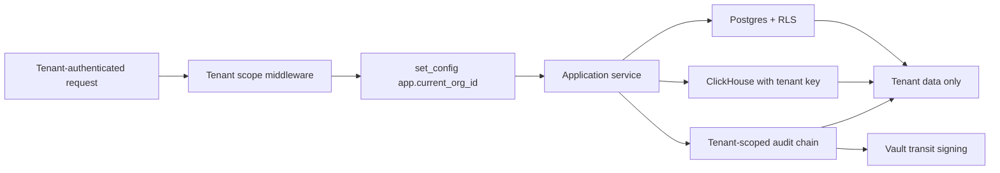

# Multi-Tenant ML Platforms: Schema Isolation, Encryption, and Tenant-Aware Observability

**Audience:** SaaS architects, ML platform engineers, security engineers, CISOs, privacy officers, multi-tenant operators
**Canonical URL:** `/whitepapers/multi-tenant-ml-platforms-schema-isolation-encryption/`
**Related papers:** The case for self-hosted MLOps; Cendryva self-hosted ML observability; HIPAA-ready ML decision logs; building an ML decision log for SOC 2, HIPAA, and model risk management
**Author:** Cendryva
**Published:** 2026-05-25
**Version:** 1.0
**License:** CC BY 4.0
**Contact:** research@cendryva.com

## Abstract

Multi-tenancy in an ML platform is not just a deployment shape. It is a contract. When a regulated customer signs up, they expect their feature samples, their decision logs, their audit chain, and their telemetry to remain isolated from every other tenant's data, by design, under attack, during incidents, and across every operator-facing surface.

Getting that right is hard. It requires explicit choices about persistence isolation, key management, audit chain scoping, observability scoping, and operator access. Most platforms that fail multi-tenant isolation do not fail because of a single dramatic bug. They fail because no one drew the boundaries explicitly and the defaults of the underlying tools were not tenant-aware.

This paper lays out the controls that a multi-tenant ML platform serving regulated customers should have, with specific attention to row-level security in Postgres, column-level encryption in analytical stores, per-tenant key contexts, tenant-scoped audit chains, and observability that does not leak across tenants. It describes how Cendryva is designed multi-tenant from V001 and what that means in practice.

## Executive Summary

A regulated multi-tenant ML platform should treat tenant boundaries as a security boundary, not a query filter. Concretely, that means:

- Every persisted row is associated with a tenant identifier.
- Database row-level security enforces tenant scope on every read and write through standard application paths.
- Encryption keys are partitioned per tenant where the threat model requires it, and at minimum are not shared with the application process.
- Audit chains are scoped to tenants so one customer's evidence cannot be invalidated by another customer's activity.
- Telemetry, metrics, and dashboards do not aggregate across tenants in ways that leak per-tenant detail.
- Operator access is logged, justified, and reviewed.
- Tests prove that a request authenticated as tenant A cannot read or write tenant B's data, including through analytical, audit, and observability surfaces.

A platform that satisfies these properties can offer multi-tenant deployment to regulated customers without inheriting the failure modes that have caused many widely reported SaaS isolation incidents.

Cendryva is structured this way from its first migration. Tenant scope is set per request, RLS is enabled on tenant-scoped tables, ClickHouse columns carry tenant identifiers, audit chains are tenant-scoped, and per-tenant key contexts are supported through the platform's Vault integration.

## Why Multi-Tenancy Is Hard for ML Platforms

ML platforms have characteristics that make tenant isolation harder than typical SaaS applications:

- **Analytical workloads.** Drift detection, anomaly detection, and benchmarking inherently want to aggregate. Aggregations across tenants are a common path to accidental cross-tenant leakage.
- **Long-tail telemetry.** Inference traffic, feature samples, and decision logs accumulate fast. Storage layers that were chosen for throughput often have weaker tenant isolation primitives than transactional databases.
- **Background workers.** Retraining orchestrators, batch jobs, and scheduled tasks frequently operate without an explicit user-facing tenant context, and can default to broad scope if not designed carefully.
- **Cross-tenant features.** Some platforms offer benchmarks, cohort comparisons, or shared registries. These are legitimate only with explicit aggregation rules and anonymization, and they require careful audit.
- **Operator surfaces.** Internal dashboards, support tooling, and admin consoles often have broader scope than user-facing surfaces. They are a common path to incidents.

A multi-tenant ML platform that does not deliberately address each of these areas will eventually leak.

## Persistence Isolation Patterns

There are three common patterns for tenant data isolation in a single-database deployment. They are not mutually exclusive, and serious platforms combine them.

### Shared Schema with Row-Level Security

Every table has a `tenant_id` column. Postgres row-level security policies attach to the table and constrain reads and writes based on a session variable set at the start of every request. The application sets `app.current_org_id` once per request from authenticated context, and queries are constrained automatically.

This pattern scales to many tenants per database. It depends on every table having the right RLS policy, every connection being properly scoped, and every direct SQL pathway (background jobs, migrations, support tooling) using a separate role with documented broader access.

### Schema-per-Tenant

Each tenant gets its own schema. Queries scope naturally. The cost is per-tenant schema migrations and a more complex connection model. This pattern is more common in mid-size enterprise deployments than in high-fan-out SaaS.

### Database-per-Tenant

Each tenant gets its own database, often per-tenant infrastructure. Strong isolation. Operationally expensive at scale. Common for enterprise tiers where customers pay for the dedicated footprint.

A serious multi-tenant ML platform typically defaults to shared schema with RLS for the shared tier and offers schema-per-tenant or database-per-tenant for enterprise tiers that need stronger isolation.

## Row-Level Security in Practice

RLS in Postgres looks simple in documentation and is straightforward to misuse. Practical considerations:

- **Session variable setup.** The application must set `app.current_org_id` on every connection acquisition, not once at startup. Connection pools recycle connections across requests.
- **Helper functions.** A `current_org_id()` SQL function reads the session variable and returns it typed. RLS policies reference this function so each table policy is a one-liner that compares `tenant_id = current_org_id()`.
- **Migrations and background jobs.** A separate role with the `BYPASSRLS` attribute is used for schema migrations and tightly controlled background work. The application role does not have `BYPASSRLS`.
- **Tests.** Every RLS-protected table has tests that verify a request authenticated as tenant A cannot read or write tenant B's rows. A static route guard verifies that new tables do not silently land without RLS.
- **Auditing.** Reads and writes from the migration role are logged. Use of `BYPASSRLS` paths is rare and traceable.

This is not exotic engineering. It is what the database has provided for years. The discipline is in the consistency.

## Analytical Stores: ClickHouse and Column-Level Encryption

Analytical stores deserve their own design attention. ClickHouse, BigQuery, Snowflake, and similar systems do not have RLS in the Postgres sense, and the patterns differ.

For ClickHouse specifically:

- **Tenant identifier in every table.** Every analytical table carries an organization identifier as part of the primary key or sort key.
- **Application-enforced scope.** Queries from the application include the tenant constraint as part of the query template. A query without a tenant constraint should not pass code review.
- **Materialized views and rollups.** Aggregations are tenant-scoped or explicitly cross-tenant with documented anonymization.
- **Column-level encryption for sensitive columns.** AES-GCM at the column level for fields that contain sensitive content. Keys are managed per environment, with tenant-scoped contexts where the threat model requires it.
- **Retention policies.** TTL-based retention at the table or partition level, set per tenant where retention obligations differ.

Cendryva ships these primitives. The encryption layer is in `src/clickhouse/encryption.rs` with column-level AES-GCM, and the schema and retention layers are in `src/clickhouse/schema.rs`, `src/clickhouse/setup.rs`, and `src/clickhouse/retention.rs`.

## Per-Tenant Key Contexts

Encryption keys are often the weakest point in a multi-tenant architecture. A single key shared across all tenants means any compromise affects every customer. A key per tenant is more expensive operationally but limits blast radius.

A practical pattern:

- A platform-level signing key for audit chain signatures, rotated on a documented schedule.
- Per-tenant key contexts for sensitive data fields, managed in Vault or an equivalent KMS.
- Key access mediated through the KMS so the application process never holds long-lived key material in memory.
- Key rotation, revocation, and audit are first-class operations.

For Vault-based deployments, transit signing and encryption capabilities allow the application to sign or encrypt without ever reading the key. That is the property that makes the control meaningful.

## Tenant-Scoped Audit Chains

A single global audit chain for a multi-tenant platform is a weakness for two reasons:

1. **Cross-tenant coupling.** A bug or attack affecting one tenant's chain integrity can call the entire log into question.
2. **Confidentiality.** Chain heads, counts, and timing patterns can leak information across tenants if everyone is in one chain.

The cleaner pattern is one chain per tenant, or one chain per tenant per resource category. Chain heads are tracked separately. Verification scopes to a tenant. Evidence export scopes to a tenant.

Cendryva uses a `chain_scope` column on the audit log and an `audit_log_chains` table to track per-scope chain heads. The default scope is per-tenant. Chain verification is tenant-aware.

## Tenant-Aware Observability

Operational metrics, dashboards, and alerting are a common path to cross-tenant leakage in multi-tenant systems. A few principles:

- **Tenant-scoped metrics.** Cardinality matters. Per-tenant labels on every metric are valuable but can explode storage and indexing costs. Most platforms strike a balance with tenant-scoped aggregates for high-cardinality metrics and full per-tenant detail for low-cardinality, high-value metrics.
- **No cross-tenant detail in shared dashboards.** Aggregations across tenants should be anonymized or explicitly opt-in. A support engineer should not see individual tenant identifiers on a dashboard meant for capacity planning.
- **Operator surfaces are separately governed.** Internal dashboards have their own access controls, their own audit trails, and their own data minimization policies.
- **Alerts are tenant-aware.** A noisy tenant should not flood a global alert channel. Alerts should route to the team responsible for that tenant.

These choices are about discipline more than tooling. They require treating observability as a tenant-aware system, not a system that happens to ingest multi-tenant data.

## Operator Access and Break-Glass

Operators occasionally need broader access than tenants for support, incident response, or migration work. That access should be:

- **Explicit.** A separate role with documented permissions, not a flag in a config file.
- **Justified.** Each elevated session is associated with a reason, a ticket, or a documented incident.
- **Time-bounded.** Elevated access does not persist beyond the work.
- **Audited.** The elevation, the activity, and the de-elevation are all recorded in the same audit chain as customer-facing activity.

This is the operational analog of the technical isolation patterns. The technical controls keep tenants apart in normal operation; the operator controls keep them apart during the abnormal moments that matter most.

## Cross-Tenant Features With Care

Some legitimate platform features cross tenant boundaries:

- Benchmarks comparing a customer to a peer cohort.
- Shared model registries for organization groups.
- Aggregate platform telemetry for capacity planning.
- Threat intelligence feeds.

These can be safe with explicit design:

- Aggregations meet a minimum cohort size and are differentially private where the cohort is small.
- Customers opt into participation explicitly.
- The aggregation pipeline is audited end to end.
- No tenant identifier leaves the platform in cross-tenant outputs.

A cross-tenant feature without these controls is a leak waiting to happen.

## Industry Focus: Multi-Tenant Healthcare ML

A healthcare ML platform serves multiple covered entities. Each entity expects HIPAA-grade isolation of PHI, decision logs, audit chains, and operational telemetry. A shared schema with RLS handles transactional metadata. ClickHouse with tenant identifiers and column-level encryption handles analytical workloads. Audit chains are scoped per covered entity. Per-tenant Vault key contexts protect signing operations. Operator surfaces are governed separately with break-glass logging.

A request authenticated as covered entity A cannot, by construction, read covered entity B's data through any application-level path. Tests prove this. Cross-tenant aggregates either do not exist or are explicitly opt-in with strict aggregation rules.

## Industry Focus: Multi-Tenant Financial Services

A financial services ML platform serves multiple banks, insurers, or broker-dealers. Each customer expects their model decisions, drift evidence, and audit chains to remain confidential from peers. The same controls apply: RLS, tenant-scoped audit chains, per-tenant key contexts where the threat model requires, and tenant-aware observability. Add the model risk management overlay: each customer's model inventory, validation evidence, and ongoing monitoring is scoped to that customer.

## Architecture Pattern

The tenant scope is set at the boundary, enforced at the database, and propagated through every persistence and audit layer. There is no application path that escapes the scope by accident.

## How Cendryva Applies This Pattern

Cendryva is multi-tenant from its first migration. Concretely:

- **Tenant scope helpers.** `current_org_id()` is defined in `migrations/postgres/V001__Identity_And_Tenancy.sql` and reads `app.current_org_id` from the session.
- **Row-level security.** RLS is enabled across ML, audit, organization member, API key, metric, condition, and dashboard tables. See `migrations/postgres/V006__ML_Schema_And_RLS.sql` and additional RLS in V009, V011, V012, V013, V017.
- **Tenant-scoped audit chains.** The `chain_scope` column on `audit_logs` and the `audit_log_chains` table in `migrations/postgres/V002__Audit_Trail_And_Logs.sql` scope chain heads per tenant. The writer at `apps/api/src/services/domains/audit/immutable-audit-log.service.ts` enforces tenant scope on every append and chain verification.
- **ClickHouse with tenant-aware schema and column-level encryption.** `src/clickhouse/schema.rs`, `src/clickhouse/encryption.rs` (AES-GCM), `src/clickhouse/retention.rs`. Feature samples table at `migrations/clickhouse/1709424028_add_feature_samples_table.sql` keys on organization, model, feature, and window.
- **Vault-backed signing and credential storage.** `apps/api/src/services/platform/vault/vault.service.ts`, `apps/api/src/services/platform/vault/credential.service.ts`, and `apps/api/src/services/domains/audit/audit-signing-key-provider.ts`. The Ed25519 private key for audit signing lives in Vault transit and never reaches the application process.
- **System-internal traffic sentinels.** `packages/types/src/system-identity.ts` exports `SYSTEM_ORGANIZATION_ID` and `SYSTEM_ACTOR_ID` so background workers and scheduled jobs produce signed, tenant-scoped audit rows rather than degrading to in-memory or untenanted writes.
- **Entitlement enforcement.** Production-grade features like model promotion are gated by per-tenant entitlements via `apps/api/src/services/ml/data-client-entitlement.checker.ts` so plan boundaries are enforced at the data path, not just the UI.
- **Static route and matrix guards.** `apps/api/src/tests/security/access-control-route-manifest.test.ts` and `apps/api/src/tests/security/access-control-route-matrix.test.ts` ensure new protected routes cannot ship without RBAC mapping. Equivalent discipline applies to RLS coverage.

## Implementation Checklist

A team building or evaluating a multi-tenant ML platform should be able to evidence:

- Every tenant-scoped table has a tenant identifier and RLS policy.
- The application sets the tenant session variable on every connection acquisition.
- Background workers and scheduled jobs use documented system identities and produce tenant-scoped writes.
- Analytical store queries include tenant constraints and pass code review.
- Sensitive columns in analytical stores are encrypted with keys outside the application process.
- Audit chains are tenant-scoped and verifiable per tenant.
- Operator access is logged and reviewed.
- Cross-tenant features, if any, document aggregation rules and audit pipelines.
- Tests prove that a tenant A request cannot read or write tenant B data.

## Conclusion

Multi-tenancy is a contract with regulated customers. Honoring it requires explicit isolation choices at the persistence layer, the analytical layer, the encryption layer, the audit layer, the observability layer, and the operator layer. None of these is exotic engineering on its own. The discipline is in applying them consistently and proving them with tests.

Cendryva is multi-tenant from V001 by design. The RLS, tenant-scoped audit chains, per-tenant key contexts, and analytical-store discipline are not bolted on after the fact. They are the shape of the data model. That is what it takes to serve regulated multi-tenant workloads without inheriting the failure modes that produced the leaks the rest of the industry has already lived through.

## Implementation Status

This section maps the Cendryva claims above to the codebase as of the publication date.

**Tenant scope helpers** - SHIPPED
- Schema: `migrations/postgres/V001__Identity_And_Tenancy.sql` defines `current_org_id()` and `current_user_id()`.

**Row-level security across core tables** - SHIPPED
- Schema: `migrations/postgres/V006__ML_Schema_And_RLS.sql` plus RLS extension in V009, V011, V012, V013, V017.

**Tenant-scoped audit chains** - SHIPPED
- Schema: `migrations/postgres/V002__Audit_Trail_And_Logs.sql` with `chain_scope` column and `audit_log_chains` table.
- Code: `apps/api/src/services/domains/audit/immutable-audit-log.service.ts`, `src/data/audit_logs.rs`.

**ClickHouse tenant-aware schema and column-level encryption** - SHIPPED
- Code: `src/clickhouse/schema.rs`, `src/clickhouse/encryption.rs`, `src/clickhouse/setup.rs`, `src/clickhouse/retention.rs`.
- Migration: `migrations/clickhouse/1709424028_add_feature_samples_table.sql`.

**Vault-backed signing keys** - SHIPPED
- Code: `apps/api/src/services/platform/vault/vault.service.ts`, `apps/api/src/services/platform/vault/credential.service.ts`, `apps/api/src/services/domains/audit/audit-signing-key-provider.ts`, `apps/api/src/services/domains/audit/audit-signing-key-provider.factory.ts`.

**System-internal traffic sentinels** - SHIPPED
- Code: `packages/types/src/system-identity.ts`.

**Plan and tenant entitlement enforcement** - SHIPPED
- Code: `apps/api/src/services/ml/data-client-entitlement.checker.ts`.

**Access control route manifest and matrix guards** - SHIPPED
- Tests: `apps/api/src/tests/security/access-control-route-manifest.test.ts`, `apps/api/src/tests/security/access-control-route-matrix.test.ts`.

**Per-tenant Vault key contexts for column-level encryption** - PARTIAL
- The encryption primitives and Vault integration are in place. A first-class per-tenant key context for ClickHouse column encryption, with rotation tooling, is DEFERRED to a future release. Current deployments use environment-level keys with tenant-scoped data partitioning.

**Differential privacy on cross-tenant aggregates** - DEFERRED
- Cross-tenant benchmarking and aggregates are not enabled by default in the shared tier. When introduced, differential privacy primitives are DEFERRED to a future release; current designs rely on minimum cohort sizes and opt-in.

## Scope and Limitations

This is a vendor-authored paper from Cendryva. It is intended for SaaS architects, security engineers, and CISOs evaluating or building multi-tenant ML platforms for regulated customers. It is not a substitute for an independent security assessment of any specific platform.

In scope: persistence isolation patterns, RLS, column-level encryption, per-tenant key contexts, tenant-scoped audit chains, tenant-aware observability, operator access discipline, and a reference description of Cendryva's multi-tenant design.

Out of scope: prescriptive sizing or topology for any specific deployment, vendor-by-vendor comparison of analytical stores, KMS-specific configuration for any one provider, and detailed threat modeling for any specific tenant set.

This paper is not legal, regulatory, or audit advice. HIPAA, SOC 2, ISO 27001, GDPR, SR 11-7, and related regimes are referenced as commonly applicable. Specific obligations depend on the regulated entity's role, contracts, and supervisory relationships. Engage qualified counsel and assessors before treating any pattern in this paper as a compliance prescription.

Empirical claims about Cendryva are limited to the file paths cited in Implementation Status, valid as of the publication date in the header.

## References and Further Reading

### Multi-tenant SaaS patterns

- AWS. *SaaS Lens for the AWS Well-Architected Framework*. https://docs.aws.amazon.com/wellarchitected/latest/saas-lens/welcome.html
- AWS. *Multi-tenant SaaS storage strategies*. https://aws.amazon.com/blogs/apn/multi-tenant-saas-storage-strategies/
- Microsoft. *Multi-tenant SaaS architecture*. https://learn.microsoft.com/en-us/azure/architecture/guide/multitenant/overview

### Database isolation

- PostgreSQL Global Development Group. *Row Security Policies*. https://www.postgresql.org/docs/current/ddl-rowsecurity.html
- ClickHouse. *Documentation*. https://clickhouse.com/docs

### Security standards

- AICPA. *SOC 2 Trust Services Criteria*. https://www.aicpa-cima.com/
- International Organization for Standardization. *ISO/IEC 27001:2022*.
- OWASP. *OWASP Application Security Verification Standard*. https://owasp.org/www-project-application-security-verification-standard/

### Privacy and AI

- HHS Office for Civil Rights. *HIPAA Security Rule*. https://www.hhs.gov/hipaa/for-professionals/security/index.html
- NIST. *Artificial Intelligence Risk Management Framework (AI RMF 1.0)*. 2023. https://www.nist.gov/itl/ai-risk-management-framework

### Related Cendryva whitepapers

- *The case for self-hosted MLOps in healthcare and financial services*.
- *Cendryva self-hosted ML observability*.
- *HIPAA-ready ML decision logs*.
- *Building an ML decision log for SOC 2, HIPAA, and model risk management*.
