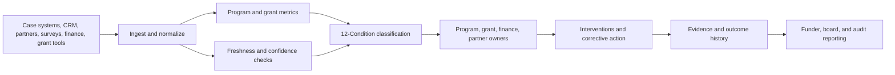

# Nonprofit and Grant Impact Operations Scorecard

**Format:** Impact operations scorecard  
**Audience:** Foundations, nonprofit executives, grant managers, program officers, impact measurement teams, community service providers, donor reporting teams  
**Canonical URL:** `/whitepapers/nonprofit-grant-impact-operations-scorecard/`  
**Related papers:** Learning operations observability; smart city municipal operations buyer’s guide; the 12-Condition Framework; Cendryva self-hosted ML observability  
**Author:** Cendryva  
**Published:** 2026-05-25  
**Version:** 1.0  
**License:** CC BY 4.0
**Contact:** research@cendryva.com

## Scorecard Purpose

Nonprofits and grant-funded programs are asked to prove impact while operating under resource constraints, fragmented systems, reporting deadlines, privacy responsibilities, and changing community needs. Program teams collect attendance, services delivered, referrals, outcomes, case notes, surveys, grant milestones, spending categories, and partner updates, but the data often arrives late or inconsistently.

This scorecard gives nonprofit and grant leaders a practical way to evaluate whether they have an operating system for impact, not just a reporting process.

Cendryva helps mission-driven organizations turn program signals into conditions, evidence, intervention history, data-quality alerts, and funder-ready operating summaries.

## Executive Scorecard

| Dimension              | Healthy state                                               | Risk state                                                      | Cendryva contribution                                                 |
| ---------------------- | ----------------------------------------------------------- | --------------------------------------------------------------- | --------------------------------------------------------------------- |
| Program delivery       | Services are delivered on schedule and tracked consistently | Delivery volume is late, missing, or uneven across sites        | Condition monitoring by program, site, cohort, and service            |
| Outcome evidence       | Outcome measures are timely and connected to interventions  | Outcomes are stale, incomplete, or disconnected from activities | Decision and intervention logs linked to outcome changes              |
| Grant compliance       | Milestones, reports, and allowable-cost signals are visible | Deadlines and documentation gaps appear late                    | Freshness, NON_EXISTENCE, and DANGER conditions for grant obligations |
| Beneficiary privacy    | Sensitive data is minimized and role-restricted             | Broad access to identifiable records creates privacy risk       | Privacy-aware views and evidence separation                           |
| Partner data           | Partners submit usable data on time                         | Partner feeds are inconsistent or missing                       | Source freshness and confidence scoring                               |
| Continuous improvement | Teams learn from recurring patterns                         | Same problem repeats every cycle                                | LIABILITY classification and recurrence history                       |

## The Operating Gap

Many nonprofit teams have three disconnected layers:

- **Service systems:** case management, attendance, referrals, CRM, LMS, volunteer tools
- **Reporting systems:** spreadsheets, grant portals, dashboards, funder templates
- **Narrative systems:** case stories, board reports, donor updates, community feedback

The missing layer is operational observability: a way to know which program signals are healthy, which are missing, which require intervention, and which actions changed outcomes.

## Focus Area: Community Service Delivery

Community programs may provide food distribution, housing support, youth services, workforce coaching, transportation, legal aid, health navigation, financial counseling, or disaster recovery support. These services often involve high-need populations and multiple partners.

**Signals to monitor**

- service volume
- waitlist length
- referral completion
- appointment no-show rate
- case aging
- staff capacity
- partner handoff completion
- beneficiary follow-up status
- geography or site coverage
- unmet need category

**Cendryva scorecard value**

- Classify site or program health as NORMAL, BELOW_NORMAL, DANGER, or EMERGENCY.
- Flag missing partner or site data as NON_EXISTENCE.
- Identify recurring delivery bottlenecks as LIABILITY.
- Preserve intervention evidence for program review.
- Show leaders which communities or services need action now.

## Focus Area: Grant Milestones and Reporting

Grant-funded programs must often track milestones, deliverables, performance measures, spending categories, and reporting deadlines. Federal awards may also require performance monitoring and reporting under grant rules such as OMB Uniform Guidance.

**Signals to monitor**

- milestone completion
- report due dates
- deliverable evidence
- budget burn rate
- allowable-cost category variance
- match requirement status
- performance indicator progress
- subrecipient data freshness
- documentation gaps

**Cendryva scorecard value**

- Turn deadlines and documentation requirements into monitored signals.
- Detect stale or missing subrecipient data early.
- Route DANGER conditions to grant owners.
- Maintain evidence history for reports and audits.
- Help program and finance teams work from the same operational view.

## Focus Area: Impact Measurement

Impact measurement often suffers from delayed outcomes, incomplete follow-up, inconsistent definitions, and attribution ambiguity. A program may deliver services well but fail to collect outcome evidence. Or outcome signals may improve without a clear link to intervention.

**Signals to monitor**

- enrollment baseline
- service completion
- outcome survey completion
- credential attainment
- job placement
- housing stability
- food security status
- recidivism or repeat service use
- participant retention
- follow-up completion

**Cendryva scorecard value**

- Connect interventions to outcome windows.
- Mark low-confidence outcome data as DOUBT.
- Show POWER_CHANGE when a program improvement produces rapid positive movement.
- Preserve which intervention was used, when, and by whom.
- Identify cohorts where follow-up evidence is missing.

## Focus Area: Partner and Subrecipient Operations

Many nonprofit programs operate through partners, affiliates, subrecipients, schools, clinics, shelters, employers, or community organizations. Impact data is only as strong as the weakest partner feed.

**Signals to monitor**

- partner submission timeliness
- data completeness
- service location coverage
- duplicated records
- unresolved data-quality issues
- partner capacity
- subrecipient milestone completion
- exception rate

**Cendryva scorecard value**

- Track partner data freshness and confidence.
- Classify unreliable feeds as DOUBT or NON_EXISTENCE.
- Show which partners need support, not only compliance pressure.
- Preserve partner improvement history.
- Reduce end-of-period reporting surprises.

## Privacy and Dignity by Design

Nonprofit and community-service data can include sensitive information about housing, food insecurity, health needs, income, immigration status, youth participation, justice involvement, employment, or family circumstances. The NIST Privacy Framework encourages organizations to identify and manage privacy risk from data processing.

Impact observability should therefore:

- minimize identifiable data in broad dashboards
- separate aggregate program metrics from sensitive case details
- restrict access by role and purpose
- avoid unnecessary free-text exposure
- log access to sensitive views
- define retention rules
- preserve evidence without overexposing beneficiary details

Cendryva supports this by separating signals, metrics, decisions, interventions, and role-based views.

## Condition Model for Impact Operations

| Condition     | Impact operations meaning                                          |
| ------------- | ------------------------------------------------------------------ |
| POWER         | Exceptional positive outcome or delivery improvement               |
| AFFLUENCE     | Strong favorable program performance                               |
| ABUNDANCE     | More capacity or resources than immediate demand                   |
| NORMAL        | Program operating within expected range                            |
| BELOW_NORMAL  | Mild delivery or outcome degradation                               |
| DANGER        | Material risk to service, outcome, or grant obligation             |
| EMERGENCY     | Immediate participant, service, or funding risk                    |
| NON_EXISTENCE | Missing report, partner data, evidence, or activity                |
| DOUBT         | Low-confidence, incomplete, or conflicting data                    |
| CHANGE        | Significant shift in need, volume, or outcome pattern              |
| POWER_CHANGE  | Rapid improvement after intervention or program change             |
| LIABILITY     | Chronic bottleneck, documentation gap, or recurring program burden |

## Cendryva Impact Operations Architecture

## What Cendryva Delivers

For nonprofits, foundations, and grant-funded programs, Cendryva delivers:

- program signal ingestion from multiple systems
- partner and subrecipient freshness monitoring
- 12-Condition classification for program and grant health
- intervention and corrective-action evidence
- outcome tracking by cohort, site, and program
- privacy-aware views for sensitive beneficiary data
- recurring bottleneck and LIABILITY analysis
- grant milestone and documentation monitoring
- board and funder-ready operating summaries
- self-hosted deployment options for sensitive service data

The value is mission-aligned: Cendryva helps organizations see where service delivery is weakening, where evidence is missing, where interventions are working, and where leaders need to act before the reporting period closes.

## 10-Point Readiness Check

1. Can program leaders see which services are in DANGER today?
2. Can grant owners see which evidence is missing before the report is due?
3. Can partner data freshness be monitored by source?
4. Can interventions be linked to outcomes?
5. Can sensitive beneficiary details be hidden from aggregate dashboards?
6. Can recurring bottlenecks be identified across program cycles?
7. Can funder metrics and program metrics use the same source of truth?
8. Can board reports show both outcomes and evidence confidence?
9. Can AI-assisted recommendations be traced to the data and model behind them?
10. Can the organization learn from condition history instead of rebuilding the story every quarter?

## Scope and Limitations

This is a vendor-authored scorecard from Cendryva. It is intended as a practitioner reference for nonprofit executives, foundation program officers, grant managers, and impact measurement teams evaluating impact operations observability. It is not independent academic research and it is not endorsed by any funder, regulator, or evaluation body.

In scope: signal design for program delivery, outcome evidence, grant compliance milestones, partner and subrecipient data freshness, and intervention logging. The scorecard helps organizations evaluate whether they have an operating system for impact rather than a reporting process.

Out of scope: theory-of-change development, randomized controlled trial design, program evaluation methodology selection, fundraising strategy, donor stewardship tactics, and specific case management software comparisons.

This scorecard is not legal, tax, accounting, audit, grant compliance, or evaluation methodology advice. Examples cited (IRS Form 990, FASB ASU 2018-08, OMB Uniform Guidance at 2 CFR Part 200) apply in the United States. Organizations operating internationally are subject to different regimes (for example, the UK Charities Act and Charity Commission rules, the Canada Revenue Agency charity rules, or country-specific donor reporting). Engage qualified counsel, your auditors, and your funder program officers before adopting any signal, threshold, or reporting workflow described here.

Nonprofit accounting standards, federal grant rules, and impact measurement practices evolve. References reflect publicly available sources at the publication date in the metadata above. Re-check current versions before relying on any specific rule, ratio, or reporting requirement.

Empirical statements about delivery improvement, intervention effectiveness, and outcome trends are illustrative patterns drawn from design discussions and reference deployments. They are not measured program outcomes and should not be cited as evaluated impact without organization-specific evaluation.

## References and Further Reading

U.S. nonprofit regulation, tax, and grants

- Internal Revenue Service. *Form 990 and Instructions for Form 990*. Annual. https://www.irs.gov/forms-pubs/about-form-990
- Office of Management and Budget. *Uniform Administrative Requirements, Cost Principles, and Audit Requirements for Federal Awards (2 CFR Part 200)*. https://www.ecfr.gov/current/title-2/subtitle-A/chapter-II/part-200
- Financial Accounting Standards Board. *Accounting Standards Update No. 2018-08: Not-for-Profit Entities (Topic 958) - Clarifying the Scope and the Accounting Guidance for Contributions Received and Contributions Made*. June 2018. https://www.fasb.org/

Transparency and ratings platforms

- Candid (formerly GuideStar and Foundation Center). *Candid Seals of Transparency*. https://candid.org/improve-your-nonprofit/demonstrate-your-impact/get-the-seals-of-transparency
- Charity Navigator. *Rating Methodology*. https://www.charitynavigator.org/about-us/our-methodology/

Evaluation and impact frameworks

- Organisation for Economic Co-operation and Development, Development Assistance Committee. *Better Criteria for Better Evaluation: Revised Evaluation Criteria Definitions and Principles for Use*. 2019. https://www.oecd.org/dac/evaluation/daccriteriaforevaluatingdevelopmentassistance.htm
- Global Reporting Initiative. *GRI Standards*. https://www.globalreporting.org/standards/

Privacy and observability

- National Institute of Standards and Technology. *NIST Privacy Framework, Version 1.0*. 2020. https://www.nist.gov/privacy-framework
- OpenTelemetry. *OpenTelemetry Documentation*. https://opentelemetry.io/docs/
