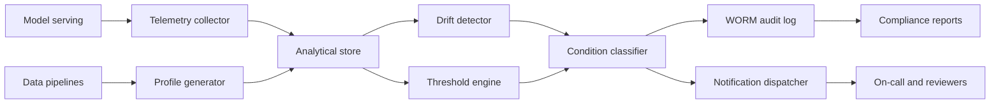

# Open-Source ML Monitoring for Regulated Teams: Architecture, Tradeoffs, and Controls

**Audience:** ML platform engineers, security and compliance leaders, data platform architects, open-source adopters in regulated industries, MLOps teams evaluating build-versus-buy  
**Canonical URL:** `/whitepapers/open-source-ml-monitoring-regulated-teams/`  
**Related papers:** Cendryva self-hosted ML observability; HIPAA-ready ML decision logs; model drift detection in regulated environments; the 12-Condition Framework  
**Author:** Cendryva  
**Published:** 2026-05-25  
**Version:** 1.0  
**License:** CC BY 4.0
**Contact:** research@cendryva.com

## Abstract

Open-source machine learning monitoring has matured rapidly. Teams now have credible options for drift detection, data quality validation, and lightweight observability, including Evidently, NannyML, Whylogs, and Arize Phoenix. These projects do good work and have legitimate places in a regulated ML stack. They also share gaps that matter when the deployment environment must satisfy HIPAA, SOC 2, SR 11-7, FedRAMP, or sector-specific audit expectations: limited or no immutable audit trail, weak tenant isolation, no built-in evidence trail for decision logs, and architectural assumptions that the monitoring layer can phone home to a hosted service.

This paper surveys the open-source ML monitoring landscape, identifies what each project does well, names the gaps that regulated teams should plan around, and proposes a build-versus-buy-versus-extend decision rubric. It positions Cendryva as the open-source-compatible option that was built for regulated teams from the start, with WORM audit logging, multi-tenant security, decision-grade evidence, and self-hosted deployment as defaults rather than enterprise upgrades.

## Executive Summary

The open-source ML monitoring landscape has three useful project families:

- **Drift and data quality libraries** (Evidently, NannyML, Whylogs). Strong at statistical drift detection, data validation, and report generation. Designed primarily as Python libraries that produce reports, dashboards, or signals consumed elsewhere.
- **Observability platforms with ML extensions** (Arize Phoenix, OpenInference, OpenTelemetry semantic conventions for GenAI). Strong at tracing, span collection, and the LLM application path. Less prescriptive about long-term evidence and regulated audit trails.
- **General observability stacks adapted to ML** (Prometheus, Grafana, OpenSearch, ClickHouse). Strong at metric storage, dashboarding, and search. Require teams to assemble ML-specific semantics on top.

What regulated teams typically need on top of any of these:

- An immutable, signed audit trail for model decisions, drift events, threshold breaches, and configuration changes.
- Multi-tenant isolation by organization, business unit, or regulated environment.
- Encrypted at rest and in transit by default, with key management under enterprise control.
- A path to air-gapped or restricted-network deployment.
- A self-hosted control plane that does not require a hosted vendor for incident response.
- A condition or state classifier so executive and audit reporting does not depend on screenshot interpretation.

Open-source projects can be extended to meet these requirements. The right choice depends on team capacity, deployment constraints, and how strict the audit posture must be. The honest options are: adopt OSS as-is and accept the gap, extend OSS to close the gap (own the integration and maintenance), or adopt a platform that ships the regulated defaults out of the box.

Cendryva is the third option, and it is itself open-source code that can be self-hosted.

## Why the Question Matters

Regulated teams have a real tension. Their security and audit teams want known, inspectable software that runs inside the organization's boundary. Their engineering teams want to move quickly and not rebuild commodity infrastructure. Their compliance teams want evidence that decisions, configuration changes, and incidents are reconstructable.

A pure SaaS ML monitoring vendor satisfies engineering velocity but creates data residency, third-party risk, and BAA negotiation overhead. A pure in-house build satisfies inspectability but spends engineering time on commodity work and rarely produces a documented audit posture.

Open-source monitoring tools sit in the middle. They are inspectable, they run inside the boundary, they reduce the amount of code the team must write, and they do not require a vendor relationship for the day-to-day. The question is whether the project as-is satisfies the regulated deployment, or whether the team has to extend it.

## The Open-Source Landscape

### Evidently AI

Evidently is a Python library for ML model evaluation, monitoring, and reporting. It computes drift, data quality, and model performance metrics, produces HTML reports and JSON outputs, and offers a self-hosted UI in the Evidently Cloud product.

Strengths:

- Mature drift metrics (Wasserstein, KS, PSI, JS divergence) with sensible defaults.
- Good documentation and active community.
- Library-first design means it integrates into existing pipelines easily.
- Report output is human-readable and useful for audit attachments.

Gaps for regulated teams:

- No built-in immutable audit log; teams must persist Evidently reports somewhere with the right retention and integrity properties.
- Multi-tenant separation is the consumer's responsibility.
- The Evidently Cloud hosted product is convenient but adds a SaaS boundary; the open-source library does not include the same UX.

### NannyML

NannyML focuses on post-deployment model performance estimation, particularly without ground truth available, and on multivariate drift detection.

Strengths:

- Confidence-based performance estimation (CBPE) is a real differentiator for environments where labels arrive late or not at all.
- Strong multivariate drift methods (PCA reconstruction error, domain classifier).
- Clean Python API and good integration with common ML stacks.

Gaps for regulated teams:

- Same library-first pattern: the team is responsible for storage, retention, signing, and access control.
- No built-in role-based access control or tenant isolation.
- No first-class condition or state classifier; output is metric-centric.

### Whylogs and WhyLabs

Whylogs is an open-source data logging library that produces statistical profiles of datasets, including ML model inputs and outputs. WhyLabs is the hosted product built on top of those profiles.

Strengths:

- Profile-based approach is efficient and privacy-friendly: the profile, not the raw data, is what flows to the monitoring backend.
- Cross-language support (Python and Java).
- Good fit for streaming environments where storing every record is impractical.

Gaps for regulated teams:

- The open-source library is excellent at profile generation; the monitoring backend is largely the hosted WhyLabs product.
- Self-hosted profile-based monitoring requires the team to build the consumer.

### Arize Phoenix and OpenInference

Phoenix is an open-source observability tool for LLMs and ML models, with tracing, evaluation, and prompt analytics. OpenInference is the related open standard for ML and LLM telemetry semantic conventions, complementing OpenTelemetry.

Strengths:

- Strong on LLM application telemetry: traces, spans, prompts, retrievals, evaluations.
- Open standards alignment with OpenTelemetry.
- Runs locally and self-hosted.

Gaps for regulated teams:

- Audit and evidence retention are not the primary design focus.
- Multi-tenant deployment is possible but not the default story.
- Coverage of classical ML telemetry (feature drift, prediction-versus-outcome reconciliation) is lighter than the LLM path.

### General-Purpose Observability Stacks

Prometheus and Grafana for metrics, OpenSearch or Elastic for logs, ClickHouse for analytical history, OpenTelemetry for traces. These tools can carry ML telemetry but do not provide ML-specific semantics. The team writes the drift detector, the decision log schema, the condition classifier, the BAA-compatible deployment topology, and the audit retention policy.

Strengths:

- Battle-tested at scale.
- Inspectable and self-hosted by default.
- Rich integration ecosystem.

Gaps for regulated teams:

- Everything ML-specific is a team responsibility.
- Audit trail and evidence semantics need to be designed.
- Without discipline, the resulting stack drifts into "we have a Grafana dashboard" territory rather than "we can answer auditor questions."

## What Regulated Teams Need on Top

Across the projects above, regulated deployments converge on a similar set of additional requirements.

### Immutable Decision and Drift Log

Auditors and model risk teams want a record of model decisions and drift events that cannot be silently rewritten. The record should include the model version, input summary, output, threshold or condition state, actor, and timestamp, with cryptographic chaining or signing to support integrity verification.

Most OSS monitoring projects produce events but rely on the consumer to provide WORM persistence and signing.

### Multi-Tenant Isolation

Regulated platforms often serve multiple organizations, business units, or regulated environments. A monitoring deployment must keep their data, dashboards, and configuration distinct. Logical isolation through organization filtering is acceptable for some deployments; dedicated infrastructure is required for others.

Most OSS monitoring projects support single-tenant deployments well and treat multi-tenancy as a deployer concern.

### Encryption and Key Management

Encryption in transit is universally supported. Encryption at rest with customer-managed keys is variable. Column-level encryption for sensitive fields is rare. Vault or KMS integration is usually a "configure it yourself" exercise.

### Self-Hosted and Air-Gapped Deployment

The control plane must be runnable inside the organization's network with no required calls to a vendor service for normal operation. Air-gapped deployments need offline-compatible release artifacts, private container registries, and no telemetry that escapes the boundary.

### Condition Classification and Executive Summaries

Boards, auditors, and executives do not want to read drift scores. They want named states: NORMAL, DANGER, EMERGENCY. A condition classifier sits between the metric and the human report, and most OSS monitoring projects leave this layer to the team.

### Compliance-Specific Hooks

HIPAA Security Rule controls, SOC 2 Trust Service Criteria mapping, SR 11-7 model risk evidence, and FedRAMP control alignment all benefit from explicit hooks: BAA-aware deployment, breach notification timers, disclosure accounting, and signed control evidence. These are not the responsibility of a drift library, but they need a home somewhere in the stack.

## Build vs. Buy vs. Extend

A practical decision rubric:

| Question | Lean toward OSS as-is | Lean toward extending OSS | Lean toward a regulated platform |
|---|---|---|---|
| Is the deployment subject to HIPAA, SOC 2, SR 11-7, or FedRAMP? | No, internal use | Yes, with strong existing audit infrastructure | Yes, no existing audit infrastructure |
| Does the team have spare platform engineering capacity? | Yes, large | Yes, moderate | No |
| Will the deployment be air-gapped or restricted-network? | No | Maybe | Yes |
| Is multi-tenancy required? | No | Single-organization | Multi-org or multi-business-unit |
| Is an immutable decision log required for audit? | No | Yes, will build | Yes, want it out of the box |
| Is condition or state classification needed for executive reporting? | No | Yes, will build | Yes, want it out of the box |
| Is there budget for a vendor relationship? | No | Mixed | Yes |

The honest assessment is that for many small-to-mid regulated teams, the OSS-as-is path produces a monitoring layer that works but does not satisfy audit, and the OSS-extension path consumes more platform engineering than the team initially expected. The platform path makes sense when the regulated defaults are the reason the team is buying, not a wishlist item.

## Where Cendryva Fits

Cendryva is open-source code that can be self-hosted, with regulated defaults out of the box:

- WORM audit log with cryptographic chaining and Vault-backed signing.
- Multi-tenant data model with row-level security in PostgreSQL.
- ClickHouse-backed analytical history with column-level AES-GCM encryption for sensitive columns.
- Static, dynamic, and seasonal threshold layer with condition classification.
- 12-Condition Framework as the operator-facing state taxonomy.
- HIPAA controls catalog with a mapping report binary.
- ONNX-based inference with versioned model registry and promotion controls.
- Kubernetes and Terraform packaging for private-cloud deployment.

The intent is not to replace Evidently, NannyML, Whylogs, or Phoenix. The drift libraries in particular are useful for offline reporting and pipeline integration. Cendryva is the platform that the regulated team would otherwise have to assemble on top.

## Architecture Pattern for Regulated OSS Monitoring



The pattern works whether the drift detector is Evidently, NannyML, or Cendryva's own. What matters is that drift events land in an audit-grade store, that the classifier produces a stable state taxonomy, and that the audit log has the integrity properties the deploying jurisdiction expects.

## How Cendryva Applies This Pattern

The Cendryva implementation of the regulated-OSS pattern is the platform itself.

- Drift detection: `apps/api/src/services/ml/drift-statistics.ts` and `apps/api/src/services/ml/model-monitoring.service.ts`.
- Threshold engine: `src/statistics/thresholds/` (static, dynamic, seasonal).
- Condition classification: `apps/api/src/services/12-conditions/state-machine.ts`.
- Audit log: `apps/api/src/services/domains/audit/immutable-audit-log.service.ts`, `src/data/audit_logs.rs`.
- Vault-backed signing: `apps/api/src/services/platform/vault/vault.service.ts`, `apps/api/src/services/domains/audit/audit-signing-key-provider.ts`.
- ClickHouse analytical history: `src/clickhouse/schema.rs`, `migrations/clickhouse/`.
- HIPAA controls catalog: `src/compliance/hipaa.rs`, `src/bin/hipaa_report.rs`.

Teams that already use Evidently, NannyML, or Whylogs can stream their drift events into the Cendryva audit and threshold layer rather than swapping out the detector.

## Implementation Checklist

For a team evaluating open-source ML monitoring for a regulated deployment:

- Map the regulated controls the deployment must satisfy.
- Identify which controls the OSS project does and does not address out of the box.
- Decide whether the team will extend the OSS, adopt a platform, or build in-house.
- For each regulated control gap, name the owner and the implementation plan.
- For multi-tenant deployments, design the tenancy model before adopting the tool.
- Establish a WORM audit log before drift detection produces evidence.
- Establish a condition or state classifier before the executive review starts.
- Pick a deployment topology that satisfies network and key management constraints.
- Schedule the compliance review of the monitoring stack as part of the rollout.

## Conclusion

Open-source ML monitoring is real and useful. Evidently, NannyML, Whylogs, and Phoenix all do credible work in their lanes. Teams should not treat "open source" as a synonym for "audit-ready," and they should not treat "regulated" as a synonym for "must buy SaaS."

The honest decision for a regulated team is to map the gap between the OSS project and the audit, tenancy, encryption, and self-hosting requirements of the deployment, and to choose between extending the OSS, adopting a platform built for the regulated case, or assembling a custom stack. Each path has real costs.

Cendryva is built for the regulated case from the beginning. It is open-source code, it runs inside the organization's boundary, and it ships WORM audit, multi-tenant security, condition classification, and HIPAA-aware deployment patterns as defaults rather than upgrades. For teams whose regulated controls are the binding constraint, that bundle is usually cheaper than the extension path.

## Implementation Status

This section maps the architectural claims above to the Cendryva codebase as of the publication date in the header.

**WORM audit log** — SHIPPED
- Code: `apps/api/src/services/domains/audit/immutable-audit-log.service.ts`, `apps/api/src/services/domains/audit/audit.service.ts`, `apps/api/src/services/domains/audit/audit-log-integrity.service.ts`, `src/data/audit_logs.rs`.
- Schema: `migrations/postgres/V002__Audit_Trail_And_Logs.sql` (WORM columns plus chain table and trigger).
- Tests: 52 audit tests plus 5 Postgres integration WORM tests.

**Vault-backed signing** — SHIPPED
- Code: `apps/api/src/services/platform/vault/vault.service.ts`, `apps/api/src/services/domains/audit/audit-signing-key-provider.ts`, `apps/api/src/services/domains/audit/audit-signing-key-provider.factory.ts`.
- Notes: Ed25519 signing with key material managed in Vault.

**Multi-tenant data model** — SHIPPED
- Schema: `migrations/postgres/V001__Identity_And_Tenancy.sql`, `migrations/postgres/V006__ML_Schema_And_RLS.sql` (row-level security on ML tables).
- Notes: Postgres RLS policies enforce organization scoping at the database layer.

**Drift detection (KS, PSI, JS divergence)** — SHIPPED
- Code: `apps/api/src/services/ml/drift-statistics.ts`, `apps/api/src/services/ml/model-monitoring.service.ts`.
- Tests: 48 drift tests.
- Notes: Drift events flow to the WORM audit log via `apps/api/src/services/ml/audit-log.audit-sink.ts`.

**Threshold engine (static, dynamic, seasonal)** — SHIPPED
- Code: `src/statistics/thresholds/static_threshold.rs`, `src/statistics/thresholds/dynamic.rs`, `src/statistics/thresholds/seasonal.rs`.

**12-Condition state machine** — SHIPPED
- Code: `apps/api/src/services/12-conditions/state-machine.ts`, `apps/api/src/services/12-conditions/evaluators.ts`.
- Tests: 100+ tests in the `12-conditions/` directory.

**ClickHouse analytical history with column encryption** — SHIPPED
- Code: `src/clickhouse/schema.rs`, `src/clickhouse/encryption.rs`, `src/clickhouse/retention.rs`.
- Migrations: `migrations/clickhouse/` (28+ migrations covering inference logs, anomaly scores, alerts, feature samples).

**HIPAA controls catalog** — SHIPPED
- Code: `src/compliance/hipaa.rs` (64 entries), `src/bin/hipaa_report.rs`, `apps/api/src/services/domains/compliance/`.
- Notes: Catalog generates a mapping report. The compliance services include BAA tracking (`baa.service.ts`), breach notification (`breach-notification.service.ts`), and disclosure accounting (`disclosure-accounting.service.ts`).

**Self-hosted packaging** — SHIPPED
- Code: 26 Kubernetes manifests under `infrastructure/k8s/`, Terraform under `infrastructure/terraform/`, `Dockerfile`, `docker-compose.yml`, `docker-compose.gpu.yml`.

**Deferred**
- Native ingestion adapters for Evidently and NannyML report output (current pattern is to call the Cendryva API directly; a thin adapter that reads Evidently JSON would make migration easier).
- A documented OpenInference / OpenTelemetry semantic mapping for Cendryva spans (the telemetry stack uses OpenTelemetry already; a published mapping is a documentation task).
- Pre-built dashboards that mirror common Evidently report layouts to ease side-by-side adoption.

**How to verify locally**

```
cargo test --lib
pnpm --filter @cendryva/api test
cargo run --bin hipaa_report
```

## Scope and Limitations

This is a vendor-authored paper from Cendryva. It surveys the open-source ML monitoring landscape from the perspective of a regulated deployment and explains where Cendryva fits. It is not a vendor-neutral benchmark, not an endorsement or criticism of the named projects, and not a procurement recommendation.

**In scope.** Categorization of open-source ML monitoring projects, the regulated-deployment requirements that commonly sit on top of any monitoring layer, a build-versus-buy-versus-extend decision rubric, and the Cendryva architectural pattern.

**Out of scope.** Performance benchmarks of any named project. Feature-by-feature checklists for each project version. Specific integration code for each project. Pricing analyses of hosted products.

**Project descriptions are current as of the publication date.** Evidently, NannyML, Whylogs, Phoenix, and the OpenTelemetry semantic conventions all evolve. Re-verify capabilities at the time of evaluation. The named gaps for regulated teams reflect publicly available documentation at the publication date and may close in future releases.

**Not legal or compliance advice.** HIPAA, SOC 2, SR 11-7, FedRAMP, and sector-specific obligations require qualified counsel, accredited assessors, and the applicable regulator's guidance. The mapping suggestions in this paper are architectural, not legal.

## References and Further Reading

Open-source ML monitoring projects

- Evidently AI. *Evidently documentation*. https://docs.evidentlyai.com/
- NannyML. *NannyML documentation*. https://nannyml.readthedocs.io/
- WhyLabs. *Whylogs documentation*. https://whylogs.readthedocs.io/
- Arize AI. *Arize Phoenix documentation*. https://docs.arize.com/phoenix
- OpenInference. *OpenInference specification*. https://github.com/Arize-ai/openinference

Observability standards

- OpenTelemetry. *OpenTelemetry specification and semantic conventions*. https://opentelemetry.io/docs/
- Cloud Native Computing Foundation. *Cloud Native Observability landscape*. https://landscape.cncf.io/

MLOps and production ML

- Google Cloud. *MLOps: Continuous delivery and automation pipelines in machine learning*. https://cloud.google.com/architecture/mlops-continuous-delivery-and-automation-pipelines-in-machine-learning
- Sculley, D. et al. *Hidden Technical Debt in Machine Learning Systems*. NeurIPS, 2015. https://papers.nips.cc/paper/5656-hidden-technical-debt-in-machine-learning-systems
- Polyzotis, N. et al. *Data Validation for Machine Learning*. SysML, 2019.

Regulated deployment frameworks

- NIST. *AI Risk Management Framework (AI RMF 1.0)*. 2023. https://www.nist.gov/itl/ai-risk-management-framework
- AICPA. *SOC 2 Trust Services Criteria*. https://www.aicpa-cima.com/
- US Department of Health and Human Services. *HIPAA Security Rule, 45 CFR Part 164 Subpart C*. https://www.hhs.gov/hipaa/for-professionals/security/index.html
- FedRAMP Program Management Office. *FedRAMP Security Controls Baselines*. https://www.fedramp.gov/

Cendryva foundations

- Cendryva. *Cendryva: A Self-Hosted ML Observability Platform for Regulated Enterprises*. https://cendryva.com/whitepapers/self-hosted-ml-observability/
- Cendryva. *Designing HIPAA-Ready ML Systems With Immutable Decision Logs*. https://cendryva.com/whitepapers/hipaa-ready-ml-decision-logs/
