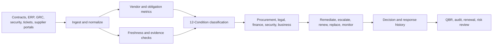

# Procurement and Vendor Risk Operations Maturity Model

**Format:** Maturity model  
**Audience:** Procurement leaders, vendor risk teams, third-party risk managers, finance operations, legal operations, security teams, supply-chain leaders  
**Canonical URL:** `/whitepapers/procurement-vendor-risk-operations-maturity-model/`  
**Related papers:** AI governance risk register; nonprofit and grant impact operations scorecard; sustainability operations field guide; Cendryva self-hosted ML observability  
**Author:** Cendryva  
**Published:** 2026-05-25  
**Version:** 1.0  
**License:** CC BY 4.0
**Contact:** research@cendryva.com

## Purpose

Procurement and vendor risk programs often operate on point-in-time reviews: onboarding questionnaires, contract approvals, annual assessments, spreadsheet trackers, and periodic business reviews. Those controls matter, but they do not show whether a vendor, supplier, contract, or service obligation is healthy today.

This maturity model gives procurement, legal, finance, security, and operations teams a practical path from static vendor records to continuous vendor operations observability.

Cendryva helps organizations monitor vendor performance, obligation evidence, data freshness, SLA risk, delivery exceptions, third-party AI use, and recurring supplier liabilities in one condition-aware operating layer.

## Maturity Model Overview

| Level         | Operating state                                                      | Typical behavior                                                   | Cendryva contribution                            |
| ------------- | -------------------------------------------------------------------- | ------------------------------------------------------------------ | ------------------------------------------------ |
| 1. Ad Hoc     | Vendor data scattered across teams                                   | Reactive follow-up after failures                                  | Central signal inventory and owner mapping       |
| 2. Recorded   | Vendor records and contracts are tracked                             | Reviews happen on schedule but remain point-in-time                | Freshness and missing-evidence monitoring        |
| 3. Monitored  | Key obligations and signals are watched                              | Teams see SLA and performance degradation earlier                  | 12-Condition classification and alerts           |
| 4. Integrated | Procurement, legal, finance, security, and operations share evidence | Response workflows are routed and logged                           | Decision evidence and cross-functional playbooks |
| 5. Predictive | Vendor risk and performance are continuously improved                | Chronic liabilities and emerging risks are forecast and remediated | Drift, anomaly, and recurring-liability analysis |

## Level 1: Ad Hoc Vendor Operations

At this level, vendor data exists but is fragmented. Procurement has contract terms. Finance has spend. Security has questionnaires. Operations has performance complaints. Legal has obligations. Business owners have informal knowledge.

**Symptoms**

- unclear vendor owner
- manual follow-up for missing evidence
- contract obligations not operationalized
- service failures discovered by business users
- supplier performance discussed only during escalations
- no shared view of vendor health

**Cendryva next step**

Create a vendor signal inventory. Connect basic owner, contract, service, spend, support, SLA, and risk signals. Establish which data sources must report and how often.

## Level 2: Recorded Vendor Risk

At this level, vendor records exist, but they are mostly static. Teams know who the vendor is, what contract applies, and when the next assessment is due. The problem is that the operating reality can change between reviews.

**Signals to monitor**

- contract renewal date
- required evidence due date
- insurance or certification expiration
- security questionnaire status
- data processing agreement status
- service owner assignment
- spend category
- invoice exception rate
- support escalation count

**Cendryva next step**

Classify missing or stale evidence as NON_EXISTENCE or DOUBT. Route DANGER conditions to procurement, legal, security, or business owners before renewals or audits force a scramble.

## Level 3: Monitored Vendor Performance

At this level, vendors are monitored against operational expectations: uptime, delivery, support response, defect rates, milestone completion, invoice quality, service credits, and customer impact.

**Signals to monitor**

- SLA attainment
- incident volume
- late delivery rate
- defect rate
- support response time
- invoice dispute rate
- order fill rate
- milestone completion
- customer-impacting events
- repeat exception category

**Cendryva next step**

Apply the 12-Condition Framework. A vendor can be NORMAL, BELOW_NORMAL, DANGER, or LIABILITY depending on performance pattern. A missing SLA feed becomes NON_EXISTENCE rather than invisible. A rapid improvement after remediation can become POWER_CHANGE.

## Level 4: Integrated Third-Party Operations

At this level, vendor risk is no longer owned by one team. Procurement, security, legal, finance, operations, and business owners share evidence and response workflows.

**Integrated workflows**

- onboarding approval
- data access review
- security exception remediation
- SLA breach escalation
- contract renewal review
- supplier corrective action
- business continuity review
- AI/vendor model review
- offboarding evidence

**Cendryva next step**

Connect conditions to playbooks. Preserve who reviewed the issue, what evidence was available, what action was taken, and whether the vendor improved. This turns vendor management from periodic assessment into operating governance.

## Level 5: Predictive Vendor Resilience

At this level, the organization uses historical signal patterns to identify emerging vendor risk and recurring liabilities before failure.

**Advanced signals**

- SLA drift
- invoice anomaly
- support sentiment
- delivery trend
- concentration risk
- source freshness trend
- security finding recurrence
- supplier financial or capacity signal
- operational dependency map
- subcontractor or fourth-party signal where available

**Cendryva next step**

Use anomaly detection, drift monitoring, recurring-liability analysis, and condition history to identify vendors that require remediation, backup planning, renegotiation, or replacement.

## Supplier and Vendor Signal Catalog

| Signal family | Example measures                                          | Operational meaning                            |
| ------------- | --------------------------------------------------------- | ---------------------------------------------- |
| Contract      | renewal, obligations, service credits, termination rights | Controls commercial and legal exposure         |
| Compliance    | certifications, insurance, audit evidence, questionnaires | Indicates required evidence status             |
| Security      | findings, patch status, access review, incident notices   | Tracks cyber and data risk                     |
| Performance   | SLA, uptime, delivery, defect, response time              | Measures service reliability                   |
| Finance       | spend, invoice disputes, budget variance                  | Shows financial control and leakage            |
| Operations    | escalations, user complaints, support backlog             | Reveals lived service quality                  |
| Data quality  | freshness, completeness, schema changes                   | Prevents false confidence in vendor dashboards |
| AI use        | model version, automation scope, decision evidence        | Governs AI-enabled third-party workflows       |

## Condition Model for Vendor Operations

| Condition     | Vendor operations interpretation                                 |
| ------------- | ---------------------------------------------------------------- |
| POWER         | Vendor materially exceeds service or improvement expectations    |
| AFFLUENCE     | Strong favorable vendor performance                              |
| ABUNDANCE     | Excess capacity or service buffer                                |
| NORMAL        | Vendor operating within expected range                           |
| BELOW_NORMAL  | Mild degradation or early warning                                |
| DANGER        | Material service, compliance, security, or delivery risk         |
| EMERGENCY     | Immediate business, security, or continuity impact               |
| NON_EXISTENCE | Missing contract evidence, SLA feed, owner, or required artifact |
| DOUBT         | Low-confidence, conflicting, or stale vendor evidence            |
| CHANGE        | Rapid shift in vendor behavior, spend, risk, or delivery         |
| POWER_CHANGE  | Rapid improvement after remediation                              |
| LIABILITY     | Chronic vendor burden, unresolved issue, or recurring exception  |

## Cendryva Operating Architecture

## What Cendryva Delivers

For procurement and vendor risk operations, Cendryva delivers:

- vendor and supplier signal ingestion
- contract and obligation evidence monitoring
- source freshness and missing-evidence detection
- SLA and performance condition monitoring
- security, privacy, and compliance signal context
- 12-Condition classification
- recurring liability analysis
- response playbooks across procurement, legal, finance, security, and operations
- decision and remediation evidence
- renewal and audit-ready summaries
- self-hosted deployment options for sensitive vendor data

The value is operating control: Cendryva helps teams know which vendors are healthy, which obligations are missing evidence, which risks are getting worse, and which actions improved vendor performance.

## Readiness Questions

1. Can the organization identify every critical vendor owner?
2. Can missing required evidence be detected automatically?
3. Can SLA deterioration be seen before renewal or escalation?
4. Can vendor incidents be tied to business impact?
5. Can procurement, legal, finance, security, and business owners see the same condition history?
6. Can chronic vendor issues be classified as liabilities?
7. Can third-party AI workflows be traced to version, decision, and evidence?
8. Can vendor improvement after remediation be measured?
9. Can audit and renewal packages be generated from operating evidence?
10. Can the organization distinguish a temporary issue from a vendor resilience problem?

## Scope and Limitations

This is a vendor-authored paper published by Cendryva. It reflects the operating model that Cendryva builds toward and is intended to be useful to procurement, third-party risk, security, legal, finance, and operations teams who are evaluating how to mature their vendor risk programs. It is not a neutral analyst report.

**In scope.** Operational signals, maturity stages, vendor lifecycle activities (onboarding, monitoring, renewal, offboarding), evidence handling, and the application of the 12-Condition Framework to third-party risk. The maturity model is descriptive and prescriptive at the program level, not at the level of any specific tool, regulator, or contract clause.

**Out of scope.** Specific contract language, indemnification structures, insurance attachment points, jurisdiction-specific procurement law, cross-border data transfer mechanics, sanctions screening implementation, ESG disclosure regimes, and fourth-party (subcontractor of subcontractor) discovery techniques. Pricing, commercial negotiation tactics, and category strategy are also out of scope.

**This is not legal, regulatory, or compliance advice.** Third-party risk programs operate inside specific legal and regulatory regimes. Readers in regulated sectors should consult qualified counsel and their primary regulator before applying any pattern in this paper to live programs. References to frameworks such as NIST SP 800-161, ISO/IEC 27036, SOC 2, DORA, or shared assessment questionnaires are intended as orientation, not as authoritative guidance.

**Time-bounded items.** Regulatory references (for example DORA scope and timelines, NIST SP revisions, SOC 2 trust services criteria editions, ISO standard editions) evolve. Confirm current versions before relying on any reference here. The maturity model itself is expected to evolve as vendor operations practice matures and as AI supplier and fourth-party risk patterns become better understood.

**Empirical claims.** The maturity levels, signal catalogs, and condition mappings in this paper are illustrative reference patterns drawn from operating practice. They are not the output of a controlled benchmarking study across customer programs. Quantitative claims about adoption, lift, or risk reduction are intentionally avoided in this version.

**Jurisdiction.** Examples and standards referenced are oriented to programs that operate under a mix of US federal frameworks (NIST), EU regimes (DORA, GDPR adjacent obligations), and globally portable standards (ISO/IEC, SOC 2). Country-specific procurement law (for example public-sector procurement directives) is out of scope.

## References and Further Reading

Procurement and third-party risk frameworks

- Shared Assessments. *Standardized Information Gathering (SIG) Questionnaire*. Current edition. https://sharedassessments.org/sig/
- American Institute of CPAs (AICPA). *SOC 2 Trust Services Criteria*. Current edition. https://www.aicpa-cima.com/
- ISO/IEC. *ISO/IEC 27036: Information security for supplier relationships*. Multi-part standard. https://www.iso.org/standard/59648.html

Supply chain risk and operational resilience

- NIST. *SP 800-161 Rev. 1: Cybersecurity Supply Chain Risk Management Practices for Systems and Organizations*. 2022. https://csrc.nist.gov/pubs/sp/800/161/r1/upd1/final
- NIST. *Cybersecurity Framework 2.0 Quick-Start Guide for Cybersecurity Supply Chain Risk Management (C-SCRM)*. 2024. https://csrc.nist.gov/pubs/sp/1305/final
- ISO. *ISO 28000:2022 Supply Chain Security Management Systems*. 2022. https://www.iso.org/standard/79612.html
- European Union. *Digital Operational Resilience Act (Regulation (EU) 2022/2554, DORA)*. 2022. https://eur-lex.europa.eu/eli/reg/2022/2554/oj

Maturity model methodology

- ISACA / CMMI Institute. *CMMI Model Methodology*. Current edition. https://cmmiinstitute.com/
- Software Engineering Institute, Carnegie Mellon. *Capability Maturity Model foundational publications*. Historical reference for staged maturity modeling.

Privacy and adjacent governance

- NIST. *Privacy Framework*. https://www.nist.gov/privacy-framework
