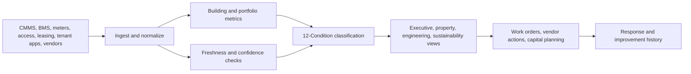

# Property Operations Observability Dashboard Specification

**Format:** Dashboard specification  
**Audience:** Commercial real estate operators, multifamily owners, facilities teams, campus operations, property technology leaders, asset managers  
**Canonical URL:** `/whitepapers/property-operations-observability-dashboard-specification/`  
**Related papers:** Sustainability operations field guide; energy and utilities observability; real-time statistical monitoring for live operations; the 12-Condition Framework  
**Author:** Cendryva  
**Published:** 2026-05-25  
**Version:** 1.0  
**License:** CC BY 4.0
**Contact:** research@cendryva.com

## Specification Goal

Commercial buildings, multifamily portfolios, campuses, and mixed-use properties generate constant operational signals: occupancy, work orders, energy use, HVAC performance, indoor environmental quality, access events, tenant requests, vendor work, lease obligations, inspections, and capital projects.

Most property teams already have dashboards. What they often lack is a shared operating view that explains which buildings are healthy, which signals are missing, which vendors or assets need action, and which issues are chronic liabilities.

Cendryva provides the observability layer for property operations. It turns building, tenant, energy, vendor, and asset signals into conditions, routes response to owners, monitors data freshness, and preserves evidence of corrective action.

## Dashboard North Star

The dashboard should answer five questions in under one minute:

1. Which properties are in DANGER or EMERGENCY?
2. Which data feeds are stale or missing?
3. Which issues are chronic liabilities rather than one-off incidents?
4. Which vendors, assets, or teams own the next action?
5. Which corrective actions improved building performance?

## Executive Portfolio View

| Widget                  | Purpose                                         | Cendryva signal logic                               |
| ----------------------- | ----------------------------------------------- | --------------------------------------------------- |
| Portfolio condition map | Show health by property, region, or asset class | 12-Condition rollup across critical signals         |
| Energy variance         | Identify buildings drifting from target         | Statistical threshold and benchmark comparison      |
| Work-order risk         | Surface aging or recurring maintenance issues   | DANGER and LIABILITY classification                 |
| Tenant experience       | Track request volume, response time, sentiment  | Condition by tenant, building, and service category |
| Indoor environment      | Monitor comfort, IAQ, temperature, humidity     | BELOW_NORMAL, DANGER, or DOUBT by zone              |
| Vendor performance      | Show contractor delays and repeat issues        | SLA and evidence history                            |
| Data confidence         | Show missing meter, BMS, CMMS, or access feeds  | NON_EXISTENCE and DOUBT detection                   |

## View 1: Building Health

**Primary users:** asset managers, regional property leaders, facilities directors

**Signals**

- occupancy trend
- work-order volume
- work-order aging
- energy use intensity
- water use
- HVAC alarms
- elevator/escalator faults
- access-control exceptions
- tenant request volume
- inspection status
- vendor open items

**Cendryva behavior**

- Classify each building as NORMAL, BELOW_NORMAL, DANGER, EMERGENCY, or LIABILITY.
- Separate acute service issues from chronic maintenance burdens.
- Show confidence level when data feeds are stale.
- Preserve response and remediation history.

## View 2: Maintenance and Work Orders

**Primary users:** facilities managers, engineering teams, vendor managers

**Signals**

- open work orders
- aging by category
- repeat issue rate
- asset downtime
- emergency work orders
- preventive maintenance completion
- vendor assignment status
- parts availability
- tenant-impacting delay

**Cendryva behavior**

- Mark chronic repeat failures as LIABILITY.
- Trigger DANGER when aging exceeds operating threshold.
- Treat missing vendor updates as NON_EXISTENCE.
- Connect work-order history to asset condition and tenant impact.

## View 3: Energy, Water, and Sustainability

**Primary users:** sustainability teams, facilities leaders, asset managers, finance

ENERGY STAR Portfolio Manager is widely used for benchmarking commercial building energy performance and tracking metrics such as energy, water, waste, and 1-100 scores for eligible property types. Operational teams need the live layer underneath periodic benchmarking.

**Signals**

- electricity use
- gas use
- water use
- peak demand
- energy intensity
- occupancy-adjusted consumption
- utility data freshness
- equipment runtime
- weather-adjusted variance
- waste diversion where available

**Cendryva behavior**

- Identify abnormal energy or water drift before monthly reporting.
- Flag missing utility or meter feeds.
- Classify chronic waste or energy variance as LIABILITY.
- Preserve corrective-action evidence such as controls tuning or equipment repair.

## View 4: Indoor Environmental Quality and Comfort

**Primary users:** facilities teams, workplace experience teams, property managers

OSHA guidance on indoor air quality highlights building operations and management factors such as maintenance, housekeeping, renovation, and energy efficiency. Property teams need continuous visibility into comfort and environmental conditions without over-collecting occupant data.

**Signals**

- temperature
- humidity
- CO2 where available
- ventilation status
- comfort complaints
- zone-level HVAC alarms
- air handling unit faults
- filter maintenance
- renovation or construction activity
- occupancy proxy freshness

**Cendryva behavior**

- Classify zone conditions into NORMAL, BELOW_NORMAL, DANGER, or DOUBT.
- Treat conflicting sensor and complaint data as DOUBT.
- Route environmental conditions to facilities owners.
- Preserve evidence of response and recurrence.

## View 5: Tenant and Resident Experience

**Primary users:** property managers, tenant experience teams, multifamily operators, campus services

**Signals**

- service request volume
- first response time
- resolution time
- reopen rate
- complaint category
- amenity availability
- access or parking issues
- move-in/move-out task status
- communication response
- satisfaction score where available

**Cendryva behavior**

- Detect service degradation by building, tenant, floor, or unit group.
- Classify high-impact tenant issues as DANGER.
- Identify recurring experience gaps as LIABILITY.
- Link tenant-impacting work orders to response evidence.

## View 6: Space, Occupancy, and Privacy

**Primary users:** workplace teams, campus planners, asset managers, privacy/security teams

BOMA standards support consistent building measurement practices used in leasing, benchmarking, valuation, and space-use analysis. Occupancy and space-use data can improve operations, but it can also raise privacy concerns when tied too closely to individuals.

**Signals**

- occupancy count or proxy
- space utilization
- reservation data
- access trend
- floor or zone density
- meeting room usage
- vacancy trend
- lease and area metadata

**Cendryva behavior**

- Monitor occupancy at useful aggregation levels.
- Avoid unnecessary individual-level exposure in portfolio dashboards.
- Apply role-based access to sensitive space-use views.
- Treat stale occupancy feeds as DOUBT or NON_EXISTENCE.

## Condition Model for Property Operations

| Condition     | Property operations meaning                                   |
| ------------- | ------------------------------------------------------------- |
| POWER         | Exceptional building or service improvement                   |
| AFFLUENCE     | Strong favorable operating state                              |
| ABUNDANCE     | Excess capacity or resource buffer                            |
| NORMAL        | Building or service operating within expected range           |
| BELOW_NORMAL  | Early degradation in service, asset, or comfort               |
| DANGER        | Material tenant, asset, energy, or vendor risk                |
| EMERGENCY     | Immediate safety, access, outage, or service failure          |
| NON_EXISTENCE | Missing meter, BMS, CMMS, vendor, or occupancy signal         |
| DOUBT         | Low-confidence or conflicting building evidence               |
| CHANGE        | Rapid shift in occupancy, energy, requests, or asset behavior |
| POWER_CHANGE  | Rapid improvement after remediation                           |
| LIABILITY     | Chronic maintenance, vendor, energy, or experience burden     |

## Cendryva Dashboard Architecture

## What Cendryva Delivers

For property operations, Cendryva delivers:

- multi-source building signal ingestion
- portfolio, building, floor, zone, asset, and vendor context
- source freshness and missing-feed detection
- 12-Condition classification
- work-order and asset liability analysis
- energy and water drift monitoring
- indoor environmental quality condition tracking
- tenant and resident experience monitoring
- vendor performance evidence
- privacy-aware occupancy views
- executive and operator dashboards
- self-hosted deployment options for sensitive property data

The value is operational: Cendryva helps property teams identify building risk earlier, separate stale feeds from healthy operation, prioritize chronic liabilities, and prove which corrective actions improved portfolio performance.

## Dashboard Acceptance Criteria

1. Executive users can identify DANGER and EMERGENCY properties in one view.
2. Operators can see whether each critical data source is fresh.
3. Work-order, energy, tenant, and vendor signals can be viewed by building and portfolio.
4. Chronic liabilities are visible separately from acute incidents.
5. Occupancy and tenant data are privacy-aware and role-restricted.
6. Corrective actions are linked to condition changes.
7. Sustainability and finance teams can access evidence for energy and water variance.
8. Vendors can be evaluated by response and recurrence history.
9. Asset managers can distinguish underperforming buildings from missing data.
10. Leadership can review trend history without asking each department for a separate export.

## Scope and Limitations

This is a vendor-authored paper published by Cendryva. It describes a dashboard specification pattern that Cendryva supports and recommends. It is not a vendor-neutral RFP template or an analyst comparison of building observability products.

**In scope.** Operational dashboard structure for portfolio-level property operations, signal catalogs by view (building health, maintenance, energy, indoor environment, tenant experience, occupancy), the application of 12-Condition classification to building signals, and freshness handling for property data feeds. The specification is written at the operating-pattern level so it can apply to commercial office, multifamily, mixed-use, campus, and similar portfolios.

**Out of scope.** Specific BMS or CMMS product configuration, control-system engineering (sequences of operation, control loops, commissioning details), building automation network design, fire and life safety system integration, structural and capital project management workflows, leasing CRM specifics, and tenant billing systems. Detailed sustainability accounting (for example GHG Protocol Scope 1/2/3 boundary setting) is referenced but not specified here.

**This is not engineering, code compliance, or legal advice.** Energy, IAQ, occupancy, and life safety operations are governed by building codes, local regulations, lease agreements, and engineering standards that vary by jurisdiction and building type. Confirm any operating threshold, alert routing, or environmental setpoint with qualified building engineers and counsel before relying on it.

**Time-bounded items.** Standards referenced (for example ASHRAE 90.1, LEED rating systems, ENERGY STAR scoring, BOMA measurement methods) are versioned. Editions change. Confirm the current edition before using a reference here as the basis for measurement or reporting.

**Empirical claims.** The dashboard views, signal lists, and condition mappings in this paper are illustrative reference patterns. They are not the output of a controlled study across a benchmark portfolio. Quantitative claims about portfolio savings, comfort improvement, or work-order throughput are intentionally avoided in this version.

**Jurisdiction.** References lean toward US-oriented standards (ASHRAE, ENERGY STAR Portfolio Manager, OSHA IAQ guidance, BOMA) alongside globally used certifications (LEED, Brick Schema, Project Haystack). Non-US energy disclosure regimes (for example UK MEES, EU EPBD) are not specified but the same dashboard pattern is portable to them.

## References and Further Reading

Building measurement and benchmarking

- BOMA International. *Standard Methods of Measurement (Office, Industrial, Multi-Unit Residential, Mixed Use, Retail, Gross Areas of a Building)*. Current editions. https://boma.org/boma-standards/
- ENERGY STAR. *Portfolio Manager*. US EPA. https://www.energystar.gov/buildings/benchmark
- IFMA. *Benchmarks Reports and Facility Management Research*. International Facility Management Association. https://www.ifma.org/

Energy, sustainability, and indoor environment

- ASHRAE. *Standard 90.1: Energy Standard for Sites and Buildings Except Low-Rise Residential Buildings*. Current edition. https://www.ashrae.org/
- USGBC. *LEED v4.1 Operations and Maintenance Rating System*. US Green Building Council. https://www.usgbc.org/leed
- US OSHA. *Indoor Air Quality in Commercial and Institutional Buildings*. https://www.osha.gov/indoor-air-quality

Building data semantics

- Brick Consortium. *Brick Schema: A uniform metadata schema for buildings*. https://brickschema.org/
- Project Haystack. *Open source tagging conventions for building equipment and operational data*. https://project-haystack.org/

Privacy

- NIST. *Privacy Framework*. https://www.nist.gov/privacy-framework
