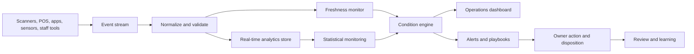

# Real-Time Statistical Monitoring for Live Operations

**Audience:** Venue operators, hospitality groups, travel platforms, event operations teams, service operations leaders, data and reliability teams  
**Canonical URL:** `/whitepapers/real-time-statistical-monitoring-live-operations/`  
**Related papers:** The 12-Condition Framework; ClickHouse for high-volume observability; Cendryva self-hosted ML observability; model drift detection in regulated environments  
**Author:** Cendryva  
**Published:** 2026-05-25  
**Version:** 1.0  
**License:** CC BY 4.0
**Contact:** research@cendryva.com

## Abstract

Live operations move faster than traditional reporting. A stadium gate queue can become a safety issue in minutes. A hotel front desk can fall behind before daily reports catch up. A delayed shuttle loop can cascade into missed flights. A conference app outage can change attendee behavior while the event is still underway.

These environments need real-time statistical monitoring: live signals, expected ranges, freshness checks, condition classification, and response workflows that help teams act before a problem becomes visible to every customer.

This paper explains how real-time statistical monitoring works for venues, hospitality, travel, and event-driven service operations. It also explains how Cendryva turns live operational signals into decision-ready conditions, alerts, dashboards, and playbooks.

## Executive Summary

Live operations are defined by time pressure. Leaders need to know what is happening now, whether it is normal, whether it is getting worse, and who should act.

The key questions are:

- Are queues, staffing, incidents, occupancy, and service times within expected range?
- Which signals are abnormal for this location, hour, event type, or customer segment?
- Which data feeds are stale or missing?
- Is a problem local, regional, or system-wide?
- Which condition requires immediate response?
- Which action was taken, by whom, and with what outcome?

Cendryva provides a real-time operating layer for these questions. It combines event ingestion, ClickHouse-backed analytical history, statistical thresholds, 12-Condition classification, anomaly detection, freshness monitoring, and response workflows so live operations teams can move from raw signals to coordinated action.

## Why Live Operations Need Statistical Monitoring

Traditional reports are too slow for live service environments. A post-event summary can explain what happened, but it cannot open another gate, dispatch another shuttle, restock a concession stand, or reroute staff while customers are still affected.

Live operations need monitoring that understands:

- normal variation by hour and day
- event-specific demand patterns
- seasonal and weather effects
- staffing constraints
- occupancy and capacity thresholds
- service-level targets
- incident escalation paths
- missing or delayed data

Statistical monitoring is different from static alerting. Static thresholds say "alert when wait time exceeds 20 minutes." Statistical monitoring asks whether the current wait time is abnormal for this gate, this event, this time window, and this recent trend.

## Industry Focus: Venues and Live Events

Sports venues, concert halls, convention centers, festivals, and arenas operate under compressed timelines. Attendance surges arrive in waves. Parking, entry, concessions, restrooms, medical events, security checkpoints, and exit flow all influence customer experience and safety.

Common live signals include:

- gate scan rate
- queue length and wait time
- occupancy by zone
- point-of-sale throughput
- inventory burn rate
- mobile app errors
- incident reports
- staffing coverage
- restroom utilization
- parking ingress and egress flow
- weather and delay signals

Cendryva can classify these signals into operational conditions such as NORMAL, BELOW_NORMAL, DANGER, EMERGENCY, NON_EXISTENCE, or POWER_CHANGE. That gives venue operators a shared language for action: which area is healthy, which area needs attention, and which area requires immediate intervention.

## Industry Focus: Hospitality and Resorts

Hotels, resorts, casinos, and large hospitality groups manage guest experience across check-in, rooms, dining, housekeeping, maintenance, transportation, amenities, and support requests. Many failures are not catastrophic individually, but they compound quickly.

Useful real-time signals include:

- check-in wait time
- room readiness rate
- housekeeping backlog
- maintenance queue age
- restaurant seating delay
- guest complaint volume
- elevator or access-control faults
- shuttle wait time
- loyalty guest service-level adherence
- energy and facility anomalies

Cendryva helps hospitality teams connect these signals to owner, response, and context. A room-readiness issue may be a housekeeping staffing problem, a maintenance delay, a late checkout wave, or a PMS integration issue. Real-time monitoring should help operators distinguish the cause while there is still time to act.

## Industry Focus: Travel and Passenger Operations

Airports, ferry terminals, rail stations, shuttle systems, and travel platforms depend on synchronized flows. A small delay in one part of the system can create larger disruption elsewhere.

Operational signals include:

- passenger arrival rate
- baggage wait time
- security checkpoint delay
- vehicle or shuttle headway
- gate change notifications
- missed connection risk
- customer support queue depth
- kiosk or app error rate
- staffing by zone
- weather and disruption signals

Cendryva gives travel operators a way to monitor these signals together instead of treating each system as an isolated dashboard. When a queue, delay, or incident moves into DANGER, the platform can route the condition to the right owner and preserve the response history for post-incident review.

## Statistical Techniques for Live Signals

Live operations require simple, explainable methods that teams can trust under pressure.

Useful techniques include:

- rolling averages
- percentiles and tail values
- rate-of-change detection
- expected-range bands
- control-chart style monitoring
- missing-data detection
- cohort and zone comparison
- anomaly scoring
- seasonality-aware baselines
- event-type baselines

NIST's statistical process control materials describe the value of monitoring a process against expected behavior and identifying when it moves outside control limits. In live operations, the same principle applies: operators need to know whether a process remains within expected behavior or requires intervention.

## Why Freshness Is a First-Class Signal

In live operations, missing data can be more dangerous than bad data. If gate scanners stop reporting, a dashboard may show no queue growth while the actual queue is getting worse. If a hotel housekeeping feed stalls, the operations team may believe rooms are ready when the data is simply stale.

Freshness monitoring should track:

- last event received
- expected update frequency
- source-specific delay
- ingestion lag
- device or connector health
- missing zones or locations
- downstream rollup delay

Cendryva treats freshness and NON_EXISTENCE states as operational conditions, not background technical details. A stale feed needs an owner and a response just like a long queue or a service outage.

## Condition Classification for Live Response

Raw metrics are not enough during a live event. Operators need conditions that translate metrics into action.

| Condition     | Live operations interpretation     | Example response                     |
| ------------- | ---------------------------------- | ------------------------------------ |
| POWER         | Better than expected performance   | Capture staffing or process pattern  |
| AFFLUENCE     | Strong performance with buffer     | Maintain current plan                |
| NORMAL        | Operating within expected range    | Continue monitoring                  |
| BELOW_NORMAL  | Mild degradation                   | Notify local owner                   |
| DANGER        | Material degradation               | Dispatch staff or initiate playbook  |
| EMERGENCY     | Immediate operational risk         | Escalate command response            |
| NON_EXISTENCE | Missing signal or process          | Restore data feed or verify manually |
| DOUBT         | Low confidence or conflicting data | Require human confirmation           |
| CHANGE        | Rapid transition                   | Monitor closely and prepare response |
| POWER_CHANGE  | Rapid positive improvement         | Identify cause and replicate         |
| LIABILITY     | Chronic operating burden           | Create remediation plan              |
| ABUNDANCE     | More capacity than needed          | Reallocate resources                 |

Cendryva's 12-Condition Framework gives live teams a compact operating language without hiding the underlying data.

## Architecture Pattern

This design separates event capture, validation, analytical history, statistical monitoring, condition classification, and response tracking. Cendryva provides the operating layer that links them.

## Event Streaming and Analytical Storage

Live operations need streaming and analytical history at the same time. Event streaming systems such as Kafka are useful for moving events from scanners, devices, applications, and operational tools. Analytical systems such as ClickHouse are useful for fast time-window queries, rollups, and historical comparison.

Cendryva combines these patterns so teams can:

- process live events as they arrive
- compare current behavior against historical baselines
- summarize conditions by zone, venue, property, or route
- inspect incident windows after the fact
- preserve response history
- monitor source freshness and lag

This matters because live decisions depend on both current signals and expected context.

## Operational Playbooks

A real-time monitoring system should not stop at alerting. It should connect conditions to action.

Example playbooks:

- DANGER at gate queue: dispatch additional scan staff, open overflow lane, notify security lead
- EMERGENCY in occupancy zone: escalate command center, pause ingress, route crowd flow
- NON_EXISTENCE for shuttle GPS: verify fleet manually, restart connector, notify transportation owner
- BELOW_NORMAL for room readiness: reassign housekeeping teams, prioritize VIP arrivals
- POWER_CHANGE in concession throughput: capture staffing pattern and replicate at nearby stands
- LIABILITY for chronic maintenance backlog: schedule capital review and vendor action

Cendryva can store these condition histories and response dispositions so teams improve over time instead of repeating the same post-event findings.

## What Cendryva Delivers

For live operations, Cendryva delivers:

- high-volume event ingestion
- ClickHouse-backed analytical history
- real-time statistical monitoring
- source freshness and missing-data detection
- 12-Condition signal classification
- anomaly detection across locations and time windows
- operational dashboards for teams and leaders
- alert routing and playbook execution
- decision and response history
- self-hosted deployment options for sensitive environments

The sales value is straightforward: Cendryva helps operators see problems while they can still act, coordinate response across teams, and retain enough evidence to improve the next event, shift, or travel window.

## Implementation Checklist

Live operations teams adopting real-time statistical monitoring should define:

- critical signals by operation type
- expected update frequency for each source
- baseline windows by event, season, location, and time
- condition thresholds and owners
- freshness thresholds
- escalation paths
- playbooks by condition
- dashboard views by role
- incident review workflow
- retention policy for event and response history
- integration points with ticketing, messaging, and workforce tools

## Conclusion

Live operations do not wait for reports. Venues, hospitality groups, travel operators, and event-driven service teams need to know what is happening now, whether it is abnormal, and who should act.

Real-time statistical monitoring provides that bridge between raw telemetry and operational response. It turns live signals into conditions, conditions into playbooks, and playbooks into coordinated action.

Cendryva brings this pattern into one platform: streaming signals, analytical history, statistical monitoring, condition classification, alerting, and response evidence. For teams responsible for customer experience under time pressure, that is the difference between discovering issues after the fact and managing them while it still matters.

## Scope and Limitations

This is a vendor-authored paper published by Cendryva. It explains how real-time statistical monitoring fits into live operations and how Cendryva supports that pattern. It is not an independent benchmark of streaming or monitoring products.

**In scope.** Real-time signal monitoring, statistical baseline concepts, freshness as a first-class signal, 12-Condition classification for live operations, response playbooks, and architecture patterns for streaming and analytical storage in live venue, hospitality, travel, and event contexts.

**Out of scope.** Detailed statistical proofs, capacity-planning calculations for specific event sizes, crowd dynamics modeling, life safety engineering, emergency response procedures (which must be defined by qualified safety professionals and local authorities), vendor selection for ticketing or access control, and PCI scope analysis for in-venue payments.

**This is not safety, security, or emergency management advice.** Live venues, hospitality sites, and travel operations are subject to safety codes, accessibility law, occupancy regulations, and emergency procedures that vary by jurisdiction. Any monitoring pattern in this paper must be reviewed alongside qualified safety, security, and operations professionals before being relied on for life safety decisions.

**Time-bounded items.** Examples reference current streaming and analytical technologies (Kafka, ClickHouse, OpenTelemetry). These ecosystems evolve. References should be reconfirmed at the time of implementation.

**Empirical claims.** The statistical techniques described (rolling averages, EWMA, CUSUM, percentile and tail monitoring, control-chart style methods) are well-established. Specific threshold values, baseline windows, and condition mappings shown in this paper are illustrative reference patterns, not the output of a published study against a labeled live operations dataset. Teams should calibrate thresholds to their own operating context.

**Jurisdiction.** Venue, hospitality, and travel operations span global jurisdictions. References here are general and technique-oriented rather than jurisdiction-specific.

## References and Further Reading

Foundational statistical process control

- Shewhart, W. A. *Economic Control of Quality of Manufactured Product*. Van Nostrand, 1931. Foundational reference for control charts.
- Page, E. S. *Continuous Inspection Schemes*. Biometrika, 1954. Introduction of the CUSUM chart.
- Roberts, S. W. *Control Chart Tests Based on Geometric Moving Averages*. Technometrics, 1959. Introduction of the EWMA chart.
- NIST/SEMATECH. *e-Handbook of Statistical Methods, Chapter 6: Process or Product Monitoring and Control*. https://www.itl.nist.gov/div898/handbook/pmc/pmc.htm

Real-time monitoring practice

- Beyer, B., Murphy, N. R., Rensin, D. K., Kawahara, K., Thorne, S. (eds). *The Site Reliability Workbook*. O'Reilly / Google, 2018. See chapters on alerting on SLOs and monitoring. https://sre.google/workbook/
- Prometheus project. *Alerting Best Practices*. https://prometheus.io/docs/practices/alerting/
- OpenTelemetry project. *Semantic Conventions*. https://opentelemetry.io/docs/specs/semconv/

Streaming and analytical storage

- Apache Software Foundation. *Apache Kafka Documentation*. https://kafka.apache.org/documentation/
- ClickHouse. *ClickHouse Documentation*. https://clickhouse.com/docs

Tail latency and monitoring discipline

- Dean, J. and Barroso, L. A. *The Tail at Scale*. Communications of the ACM, 56(2), 2013. Foundational treatment of tail latency in distributed systems.
