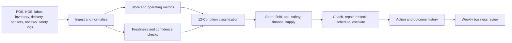

# Restaurant and QSR Operations Weekly Business Review Packet

**Format:** Weekly business review packet  
**Audience:** Restaurant operators, QSR leaders, ghost kitchen operators, franchise field teams, food safety teams, delivery operations, finance and labor planning teams  
**Canonical URL:** `/whitepapers/restaurant-qsr-operations-weekly-business-review/`  
**Related papers:** Real-time statistical monitoring for live operations; property operations dashboard specification; agriculture and cold-chain observability; the 12-Condition Framework  
**Author:** Cendryva  
**Published:** 2026-05-25  
**Version:** 1.0  
**License:** CC BY 4.0
**Contact:** research@cendryva.com

## WBR Objective

Restaurant operations move quickly: labor, speed of service, food safety checks, inventory, delivery marketplaces, kitchen equipment, guest experience, promotions, and margins all change by shift. A bad week can start as one stale temperature log, one understaffed lunch rush, one missing delivery feed, one overloaded station, or one untracked waste pattern.

This weekly business review packet defines the signals restaurant and QSR operators should review to manage performance before problems become brand, margin, or safety issues.

Cendryva provides the operating layer that turns store, kitchen, labor, food safety, delivery, and guest signals into conditions, owner actions, and evidence of improvement.

## Weekly Review Agenda

| Section | Decision to make | Cendryva evidence |
| --- | --- | --- |
| Store health | Which locations need action this week? | 12-Condition rollup by store, region, daypart |
| Speed of service | Which dayparts are degrading? | Queue, order time, station, and delivery condition history |
| Food safety | Which checks are missing or out of range? | Temperature, date-marking, corrective-action evidence |
| Labor | Which stores are over/under-staffed? | Labor variance, schedule adherence, demand alignment |
| Inventory and waste | Where is margin leaking? | Waste, stockout, spoilage, and transfer signals |
| Delivery marketplace | Which channels hurt reliability or margin? | Order defects, late handoff, refund, and review patterns |
| Guest experience | Which issues are recurring? | Complaint, sentiment, ticket, and resolution evidence |

## Store Health Scorecard

**Primary questions**

- Which stores are in DANGER or EMERGENCY?
- Which stores have missing or stale operating data?
- Which conditions improved after last week's actions?
- Which problems are chronic liabilities?

**Signals**

- sales versus forecast
- transaction count
- speed of service
- labor cost percentage
- food cost variance
- waste
- stockouts
- guest complaints
- delivery defects
- food safety check completion
- equipment downtime

**Cendryva behavior**

- Classify stores by condition, not only rank.
- Separate acute issues from chronic liabilities.
- Mark missing feeds as NON_EXISTENCE.
- Preserve action history so field leaders can see whether intervention worked.

## Speed of Service and Kitchen Flow

Speed of service is a system signal. It can degrade because of staffing, station layout, equipment, order mix, delivery batching, prep levels, or POS/kitchen-display issues.

**Signals**

- order-to-serve time
- drive-thru time
- ticket time by station
- order queue depth
- late delivery handoff
- prep completion
- item availability
- kitchen display latency
- remake rate

**WBR review**

- Which dayparts moved into BELOW_NORMAL or DANGER?
- Did speed degrade because of volume, labor, station bottleneck, or system issue?
- Did last week's staffing or prep adjustment create POWER_CHANGE?

**Cendryva behavior**

- Correlate ticket time, labor, order mix, and station signals.
- Route DANGER conditions to store, field, or operations owners.
- Track intervention evidence by daypart and store.

## Food Safety and Critical Checks

The FDA Food Code provides model requirements used by jurisdictions for retail and food service safety. USDA food safety guidance highlights the risk of time and temperature conditions that allow bacteria to grow. Restaurants need operational visibility into the checks and exceptions behind safe execution.

**Signals**

- temperature log completion
- cold-holding exceptions
- hot-holding exceptions
- cooling log status
- date-marking completion
- sanitizer check
- handwashing or hygiene observation where tracked
- equipment temperature
- corrective action status
- manager verification

**WBR review**

- Which checks are missing?
- Which exceptions repeated by store, station, or equipment?
- Which corrective actions were verified?
- Which issues require retraining or equipment repair?

**Cendryva behavior**

- Treat missing checks as NON_EXISTENCE, not blank space.
- Mark out-of-range conditions as DANGER or EMERGENCY depending on severity.
- Preserve corrective-action evidence for food safety review.
- Classify repeat issues as LIABILITY.

## Labor and Forecast Alignment

Labor is both a cost and service-quality lever. Understaffing damages speed and guest experience; overstaffing erodes margin.

**Signals**

- scheduled labor versus forecast
- actual labor versus schedule
- sales per labor hour
- overtime
- callouts
- training status
- role coverage
- manager coverage
- break compliance where applicable
- service degradation by staffing level

**WBR review**

- Which stores are repeatedly BELOW_NORMAL on labor alignment?
- Which stores have ABUNDANCE that can be rebalanced?
- Which training gaps correlate with service or safety issues?

**Cendryva behavior**

- Connect staffing condition to speed, waste, complaints, and food safety checks.
- Mark chronic labor mismatch as LIABILITY.
- Preserve evidence of scheduling changes and their outcome.

## Inventory, Waste, and Margin Leakage

Inventory issues show up as stockouts, substitutions, waste, transfers, spoilage, and emergency purchases.

**Signals**

- stockout rate
- waste by item
- spoilage
- emergency transfer
- ingredient variance
- forecast error
- supplier late delivery
- prep over/under-production
- menu item availability

**WBR review**

- Which items create recurring margin leakage?
- Which stores are in DANGER for priority stockouts?
- Did forecast or prep changes improve waste?

**Cendryva behavior**

- Classify stockout risk and waste variance by store and item.
- Identify chronic issues as LIABILITY.
- Connect supplier, prep, demand, and waste signals.

## Delivery Marketplace and Off-Premise Channels

Delivery and pickup add complexity: marketplace feeds, courier delays, handoff timing, packaging quality, refunds, chargebacks, ratings, and customer complaints.

**Signals**

- marketplace order volume
- late handoff
- courier wait time
- cancellation rate
- refund rate
- missing item rate
- rating by channel
- order accuracy
- packaging issue
- delivery prep time

**WBR review**

- Which channels hurt margin or guest experience?
- Which stores have DANGER conditions for delivery quality?
- Which issues are marketplace, store, courier, or menu related?

**Cendryva behavior**

- Correlate delivery outcomes with kitchen flow and order mix.
- Treat missing marketplace data as DOUBT or NON_EXISTENCE.
- Preserve evidence for channel, store, and vendor review.

## Guest Experience and Brand Health

Guest experience signals arrive from surveys, reviews, support tickets, social comments, refund reasons, and in-store observations.

**Signals**

- satisfaction score
- review rating
- complaint volume
- sentiment
- refund or comp reason
- repeat complaint
- service recovery time
- issue category
- location hotspot

**WBR review**

- Which issues are acute DANGER versus chronic LIABILITY?
- Which stores improved after coaching?
- Which product or operational issue is generating complaints?

**Cendryva behavior**

- Classify guest experience by store, region, and category.
- Connect complaints to speed, food safety, labor, and inventory signals.
- Preserve service recovery and coaching evidence.

## Cendryva WBR Architecture

## What Cendryva Delivers

For restaurant and QSR operations, Cendryva delivers:

- multi-source store signal ingestion
- speed-of-service and queue condition monitoring
- food safety check and exception visibility
- source freshness and missing-check detection
- labor alignment and training signal monitoring
- inventory, waste, and stockout condition tracking
- delivery marketplace performance monitoring
- guest experience condition classification
- action and coaching evidence
- executive and field WBR summaries
- self-hosted deployment options for sensitive operating data

The value is operational discipline: Cendryva helps restaurant leaders see which stores need action, why performance changed, whether corrective action worked, and where the same issue keeps returning.

## WBR Closeout Questions

1. Which stores are in DANGER or EMERGENCY this week?
2. Which signals are missing or stale?
3. Which issues are chronic liabilities?
4. Which interventions produced POWER_CHANGE?
5. Which food safety checks or corrective actions need review?
6. Which delivery channels are degrading guest experience?
7. Which labor changes should be repeated or reversed?
8. Which inventory issues are supplier, forecast, or execution related?
9. Which stores need field support before next week?
10. Which evidence should be preserved for finance, safety, or franchise review?

## Scope and Limitations

This is a vendor-authored paper published by Cendryva. It defines a weekly business review (WBR) packet pattern for restaurant and QSR operations and explains how Cendryva supports that pattern. It is not a regulator-issued guide and it is not a substitute for a food safety management system.

**In scope.** WBR agenda design, signal catalogs for store health, speed of service, food safety check completion, labor, inventory, delivery marketplace, and guest experience, the application of 12-Condition classification to these signals, and freshness handling for store-level data feeds.

**Out of scope.** HACCP plan authoring, allergen management programs, supplier qualification audits, franchise disclosure documents, employment law and wage-and-hour scheduling specifics, marketplace contract negotiation, payment-card scope analysis for POS, and detailed accounting practices. Specific menu engineering and recipe costing methods are also out of scope.

**This is not food safety, regulatory, or legal advice.** Food safety is governed by the FDA Food Code (in the US, as adopted with state and local variation), USDA and CDC guidance, local health departments, and equivalent regulators in other jurisdictions. The patterns in this paper are operating-discipline patterns intended to surface missing checks and exceptions, not to replace a documented food safety management system. Always consult qualified food safety professionals and your regulator when designing or modifying food safety procedures.

**Time-bounded items.** The FDA Food Code, ServSafe materials, and similar references are versioned. State adoption of the Food Code varies and lags. Confirm current versions and the version your jurisdiction has adopted before relying on any reference here.

**Empirical claims.** The signal catalogs, condition mappings, and WBR sections in this paper are illustrative reference patterns drawn from operating practice. They are not the output of a controlled study across a labeled multi-brand operating dataset. Quantitative claims about labor savings, speed improvement, or waste reduction are intentionally avoided in this version.

**Jurisdiction.** Food safety references are US-oriented (FDA Food Code, USDA FSIS, CDC). The WBR operating pattern itself is portable to non-US jurisdictions, but specific safety, labor, and disclosure obligations must be confirmed against the operator's local regulators.

## References and Further Reading

Food safety regulation and guidance

- US Food and Drug Administration. *FDA Food Code*. Current edition. https://www.fda.gov/food/retail-food-protection/fda-food-code
- Codex Alimentarius Commission (FAO/WHO). *General Principles of Food Hygiene (CXC 1-1969) and the HACCP system Annex*. Current revision. https://www.fao.org/fao-who-codexalimentarius/
- US Department of Agriculture, FSIS. *Food Safety Education and How Temperatures Affect Food*. https://www.fsis.usda.gov/food-safety
- US Centers for Disease Control and Prevention. *Restaurant Food Safety*. https://www.cdc.gov/restaurant-food-safety/
- National Restaurant Association. *ServSafe Manager training and certification*. https://www.servsafe.com/

Industry data, benchmarking, and standards

- National Restaurant Association. *Industry research and labor benchmarking publications*. https://restaurant.org/research-and-media/
- Conexxus. *Standards for convenience and foodservice retail data interchange*. https://www.conexxus.org/

Operational safety and SaaS controls

- US OSHA. *Restaurant Safety standards and resources*. https://www.osha.gov/young-workers-restaurant-safety/standards
- American Institute of CPAs (AICPA). *SOC 2 Trust Services Criteria for SaaS POS and back-office systems*. https://www.aicpa-cima.com/
