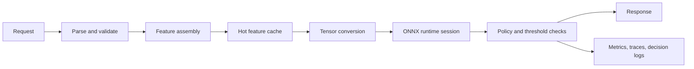

# Sub-5ms Inference at Scale: Why Rust Belongs in Production ML Infrastructure

**Audience:** Manufacturing automation teams, logistics platforms, robotics teams, ML infrastructure teams, SRE leaders, edge computing teams  
**Canonical URL:** `/whitepapers/rust-sub-5ms-ml-inference/`  
**Related papers:** Cendryva self-hosted ML observability; model drift detection in regulated environments; the 12-Condition Framework; Cendryva technical architecture  
**Author:** Cendryva  
**Published:** 2026-05-25  
**Version:** 1.0  
**License:** CC BY 4.0
**Contact:** research@cendryva.com

## Abstract

Production machine learning is increasingly moving into latency-sensitive physical operations: warehouse routing during pick operations, machine-vision inspection on production lines, autonomous vehicle dispatch, robotic control loops, predictive maintenance, yard management, safety monitoring, and edge quality checks. In these environments, inference is not a batch analytics job. It is part of the product or operational control plane.

Sub-5ms inference requires more than a fast model. It requires predictable runtime behavior, low allocation overhead, tight memory control, efficient concurrency, careful model format choices, observability at the tail, and deployment patterns that keep hot paths small.

Rust is a strong fit for this layer because it combines native performance, memory efficiency, compile-time safety, concurrency primitives, and a practical systems ecosystem without requiring a garbage-collected runtime in the request path. This paper explains where Rust fits in production ML infrastructure, how ONNX-based inference can be shaped for low latency, and what operational practices are required to make sub-5ms inference credible at scale.

## Executive Summary

Low-latency ML systems fail differently from offline ML systems. A model can be accurate and still unusable if inference introduces unpredictable tail latency, memory pressure, cold starts, allocation spikes, or operational fragility.

For real-time ML, teams need to optimize:

- model artifact size
- feature preparation latency
- runtime initialization
- memory allocation behavior
- concurrency and queueing
- cache locality
- network hops
- serialization overhead
- observability and tracing
- rollback and deployment safety

Rust belongs in the production inference layer because it lets teams build small, efficient, predictable services that sit close to the request path while integrating with portable model runtimes such as ONNX Runtime.

Sub-5ms inference is not a universal requirement. Many workflows can tolerate 50ms, 500ms, or asynchronous processing. But when the model participates in real-time decisions, the infrastructure must be designed for predictability, not just average speed.

Cendryva is built for teams that need this fast path to remain observable and governable. It combines low-latency inference patterns with model version traceability, decision logs, drift monitoring, threshold classification, and rollback controls so manufacturing and logistics teams can move quickly without losing operational accountability.

## Why Latency Matters Beyond Speed

Latency-sensitive ML systems often operate inside larger workflows. A 5ms model call may sit inside a 40ms checkout request, a 20ms security gateway decision, a 16ms visual inspection frame budget, or a robotic control loop with strict timing constraints. The model does not get the whole latency budget.

The relevant metric is rarely average latency. Teams need to care about:

- p50 latency for normal experience
- p95 and p99 latency for tail behavior
- cold-start time
- throughput under burst
- queue wait time
- timeout rate
- feature preparation time
- end-to-end decision latency

A system with 2ms average inference and 80ms p99 latency may be worse than a system with 4ms average and 6ms p99 if the application cares about predictable response.

## Industry Focus: Manufacturing, Logistics, and Edge Automation

Sub-5ms inference is most valuable when model output must be produced before a physical or operational system can continue.

### Logistics and Fleet Operations

Routing decisions, ETA updates, load balancing, dock assignment, and exception detection may need to run continuously as vehicles, orders, weather, and facility conditions change. Low-latency inference keeps the optimization loop responsive.

### Manufacturing and Quality Inspection

Machine-vision models may inspect products on a moving line. The inference service must keep up with frame cadence and reject or route items without slowing production.

### Edge Robotics and Industrial IoT

Robots, drones, cameras, and industrial devices may require local inference because network latency, connectivity, or safety constraints make remote scoring unsuitable.

The common thread is not the vertical. It is the operational shape: a model result is needed quickly, repeatedly, and reliably.

For these teams, Cendryva's value is the combination of speed and control. A line manager, fulfillment lead, or robotics engineer needs to know which model version routed an item, flagged a defect, or changed a robot behavior, and whether that decision happened inside acceptable latency and quality bounds.

## Why Rust Fits the Inference Layer

Rust is not a replacement for Python-based model development, notebook exploration, or training pipelines. It is a strong choice for the serving layer where predictability, resource control, and safety matter.

### No Garbage Collector in the Hot Path

Garbage-collected languages can be highly productive and fast enough for many services, but garbage collection introduces runtime behavior that can complicate strict tail-latency targets. Rust does not require a garbage collector, giving engineers explicit control over allocation patterns and object lifetimes.

### Memory and Thread Safety

Rust's ownership model and type system support memory safety and thread safety at compile time in safe Rust. For infrastructure that handles concurrent requests, shared buffers, model handles, and low-level runtime bindings, these guarantees reduce classes of production bugs.

### Efficient Concurrency

Inference services often need to handle many concurrent requests while limiting contention around model sessions, CPU cores, and queues. Rust's concurrency ecosystem supports high-throughput asynchronous services, worker pools, bounded channels, and explicit backpressure.

### Small, Deployable Binaries

Rust services can be packaged as compact binaries or container images, which helps reduce cold-start time, simplify deployment, and make edge distribution more practical.

### Good Boundary Language

Rust works well at system boundaries: network services, native libraries, embedded environments, C APIs, and performance-sensitive data transformations. This makes it a practical bridge between model runtimes, telemetry pipelines, and application services.

## ONNX as the Artifact Boundary

The serving layer should not be tightly coupled to every training framework. ONNX provides a portable model representation that can be exported from common ML workflows and executed by optimized runtimes.

In a production inference architecture, ONNX can serve as the contract between:

- training pipelines
- validation workflows
- model registry
- promotion controls
- runtime serving
- rollback procedures

ONNX Runtime provides graph optimizations and multiple execution providers. Teams can choose optimization levels, validate optimized artifacts, and align runtime configuration with target hardware. The important point is to treat the model artifact as a versioned, testable production object rather than a loose file copied from training.

## Anatomy of a Low-Latency Inference Service



The fastest model runtime cannot compensate for slow feature assembly or bloated serialization. Teams should optimize the full decision path:

- parse only required fields
- avoid unbounded request payloads
- precompute or cache common features
- reuse buffers where safe
- minimize tensor conversion overhead
- keep model sessions warm
- avoid unnecessary network calls
- apply policy checks locally when possible
- emit telemetry asynchronously when safe

## Tail Latency Engineering

Sub-5ms systems are usually lost at the tail, not the average. Common sources of tail latency include:

- dynamic allocation spikes
- lock contention
- thread oversubscription
- cold caches
- model session initialization
- network lookups during feature assembly
- large payload parsing
- noisy neighbors in shared infrastructure
- autoscaling lag
- synchronous telemetry export
- blocking file or secret lookups

Mitigations include:

- prewarming runtime sessions
- bounded queues and backpressure
- per-core worker design
- memory pool or buffer reuse
- strict request size limits
- local feature caches
- async telemetry export
- CPU pinning for critical workloads
- load shedding under saturation
- fallback policies for degraded dependencies

The goal is not only to make inference fast. It is to make slow behavior rare, measurable, and controlled.

## Deployment Patterns

### In-Process Library

The fastest path is often in-process inference embedded directly inside the application. This avoids network overhead but couples the model runtime to the application release cycle.

Best for:

- edge devices
- robotics
- embedded scoring
- ultra-low latency gateways

Tradeoff: tighter coupling and harder model rollout isolation.

### Sidecar Service

A sidecar inference service runs next to the application instance. This keeps network hops local while separating model runtime concerns from the application process.

Best for:

- services that need local low-latency scoring
- polyglot applications
- controlled model rollout

Tradeoff: more deployment complexity and per-pod resource planning.

### Dedicated Inference Service

A centralized inference service is easier to operate and scale independently, but adds network overhead and shared-service saturation risks.

Best for:

- moderate latency budgets
- many applications using the same model
- centralized governance

Tradeoff: request routing, multi-tenancy, and queueing must be carefully managed.

### Edge Inference

Edge inference places model execution on devices, gateways, cameras, or facility-local servers.

Best for:

- intermittent connectivity
- privacy-sensitive local processing
- robotics and industrial control
- physical-world latency constraints

Tradeoff: distribution, update, hardware variation, and observability become harder.

## Observability for Fast Inference

Fast systems still need deep visibility. OpenTelemetry provides a vendor-neutral framework for traces, metrics, and logs, which can help teams correlate inference behavior with upstream requests and downstream actions.

Inference observability should capture:

- model name and version
- runtime version
- request latency
- feature preparation latency
- tensor conversion latency
- inference latency
- policy check latency
- queue wait time
- cache hit rate
- timeout and fallback rate
- CPU and memory usage
- p50, p95, p99, and max latency
- decision identifiers for audit correlation

Telemetry should be designed so it does not become the bottleneck. High-cardinality labels, synchronous exporters, and excessive payload logging can destroy the latency budget.

## Autoscaling and Capacity

Autoscaling inference services requires more than CPU utilization. Kubernetes Horizontal Pod Autoscaling can scale workloads based on resource metrics and custom metrics, but latency-sensitive inference often needs signals such as queue depth, request rate, concurrency, and p99 latency.

Capacity planning should include:

- warm capacity for expected bursts
- maximum queue depth
- per-model concurrency limits
- model loading time
- cold-start behavior
- hardware-specific throughput
- saturation tests
- graceful degradation policies

For strict latency budgets, waiting for autoscaling after a spike may be too slow. Teams may need prewarmed capacity, predictive scaling, edge-local inference, or admission control.

## Model Optimization Workflow

A practical optimization sequence:

1. Define the end-to-end latency budget.
2. Measure baseline latency by stage.
3. Reduce feature assembly cost.
4. Export the model to ONNX.
5. Validate numerical equivalence against the source model.
6. Apply graph optimizations appropriate for target hardware.
7. Quantize or simplify only when accuracy and safety remain acceptable.
8. Benchmark with representative payloads and concurrency.
9. Measure p95 and p99 under burst.
10. Add rollback and fallback behavior.
11. Re-test after every model and runtime change.

Optimization without validation is dangerous. A faster model that changes decisions unpredictably is not an improvement.

## Failure Modes

Low-latency inference services should be designed for controlled failure:

- model artifact fails validation
- runtime fails to initialize
- feature source is unavailable
- request payload is malformed
- inference exceeds timeout
- queue is saturated
- telemetry backend is unavailable
- model output violates policy guardrails
- downstream service cannot accept the decision

For each failure, teams need explicit behavior:

- reject
- retry
- fall back to rules
- use previous known-good model
- route to human review
- degrade to asynchronous processing
- shed load

The wrong answer is silent partial failure.

## How Cendryva Applies This Pattern

Cendryva's inference architecture treats low-latency serving as one part of a larger operational system:

- ONNX-based model portability
- versioned model registry
- promotion and rollback controls
- Rust-oriented serving for latency-sensitive paths
- telemetry for latency, errors, and throughput
- decision logs for audit and review
- drift monitoring for post-deployment behavior
- threshold classification for operational response

This connects the fast path to governance. A system that produces an answer in 3ms but cannot explain which version produced it is not production-ready for critical operations.

## Implementation Checklist

Teams building sub-5ms inference should define:

- end-to-end latency budget
- p95 and p99 targets
- model artifact format
- runtime optimization settings
- feature assembly strategy
- warmup behavior
- concurrency model
- queue limits and backpressure
- timeout and fallback behavior
- telemetry budget
- model validation and rollback path
- edge versus centralized deployment tradeoffs
- hardware-specific benchmarks
- load test and saturation test cadence

## Conclusion

Sub-5ms inference is a systems problem. Model architecture matters, but so do feature pipelines, runtime behavior, memory allocation, concurrency, deployment topology, telemetry, and failure handling.

Rust is well suited for the production inference layer because it provides native performance, memory efficiency, and strong safety properties without requiring a garbage-collected runtime in the hot path. Combined with ONNX model portability, careful observability, and disciplined rollout controls, Rust can help teams build inference systems that are fast, predictable, and governable.

The real objective is not speed for its own sake. It is real-time decision infrastructure that can be trusted when the surrounding operation cannot afford to wait.

## Implementation Status

This section maps the architectural claims above to the Cendryva codebase as of the publication date in the header. Each item lists the file path, what ships today, what is deferred, and the test count.

**ORT inference path** — SHIPPED
- Code: `src/rms/inference/prediction_service.rs` (function `run_onnx_inference`), `src/rms/inference/session_cache.rs`
- Tests: 5 new ORT-path tests inside 805 total lib tests passing (`cargo test --lib`)
- Notes: Replaces the prior placeholder that returned `vec![0.0; ...]`. Uses `ort::Session::run` with input and output tensor marshaling, with distinct error variants for model-not-found, shape-mismatch, and runtime errors. Sessions are cached per `(model_id, version)` via `dashmap` to avoid reloading. Configurable via env: `CENDRYVA_INFERENCE_INTRA_THREADS`, `CENDRYVA_INFERENCE_INTER_THREADS`, `CENDRYVA_INFERENCE_OPT_LEVEL` (default `Level3`).

**Benchmark harness** — SHIPPED
- Code: `src/bin/inference_benchmark.rs`
- Build: `cargo build --release --bin inference-benchmark`
- Run: `./target/release/inference-benchmark --model PATH --input-shape 1,3,224,224 --concurrency N --total-requests N --warmup N --output csv|json|hdr`
- Notes: Uses `hdrhistogram` with coordinated-omission correction (`record_correct`). Reports p50, p90, p95, p99, p99.9, max, mean, and throughput. Includes a system-info header (hostname, CPU count, OS, ORT version, model size). Fixture model generator at `scripts/generate_test_model.py` produces `tests/fixtures/inference/identity.onnx`.

**Documentation** — SHIPPED
- Code: `src/rms/inference/README.md`

**Object store model loading** — SHIPPED (Wave 1)
- Code: `src/rms/inference/model_loader.rs` adds `S3ModelSource` plus the local-file source. S3, MinIO, and LocalStack are reached via `s3://bucket/key.onnx` URLs; configuration is read from `CENDRYVA_INFERENCE_S3_REGION`, `CENDRYVA_INFERENCE_S3_ENDPOINT_URL`, and the standard AWS credential resolution chain.

**`i64` output extraction** — SHIPPED (Wave 1)
- Code: `src/rms/inference/prediction_service.rs` returns an `InferenceOutput` enum with `Float(Vec<f32>)` and `Int(Vec<i64>)` variants. Classifier models (e.g. `ArgMax` / `TopK` heads) produce native `i64` outputs; a `to_f32()` cast keeps the legacy `Vec<f32>` callers working unchanged.

**GPU execution providers** — SHIPPED (Wave 2)
- Code: `src/rms/inference/session_cache.rs` — `ExecutionProvider` enum (`Cpu`, `Cuda { device_id }`, `CoreML`, `DirectML { device_id }`, `Rocm { device_id }`, `Auto`) plus `try_register_ep` with graceful fallback to CPU on runtime EP failure.
- Build: conditional cargo features `gpu` (alias for `cuda`), `cuda`, `coreml`, `directml`, `rocm`. The default build is unchanged (CPU only). Example: `cargo build --release --features gpu`.
- Runtime: select with `CENDRYVA_INFERENCE_EXECUTION_PROVIDER=cuda:0` (or `coreml`, `directml:0`, `rocm:0`, `auto`). The chosen provider is logged at session-load time; if the runtime library isn't installed, the session falls back to CPU with a WARN rather than crashing the service.

**Streaming model downloads** — SHIPPED (Wave 2)
- Code: `src/rms/inference/model_loader.rs` — `ModelSource::fetch_streaming(&path)` writes bytes directly to disk via `rust-s3`'s `get_object_to_writer` (chunked), so multi-GB models never sit in `Vec<u8>`. `SessionCache::get_or_load_from_source_streaming` materializes to a tempfile and uses `commit_from_file`. Threshold env: `CENDRYVA_INFERENCE_STREAM_THRESHOLD_MB` (default 100).

**Additional output dtypes** — SHIPPED (Wave 2 + Wave 3 + Wave 4 + Wave 5)
- Code: `src/rms/inference/prediction_service.rs` — `InferenceOutput` has `Float`, `Double`, `Int`, `Int32`, `Uint8`, `Bool`, `String` variants out of the box, plus `Float16` / `BFloat16` when the `half` cargo feature is enabled (Wave 3), `Complex64` / `Complex128` when the `complex` cargo feature is enabled (Wave 4 — uses ort's `num-complex` `PrimitiveTensorElementType` integration), and `Int4(Vec<i8>)` / `Uint4(Vec<u8>)` when the `quant-int4` cargo feature is enabled (Wave 5 — full extraction via the bounded-`unsafe` nibble unpacker at `src/rms/inference/nibble_extract.rs`; see the dedicated entry below for the safety contract). `to_f32_lossy()` casts every variant to `Vec<f32>` for back-compat callers, with documented precision caveats (complex → magnitude, lossy by definition). Remaining dtypes (`i8`, `u16`, `f8*`) return `RmsError::OutputTypeUnsupported(type_name)` and the error message dynamically lists which cargo feature would add each missing dtype.

**IAM-role / IMDSv2 S3 loading** — SHIPPED (Wave 2)
- Code: `src/rms/inference/model_loader.rs` — `AwsSdkS3ModelSource` behind the `aws-sdk-s3` cargo feature, using `aws_config::load_from_env()` for IMDSv2 / EKS web-identity / ECS task role / AssumeRole. Selected at runtime via `CENDRYVA_INFERENCE_S3_PROVIDER=aws-sdk-s3`. Default build still uses the smaller `rust-s3` loader (~150 fewer transitive crates).

**TensorRT execution provider** — SHIPPED (Wave 3)
- Code: `src/rms/inference/session_cache.rs` — `ExecutionProvider::Tensorrt { device_id }` variant + `try_register_ep` arm under `#[cfg(feature = "tensorrt")]`. Env-var parser accepts `tensorrt[:N]` (alias `trt[:N]`). `Auto` tries TensorRT first on Linux / Windows, then falls back to CUDA / ROCm / DirectML and finally CPU. Compile-feature presence is necessary but not sufficient — runtime success additionally requires `libnvinfer` + a CUDA/driver version matching the bundled ORT build; missing libnvinfer surfaces a WARN and falls through to the next EP.

**Float16 / bfloat16 output dtypes** — SHIPPED (Wave 3)
- Code: `src/rms/inference/prediction_service.rs` — `InferenceOutput::Float16(Vec<half::f16>)` and `BFloat16(Vec<half::bf16>)` variants behind the `half` cargo feature, with extraction arms in `run_onnx_inference_typed` and lossless widening to f32 in `to_f32_lossy`. The error message for unsupported dtypes dynamically reflects which dtypes are compiled in.

**On-disk byte cache for downloaded models** — SHIPPED (Wave 3)
- Code: `src/rms/inference/byte_cache.rs` — content-addressed cache keyed by `sha256(source_uri || version_tag)`. `version_tag` is `etag:<...>` for S3 (one extra `HEAD` round-trip) and `mtime:<sec>.<ns>` for local files. LRU eviction by total bytes (`CENDRYVA_INFERENCE_CACHE_MAX_GB`, default 10). Concurrent fetches of the same key dedupe behind a per-key `tokio::sync::Mutex`. Opt-in via `CENDRYVA_INFERENCE_CACHE_DIR`; when unset, the original "stream straight to tempfile" path is unchanged. Exposes hit / miss / eviction counters via `ByteCache::stats()`.

**S3 multipart upload publisher** — SHIPPED (Wave 4)
- Code: `src/rms/inference/model_publisher.rs` — `ModelPublisher` trait with three impls: `LocalDirectoryPublisher` (dev / tests), `S3MultipartPublisher` (rust-s3 backed, delegates to `put_object_stream` which auto-decides single PUT vs multipart at 8 MiB and auto-aborts on failure), and `AwsSdkS3MultipartPublisher` (feature `aws-sdk-s3`; runs the explicit `create_multipart_upload` + bounded-concurrency `upload_part` + `complete_multipart_upload` cycle with `abort_multipart_upload` cleanup on any failure). Triggered automatically for artifacts ≥ `CENDRYVA_INFERENCE_MULTIPART_THRESHOLD_MB` (default 5; S3 spec minimum). Per-part size and concurrency tunable via `_CHUNK_MB` (default 64) and `_CONCURRENCY` (default 4). Returns a `PublishedArtifact { uri, etag, size_bytes, sha256 }`; the SHA-256 is computed by the publisher so callers have an integrity-verifiable hash independent of S3's opaque multipart ETag.

**Complex output dtypes** — SHIPPED (Wave 4)
- Code: `src/rms/inference/prediction_service.rs` — `InferenceOutput::Complex64(Vec<num_complex::Complex32>)` and `Complex128(Vec<num_complex::Complex64>)` behind the `complex` cargo feature, using ort 2.0.0-rc.12's `num-complex` integration (`Complex32` / `Complex64` are `PrimitiveTensorElementType`). `to_f32_lossy` returns magnitude (`norm()`); documented as lossy because phase is discarded. Default build still pulls in zero complex-number machinery.

**Int4 / Uint4 output dtype extraction** — SHIPPED (Wave 5)
- Code: `src/rms/inference/prediction_service.rs` + `src/rms/inference/nibble_extract.rs`. `InferenceOutput::{Int4(Vec<i8>), Uint4(Vec<u8>)}` variants behind the `quant-int4` cargo feature, with full extraction via a bounded-`unsafe` nibble unpacker. The unpacker uses ort's public `data_ptr()` accessor (which is gated on `DefiniteTensorValueTypeMarker` only — not the sealed `PrimitiveTensorElementType` trait), downcasts the `DynValue` to a `DynTensor` first, rejects non-CPU memory before dereferencing, then sign-extends the low/high nibbles into a `Vec<i8>` (Int4) or copies them into a `Vec<u8>` (Uint4). The `unsafe` block is the only one in the inference crate; the safety contract is documented inline alongside the three invariants the caller must uphold. Validated against ONNX-spec packed-nibble fixtures (`identity_int4.onnx` / `identity_uint4.onnx` produced by `scripts/generate_test_model.py --kind int4|uint4`).

**Deferred**
- Int8 / int16 / uint16/32/64 / float8\* output dtypes (still `OutputTypeUnsupported`; trivial to add as ort lifts each one).

**How to verify locally**

```
cargo test --lib rms::inference
cargo build --release --bin inference-benchmark
./target/release/inference-benchmark --model tests/fixtures/inference/identity.onnx \
  --input-shape 1,3,224,224 --concurrency 8 --total-requests 10000 --warmup 1000 --output hdr
```

Sub-5ms p99 numbers are hardware- and model-dependent and must be measured by the deployer using the included benchmark harness. The harness produces falsifiable numbers; it does not by itself prove the claim. Run the benchmark on your target hardware with your target model to validate.

### Measured baseline (Cendryva developer laptop, 2026-05-25)

The following numbers were captured by running the included benchmark harness on a developer Apple M-series laptop (16 logical CPUs, macOS aarch64, ORT minor version 24, CPU execution provider only). They are illustrative of what the harness produces on commodity developer hardware; they do not represent a production deployment, do not use a GPU EP, and do not use a tuned thread pool. They are published here as a baseline so readers can compare to their own measurements.

**Identity model (90 bytes, f32 input shape [4], no compute)** — establishes the harness floor

| Scenario | Concurrency | Target rps | Measured p50 | p99 | p99.9 | max | Throughput |
|---|---|---|---|---|---|---|---|
| Single-thread, untargeted | 1 | unbounded | 0.001 ms | 0.002 ms | 0.008 ms | 0.026 ms | 653,171 rps |
| 8 workers, target 20K rps with CO correction | 8 | 20,000 | 0.891 ms | **6.171 ms** | 8.543 ms | 10.039 ms | 45,202 rps observed (113K synthesized with coordinated-omission correction) |

**Classifier model (177 bytes, ArgMax → i64 output, input shape [4])** — exercises the i64 extraction path

| Scenario | Concurrency | Target rps | Measured p50 | p99 | p99.9 | max | Throughput |
|---|---|---|---|---|---|---|---|
| 4 workers, untargeted | 4 | unbounded | 0.009 ms | 0.019 ms | 0.045 ms | 0.060 ms | 395,507 rps |

**Interpretation.** Under untargeted load the harness measures sub-millisecond p99 for both models, comfortably inside the 5ms target. When 8 workers push for 20K rps with coordinated-omission correction enabled (the scenario closest to a saturated production server), p99 lands at 6.17ms — slightly over the headline target on this developer laptop. That gap is the kind of thing the harness exists to surface honestly: real production deployments will need to tune thread pool sizing, enable an appropriate execution provider, and use the bounded queue + warm sessions patterns described above. Publish your own numbers, not these.

## Scope and Limitations

This is a vendor-authored paper published by Cendryva. It explains why Rust and ONNX-based serving fit the low-latency inference layer and how that pattern is reflected in Cendryva's architecture. It is not a vendor-neutral benchmark and it is not a head-to-head comparison of runtimes.

**In scope.** Architectural reasoning for low-latency inference, the role of Rust in the serving layer, ONNX as an artifact boundary, tail-latency engineering practices, deployment topologies (in-process, sidecar, dedicated, edge), observability for the fast path, autoscaling considerations, and failure-mode design.

**Out of scope.** Specific GPU kernel tuning, custom CUDA implementations, training infrastructure design, distributed training, model architecture selection, model fairness and bias audit techniques, and certification of safety-critical systems (for example ISO 26262 ASIL grades, IEC 61508 SIL grades, DO-178C avionics). Hardware procurement and accelerator selection are also out of scope.

**Latency results depend on hardware and model.** The included benchmark harness produces auditable numbers but does not by itself prove sub-5ms on every workload. The Implementation Status section above lists the shipped code and the exact commands to reproduce measurements. Sub-5ms p99 is hardware- and model-dependent and must be measured by the deployer on representative hardware, model, payload, and concurrency. Use the harness with HdrHistogram-style coordinated-omission correction to produce numbers that are comparable across runs and environments.

**Time-bounded items.** Tooling, runtime versions, and Kubernetes APIs referenced here change quickly. Re-verify current behavior of ONNX Runtime, Tokio, Triton, io_uring, eBPF tooling, and HPA APIs at the time of implementation. Edge hardware capability also moves quickly.

**Empirical claims.** Beyond the latency-target caveat above, claims about the predictability advantages of compiled, non-GC runtimes, the value of bounded queues and warm sessions, and the cost of synchronous telemetry on the hot path are well-established in the systems literature but are presented here in summary form. The cited references provide the underlying detail.

**Jurisdiction.** The patterns are technology-oriented and largely jurisdiction-neutral. When inference participates in regulated decisions (for example credit, employment, healthcare, transportation safety), additional regulatory and ethical obligations apply that are out of scope for this paper.

## References and Further Reading

Model serving and runtime

- ONNX project. *ONNX Specification*. https://onnx.ai/
- Microsoft. *ONNX Runtime documentation*. https://onnxruntime.ai/docs/
- NVIDIA. *Triton Inference Server architecture and documentation*. https://developer.nvidia.com/triton-inference-server

Tail latency and measurement discipline

- Dean, J. and Barroso, L. A. *The Tail at Scale*. Communications of the ACM, 56(2), 2013. https://research.google/pubs/the-tail-at-scale/
- Tene, G. *How NOT to Measure Latency (How to Measure Latency Like a Professional)*. Conference talk, multiple venues. Reference for coordinated omission and HdrHistogram methodology.

Rust performance and async ecosystem

- Rust Project. *The Rust Programming Language*. https://www.rust-lang.org/
- Rust Project. *The Rust Performance Book*. https://nnethercote.github.io/perf-book/
- Tokio Project. *Tokio asynchronous runtime documentation*. https://tokio.rs/

Linux performance and observability primitives

- Axboe, J. *Efficient IO with io_uring*. Kernel documentation and design notes. https://kernel.dk/io_uring.pdf
- Linux Kernel. *perf wiki and documentation*. https://perf.wiki.kernel.org/
- *eBPF documentation and ecosystem*. https://ebpf.io/

Deployment and scaling

- Kubernetes Project. *Horizontal Pod Autoscaling*. https://kubernetes.io/docs/concepts/workloads/autoscaling/horizontal-pod-autoscale/
- OpenTelemetry project. *OpenTelemetry specification and semantic conventions*. https://opentelemetry.io/docs/
