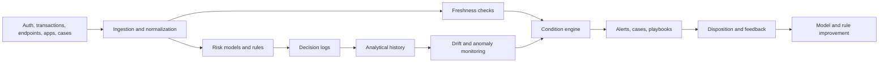

# Security and Fraud Operations Observability for Real-Time Risk Response

**Audience:** Security operations leaders, fraud teams, trust and safety teams, risk operations teams, ML platform teams, incident response teams  
**Canonical URL:** `/whitepapers/security-fraud-operations-observability/`  
**Related papers:** Model drift detection in regulated environments; real-time statistical monitoring for live operations; Cendryva self-hosted ML observability; the 12-Condition Framework  
**Author:** Cendryva  
**Published:** 2026-05-25  
**Version:** 1.0  
**License:** CC BY 4.0
**Contact:** research@cendryva.com

## Abstract

Security, fraud, and abuse teams operate in adversarial environments. Attackers adapt. Fraud patterns mutate. Bot behavior changes. Credential abuse moves across channels. Rules that worked last quarter become noisy, stale, or blind. Models can help, but only if their signals remain observable, explainable, and connected to response.

The challenge is not simply detecting suspicious behavior. The challenge is knowing which signals are trustworthy, which detections are degrading, which risk scores have drifted, which alerts deserve attention, and what action was taken.

This paper explains how observability principles can improve security operations, fraud response, and trust-and-safety workflows. It also explains how Cendryva connects telemetry, risk scoring, decision logs, drift monitoring, condition classification, and response evidence into one operating layer.

## Executive Summary

Security and fraud operations teams need to answer fast-moving questions:

- Which alerts are meaningful and which are noise?
- Which model or rule produced a risk decision?
- Did the attack pattern change?
- Did false positives increase for a customer, product, region, or channel?
- Are key telemetry sources fresh and complete?
- Which response action was taken, by whom, and with what outcome?
- Can investigators reconstruct a risk decision later?
- Can the organization tune detections without losing auditability?

Cendryva provides an observability layer for real-time risk operations. It combines event ingestion, risk-score monitoring, decision logs, model and rule version traceability, anomaly detection, drift monitoring, 12-Condition classification, and response workflows so teams can move from alert volume to operational clarity.

## Why Security and Fraud Teams Need Observability

Security and fraud systems generate enormous amounts of telemetry: authentication events, device fingerprints, transaction metadata, network logs, application traces, customer actions, case outcomes, chargebacks, user reports, and enrichment data.

But telemetry alone does not create operational clarity. Teams still struggle with:

- alert fatigue
- stale or missing signals
- models that drift as adversaries adapt
- rules that become noisy after product changes
- inconsistent case disposition
- lack of traceability from risk score to action
- delayed feedback from confirmed fraud or incident outcomes
- investigation evidence scattered across tools

Observability connects detection, decision, response, and outcome. It helps teams see when the risk system itself is healthy, not just whether alerts are firing.

## Industry Focus: Fraud and Payments Risk

Payments, marketplaces, lending platforms, subscription businesses, and digital wallets rely on real-time risk decisions. A risk model may approve, decline, step up, hold, route, or flag a transaction for review.

Signals include:

- transaction velocity
- device and session reputation
- payment instrument changes
- geolocation anomalies
- account age
- chargeback rate
- dispute outcomes
- manual review decisions
- rule hit rates
- model score distributions
- false-positive indicators
- issuer or processor response patterns

Cendryva helps fraud teams observe the full risk decision lifecycle. A sudden shift in model scores can become CHANGE. A spike in false positives can become DANGER. A missing enrichment feed can become NON_EXISTENCE. A chronic rule that creates review backlog can become LIABILITY.

This gives risk leaders a shared language for tuning, escalation, and post-incident review.

## Industry Focus: Security Operations and Incident Response

Security operations centers monitor identity, endpoint, network, cloud, application, and SaaS telemetry. Frameworks such as NIST Cybersecurity Framework and MITRE ATT&CK help teams organize cybersecurity risk, detection, response, and adversary behavior. Operationally, teams still need to know whether their detections and response workflows are working right now.

Useful signals include:

- suspicious authentication rate
- impossible travel detections
- endpoint alert volume
- cloud permission changes
- anomalous API activity
- privilege escalation indicators
- detection rule hit rate
- alert closure time
- case escalation rate
- containment action status
- source freshness by telemetry stream

Cendryva can monitor these signals as operating conditions. A rule can move into DOUBT when its data source becomes incomplete. An identity anomaly detector can move into DANGER when score distributions shift. A response workflow can become LIABILITY when mean time to closure remains persistently high.

## Industry Focus: Trust, Safety, and Abuse Prevention

Trust and safety teams deal with spam, harassment, fake accounts, content abuse, marketplace manipulation, policy evasion, and coordinated behavior. These problems are adversarial and fast-changing.

Signals include:

- account creation bursts
- report volume
- content classification scores
- policy violation rate
- moderator queue depth
- appeal outcomes
- repeat offender patterns
- graph or network anomaly scores
- model confidence distribution
- rule override rate
- moderator disagreement rate

Cendryva helps teams distinguish operational load from detection degradation. A surge in reports may be a real attack, a product change, a reporting campaign, or a moderation workflow bottleneck. The platform connects model scores, rule versions, queue metrics, moderator decisions, and condition history so teams can respond with context.

## Decision Logs for Risk Operations

Every high-impact risk decision should be reconstructable. A decision log should capture:

- event ID and timestamp
- customer, account, device, or entity context as permitted
- model or rule version
- risk score or classification
- triggering signals
- enrichment source status
- policy checks
- action taken
- reviewer or automated actor
- case disposition
- feedback outcome
- trace ID for correlation

Decision logs are not only for audits. They are how teams learn whether a detection worked, whether a model created unnecessary friction, or whether an attacker found a blind spot.

## Drift and Adversarial Adaptation

Security and fraud models face active adaptation. Attackers probe boundaries, change behavior, exploit new product flows, and react to enforcement.

Monitoring should track:

- score distribution changes
- feature drift
- rule hit-rate changes
- new clusters of behavior
- rising false positives
- rising false negatives where outcomes are available
- review queue composition
- feedback delay
- telemetry source degradation

Retraining is not always the first response. Teams may need to repair a data feed, tune a rule, add a step-up challenge, suppress a detection for one segment, or escalate to manual review.

Cendryva connects drift signals to response workflows so the team can see whether a detection is degrading, whether the input changed, or whether adversaries are adapting.

## Freshness and Missing Signals

Risk systems often depend on enrichment feeds and telemetry streams. If a device fingerprinting feed, IP reputation feed, endpoint stream, or identity log source fails, the model may still return a score while operating with degraded context.

Freshness monitoring should track:

- last event by source
- expected event rate
- delayed enrichment
- missing segment coverage
- schema changes
- feed error rate
- ingestion lag
- source confidence

Cendryva treats stale and missing signals as operational states. A model that keeps scoring while a critical enrichment feed is down should not look healthy. It should be marked as DOUBT, DANGER, or NON_EXISTENCE depending on severity.

## Condition Classification for Risk Response

Risk teams need fast interpretation, not more charts. Cendryva's 12-Condition Framework can classify detections, queues, models, and telemetry streams.

| Condition     | Risk operations interpretation                           |
| ------------- | -------------------------------------------------------- |
| POWER         | Detection or response performing exceptionally well      |
| AFFLUENCE     | Strong favorable signal quality or outcome               |
| NORMAL        | Within expected operating range                          |
| BELOW_NORMAL  | Mild degradation or early noise                          |
| DANGER        | Material risk or detection degradation                   |
| EMERGENCY     | Immediate threat, fraud spike, or active incident        |
| NON_EXISTENCE | Missing telemetry, feed, rule output, or review evidence |
| DOUBT         | Low-confidence or conflicting evidence                   |
| CHANGE        | Rapid behavioral or score shift                          |
| POWER_CHANGE  | Rapid improvement after tuning or response               |
| LIABILITY     | Chronic noisy rule, backlog, or control weakness         |
| ABUNDANCE     | Excess capacity or review coverage                       |

The condition is not the investigation. It is the operational state that tells the right team what needs attention.

## Architecture Pattern

This pattern connects detection, evidence, telemetry freshness, risk decisions, response, and feedback. Cendryva provides the operating layer that keeps these pieces linked.

## What Cendryva Delivers

For security, fraud, and trust operations, Cendryva delivers:

- high-volume event ingestion
- risk score and rule telemetry
- model and rule version traceability
- decision logs for risk actions
- telemetry freshness and missing-source detection
- drift and anomaly monitoring
- 12-Condition classification for queues, detections, and models
- alert routing and response playbooks
- outcome and disposition tracking
- analytical history for incident review
- self-hosted deployment options for sensitive environments

The value is operational: Cendryva helps risk teams reduce blind spots, identify degrading detections, preserve decision evidence, and coordinate response while adversaries are still active.

## Implementation Checklist

Security and fraud teams adopting observability should define:

- critical telemetry sources
- expected event rates
- risk models and rule ownership
- model and rule versioning policy
- decision-log schema
- alert and case disposition taxonomy
- condition thresholds
- freshness thresholds
- drift and false-positive monitoring
- escalation playbooks
- feedback loops from confirmed outcomes
- evidence retention policy
- access control for sensitive investigation data

## Conclusion

Security and fraud operations are adversarial. Detection logic that works today may degrade tomorrow. Telemetry that looks complete may be stale. A model that still returns scores may be operating with missing context.

Observability gives risk teams a way to monitor the health of the detection system itself: signals, scores, decisions, queues, actions, and outcomes.

Cendryva brings this into one operating layer. It helps teams move from alert volume to condition-aware response, with decision evidence, model traceability, drift monitoring, and feedback loops that improve security and fraud operations over time.

## Scope and Limitations

This is a vendor-authored whitepaper from Cendryva. It explains how observability principles can be applied to security, fraud, and trust-and-safety operations, and how the Cendryva platform supports those workflows. It is not an independent benchmark, an academic study, or a third-party assessment.

**In scope.** Operational observability patterns for risk detection, decision logging, drift monitoring, telemetry freshness, and response coordination. Conceptual mapping of risk operations to the 12-Condition Framework. Reference architecture for connecting detection, evidence, and response.

**Out of scope.** This paper does not specify a complete security operations center build, an incident command system, an offensive security program, or a particular regulatory certification path. It does not replace a SIEM, EDR, fraud decision engine, case management system, or specialized counter-abuse tooling.

**Not legal, regulatory, or security advice.** Frameworks such as NIST CSF, PCI DSS, SOC 2, FFIEC guidance, and FIDO standards evolve, and their application depends on jurisdiction, sector, and the organization's specific risk profile. Most cited frameworks (NIST, FFIEC, FedRAMP) are US-centric. Organizations subject to other regimes (for example UK FCA, EU NIS2, EU DORA, Singapore MAS, or Australian APRA standards) should consult qualified counsel and accredited assessors before using this material to design controls or evidence packages.

**Empirical claims.** Signals, conditions, and example failure modes in this paper are illustrative patterns drawn from common industry practice. They are not the result of a controlled study and should not be cited as measured outcomes from Cendryva customers.

**Time-bounded content.** Adversary techniques, detection patterns, threat intelligence sources, and regulatory expectations change continuously. Readers should treat the references as starting points and confirm current versions before relying on them operationally.

## References and Further Reading

### Cybersecurity frameworks and detection content

- NIST. *Cybersecurity Framework 2.0 (NIST CSWP 29)*. 2024. https://www.nist.gov/cyberframework
- NIST. *Security and Privacy Controls for Information Systems and Organizations (SP 800-53 Rev. 5)*. 2020. https://csrc.nist.gov/pubs/sp/800/53/r5/upd1/final
- NIST. *AI Risk Management Framework (AI RMF 1.0)*. 2023. https://www.nist.gov/itl/ai-risk-management-framework
- MITRE. *ATT&CK Knowledge Base*. https://attack.mitre.org/
- SigmaHQ. *Sigma: Generic Signature Format for SIEM Systems*. https://github.com/SigmaHQ/sigma
- VirusTotal. *YARA: The Pattern Matching Swiss Knife for Malware Researchers*. https://virustotal.github.io/yara/

### Fraud, payments, and identity

- FFIEC. *Authentication and Access to Financial Institution Services and Systems*. 2021. https://www.ffiec.gov/
- PCI Security Standards Council. *Payment Card Industry Data Security Standard, Version 4.0.1*. 2024. https://www.pcisecuritystandards.org/
- AICPA. *SOC 2 Trust Services Criteria*. 2017 (with revisions). https://www.aicpa-cima.com/
- FIDO Alliance. *FIDO2 and WebAuthn Specifications*. https://fidoalliance.org/specifications/

### Observability and telemetry

- OpenTelemetry. *OpenTelemetry Specification and Semantic Conventions*. https://opentelemetry.io/docs/
- CNCF. *Cloud Native Landscape: Observability and Analysis*. https://landscape.cncf.io/
