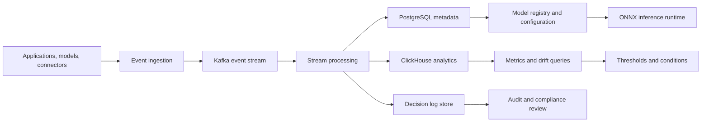

# Cendryva: A Self-Hosted ML Observability Platform for Regulated Enterprises

**Audience:** Critical infrastructure operators, public-sector technology leaders, industrial ML teams, security and compliance leaders  
**Canonical URL:** `/whitepapers/self-hosted-ml-observability/`  
**Related papers:** HIPAA-ready ML decision logs; model drift detection in regulated environments; sub-5ms inference at scale; the 12-Condition Framework  
**Author:** Cendryva  
**Published:** 2026-05-25  
**Version:** 1.0  
**License:** CC BY 4.0
**Contact:** research@cendryva.com

## Abstract

Enterprise machine learning has moved from experimentation into operational infrastructure. Models now influence grid operations, water systems, transportation networks, emergency response, industrial scheduling, public-sector services, security triage, and workforce planning. In these environments, basic model tracking is not enough. Teams need production observability, decision auditability, drift detection, performance thresholds, tenant-aware controls, and deployment patterns that satisfy security and operational continuity requirements.

Cendryva is designed as a self-hosted ML observability, statistics, compliance, and real-time inference platform for organizations that operate sensitive systems. Its architecture combines production metric monitoring, model decision logging, anomaly detection, statistical thresholding, ONNX-based model portability, and a multi-tenant security model suitable for teams that cannot send operational data to opaque third-party systems.

This paper explains the operational gap Cendryva addresses, the architectural principles behind a self-hosted platform, and the controls regulated teams need when ML systems become business-critical infrastructure.

## Executive Summary

Most ML tooling was built around the training lifecycle: experiments, notebooks, feature exploration, model versions, and offline evaluation. Regulated enterprises need that foundation, but their harder problem begins after deployment. They must answer production questions:

- Which model version made a decision?
- Which inputs and features influenced the result?
- Did data drift from the training baseline?
- Did prediction latency, error rate, or downstream business outcome degrade?
- Can the organization reconstruct a decision during an audit?
- Can sensitive data stay inside the organization's own network boundary?
- Can different tenants, business units, or regulated environments remain isolated?

Cendryva's thesis is that ML observability for sensitive operating environments should be self-hosted by default, audit-aware by design, and integrated with real-time statistical monitoring rather than treated as a dashboard-only layer.

For critical infrastructure and public-sector teams, Cendryva provides a practical path between two weak options: sending sensitive telemetry into generic SaaS tools, or building and maintaining an expensive in-house observability stack from scratch. Cendryva gives these teams reusable platform primitives for model monitoring, operational metrics, decision history, anomaly detection, and response workflows while keeping deployment control in the organization's hands.

## The Operational Gap in Enterprise ML

Training-time systems help teams build models. Production systems must help teams operate models. That distinction matters because the failure modes are different.

A model can pass offline validation and still fail in production because the input population changes, features become stale, upstream systems alter schemas, latency spikes, business rules change, or the original training objective no longer reflects operational reality. In regulated environments, those failures are not only engineering incidents. They can become compliance events, patient-safety concerns, customer-impact events, or model risk management issues.

Traditional monitoring also leaves gaps. Infrastructure observability can show CPU, memory, logs, and request latency. Data observability can show pipeline freshness or schema changes. Experiment tracking can show training runs. But production ML operations require a combined view:

- model version and promotion history
- feature distribution and drift
- prediction quality and confidence
- decision logs and audit events
- business metric thresholds
- tenant and environment boundaries
- retraining and rollback triggers

Cendryva treats these concerns as one operational surface.

## Why Self-Hosted Matters

Sensitive operating environments often have constraints that make third-party SaaS monitoring difficult or impossible. Public agencies, utilities, transportation networks, defense-adjacent contractors, industrial operators, and critical infrastructure teams may need strict control over operational data, model inputs, decision artifacts, and audit evidence.

A self-hosted architecture gives organizations direct control over:

- **Data residency:** operational data remains in approved infrastructure and jurisdictions.
- **Network boundaries:** deployments can run inside private cloud, VPC, Kubernetes, or air-gapped environments.
- **Audit evidence:** logs and decision records can be retained under organizational policies.
- **Encryption and keys:** key management can remain under enterprise control.
- **Tenant isolation:** dedicated deployments can separate business units, customers, or regulated workloads.
- **Operational continuity:** teams are less dependent on external telemetry vendors for critical incident response.

Self-hosting is not only a security posture. It is an operating model for organizations that need ML systems to be inspectable, governable, and accountable.

## Cendryva Platform Principles

### 1. Production Observability Over Experiment Tracking

Cendryva focuses on the deployed model lifecycle: inference events, prediction latency, input drift, anomaly scoring, business metric changes, and operational response. Experiment metadata still matters, but the production system must answer what happened after promotion.

### 2. Decision Logs as First-Class Records

Regulated ML systems need durable evidence. A decision log should connect the request, model version, input summary, feature state, prediction output, confidence or score, policy checks, and downstream action. This does not require storing unnecessary raw sensitive data forever, but it does require a traceable record that can support review.

### 3. Statistical Thresholding, Not Passive Dashboards

Dashboards are useful after someone knows what to inspect. Production systems need proactive signal classification. Cendryva's Universal Statistics Engine and 12-Condition Framework classify operational metrics into understandable states, making degradation, missing data, and abnormal behavior easier to act on.

### 4. Open Model Portability

ONNX gives teams a portable model format for production inference across environments. Cendryva's model registry and inference approach are designed around portable artifacts, validation, promotion controls, and rollback rather than framework lock-in.

### 5. Architecture That Separates Workloads by Need

Cendryva uses PostgreSQL for transactional metadata, ClickHouse for high-volume time-series analytics, Kafka for event-driven workflows, Redis for low-latency access patterns, and Vault-oriented credential management for secrets and key handling. The platform does not force every workload into one database or one operational pattern.

## Reference Architecture

At a high level, Cendryva separates control-plane metadata from data-plane telemetry and analytical workloads.



The architecture supports four core loops:

1. **Inference loop:** model requests are evaluated through versioned runtime artifacts.
2. **Observability loop:** latency, errors, feature freshness, drift, and outcomes are collected.
3. **Governance loop:** model promotions, configuration changes, and access events are recorded.
4. **Response loop:** threshold breaches trigger review, rollback, retraining, or escalation.

## Core Capabilities

### Model and Inference Observability

Cendryva tracks production signals that matter after deployment:

- request volume and throughput
- prediction latency and tail latency
- model version usage
- error rates and failed inference calls
- feature freshness
- distribution shift and drift indicators
- anomaly scores
- downstream business metrics

The goal is to make model behavior observable in the same operational language as the rest of the enterprise system.

### Drift and Anomaly Detection

Production model quality depends on whether current data still resembles the data used for validation. Cendryva's drift and anomaly monitoring supports statistical tests such as KS-statistic and PSI, anomaly scoring with production-ready model artifacts, and threshold-based escalation paths.

Drift detection should not be treated as a single chart. It should answer operational questions:

- Which feature moved?
- How far did it move from baseline?
- Which tenants, cohorts, or environments are affected?
- Did prediction behavior change at the same time?
- Should the system notify, retrain, rollback, or require human review?

### Universal Statistics Engine

Cendryva's Universal Statistics Engine generalizes metric monitoring across ML, product, operational, and business domains. Metrics can be computed, rolled up, thresholded, and classified into operational conditions.

This matters because model health is rarely just a model metric. A real incident may appear as a combination of feature drift, prediction latency, conversion drop, queue backlog, missing integration data, or a compliance workflow delay.

### 12-Condition Framework

The 12-Condition Framework is Cendryva's classification layer for operational signals. It turns raw measurements into states that humans and automation can interpret consistently. Example states include POWER, AFFLUENCE, NORMAL, DANGER, EMERGENCY, and NON_EXISTENCE.

For ML observability, condition classification can support:

- warning states before hard failure
- missing-data detection
- escalation policies
- historical condition tracking
- executive-level health summaries
- audit-friendly explanation of operational status

### Decision Logging and Auditability

For regulated teams, a model prediction is often not enough. The organization also needs the context around the prediction. Cendryva's decision logging posture should preserve the operational facts needed for review while allowing teams to minimize raw sensitive payload retention.

A decision log should typically capture:

- request timestamp
- tenant or organization context
- model name and version
- feature vector hash or summarized feature state
- prediction output and score
- policy checks or guardrails
- latency and runtime metadata
- user, service, or system actor
- downstream action or disposition
- immutable audit event identifiers

### Model Registry and Promotion Controls

Cendryva's model registry connects model artifacts to validation, promotion, runtime deployment, and rollback workflows. ONNX is the preferred artifact format because it supports portability across runtimes and deployment targets.

Promotion controls should include:

- model artifact identity
- validation result history
- approval records
- environment-specific promotion gates
- canary or staged rollout metadata
- rollback paths
- model retirement state

### Tenant-Aware Security

Regulated enterprises need more than role-based access control. They need tenant-aware data boundaries, encryption, credential management, and audit trails across the platform.

Cendryva's architecture supports a hybrid tenancy model:

- shared tiers with logical isolation and organization filtering
- enterprise tiers with dedicated infrastructure
- controlled access to secrets and integration credentials
- audit logging for credential and configuration access
- deployment options compatible with private infrastructure

## Deployment Model

Cendryva supports multiple deployment profiles:

| Deployment profile               | Best fit                                              | Key requirements                                          |
| -------------------------------- | ----------------------------------------------------- | --------------------------------------------------------- |
| Private cloud                    | Regulated enterprise teams                            | VPC isolation, managed Kubernetes, enterprise identity    |
| Dedicated tenant                 | Enterprise customers with strict isolation            | Dedicated databases, queues, and analytics stores         |
| Air-gapped or restricted network | High-control environments                             | Offline-compatible releases, private artifact registries  |
| Hybrid analytics                 | Teams with separate operational and analytics systems | Controlled exports, ClickHouse-backed analytical surfaces |

The important design point is that telemetry and decision evidence should not have to leave the enterprise's approved environment for the organization to observe its models.

## Industry Focus: Critical Infrastructure Operations

A regional utility deploys ML models to forecast demand, prioritize maintenance, detect telemetry anomalies, and support dispatch decisions. Even when these models are advisory, operators need to know when input distributions shift, when telemetry freshness degrades, when latency affects response, and when a recommendation must be reconstructed after an incident.

With Cendryva, the team can:

- register the model artifact and approved version
- log inference events and model decisions
- monitor feature drift by asset class, region, or control zone
- classify operational health through threshold conditions
- retain audit events under organizational policy
- trigger review when drift or anomaly scores exceed thresholds
- keep sensitive operational data inside approved infrastructure

The value is not only technical monitoring. Cendryva gives the operator a structured way to prove what the system saw, what it recommended, what state the infrastructure was in, and how the organization responded.

## Industry Focus: Public-Sector Service Delivery

A public-sector agency uses models to forecast service demand, prioritize case queues, detect unusual application patterns, and allocate field staff. These models may not make final decisions, but they influence resource allocation and citizen experience.

Cendryva can support:

- model promotion and rollback records
- tenant-aware monitoring across departments or programs
- drift and anomaly detection over operational signals
- decision logs for review and public accountability workflows
- ClickHouse-backed analytical queries for high-volume time-series inspection
- event-driven escalation through Kafka-backed workflows

For agencies with procurement, data residency, and transparency obligations, Cendryva's self-hosted deployment model makes the observability layer governable instead of hidden inside a vendor-controlled black box.

## Differentiation

Cendryva is differentiated by the combination of self-hosting, ML observability, statistical monitoring, compliance-oriented decision logs, and production inference architecture.

| Category                  | Common gap                                           | Cendryva direction                                        |
| ------------------------- | ---------------------------------------------------- | --------------------------------------------------------- |
| Experiment tracking       | Strong training metadata, weaker production controls | Production-first observability and decision records       |
| Infrastructure monitoring | Strong system telemetry, weak model context          | Model, feature, decision, and business metric correlation |
| BI dashboards             | Strong visualization, weak operational response      | Threshold classification and event-driven escalation      |
| SaaS ML monitoring        | Fast adoption, possible data boundary concerns       | Self-hosted and tenant-aware deployment model             |
| Custom in-house tooling   | Tailored, but expensive to maintain                  | Reusable platform primitives for regulated teams          |

## Implementation Considerations

Teams adopting a self-hosted ML observability platform should plan for:

- clear data retention policies for decision logs
- separation of raw payloads from audit metadata
- baseline windows for drift detection
- model artifact signing or verification
- tenant-aware access control
- incident response runbooks for drift and degraded model behavior
- backup and restore procedures for audit evidence
- security review of all connectors and credentials
- performance budgets for online inference and telemetry ingestion

Cendryva provides platform defaults while allowing regulated enterprises to make deployment-specific governance choices.

## Related Reading

This paper is part of a broader Cendryva whitepaper series:

1. **Designing HIPAA-Ready ML Systems With Immutable Decision Logs**
2. **Model Drift Detection in Regulated Environments**
3. **Sub-5ms Inference at Scale: Why Rust Belongs in Production ML Infrastructure**
4. **The 12-Condition Framework: A Standardized Method for Operational Signal Classification**
5. **Cendryva Technical Architecture: Rust, PostgreSQL, ClickHouse, Kafka, Vault, and ONNX**

## Implementation Status

This section maps the architectural claims above to the Cendryva codebase as of the publication date in the header. Each item lists the file path, what ships today, what is deferred, and the test count.

**ONNX-based inference (Rust)** - SHIPPED

- Code: `src/rms/inference/prediction_service.rs` (function `run_onnx_inference`), `src/rms/inference/session_cache.rs`, `src/bin/inference_benchmark.rs` (HdrHistogram-based reproducible benchmark with coordinated-omission correction).
- Tests: 5 ORT-path tests inside 805 total lib tests passing (`cargo test --lib`).
- Notes: Replaces a prior placeholder. Real `ort::Session::run` calls with input and output tensor marshaling, a model session cache backed by `dashmap`, distinct error variants per failure mode, and tracing spans for each inference phase. Object store model loading is deferred (local disk only in v1). GPU execution providers are deferred (CPU only in v1).

**ClickHouse high-volume observability** - SHIPPED

- Code: `src/clickhouse/schema.rs`, `src/clickhouse/setup.rs`, `src/clickhouse/encryption.rs`, `src/clickhouse/retention.rs`.
- Tests: Included in the 805 cargo lib tests passing.
- Notes: Real `MergeTree` and `AggregatingMergeTree` DDL, partitioning, TTL-based retention, and column-level AES-GCM encryption for sensitive columns.

**12-Condition Framework** - SHIPPED

- Code: `apps/api/src/services/12-conditions/state-machine.ts`, `apps/api/src/services/12-conditions/evaluators.ts`.
- Tests: 100+ tests in the 12-conditions test files, part of 7460 passing TypeScript tests.
- Notes: Full state machine covering POWER, AFFLUENCE, ABUNDANCE, NORMAL, BELOW_NORMAL, DANGER, EMERGENCY, NON_EXISTENCE, LIABILITY, DOUBT, CHANGE, and POWER_CHANGE, with ethics gating and audit callbacks.

**Real-time statistical monitoring and alerts** - SHIPPED

- Code: `src/rms/alerts.rs`, `src/statistics/thresholds/static.rs`, `src/statistics/thresholds/dynamic.rs`, `src/statistics/thresholds/seasonal.rs`, `apps/api/src/services/realtime-metrics/socket.service.ts`, `apps/api/src/services/notifications/dispatcher.ts`.
- Tests: Included in the lib and api test suites cited above.
- Notes: Static, dynamic, and seasonal thresholds, WebSocket fan-out, and multi-channel notifications are wired end to end.

**Audit, WORM persistence, and Vault signing** - SHIPPED

- Schema: `migrations/postgres/V002__Audit_Trail_And_Logs.sql` (WORM columns plus trigger and chain table).
- Code: `src/data/audit_logs.rs`, `apps/api/src/services/domains/audit/immutable-audit-log.service.ts`, `apps/api/src/services/platform/vault/vault.service.ts`, `apps/api/src/services/domains/audit/audit-signing-key-provider.ts` (Vault-backed Ed25519 signing).
- Tests: 52 audit tests plus 5 Postgres integration WORM tests.
- Notes: Operator documentation is in `docs/operations/AUDIT-WORM-OPERATIONS.md`. The production writer cutover is COMPLETE — `apps/api/src/services/domains/audit/audit.service.ts` now routes every write through `ImmutableAuditLogService.appendLog`, so every call site of `auditLogService.log` (auth, metrics, admin, agents, ml promotions, ml drift, valuable-final-products, global HTTP audit interceptor) produces signed, chain-linked rows.

**Drift detection (KS, PSI, JS divergence)** - SHIPPED

- Code: `apps/api/src/services/ml/drift-statistics.ts`, `apps/api/src/services/ml/model-monitoring.service.ts` (function `detectDistributionDrift`), `apps/api/src/services/ml/clickhouse-feature-sample.loader.ts`, `apps/api/src/services/ml/model-monitoring.factory.ts`.
- Tests: 48 drift tests plus 5 loader tests passing.
- Notes: ClickHouse-backed feature sample storage now ships (`migrations/clickhouse/1709424028_add_feature_samples_table.sql`) and is the default loader in the production factory. Drift events flow to the WORM audit sink via `apps/api/src/services/ml/audit-log.audit-sink.ts`.

**Model promotion workflow** - SHIPPED

- Code: `apps/api/src/services/ml/model-promotion.service.ts` (FSM + gates), `apps/api/src/services/ml/data-client-promotion.repository.ts` (Postgres-backed, V006), `apps/api/src/services/ml/data-client-entitlement.checker.ts` (`PRODUCTION_MODEL_PROMOTION` feature gate), `apps/api/src/services/ml/model-promotion.factory.ts` (production wiring).
- Migration: `migrations/postgres/V006*` adds `model_promotions`, `model_promotion_approvals`, `model_promotion_events`, plus a `state` column on `ml_models`.
- Notes: Each promotion event lands in the WORM audit log. Production promotion requires the `PRODUCTION_MODEL_PROMOTION` feature, which is granted on PROFESSIONAL and ENTERPRISE plans.

**Rust ONNX inference (S3 + i64 outputs)** - SHIPPED

- Code: `src/rms/inference/model_loader.rs` adds `s3://` model URLs (S3/MinIO/LocalStack via `aws-creds`); `src/rms/inference/prediction_service.rs` returns `InferenceOutput::Float(Vec<f32>) | Int(Vec<i64>)` so classifier heads with `i64` class indices work natively.

**HIPAA controls catalog** - SHIPPED

- Code: `src/compliance/hipaa.rs` (64 entries), `src/bin/hipaa_report.rs`.
- Notes: Mapping document is in `docs/compliance/HIPAA-CONTROLS-MAPPING.md`.

**Self-hosted packaging** - SHIPPED

- Code: 26 Kubernetes manifests under `infrastructure/k8s/`, Terraform under `infrastructure/terraform/`, `Dockerfile`, `docker-compose.yml`, `docker-compose.gpu.yml`, `docker-compose.vagrant.yml`.
- Notes: No managed-cloud lock-in. Deployments run inside the organization's own infrastructure.

**Cendryva Advisory marketplace (Pillar 2)** - SHIPPED (v1 scaffolding)

- Schema: `migrations/postgres/V010__Billing_And_Marketplace.sql` adds `advisor_profiles`, `advisor_availability_windows`, `advisory_bookings`, `advisory_session_summaries`, `advisor_reviews`.
- Code: `src/data/advisory_marketplace.rs` (Rust dumb storage), `apps/api/src/services/domains/advisory/*` (lifecycle, search, booking orchestration, AI summary, video and payout abstractions), `apps/api/src/routes/advisory-marketplace.ts` (mounted at `/api/v1/advisory-marketplace`).
- Entitlement: `ADVISORY_MARKETPLACE_ACCESS` granted on STARTER, PROFESSIONAL, and ENTERPRISE plans via `StripeService.getEntitlementsForPlan`.
- Tests: 60+ unit tests covering advisor FSM, search ranking, slot computation, booking conflicts, refund eligibility, video provider env selection, and payout fee math; one E2E happy-path file under `apps/e2e/tests/api/advisory/`.
- Customer wiring required for production: real video provider (Daily / Zoom / Twilio) under `CENDRYVA_VIDEO_PROVIDER`, real Stripe `PaymentIntentProvider`, real Stripe Connect `PayoutProvider` under `CENDRYVA_PAYOUT_PROVIDER`, real KYC/AML before flipping advisors to `active`, and an LLM-backed `SummaryGenerator` injected into `SessionSummaryService`. The v1 scaffolding ships logging stubs so the API surface exercises end-to-end without external dependencies; see `docs/whitepapers/advisory-marketplace-operational-intelligence.md` for the full architecture paper.

**Helm chart** - SHIPPED

- Code: `infrastructure/helm/cendryva/` (Chart.yaml v0.1.0, appVersion 2.0.0-beta).
- Install: `helm install cendryva infrastructure/helm/cendryva --namespace cendryva --create-namespace -f my-values.yaml`.
- Notes: Single chart packages API, Web, Postgres, ClickHouse, Redis, OpenSearch, optional Temporal, Ingress, NetworkPolicies, Pod Security Standards, and a pre-install/pre-upgrade migrations Job. `values.dev.yaml` and `values.airgap.yaml` overrides are included.

**How to verify locally**

```
cargo test --lib
pnpm --filter @cendryva/api test
cargo run --bin inference_benchmark
cargo run --bin hipaa_report
```

## Scope and Limitations

This is a vendor-authored whitepaper from Cendryva. It describes design principles and capabilities for a self-hosted ML observability platform aimed at regulated and operationally sensitive environments. It is not an independent product review, a certification statement, or a procurement endorsement.

**In scope.** Architectural principles for production ML observability, decision logging, drift and anomaly detection, model registry and promotion controls, condition classification, and self-hosted deployment patterns. Conceptual mapping of Cendryva primitives to common regulated-enterprise needs.

**Out of scope.** This paper does not constitute a full implementation guide for any specific regulation, nor a one-to-one mapping of Cendryva features to HIPAA, FedRAMP, SR 11-7, or other named regimes. It does not specify hardware sizing, network design, or disaster recovery topology for any individual deployment.

**Not legal, compliance, or model-risk advice.** Compliance posture depends on the controlling jurisdiction, sector, data classification, and contractual obligations of the deploying organization. Citations to NIST AI RMF, HIPAA, SR 11-7, and FedRAMP are US-centric. Organizations subject to EU AI Act, GDPR, UK regulators, or sector-specific regimes outside the US should consult qualified counsel, model-risk officers, and accredited assessors before treating this paper as guidance.

**Empirical claims.** Architectural patterns and capabilities described above ship in the codebase as of the publication date and are traceable through the Implementation Status section. Example workflows remain reference patterns, and performance, latency, drift sensitivity, and operational outcomes will vary by deployment, model, and data. Specific numbers should be validated against the reader's own environment.

**Time-bounded content.** Regulatory expectations, frameworks, and open-source observability standards evolve. Readers should confirm current versions of cited materials and any internal policies before designing or auditing controls.

## References and Further Reading

### Governance and model risk

- NIST. *AI Risk Management Framework (AI RMF 1.0)*. 2023. https://www.nist.gov/itl/ai-risk-management-framework
- Board of Governors of the Federal Reserve System and OCC. *Supervisory Guidance on Model Risk Management (SR 11-7)*. 2011. https://www.federalreserve.gov/supervisionreg/srletters/sr1107.htm
- AICPA. *SOC 2 Trust Services Criteria*. 2017 (with revisions). https://www.aicpa-cima.com/

### Healthcare and federal controls

- US Department of Health and Human Services. *HIPAA Security Rule, 45 CFR Part 164 Subpart C*. https://www.hhs.gov/hipaa/for-professionals/security/index.html
- FedRAMP Program Management Office. *FedRAMP Security Controls Baselines*. https://www.fedramp.gov/

### Observability ecosystem

- Cloud Native Computing Foundation. *Cloud Native Landscape: Observability and Analysis*. https://landscape.cncf.io/
- OpenTelemetry. *OpenTelemetry Specification*. https://opentelemetry.io/docs/
- Prometheus. *Prometheus Documentation*. https://prometheus.io/docs/

### Model portability and runtime

- ONNX. *Open Neural Network Exchange Specification*. https://onnx.ai/
- ONNX Runtime. *ONNX Runtime Documentation*. https://onnxruntime.ai/docs/
