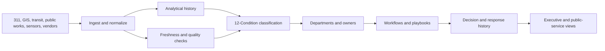

# Smart City and Municipal Operations Observability Buyer’s Guide

**Format:** Buyer’s guide and RFP companion  
**Audience:** City managers, CIOs, public works leaders, transportation teams, 311 leaders, emergency management coordinators, procurement teams  
**Canonical URL:** `/whitepapers/smart-city-municipal-operations-buyers-guide/`  
**Related papers:** Real-time statistical monitoring for live operations; energy and utilities observability; the 12-Condition Framework; Cendryva self-hosted ML observability  
**Author:** Cendryva  
**Published:** 2026-05-25  
**Version:** 1.0  
**License:** CC BY 4.0
**Contact:** research@cendryva.com

## Buyer’s Summary

Cities do not have one operational system. They have many: 311, permitting, public works, transit, traffic signals, code enforcement, parks, utilities, snow response, sanitation, inspections, public safety support, emergency coordination, vendor systems, citizen portals, and spreadsheets.

Smart-city programs often add even more devices and dashboards without solving the operating problem: which signals need attention, which data is stale, which department owns the response, and what evidence exists after action is taken.

Cendryva gives municipalities an observability layer for cross-department operations. It turns city signals into conditions, routes response to owners, tracks evidence, monitors data freshness, and gives leadership a shared view of service health without forcing every department into one monolithic application.

## What This Guide Helps Buyers Evaluate

Use this guide when evaluating platforms for:

- smart city observability
- 311 and citizen service monitoring
- public works operations
- traffic and mobility signal monitoring
- utility and field asset oversight
- emergency operations support
- performance management
- data quality and source freshness
- AI/ML model monitoring in municipal services
- cross-department executive dashboards

## Procurement Problem Statement

A municipality needs a platform that can ingest operational signals from multiple departments and vendors, classify those signals into actionable conditions, route response to accountable owners, and preserve evidence of decisions and actions.

The platform must support privacy-aware data handling, role-based access, source freshness monitoring, public-sector transparency needs, and deployment models suitable for sensitive municipal operations.

## Evaluation Criteria

| Capability                  | Why it matters                                            | Cendryva fit                                                    |
| --------------------------- | --------------------------------------------------------- | --------------------------------------------------------------- |
| Multi-source ingestion      | City data comes from many systems and vendors             | Ingests events, metrics, model outputs, and operational records |
| Source freshness monitoring | A silent feed can hide service degradation                | Detects stale, missing, or low-confidence signals               |
| Condition classification    | Raw metrics do not tell teams what to do                  | Uses the 12-Condition Framework for shared interpretation       |
| Department ownership        | Signals need accountable response                         | Routes conditions to owners and playbooks                       |
| Decision evidence           | Public-sector actions need reviewability                  | Preserves decision logs, response history, and outcomes         |
| Privacy-aware access        | Municipal data can include sensitive resident information | Supports role-based views and data minimization patterns        |
| Analytical history          | Leaders need trends and incident reconstruction           | Uses high-volume analytical history and rollups                 |
| Model monitoring            | AI-assisted services need oversight                       | Tracks model version, drift, decisions, and outcomes            |
| Self-hosted options         | Some cities need infrastructure control                   | Supports deployment models for sensitive environments           |

## Industry Focus: 311 and Citizen Service Operations

311 and citizen service centers are a city’s front door. They receive reports about potholes, missed trash pickup, noise, damaged signs, blocked drains, abandoned vehicles, permit questions, park issues, and many other service needs.

Important signals include:

- request volume by category
- service-level compliance
- time to first response
- time to closure
- reopen rate
- duplicate report clusters
- location hotspots
- department handoff delay
- citizen satisfaction
- stale cases
- missing disposition

Cendryva can classify service conditions across categories and neighborhoods. A pothole backlog can become DANGER, a chronic duplicate-report pattern can become LIABILITY, a missing department feed can become NON_EXISTENCE, and a successful response improvement can become POWER_CHANGE.

This helps city leaders move from complaint volume to operational accountability.

## Industry Focus: Public Works and Field Operations

Public works teams manage roads, drainage, sanitation, snow response, streetlights, signage, facilities, fleet, inspections, and contractor work. Their data often lives in work-order systems, GIS tools, crew apps, IoT devices, and vendor portals.

Key signals include:

- work-order backlog
- crew availability
- asset condition
- route completion
- inspection status
- equipment downtime
- response time by district
- contractor performance
- material inventory
- weather impact

Cendryva connects these signals to condition, owner, and action. A snow-route completion delay can trigger a DANGER state. A recurring drainage hotspot can become LIABILITY. A field asset feed that stops reporting can become NON_EXISTENCE. The response history remains available for after-action review.

## Industry Focus: Traffic, Mobility, and Transit Coordination

Transportation departments and transit teams manage traffic flow, signals, incidents, curb activity, bus performance, pedestrian safety, and construction impacts. USDOT data initiatives emphasize accessibility, usability, evidence-building, and data quality for transportation data. Municipal teams need operational versions of those same principles.

Useful signals include:

- travel time reliability
- signal fault status
- transit headway
- missed trips
- incident duration
- curb occupancy
- construction disruption
- crash or near-miss reports
- bike and pedestrian counts
- sensor last-heard status

Cendryva helps transportation teams see when mobility signals degrade and whether the underlying data remains trustworthy. A bus corridor can be BELOW_NORMAL, a signal outage can be EMERGENCY, and a sensor region can be DOUBT when data coverage is incomplete.

## Industry Focus: Emergency Operations Support

Cendryva is not an incident command system, but it can support the information layer around emergency operations centers and cross-agency coordination. FEMA’s NIMS materials emphasize command, coordination, information gathering, analysis, sharing, and resource support. Municipal observability should strengthen those information workflows without replacing official command structures.

Signals include:

- resource availability
- shelter status
- call volume
- road closures
- utility outages
- crew assignment status
- weather alerts
- damage reports
- public information requests
- facility readiness

Cendryva can help classify and route operational conditions before, during, and after incidents. It preserves evidence of what signals were available, which conditions were active, and what actions were taken.

## Required Architecture Characteristics

Municipal buyers should require:

- open integration patterns
- API-based ingestion
- role-based access control
- source freshness monitoring
- audit and decision logs
- configurable condition thresholds
- geospatial and organizational context
- support for department-specific views
- analytical history and rollups
- privacy-aware data minimization
- self-hosted or controlled deployment options
- clear exportability of operational evidence

## Privacy and Public Trust

Cities must balance operational visibility with resident privacy. The NIST Privacy Framework frames privacy risk in terms of potential problems individuals can experience from data processing. Municipal observability should therefore avoid unnecessary exposure of personally identifiable information and should give departments only the data they need for their role.

Privacy-aware practices include:

- minimizing resident identifiers in broad operational views
- separating case details from aggregate service metrics
- restricting sensitive datasets by role and purpose
- logging access to sensitive views
- defining retention rules
- documenting data sources and uses
- preventing AI or analytics outputs from becoming unreviewable decisions

Cendryva supports these patterns by separating signals, metrics, decisions, and role-specific views.

## RFP Questions to Ask Vendors

1. How does the platform detect stale or missing data sources?
2. Can departments define different thresholds for the same signal type?
3. How are operational conditions routed to owners?
4. Can the city preserve decision and response history?
5. How does the platform support role-based access and privacy-aware views?
6. Can AI model outputs be traced to model version, input freshness, and downstream action?
7. Can the platform support both real-time dashboards and historical analysis?
8. How does the platform handle vendor system changes or schema drift?
9. Can the city export evidence for after-action review or public reporting?
10. Does the platform support self-hosted or controlled deployment models?

## Cendryva Reference Architecture

## What Cendryva Delivers

For smart city and municipal operations, Cendryva delivers:

- multi-department signal ingestion
- data freshness and missing-source detection
- 12-Condition classification
- role-based operational views
- analytical history for trends and after-action review
- decision and response evidence
- model monitoring for AI-assisted workflows
- owner routing and playbooks
- privacy-aware data handling
- self-hosted deployment options for sensitive public-sector environments

The value is practical: Cendryva helps cities see which services are healthy, which departments need support, which data sources are unreliable, and which actions were taken before problems become public failures.

## Buyer’s Implementation Roadmap

### Phase 1: Service Health Foundation

- Select 3-5 high-value departments or services.
- Define critical signals and owners.
- Connect existing systems.
- Configure source freshness rules.
- Establish initial condition thresholds.

### Phase 2: Cross-Department Operations

- Add geospatial and organizational views.
- Configure department playbooks.
- Start response evidence logging.
- Add leadership dashboards.
- Review recurring liabilities.

### Phase 3: AI and Advanced Monitoring

- Monitor AI-assisted routing, prioritization, or forecast models.
- Add drift and anomaly detection.
- Connect model version and decision logs.
- Create after-action review packages.
- Expand to additional departments.

## Scope and Limitations

This is a vendor-authored buyer's guide from Cendryva. It is designed to help municipal procurement, IT, and operations leaders structure evaluation criteria for cross-department observability. It is not an independent analyst report, a procurement endorsement, or a substitute for a formal RFP process.

**In scope.** Capability framing, evaluation criteria, RFP question prompts, and reference architecture for municipal operations observability across 311, public works, transportation, utilities, and emergency-support information workflows.

**Out of scope.** This guide does not certify any vendor (including Cendryva) against specific municipal procurement standards. It is not an incident command system, a 911 CAD replacement, a GIS authoring tool, or an enterprise asset management system. It does not prescribe a single technology stack for smart-city programs.

**Not legal, regulatory, or safety advice.** Municipal procurement is governed by state, county, and city statutes that vary widely. Public-records, open-data, accessibility (Section 508, WCAG), cybersecurity (StateRAMP, CJIS for justice-adjacent systems), and resident privacy obligations differ by jurisdiction. Cited frameworks (NIST, FEMA NIMS, US DOT) are US-centric. International readers should consult equivalent national or municipal frameworks and qualified counsel before adopting this guide as a procurement basis.

**Empirical claims.** Signal catalogs and condition examples are illustrative patterns drawn from common municipal practice, not measurements from a specific city. Performance, response time, and adoption outcomes depend on local context, data quality, and operational capacity.

**Time-bounded content.** Smart-city standards, open-data formats, and federal guidance change. Readers should confirm current versions of cited materials before issuing an RFP or making a procurement decision.

## References and Further Reading

### Smart city and municipal frameworks

- NIST. *Smart Cities and Communities Framework Series (NIST SP 1900-202)*. 2018. https://www.nist.gov/el/cyber-physical-systems/smart-americaglobal-cities/nist-smart-cities-and-communities-framework
- NIST. *Cyber-Physical Systems and Internet of Things for Smart Cities*. https://www.nist.gov/programs-projects/cyber-physical-systemsinternet-things-smart-cities
- ISO. *ISO 37120: Sustainable Cities and Communities — Indicators for City Services and Quality of Life*. 2018. https://www.iso.org/standard/68498.html

### Transportation and mobility data

- US Department of Transportation. *Transportation.gov Data*. https://www.transportation.gov/data
- MobilityData. *General Transit Feed Specification (GTFS) and GTFS-realtime*. https://gtfs.org/

### Public-sector security and information sharing

- StateRAMP. *StateRAMP Security Standards*. https://stateramp.org/
- FBI Criminal Justice Information Services Division. *CJIS Security Policy*. https://www.fbi.gov/services/cjis/cjis-security-policy-resource-center
- US Department of Justice / DHS. *National Information Exchange Model (NIEM)*. https://www.niem.gov/

### Emergency management and privacy

- FEMA. *National Incident Management System (NIMS): Command and Coordination*. https://www.usfa.fema.gov/a-z/nims/command-and-coordination.html
- NIST. *Privacy Framework 1.0*. 2020. https://www.nist.gov/privacy-framework
