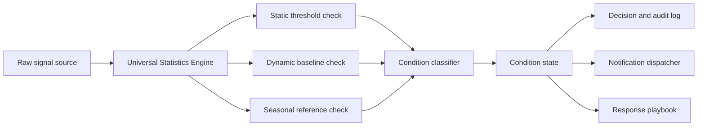

# Why Production ML Needs Statistical Thresholding, Not Just Dashboards

**Audience:** ML platform leaders, SRE and operations teams, data engineering leads, model risk and quality teams, regulated-industry operators  
**Canonical URL:** `/whitepapers/statistical-thresholding-beyond-dashboards/`  
**Related papers:** Real-time statistical monitoring for live operations; the 12-Condition Framework; Cendryva self-hosted ML observability; model drift detection in regulated environments  
**Author:** Cendryva  
**Published:** 2026-05-25  
**Version:** 1.0  
**License:** CC BY 4.0
**Contact:** research@cendryva.com

## Abstract

Most ML monitoring tools present operational data as charts and let operators decide what is normal, what is degraded, and what is broken. This works at small scale, but it does not survive production. A team that runs dozens of models across many tenants, regions, and feature pipelines cannot maintain a coherent operational picture from dashboards alone. They need statistical thresholds that classify each signal into a defined state, route the state into an escalation path, and produce evidence that the classification was applied.

Statistical thresholding is the discipline of converting a continuous measurement into a categorical state that humans and automation can act on consistently. Done well, it borrows from statistical process control, time-series anomaly detection, and operational alerting. Done badly, it produces alert fatigue, false confidence, or silent regressions.

This paper argues that production ML observability must include statistical thresholding as a first-class capability, explains the methods that work for ML telemetry (static thresholds, dynamic baselines, seasonal references, control charts, and condition classification), and describes how Cendryva implements this layer through static, dynamic, and seasonal thresholds plus the 12-Condition Framework.

## Executive Summary

Dashboards are display. Thresholds are decisions. Production ML systems generate more signals than any human can interpret in real time. Without statistical thresholding, dashboards become either ignored (because nothing on them is actionable) or noisy (because every line looks alarming to someone). Both outcomes erode operational trust.

The core argument:

- Visual interpretation does not scale beyond a small number of models and metrics.
- Threshold ownership is an operating-model question, not only an alerting question.
- Statistical process control has a fifty-year record of converting continuous measurements into actionable states.
- ML telemetry needs static, dynamic, and seasonal thresholds, plus condition classification for high-level summarization.
- Alert fatigue is a design problem caused by missing hysteresis, missing escalation tiers, and missing state taxonomy.
- A useful thresholding system produces audit evidence: what was measured, what threshold applied, which state resulted, who was notified, and what response followed.

Cendryva treats statistical thresholding as the bridge between raw observability and operational response. The Universal Statistics Engine computes the measurements, the threshold layer classifies them, the 12-Condition Framework summarizes them, and the audit log captures the trail.

## Dashboards Are Display, Thresholds Are Decisions

A dashboard answers the question "what is happening?" A threshold answers the question "is this normal?" These are different problems and they require different tools.

Display problems are about layout, color, ordering, and density. Decision problems are about classification: pass or fail, normal or abnormal, healthy or degraded, action required or no action required. A chart with a red zone is a primitive threshold, but real production systems need more than visual cues. They need:

- a defined state taxonomy
- a method that produces the state from data
- a confidence or evidence record
- a defined response path per state
- a defined owner for the threshold itself
- a defined cadence for review of the threshold

When teams skip these and rely on dashboards alone, the result is either silence (everyone trusts the model until something catastrophic happens) or noise (everyone tunes out because every chart has a red region somewhere).

## Why Visual Interpretation Does Not Scale

Three observations from operating ML systems at scale:

**Number of signals grows multiplicatively.** A single model in production generates request volume, latency percentiles, error rate, prediction distribution, feature freshness for each input, drift score per feature, prediction confidence distribution, and downstream outcome metrics. Multiply by model versions, tenants, regions, segments, and time windows, and a small platform tracks tens of thousands of distinct time series.

**Human pattern recognition does not transfer between operators.** Two skilled engineers looking at the same chart will often disagree on whether a recent change is meaningful. Without an explicit threshold, this disagreement does not resolve, it just becomes invisible.

**On-call rotations change the watchers.** Even with a strong primary operator, the team that responds to an off-hours incident may have less context than the team that built the dashboard. A threshold that fires is portable across operators in a way that a chart that "looks off" is not.

Scalable operations require a layer that classifies signals into states without requiring a human to interpret a picture each time.

## Statistical Process Control as a Foundation

Statistical process control originated in industrial quality monitoring in the 1920s. Walter Shewhart introduced control charts to distinguish "common cause" variation (the noise of a stable process) from "special cause" variation (a signal that something changed). The methods that grew from this work, including CUSUM and EWMA, are still standard tools in manufacturing quality, clinical trials, and financial risk monitoring.

The lessons transfer to ML observability:

- A stable system has a measurable variation envelope.
- A new measurement is interpreted against that envelope, not against an arbitrary value.
- Out-of-envelope measurements are flagged as needing investigation, not as automatically broken.
- The envelope itself is reviewed and recalibrated as the process evolves.

For ML telemetry, this means a drift score above a fixed threshold is a primitive control. A drift score that exceeds the model's typical variation envelope, sustained over multiple windows, is a better control. The first is easy to set up. The second is closer to a real production signal.

## Threshold Methods That Work for ML Telemetry

No single threshold method covers every ML signal. A practical thresholding layer combines several.

### Static Thresholds

A fixed numerical limit. The simplest method and the right starting point for signals where the acceptable range is known in advance.

Examples: prediction latency must be below 50 ms p99; daily inference count must be above zero; failed inference rate must be below 1 percent.

Strengths: cheap to define, easy to audit, easy to communicate.
Weaknesses: cannot adapt to expected variation; can be wrong if the underlying process changes.

### Dynamic Baselines

A threshold derived from recent history. Common forms include rolling mean plus standard deviations, percentile bands over a trailing window, or seasonal decomposition residuals.

Examples: request volume should be within two standard deviations of the seven-day moving average; prediction-confidence p50 should be within five percentage points of the trailing week.

Strengths: adapts to process change; detects relative shifts; reduces false alarms during steady-state drift.
Weaknesses: harder to audit; can drift along with a slow regression; needs cold-start handling.

### Seasonal References

A threshold that compares the current measurement to the same point in a previous seasonal period. Useful when traffic, demand, or behavior has weekly, daily, or holiday cycles.

Examples: Tuesday 10:00 traffic should be within 10 percent of the previous Tuesday 10:00; weekend prediction volume should fall within the trailing four-weekend envelope.

Strengths: handles known periodicity without complex modeling.
Weaknesses: needs enough history to establish the season; sensitive to schedule changes and one-off events.

### Control Charts (CUSUM and EWMA)

CUSUM accumulates deviations from a target and flags when the running sum crosses a decision threshold. EWMA applies an exponentially weighted moving average and flags when it crosses a control limit. Both are designed to detect small, sustained shifts that a static threshold would miss.

Strengths: well-suited to slow drift; mathematically grounded; tunable for trade-off between detection delay and false-alarm rate.
Weaknesses: requires baseline calibration; harder to explain to non-statistical operators.

### Condition Classification

Rather than emitting a single boolean (in-bounds or out-of-bounds), a condition layer maps the measurement onto a named state from a fixed taxonomy. Operators learn the taxonomy once and apply it across all metrics.

Examples: NORMAL, DANGER, EMERGENCY, NON_EXISTENCE; or GREEN, YELLOW, RED with documented criteria.

Strengths: high signal density per dashboard cell; consistent operator language; supports executive summaries.
Weaknesses: needs clear definitions and explicit policies; requires governance to keep the taxonomy stable.

## Threshold Ownership and Operating Model

A threshold is not just a configuration value. It encodes a policy decision: this measurement, exceeding this value, in this direction, sustained for this duration, requires this response.

Healthy threshold operations need explicit answers to:

- Who owns the threshold?
- Who can change it?
- What evidence is required for a change?
- How are changes audited?
- How often are thresholds reviewed?
- What is the response playbook when the threshold fires?
- What is the escalation path if the first responder does not act?
- What is the back-off behavior after the threshold is silenced?

When thresholds have no owner, they decay. Operators silence noisy alerts, retune in private, or override in production without leaving a trace. The signal value of the threshold collapses, and the team loses operational ground.

## Alert Fatigue and How to Avoid It

Alert fatigue is the natural consequence of a thresholding system that fires too often, too unimportantly, or without enough context to act. It is not a personality flaw of operators. It is a design failure.

Common contributors:

- Single severity tier (everything is "alert").
- No hysteresis (a flapping metric fires repeatedly).
- No aggregation (one root cause fires many threshold breaches).
- No suppression during known maintenance windows.
- Thresholds set at training time and never reviewed.
- No clear ownership.
- No defined response playbook.

Practical mitigations:

- Multiple severity tiers tied to response expectations (informational, warning, page, executive escalation).
- Hysteresis: enter a degraded state after N consecutive breaches, leave it after M consecutive recoveries.
- Suppression windows tied to deployment and maintenance events.
- Correlation: a single incident produces a single open ticket, not one per breached metric.
- Periodic threshold review built into the operating cadence.
- Owner per threshold, with the owner accountable for response quality.
- A response playbook attached to the threshold so the responder is not improvising at 3 a.m.

## Response Playbooks

A threshold without a playbook is a notification, not an operational control. A playbook should answer:

- What does this state mean?
- What is the first action?
- What is the expected resolution time?
- Who should be notified and when?
- What evidence should be captured?
- What is the rollback or fallback option?
- When is the incident considered closed?

Playbooks are the difference between a threshold that produces an audit trail and a threshold that produces a Slack message.

## The 12-Condition Framework as Threshold Output

Cendryva applies a fixed condition taxonomy to threshold output rather than emitting raw severities. The taxonomy is the 12-Condition Framework: POWER, AFFLUENCE, ABUNDANCE, NORMAL, BELOW_NORMAL, DANGER, EMERGENCY, NON_EXISTENCE, LIABILITY, DOUBT, CHANGE, and POWER_CHANGE. Each condition has documented entry and exit criteria, a recommended response posture, and an escalation expectation.

Why a fixed taxonomy:

- Operators learn it once, apply it across every metric and model.
- Executive summaries can roll up by condition rather than by metric name.
- Audit and review are easier because the language is stable.
- Automated remediation can branch on the condition without parsing free-text severity.

For ML telemetry specifically, the framework converts drift scores, latency distributions, prediction volume, confidence shifts, and downstream outcome changes into a small number of named states that fit on a single dashboard cell and survive a handoff between shifts.

## Architecture Pattern



The boundary between measurement, classification, and response should be explicit. Measurement is a math problem. Classification is a policy problem. Response is an operational problem. Conflating them produces brittle alerts and unclear ownership.

## How Cendryva Applies This Pattern

Cendryva's thresholding layer combines static, dynamic, and seasonal thresholds with the 12-Condition Framework. The threshold types and the condition state machine are implemented in Rust and TypeScript and are exercised by the model monitoring pipeline.

- Static thresholds: `src/statistics/thresholds/static_threshold.rs`.
- Dynamic baselines: `src/statistics/thresholds/dynamic.rs`.
- Seasonal references: `src/statistics/thresholds/seasonal.rs`.
- Condition state machine: `apps/api/src/services/12-conditions/state-machine.ts`.
- Condition evaluators: `apps/api/src/services/12-conditions/evaluators.ts`.
- Condition event bus: `apps/api/src/services/12-conditions/condition-event-bus.service.ts`.
- Real-time signal scanning and alerts: `src/rms/alerts.rs`.
- Notification dispatch: `apps/api/src/services/notifications/dispatcher.ts`.

Drift score classification is wired through `apps/api/src/services/ml/model-monitoring.service.ts`, and threshold breach events land in the immutable audit log via `apps/api/src/services/ml/audit-log.audit-sink.ts`.

## Implementation Checklist

For a team adopting statistical thresholding for ML observability:

- Inventory every metric currently displayed on a dashboard.
- For each metric, name the threshold method (static, dynamic, seasonal, control chart, condition classifier).
- For each threshold, name the owner and the review cadence.
- For each threshold, write the response playbook.
- Define a small, fixed condition taxonomy and document the entry and exit criteria for each state.
- Wire condition output to the notification system with explicit severity tiers.
- Wire threshold breach events to the audit log so the decision trail is reconstructable.
- Build hysteresis and suppression into the classifier.
- Schedule periodic threshold review with the owner.
- Publish threshold configuration as code so changes are reviewable.

## Conclusion

Dashboards are not enough. A production ML platform that depends on a human noticing a chart will eventually miss the signal that matters. Statistical thresholding converts continuous measurement into a categorical state that operators, automation, executives, and auditors can interpret consistently.

The discipline is not new. Statistical process control has been used for industrial quality since the 1920s, and the same principles translate cleanly to ML telemetry. What changes is the volume of signals and the variety of methods needed: static thresholds for known limits, dynamic baselines for adaptive comparison, seasonal references for cyclical traffic, control charts for slow drift, and condition classification for executive summarization.

Cendryva treats statistical thresholding as a first-class platform capability rather than a dashboard styling choice. The Universal Statistics Engine produces the measurements, the threshold layer classifies them across multiple methods, the 12-Condition Framework gives the classification a stable language, and the audit log preserves the trail. Dashboards still exist, but they are display. The thresholds are where the decisions live.

## Implementation Status

This section maps the architectural claims above to the Cendryva codebase as of the publication date in the header. Each item lists the file path, what ships today, what is deferred, and the test count.

**Static thresholds** — SHIPPED
- Code: `src/statistics/thresholds/static_threshold.rs`, `src/statistics/thresholds/mod.rs`.
- Notes: Configurable upper/lower bounds with direction-aware comparison. Threshold definitions are persisted via the metric threshold tables introduced in `migrations/postgres/V005__Legacy_Metrics_Foundation.sql` and `V014__Platform_Stats_And_Conditions.sql`.

**Dynamic baseline thresholds** — SHIPPED
- Code: `src/statistics/thresholds/dynamic.rs`.
- Notes: Rolling-window comparison with configurable tolerance percentage. The window query reads from the `metric_values` time series in Postgres.

**Seasonal reference thresholds** — SHIPPED
- Code: `src/statistics/thresholds/seasonal.rs`.
- Notes: Compares the current value to the same point in the previous seasonal period (default seven days back, ±30 minute window). Tolerance percentage is configurable; default is 10 percent.

**12-Condition state machine** — SHIPPED
- Code: `apps/api/src/services/12-conditions/state-machine.ts`, `apps/api/src/services/12-conditions/evaluators.ts`, `apps/api/src/services/12-conditions/condition.service.ts`, `apps/api/src/services/12-conditions/condition-event-bus.service.ts`.
- Tests: 100+ tests across the `12-conditions/` directory, including `state-machine.test.ts`, `evaluators.test.ts`, `ethics-authority.test.ts`, and `condition.service.test.ts`.
- Notes: Full state machine covering POWER, AFFLUENCE, ABUNDANCE, NORMAL, BELOW_NORMAL, DANGER, EMERGENCY, NON_EXISTENCE, LIABILITY, DOUBT, CHANGE, and POWER_CHANGE with documented entry and exit criteria and ethics gating.

**Real-time alert dispatch** — SHIPPED
- Code: `src/rms/alerts.rs`, `apps/api/src/services/realtime-metrics/socket.service.ts`, `apps/api/src/services/notifications/dispatcher.ts`.
- Notes: WebSocket fan-out for threshold breach events plus multi-channel notification dispatch (email, in-app, webhook).

**Drift score thresholding** — SHIPPED
- Code: `apps/api/src/services/ml/model-monitoring.service.ts` (`detectDistributionDrift`), `apps/api/src/services/ml/drift-statistics.ts`, `apps/api/src/services/ml/audit-log.audit-sink.ts`.
- Tests: 48 drift tests plus the audit sink test file.
- Notes: KS-statistic, PSI, and JS divergence outputs are evaluated against configured thresholds and routed through the WORM audit log.

**Audit trail for threshold breaches** — SHIPPED
- Code: `apps/api/src/services/domains/audit/immutable-audit-log.service.ts`, `apps/api/src/services/domains/audit/audit.service.ts`, `src/data/audit_logs.rs`.
- Schema: `migrations/postgres/V002__Audit_Trail_And_Logs.sql` (WORM columns plus chain table).
- Notes: Threshold breach events, condition transitions, and notification dispatch produce signed, chain-linked audit rows.

**Deferred**
- CUSUM and EWMA control-chart engines as named threshold types (current dynamic baseline supports rolling-window comparison but does not yet expose CUSUM/EWMA as first-class configuration options; the math is straightforward to add on top of the existing dynamic threshold path).
- Threshold suggestion or auto-tuning from historical data (operators currently set thresholds explicitly; suggestion based on quantile bands of recent history is a planned addition).
- Per-threshold review-cadence enforcement in the UI (the data model supports owner and review date fields; the workflow that nudges owners on overdue review is not yet built).

**How to verify locally**

```
cargo test --lib statistics::thresholds
pnpm --filter @cendryva/api test 12-conditions
pnpm --filter @cendryva/api test ml/model-monitoring
```

## Scope and Limitations

This is a vendor-authored paper from Cendryva. It explains why statistical thresholding belongs alongside dashboards in production ML observability and how Cendryva implements that layer. It is not a vendor-neutral comparison of alerting systems and it is not a complete textbook on statistical process control.

**In scope.** Conceptual differences between dashboards and thresholds, the threshold methods that work for ML telemetry (static, dynamic, seasonal, control charts, condition classification), threshold ownership and operating-model considerations, alert fatigue mitigation, response playbooks, and the mapping of these concepts to Cendryva's Universal Statistics Engine and the 12-Condition Framework.

**Out of scope.** Detailed mathematical derivations of CUSUM, EWMA, and Bayesian change-point methods. Specific notification-channel configuration. UI design for alerting consoles. Cross-tool migration guidance for teams moving from a specific incumbent (PagerDuty, Opsgenie, Grafana alerting, Prometheus Alertmanager, etc.).

**Empirical claims.** The control-chart methods cited (Shewhart, CUSUM, EWMA) are well-established in the statistical process control literature; the references section points to canonical sources. Claims about alert fatigue and operator behavior reflect common observation in SRE and operations literature, summarized rather than measured here.

**Time-bounded items.** Threshold method names and tool ecosystems evolve. The Cendryva file paths in the Implementation Status section reflect the publication date and may move under refactoring.

**Not legal or model-risk advice.** When a threshold governs a regulated decision (for example credit, employment, healthcare, or safety), additional regulatory and ethical obligations apply. Threshold design in those contexts should involve qualified counsel, model-risk officers, and the applicable regulator's guidance.

## References and Further Reading

Statistical process control

- Shewhart, W. A. *Economic Control of Quality of Manufactured Product*. Van Nostrand, 1931.
- Page, E. S. *Continuous Inspection Schemes*. Biometrika, 41 (1/2), 1954.
- Roberts, S. W. *Control Chart Tests Based on Geometric Moving Averages*. Technometrics, 1 (3), 1959.
- Montgomery, D. C. *Introduction to Statistical Quality Control*. Wiley.
- NIST/SEMATECH. *e-Handbook of Statistical Methods*. https://www.itl.nist.gov/div898/handbook/

Operations and alerting

- Beyer, B., Jones, C., Petoff, J., and Murphy, N. R. (eds.). *Site Reliability Engineering*. O'Reilly, 2016. https://sre.google/sre-book/table-of-contents/
- Beyer, B., Murphy, N. R., Rensin, D. K., Kawahara, K., and Thorne, S. (eds.). *The Site Reliability Workbook*. O'Reilly, 2018. https://sre.google/workbook/table-of-contents/
- Sridharan, C. *Distributed Systems Observability*. O'Reilly, 2018.

ML monitoring and drift

- Sculley, D. et al. *Hidden Technical Debt in Machine Learning Systems*. NeurIPS, 2015. https://papers.nips.cc/paper/5656-hidden-technical-debt-in-machine-learning-systems
- Polyzotis, N. et al. *Data Validation for Machine Learning*. SysML, 2019.

Cendryva foundations

- Cendryva. *The 12-Condition Framework*. https://cendryva.com/whitepapers/12-condition-framework/
- Cendryva. *Real-Time Statistical Monitoring for Live Operations*. https://cendryva.com/whitepapers/real-time-statistical-monitoring-live-operations/
