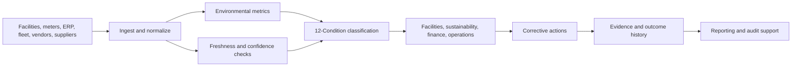

# Sustainability and Environmental Operations Field Guide

**Format:** Executive field guide  
**Audience:** Sustainability leaders, ESG teams, facilities leaders, manufacturing operations, supply-chain leaders, finance and audit stakeholders  
**Canonical URL:** `/whitepapers/sustainability-esg-environmental-operations-field-guide/`  
**Related papers:** Energy and utilities observability; agricultural and cold-chain observability; ClickHouse for high-volume observability; the 12-Condition Framework  
**Author:** Cendryva  
**Published:** 2026-05-25  
**Version:** 1.0  
**License:** CC BY 4.0
**Contact:** research@cendryva.com

## One-Page Brief

Sustainability programs often fail operationally for a simple reason: teams collect annual reporting data, but the business generates environmental signals every day. Energy consumption, refrigerant events, fleet fuel use, waste diversion, water usage, supplier data, facility exceptions, meter quality, production throughput, and maintenance activity all move continuously.

The gap is not intent. The gap is operating infrastructure.

Cendryva gives sustainability and environmental operations teams a way to monitor the signals behind carbon, water, waste, energy, and facility performance before they become year-end reporting surprises. It connects source freshness, statistical thresholds, 12-Condition classification, decision logs, anomaly detection, and evidence history so teams can see where performance is degrading, which data is missing, and which corrective action was taken.

This field guide is written for leaders who need sustainability reporting to become an operational discipline, not an annual scramble.

## Executive Decisions This Guide Supports

| Decision                                                             | Why it matters                                                                       | What Cendryva adds                                               |
| -------------------------------------------------------------------- | ------------------------------------------------------------------------------------ | ---------------------------------------------------------------- |
| Which facilities are drifting from energy targets?                   | Energy variance can become cost, emissions, or equipment risk                        | Facility-level conditions, anomaly detection, and trend evidence |
| Which emissions data is incomplete or stale?                         | Missing data weakens reporting confidence                                            | Source freshness and NON_EXISTENCE detection                     |
| Which operational issues create recurring environmental liabilities? | Chronic issues hide behind annual averages                                           | LIABILITY classification and recurrence history                  |
| Which corrective actions worked?                                     | Teams need proof of improvement, not just activity                                   | Decision and response logs tied to outcomes                      |
| Which suppliers or sites need review?                                | Scope 3 and supplier data quality are hard to manage                                 | Signal confidence, freshness, and condition history              |
| Which executives need which view?                                    | Facilities, finance, audit, and sustainability teams need different levels of detail | Role-specific operational and executive summaries                |

## The Operating Problem

Sustainability programs rely on data from many systems:

- utility bills
- smart meters
- building management systems
- fleet telematics
- ERP and procurement
- waste vendors
- refrigerant logs
- maintenance systems
- production systems
- supplier questionnaires
- environmental monitoring
- manual spreadsheets

These sources rarely arrive cleanly. Some are delayed. Some are estimated. Some are duplicated. Some change schema. Some are only updated monthly. Some fail silently.

Annual reporting workflows can tolerate some delay, but operations cannot. If a refrigerant leak, abnormal energy load, water anomaly, or waste-process failure continues for weeks, the problem becomes more expensive and harder to explain.

Cendryva turns these scattered signals into monitored operational conditions.

## Industry Focus: Facilities and Real Estate Portfolios

Facilities teams manage energy, water, waste, maintenance, comfort, equipment performance, occupancy, and capital projects across many sites. Sustainability teams often depend on these same signals for emissions and environmental reporting.

**Common signals**

- electricity consumption
- natural gas use
- water usage
- refrigerant events
- HVAC runtime
- occupancy-adjusted energy intensity
- equipment faults
- waste diversion
- lighting schedules
- building automation exceptions

**Cendryva operating value**

- Classify site performance as NORMAL, BELOW_NORMAL, DANGER, or LIABILITY.
- Detect missing meter feeds as NON_EXISTENCE instead of letting dashboards imply health.
- Compare similar facilities without flattening local context.
- Preserve evidence of corrective actions such as HVAC tuning, repair, schedule changes, or retrofit completion.
- Provide executives with portfolio-level condition summaries while keeping facility teams close to raw metrics.

## Industry Focus: Manufacturing and Process Operations

Manufacturing sustainability is tied to production reality. Energy, water, waste, scrap, rework, downtime, and process quality all interact. A plant may miss environmental targets because of equipment degradation, abnormal batch behavior, compressed schedules, or material quality changes.

**Common signals**

- energy per unit produced
- water per batch
- scrap and rework rate
- waste stream volume
- process temperature
- compressed air usage
- maintenance backlog
- production mix
- equipment runtime
- emissions control equipment status

**Cendryva operating value**

- Normalize environmental performance against production context.
- Detect process drift before it becomes month-end variance.
- Connect abnormal environmental metrics to equipment, line, batch, or shift.
- Classify chronic waste or energy issues as LIABILITY.
- Preserve decision evidence for operations, quality, sustainability, and audit teams.

## Industry Focus: Supply Chain and Scope 3 Data Quality

Scope 3 reporting and supplier sustainability programs are difficult because the data often arrives from outside the organization. It may be late, estimated, inconsistent, or incomplete. Supplier risk is not only about the reported value; it is also about the confidence and freshness of the data.

**Common signals**

- supplier emissions factors
- shipment mode and distance
- purchased goods categories
- supplier questionnaire status
- data confidence score
- missing supplier responses
- spend and volume changes
- logistics lane emissions
- supplier audit outcomes

**Cendryva operating value**

- Treat supplier data freshness as an operational signal.
- Classify low-confidence supplier records as DOUBT.
- Identify missing supplier responses as NON_EXISTENCE.
- Track improvement after supplier engagement.
- Connect procurement, sustainability, and finance teams around shared condition history.

## Signal Catalog

| Signal family | Example measures                                     | Cendryva condition use                              |
| ------------- | ---------------------------------------------------- | --------------------------------------------------- |
| Energy        | kWh, gas therms, peak demand, energy intensity       | Detect drift, abnormal peaks, chronic waste         |
| Water         | usage, discharge, process water intensity            | Flag leaks, abnormal process use, missing meters    |
| Waste         | landfill, recycling, hazardous waste, diversion rate | Identify process failures and recurring liabilities |
| Refrigerants  | leak events, charge, service logs                    | Trigger DANGER or EMERGENCY conditions              |
| Fleet         | fuel, idle time, route distance, EV charge           | Monitor operational emissions drivers               |
| Production    | units, batch mix, downtime, scrap                    | Normalize environmental metrics by activity         |
| Supplier      | emissions factors, questionnaires, confidence        | Track Scope 3 data quality and supplier progress    |
| Data quality  | freshness, completeness, duplicates, estimates       | Prevent false confidence in reporting               |

## Condition Model for Sustainability Operations

| Condition     | Sustainability interpretation                                      |
| ------------- | ------------------------------------------------------------------ |
| POWER         | Exceptional improvement or target overperformance                  |
| AFFLUENCE     | Strong favorable performance                                       |
| ABUNDANCE     | Excess capacity or environmental buffer                            |
| NORMAL        | Within expected range                                              |
| BELOW_NORMAL  | Mild degradation or early variance                                 |
| DANGER        | Material deviation requiring owner review                          |
| EMERGENCY     | Immediate environmental, safety, or compliance risk                |
| NON_EXISTENCE | Missing meter, supplier response, record, or evidence              |
| DOUBT         | Low-confidence, estimated, conflicting, or stale data              |
| CHANGE        | Rapid shift in usage, emissions, or data quality                   |
| POWER_CHANGE  | Rapid favorable improvement after action                           |
| LIABILITY     | Chronic waste, recurring issue, or unresolved environmental burden |

The point is not to replace carbon accounting. The point is to make the operating signals behind carbon, water, waste, and environmental performance visible before they become reporting problems.

## Blueprint: From Reporting Data to Operating System

Cendryva sits between raw sustainability data and reporting. It helps teams operate the signals continuously, then produce stronger evidence when reporting, audit, or executive review arrives.

## 90-Day Deployment Plan

### Days 1-30: Establish Critical Signals

- Select 10-20 high-value environmental signals.
- Prioritize sites, plants, or suppliers with known variance.
- Define source freshness expectations.
- Assign metric owners.
- Establish baseline windows.

### Days 31-60: Classify and Route Conditions

- Map thresholds to the 12-Condition Framework.
- Configure NON_EXISTENCE and DOUBT rules for missing or low-confidence data.
- Build owner-specific views.
- Connect DANGER and EMERGENCY conditions to response workflows.
- Begin condition history review.

### Days 61-90: Close the Evidence Loop

- Log corrective actions.
- Track outcome changes after intervention.
- Identify recurring LIABILITY conditions.
- Prepare executive portfolio summaries.
- Align operational evidence with reporting and audit needs.

## What Cendryva Delivers

For sustainability and environmental operations, Cendryva delivers:

- multi-source environmental signal ingestion
- source freshness and data quality monitoring
- high-volume time-series analytics
- facility, supplier, fleet, and production context
- 12-Condition classification
- anomaly detection and trend monitoring
- corrective-action evidence
- recurring issue analysis
- executive condition summaries
- self-hosted deployment options for sensitive operational data

The value is simple: Cendryva helps sustainability teams stop discovering operational problems after reporting periods close. It gives them the monitoring and evidence layer needed to manage environmental performance while there is still time to act.

## Board-Level Questions Cendryva Helps Answer

- Which sustainability targets are operationally at risk?
- Which facilities or suppliers are driving the variance?
- Which problems are acute, and which are chronic liabilities?
- Which reported values are based on stale, missing, or low-confidence data?
- Which corrective actions improved performance?
- Where does the organization need capital investment, process change, or supplier engagement?

## Scope and Limitations

This is a vendor-authored field guide from Cendryva. It explains how to apply operational observability to the signals behind sustainability and environmental reporting. It is not an accounting methodology, a disclosure framework, or an independent assurance product.

**In scope.** Operating patterns for monitoring environmental signals (energy, water, waste, refrigerants, fleet, production, supplier data), classifying conditions, and preserving evidence of corrective action. Conceptual mapping of these operations to common reporting workflows.

**Out of scope.** This guide does not perform GHG inventory calculations, generate disclosure documents, replace a carbon accounting platform, or constitute assurance under ISAE 3000, ISAE 3410, or AICPA attestation standards. It is not a Life Cycle Assessment tool and does not substitute for emission factor databases.

**Not legal, accounting, or disclosure advice.** ESG and sustainability disclosure is governed by a fast-moving and jurisdiction-specific patchwork. The SEC Climate Disclosure Rule is US-specific and has been subject to litigation and revision. CSRD and ESRS are EU regimes with extraterritorial reach. ISSB IFRS S1/S2 adoption depends on jurisdiction. California SB 253 and SB 261 apply to entities doing business in California. Readers should consult qualified counsel, sustainability assurance providers, and finance leadership before treating any operational signal in this paper as disclosure-ready.

**Empirical claims.** Signal families, condition examples, and the 90-day plan are illustrative. They reflect common practice patterns rather than measured outcomes from any specific organization. Actual results depend on data availability, source quality, and operational maturity.

**Time-bounded content.** Reporting standards, regulatory timelines, and emission factor sources change frequently. Readers should verify current versions of GHG Protocol, ISSB, CSRD/ESRS, SBTi, and any national or sub-national rules before relying on this material.

## References and Further Reading

### Greenhouse gas accounting

- World Resources Institute and WBCSD. *Greenhouse Gas Protocol: Corporate Accounting and Reporting Standard*. Revised edition, 2004. https://ghgprotocol.org/corporate-standard
- World Resources Institute and WBCSD. *Corporate Value Chain (Scope 3) Accounting and Reporting Standard*. 2011. https://ghgprotocol.org/standards/scope-3-standard
- US Environmental Protection Agency. *Greenhouse Gas Reporting Program (GHGRP)*. https://www.epa.gov/ghgreporting
- US EPA Center for Corporate Climate Leadership. *Scope 1 and Scope 2 Inventory Guidance*. https://www.epa.gov/climateleadership/scope-1-and-scope-2-inventory-guidance

### Disclosure frameworks

- CDP. *CDP Disclosure System*. https://www.cdp.net/
- Task Force on Climate-related Financial Disclosures. *Final Report: Recommendations of the TCFD*. 2017. https://www.fsb-tcfd.org/
- IFRS Foundation. *ISSB Standards IFRS S1 (General Sustainability) and IFRS S2 (Climate)*. 2023. https://www.ifrs.org/issued-standards/ifrs-sustainability-standards-navigator/
- European Financial Reporting Advisory Group. *European Sustainability Reporting Standards (ESRS) under the Corporate Sustainability Reporting Directive (CSRD)*. 2023. https://www.efrag.org/
- US Securities and Exchange Commission. *The Enhancement and Standardization of Climate-Related Disclosures for Investors*. 2024. https://www.sec.gov/newsroom/climate-related-disclosure

### Target setting and governance

- Science Based Targets initiative. *SBTi Corporate Net-Zero Standard*. https://sciencebasedtargets.org/net-zero
- NIST. *AI Risk Management Framework (AI RMF 1.0)*. 2023. https://www.nist.gov/itl/ai-risk-management-framework
