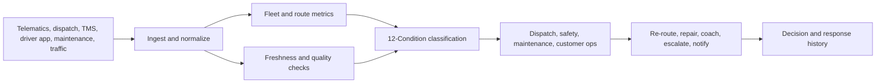

# Transportation, Fleet, and Last-Mile Observability Blueprint

**Format:** Technical implementation blueprint  
**Audience:** Fleet operators, last-mile delivery platforms, dispatch teams, transportation technology leaders, safety managers, logistics analytics teams  
**Canonical URL:** `/whitepapers/transportation-fleet-last-mile-observability-blueprint/`  
**Related papers:** Real-time statistical monitoring for live operations; sub-5ms inference at scale; model drift detection in regulated environments; the 12-Condition Framework  
**Author:** Cendryva  
**Published:** 2026-05-25  
**Version:** 1.0  
**License:** CC BY 4.0
**Contact:** research@cendryva.com

## Blueprint Objective

Transportation operations depend on moving assets, variable demand, driver behavior, customer commitments, route conditions, weather, maintenance, and dispatch decisions. A fleet can look healthy in daily reporting while individual routes, drivers, vehicles, or delivery zones are already degrading.

This blueprint defines an observability architecture for transportation, fleet, and last-mile delivery operations.

Cendryva provides the operating layer: ingest vehicle and dispatch signals, monitor freshness, classify route and fleet conditions, trace model-assisted dispatch decisions, preserve response evidence, and give operations leaders a shared view of service, safety, and reliability.

## Reference Use Cases

| Use case                  | Operational risk                                     | Cendryva role                                    |
| ------------------------- | ---------------------------------------------------- | ------------------------------------------------ |
| Last-mile delivery        | SLA misses, route failures, failed delivery attempts | Route condition monitoring and response evidence |
| Fleet safety              | Risky driving, incident clusters, stale telematics   | Safety signal classification and owner routing   |
| Dispatch optimization     | Bad recommendations, model drift, late inputs        | Model version traceability and decision logs     |
| Maintenance operations    | Preventable breakdowns, unavailable vehicles         | Asset condition and recurring liability tracking |
| Passenger transport       | Headway gaps, missed trips, service reliability      | Real-time condition monitoring by route and zone |
| Cold or sensitive freight | Temperature excursions, chain-of-custody gaps        | Freshness, condition, and evidence history       |

## System Inputs

Transportation observability should combine signals from operational, vehicle, customer, and external systems.

**Core sources**

- telematics
- dispatch system
- route optimizer
- transportation management system
- driver mobile app
- proof-of-delivery system
- maintenance system
- fuel or charging system
- customer promise/SLA system
- weather and traffic feeds
- safety events
- support tickets

**Cendryva ingestion pattern**

## Data Model Blueprint

| Entity             | Key fields                                               | Why it matters                           |
| ------------------ | -------------------------------------------------------- | ---------------------------------------- |
| Vehicle            | vehicle ID, type, capacity, state, location, health      | Enables asset-level monitoring           |
| Driver             | driver ID, shift, route, safety events, app status       | Supports safety and workload visibility  |
| Route              | route ID, planned stops, actual stops, delay, exceptions | Measures service reliability             |
| Stop               | ETA, arrival, dwell, proof, failed attempt reason        | Links operations to customer promise     |
| Dispatch decision  | model/rule version, recommendation, override, owner      | Makes optimization accountable           |
| Maintenance event  | fault, inspection, repair, downtime, recurrence          | Tracks asset reliability                 |
| External condition | weather, traffic, road closure, event                    | Explains route and SLA variance          |
| Freshness state    | source, last update, expected cadence, lag               | Prevents stale data from looking healthy |

## Workflow 1: Route Reliability Monitoring

**Goal:** Detect route degradation before missed commitments cascade.

**Signals**

- planned versus actual departure
- ETA variance
- stop dwell time
- failed delivery attempts
- route completion percentage
- customer notification delay
- driver app last update
- traffic or weather exception

**Cendryva pattern**

- Classify each route as NORMAL, BELOW_NORMAL, DANGER, or EMERGENCY.
- Mark stale driver-app or telematics data as NON_EXISTENCE.
- Identify route patterns that repeatedly become LIABILITY.
- Preserve reroute, customer notification, or escalation evidence.

## Workflow 2: Dispatch and Optimization Governance

**Goal:** Make route optimization and dispatch recommendations traceable.

Optimization systems can recommend assignments, routes, delivery windows, vehicle usage, and driver sequencing. These recommendations can fail when constraints are stale, traffic changes, vehicle capacity is wrong, or model behavior drifts.

**Signals**

- optimizer version
- recommendation accepted or overridden
- input freshness
- constraint violations
- route cost estimate
- actual route outcome
- SLA impact
- driver or dispatcher override reason

**Cendryva pattern**

- Log dispatch decisions with model or rule version.
- Monitor drift between predicted and actual route outcomes.
- Classify unreliable recommendations as DOUBT or DANGER.
- Preserve override evidence for continuous improvement.

## Workflow 3: Fleet Safety and Driver Risk

**Goal:** Monitor safety signals without reducing driver management to a single score.

FMCSA's Safety Measurement System uses inspection, crash, and investigation data to identify carriers that may pose safety risk. Private fleets and delivery operators also need operational safety monitoring based on telematics, coaching, vehicle health, and incident history.

**Signals**

- harsh braking
- speeding
- seatbelt events
- fatigue indicators where available
- crash or near-miss events
- inspection outcomes
- coaching completion
- vehicle defect reports
- repeated route risk

**Cendryva pattern**

- Classify safety patterns by route, vehicle, terminal, and driver group.
- Use DOUBT when sample size or sensor confidence is low.
- Route DANGER conditions to safety owners.
- Preserve coaching, inspection, and remediation evidence.

## Workflow 4: Maintenance and Asset Availability

**Goal:** Reduce preventable downtime and identify chronic fleet liabilities.

**Signals**

- diagnostic trouble codes
- inspection status
- vehicle downtime
- recurring repair category
- battery or fuel efficiency
- tire or brake condition
- maintenance backlog
- parts availability
- missed preventive maintenance

**Cendryva pattern**

- Classify vehicle health and maintenance backlog.
- Identify recurring problems as LIABILITY.
- Correlate route reliability with asset condition.
- Preserve repair and return-to-service evidence.

## Workflow 5: Customer Promise and Exception Management

**Goal:** Connect operational conditions to customer-facing commitments.

**Signals**

- delivery promise window
- predicted delay
- notification sent
- failed attempt reason
- claim or complaint
- refund or concession
- support escalation
- proof-of-delivery quality

**Cendryva pattern**

- Classify promise risk by segment, route, and customer type.
- Trigger DANGER when operational conditions threaten customer commitments.
- Connect support signals to route and dispatch history.
- Preserve evidence of proactive customer communication.

## Condition Model for Fleet Operations

| Condition     | Transportation interpretation                                |
| ------------- | ------------------------------------------------------------ |
| POWER         | Exceptional route reliability or safety improvement          |
| AFFLUENCE     | Strong favorable operating state                             |
| ABUNDANCE     | Spare vehicle, driver, or route capacity                     |
| NORMAL        | Within expected operating range                              |
| BELOW_NORMAL  | Mild degradation in route, asset, or service health          |
| DANGER        | Material SLA, safety, or asset risk                          |
| EMERGENCY     | Immediate service, safety, or customer-impacting event       |
| NON_EXISTENCE | Missing telematics, app, proof, or dispatch signal           |
| DOUBT         | Low-confidence or conflicting route/safety evidence          |
| CHANGE        | Rapid shift in route, demand, weather, or optimizer behavior |
| POWER_CHANGE  | Rapid improvement after operational intervention             |
| LIABILITY     | Chronic route failure, asset issue, or safety burden         |

## What Cendryva Delivers

For transportation, fleet, and last-mile operations, Cendryva delivers:

- multi-source vehicle and dispatch signal ingestion
- route and SLA condition monitoring
- source freshness and missing-signal detection
- model and optimizer version traceability
- dispatch decision logs
- fleet safety and asset health conditions
- maintenance liability analysis
- customer promise risk monitoring
- alert routing and response evidence
- executive summaries by route, region, terminal, and fleet
- self-hosted deployment options for sensitive operating data

The value is operational: Cendryva helps fleet leaders see route degradation early, separate stale telemetry from healthy service, make dispatch optimization accountable, and preserve evidence of safety, maintenance, and customer response.

## Rollout Sequence

### Phase 1: Route and Source Health

- Connect dispatch, telematics, and driver app signals.
- Define route reliability conditions.
- Configure freshness rules.
- Identify chronic route liabilities.

### Phase 2: Dispatch Accountability

- Add optimizer version and decision logs.
- Track accepted versus overridden recommendations.
- Compare predicted and actual route outcomes.
- Add DOUBT and DANGER rules for unreliable recommendations.

### Phase 3: Safety, Maintenance, and Customer Promise

- Add safety events and maintenance data.
- Connect promise/SLA signals.
- Route conditions to safety, maintenance, dispatch, and customer operations owners.
- Publish executive fleet health summaries.

## Scope and Limitations

This is a vendor-authored blueprint from Cendryva. It describes how observability principles can be applied to transportation, fleet, and last-mile operations, and how Cendryva supports those workflows. It is not an independent benchmark, a fleet safety certification, or a regulatory compliance product.

**In scope.** Architectural and workflow patterns for monitoring route reliability, dispatch decisions, safety signals, maintenance, and customer-promise risk across fleet and last-mile operations. Conceptual mapping of fleet operations to the 12-Condition Framework.

**Out of scope.** This blueprint does not implement an ELD, fleet management system, transportation management system, or dispatch optimizer. It does not certify safety performance, produce DOT-compliant driver hours-of-service records, or substitute for a Safety Management System under FMCSA rules.

**Not legal, regulatory, or safety advice.** Transportation is heavily regulated and jurisdiction-specific. The ELD mandate (49 CFR Parts 385, 386, 390, 395), CSA Safety Measurement System, hours-of-service rules, and Hazardous Materials Regulations are US Federal Motor Carrier Safety Administration requirements. EU regulations (Mobility Package, Driver Card, smart tachograph) differ. Autonomous-vehicle, functional-safety, and cybersecurity standards (ISO 26262, ISO/SAE 21434, UNECE WP.29) impose specific engineering processes that this paper does not cover. Operators should consult qualified counsel, safety directors, and accredited assessors before treating any signal or condition here as a safety or compliance control.

**Empirical claims.** Signal lists, workflow patterns, and condition examples are illustrative practice patterns. They are not measurements from a specific fleet and should not be cited as outcomes attributable to Cendryva customers.

**Time-bounded content.** Telematics standards, regulatory mandates, vehicle protocols, and connectivity technologies (DSRC, C-V2X) continue to evolve. Readers should verify current versions of cited regulations and standards before designing operational or safety controls.

## References and Further Reading

### US transportation safety and regulation

- Federal Motor Carrier Safety Administration. *Electronic Logging Devices (ELD) Rule, 49 CFR Parts 385, 386, 390, and 395*. https://www.fmcsa.dot.gov/hours-service/elds/electronic-logging-devices
- Federal Motor Carrier Safety Administration. *Safety Measurement System (CSA)*. https://csa.fmcsa.dot.gov/about/measure
- National Highway Traffic Safety Administration. *Automated Vehicles for Safety*. https://www.nhtsa.gov/vehicle-safety/automated-vehicles-safety
- US Department of Transportation. *Transportation.gov Data*. https://www.transportation.gov/data
- US DOT. *Intelligent Transportation Systems DataHub*. https://www.its.dot.gov/data/search/

### Vehicle, safety, and connectivity standards

- SAE International. *SAE J1939: Serial Control and Communications Heavy Duty Vehicle Network*. https://www.sae.org/standards/content/j1939/
- International Organization for Standardization. *ISO 26262: Road Vehicles — Functional Safety*. 2018. https://www.iso.org/standard/68383.html
- IEEE. *IEEE 802.11p: Wireless Access in Vehicular Environments*. 2010 (now folded into IEEE 802.11). https://standards.ieee.org/

### Transit and mobility data

- MobilityData. *GTFS-realtime Reference*. https://gtfs.org/realtime/
- Open Geospatial Consortium. *MobilityDB and Moving Features Standards*. https://www.ogc.org/

### Observability

- OpenTelemetry. *OpenTelemetry Specification*. https://opentelemetry.io/docs/
